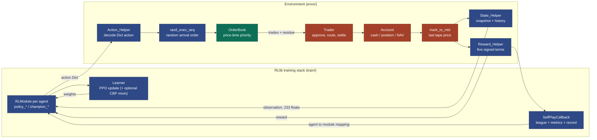

# gym-continuousDoubleAuction

This repository implements a multi-agent continuous double auction system, structured as a price- and time-priority limit order book exchange. It is provided as a Gymnasium / RLlib `MultiAgentEnv` and includes a league-based self-play PPO training pipeline built on Ray RLlib 2.56.1’s new API stack. 

In this environment, agents act as traders who can submit market, limit, modify, and cancel orders to a shared order book. They are marked to market based on the trade tape, and receive rewards derived from a multi-term NAV-based function. The codebase also includes a matching engine, supports `Decimal`-based accounting, includes the necessary RLlib league wiring, and comes with CI unit tests.

Where the project stands — what was wrong with the learning problem and what has been fixed — is in
[15_findings_and_recommendations.md](doc/15_findings_and_recommendations.md#status-in-brief).

---

## At a glance

One environment step, end to end. Every box is a real function; the labels on the arrows are what
actually crosses between them.

<!-- canonical: doc/02_architecture.md §2.0 — change both together -->


Blue is `envs/exchg/` and `train/`, green is `envs/orderbook/`, red is `envs/agent/` and
`envs/account/`. Full detail: [02_architecture.md](doc/02_architecture.md) §2.0 for this picture,
§2.2 for the four layers, §2.5 for the step lifecycle, §2.9 for the same picture with the
distributed boundaries drawn in.

---

## Quick start

Python 3.12.

```bash
python3.12 -m venv .venv && source .venv/bin/activate
pip install -r requirements.txt
pip install -e ".[dev]"

# a random-agent episode through the whole env, no learning: a few seconds
python -m gym_continuousDoubleAuction.CDA_rand --steps 200 --agents 4

# league self-play PPO, every value from config/train_config.json
python -m gym_continuousDoubleAuction.train.train

# the unit suite
python -m pytest gym_continuousDoubleAuction/test -q --ignore=gym_continuousDoubleAuction/test/integration
```

On a CPU-only box install the CPU torch wheel first ([26_runbook.md](doc/26_runbook.md) §26.1). For a
GPU box use the Docker image ([19](doc/19_docker.md)); for Colab, the notebook
([20](doc/20_colab.md)). Everything after the first run — configuring, resuming, inspecting,
evaluating, probing — is in the [runbook](doc/26_runbook.md).

---

## Documentation

All documentation lives in [`doc/`](doc/README.md), whose index has a map of every document, what
each one answers, and reading paths for common goals. Start with:

| # | Document | What it answers |
|---|---|---|
| 1 | [01_overview.md](doc/01_overview.md) | What this project is, the market it models, the research question, what an episode looks like |
| 26 | [26_runbook.md](doc/26_runbook.md) | Install, check, train, resume, inspect, probe and pretrain, step by step, with what to watch and a troubleshooting table |
| 2 | [02_architecture.md](doc/02_architecture.md) | The system at a glance, layer map, package tree, the mixin/MRO chain, the step lifecycle, config keys, data flow, tech stack |

---

## What changed since version 1 (update 20251224)

This repository has undergone significant modernization since the `original_v1` branch (the original release from 2020, [README_v1.md](doc/README_v1.md)).

For a detailed breakdown of codebase modernizations, please refer to the [17_changelog.md](doc/17_changelog.md) document.

---

## Acknowledgements:
The orderbook matching engine is adapted from
https://github.com/dyn4mik3/OrderBook

---

## Disclaimer:
This repository is only meant for research purposes & is **never** meant to be used in any form of trading. Past performance is no guarantee of future results. If you suffer losses from using this repository, you are the sole person responsible for the losses. The author will **NOT** be held responsible in any way.

---

## 📌 How to Cite

If you use this software in your research, please cite the appropriate version:

> Chua Cheow Huan. (2025). *gym-continuousDoubleAuction* (Version 2.0.0) [Computer software].

You can also view and export citations in various formats using the **"Cite this repository"** button on the top-right of this page.

For version 1.0.0 (original version released in 2020), see: https://github.com/ChuaCheowHuan/gym-continuousDoubleAuction/tree/original_v1
