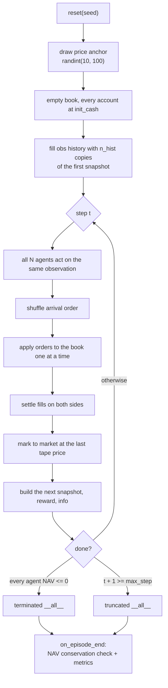

# 1. Overview — What This Repository Is

For how it is built, see [02_architecture.md](02_architecture.md). For what is wrong with it,
see [15_findings_and_recommendations.md](15_findings_and_recommendations.md). For how it got
here, see [17_changelog.md](17_changelog.md).

---

## 1.1 Core purpose

`gym-continuousDoubleAuction` is a **simulated financial exchange used as a multi-agent
reinforcement learning environment**. It is not a backtester, not a trading bot, and not
connected to any real market data feed. It is a synthetic market in which *all* liquidity, all
price formation, and all P&L come from the learning agents themselves. Registered as
`continuousDoubleAuction-v0` in [`__init__.py`](../gym_continuousDoubleAuction/__init__.py).

The concrete artefact is four layers:

1. A **continuous double auction (CDA) matching engine** — a price/time-priority limit order
   book (LOB) with market, limit, modify and cancel order types
   ([`envs/orderbook/`](../gym_continuousDoubleAuction/envs/orderbook/)).
2. A **broker/clearing layer** tracking per-trader cash, cash-on-hold, inventory, VWAP,
   mark-to-market P&L and NAV
   ([`envs/account/`](../gym_continuousDoubleAuction/envs/account/),
   [`envs/agent/`](../gym_continuousDoubleAuction/envs/agent/)).
3. A **Gymnasium / RLlib `MultiAgentEnv` wrapper** turning "N traders acting simultaneously into
   one order book" into a standard RL step function
   ([`continuousDoubleAuction_env.py`](../gym_continuousDoubleAuction/envs/continuousDoubleAuction_env.py),
   [`envs/exchg/`](../gym_continuousDoubleAuction/envs/exchg/)).
4. A **league-based self-play PPO training stack** on Ray RLlib's new API stack, with champion
   snapshotting and weighted opponent matchmaking
   ([`train/`](../gym_continuousDoubleAuction/train/)).

This is version 2 of a 2020 project, modernized for Gymnasium and Ray 2.56.

---

## 1.2 The domain: continuous double auction

A continuous double auction is the mechanism behind essentially every modern electronic equity,
futures and crypto exchange. Both sides quote continuously; orders rest in a book sorted by
price, then by arrival time within a price; an incoming order that crosses the opposite side
executes immediately against the resting orders in priority sequence.

This repository implements exactly that:

- **Price priority** — `OrderTree` is a `SortedDict` keyed by price
  ([`ordertree.py`](../gym_continuousDoubleAuction/envs/orderbook/ordertree.py)), so
  `max_price()` / `min_price()` give the best bid / best ask off the sorted key view.
- **Time priority** — each price level is an `OrderList`, a doubly-linked FIFO queue; new orders
  are appended at the tail and matching consumes from the head
  ([`orderlist.py`](../gym_continuousDoubleAuction/envs/orderbook/orderlist.py),
  [`orderbook.py`](../gym_continuousDoubleAuction/envs/orderbook/orderbook.py)).
- **Priority loss on size increase** — increasing a resting order's quantity moves it to the tail
  of its level; decreasing it keeps priority
  ([`order.py`](../gym_continuousDoubleAuction/envs/orderbook/order.py)). This is the real
  exchange rule and it is implemented correctly.
- **A tape** — every fill appends a transaction record carrying explicit `counter_party` and
  `init_party` dicts, price, size and timestamp. That party attribution is the hook the
  accounting layer needs to debit both sides and to distinguish aggressive from passive
  execution.

Full mechanics in [03_matching_engine.md](03_matching_engine.md).

---

## 1.3 The research question the code is built to ask

The design choices point at one specific question: **what trading behaviour emerges when a
population of RL agents is the only source of liquidity in a closed, zero-sum market?**

Evidence for that framing in the code:

- There is **no exogenous price process**. The initial price is a single random integer anchor
  drawn per episode
  ([`continuousDoubleAuction_env.py`](../gym_continuousDoubleAuction/envs/continuousDoubleAuction_env.py));
  everything after that is endogenous.
- There are **no non-learning market participants** beyond the frozen `RandomRLModule`
  baselines, which are themselves league members
  ([`model_handler.py`](../gym_continuousDoubleAuction/train/model/model_handler.py)).
- The training callback explicitly **asserts NAV conservation** at the end of every episode —
  total NAV across all agents must equal total initial cash
  ([`league_based_self_play_callback.py`](../gym_continuousDoubleAuction/train/callbk/league_based_self_play_callback.py)).
  That check only makes sense for a closed zero-sum system, and it holds: **[verified]** 4 agents
  × 1,000,000 initial cash → final total NAV exactly 4,000,000.00.
- Training is **league-based self-play** with champion snapshots, the standard tool for
  non-transitive competitive games (AlphaStar-style). You only reach for that when the opponent
  distribution *is* the environment.

So: this is a **market-microstructure emergence study**, not a trading-strategy optimiser. The
agents cannot "predict the market" because there is no market to predict — they can only exploit
each other.

**The caveat that follows from this.** The classic microstructure setups this evokes (Kyle,
Glosten–Milgrom) all require informational asymmetry to generate meaningful price discovery,
spreads, and adverse selection. Without a fundamental value, informed traders, news, or
exogenous liquidity demand, "profit" is purely redistribution among agents reacting to each
other. The environment is a valid *game*; framing it as a market simulator overreaches. See
[13_perspective_financial_trader.md](13_perspective_financial_trader.md) §1.

---

## 1.4 What an episode looks like

| Aspect | Value | Source |
|---|---|---|
| Agents | 8 by default (2 trainable + 6 league opponents) | `environment.num_agents` / `num_trained_agents`, [`train_config.json`](../config/train_config.json) |
| Episode length | 4,096 env steps | `environment.max_step`, [`train_config.json`](../config/train_config.json) |
| Initial cash | 1,000,000 per agent | `environment.init_cash`, [`train_config.json`](../config/train_config.json) |
| Initial price anchor | `randint(10, 100)` inclusive, per episode, from the seeded `self.np_random` | `reset` in [`continuousDoubleAuction_env.py`](../gym_continuousDoubleAuction/envs/continuousDoubleAuction_env.py) |
| Tick | 1.0 (`Action_Helper.min_tick`, from the `tick_size` config key) | `environment.tick_size`, [`train_config.json`](../config/train_config.json) |
| Instrument | a single unnamed contract, no expiry, no carry | [`account.py`](../gym_continuousDoubleAuction/envs/account/account.py) |
| Observation | 168 floats (4 stacked snapshots × 42), identical for every agent | `observation_layout`, [`tunable_constants.json`](../config/tunable_constants.json) |
| Action | `Dict{category:9, size_mean:Box, size_sigma:Box, price:10, price_offset:3}` | `action_space`, [`tunable_constants.json`](../config/tunable_constants.json) |
| Termination | only when *every* agent is bankrupt | `set_all_done` in [`done_helper.py`](../gym_continuousDoubleAuction/envs/exchg/done_helper.py) |
| Truncation | at `max_step` | `set_all_done` in [`done_helper.py`](../gym_continuousDoubleAuction/envs/exchg/done_helper.py) |

Note the env's **own** defaults differ from what `TrainConfig` passes — a bare
`continuousDoubleAuctionEnv({})` gets 5 agents, `init_cash=1,000,000`, `max_step=64` and
`is_render=True`. (`init_cash` was `0` until it was found to make the bare env inert — every
order refused, every agent bankrupt on step 1.)
The full table is in [02_architecture.md](02_architecture.md) §6.

Within one env step, all N agents' orders are collected, **randomly shuffled**, and then applied
to the book one at a time
([`action_helper.py`](../gym_continuousDoubleAuction/envs/exchg/action_helper.py)).
The shuffle is the simulator's answer to "who gets there first": it randomises latency and
queue-race outcomes rather than modelling them. The corresponding modelling assumption is that
**all traders share the same lag** — nobody sees a new book snapshot until every order in the
step has executed.

### The shape of an episode



Note what the two exits mean. Truncation at `max_step` is the normal ending; termination needs
**every** agent bankrupt, and per-agent flags are rebuilt as all-`False` each step, so a single
bust agent keeps being stepped (§S2-4 in
[15_findings_and_recommendations.md](15_findings_and_recommendations.md)).

---

## 1.5 Project maturity and trajectory

Reading `git log`, the project has four eras:

1. **Original environment** (through 2020-era commits) — the LOB, accounting, and a first RLlib
   integration.
2. **Model/reward refinement** — the reward function, visualisation, the redesigned action space,
   observation normalization and stacking, and a probabilistic self-play league.
3. **The Ray 2.56.1 / new-API-stack migration** — `Upgrade to Ray 2.56.1 and complete the RLlib
   new API stack migration`, followed by commits fixing genuine distributed-training defects
   (champion propagation to remote EnvRunners, champion snapshotting with a remote LearnerGroup)
   and adding integration tests for them.
4. **The operability era, since merged to `master`** — everything a run needs to be diagnosed
   rather than merely launched: `config/` as the only place values live
   ([18](18_configuration.md)), recoverable checkpointing, a logging framework replacing ~86
   `print()` calls, the Parquet per-step record, 27 custom metrics
   ([11](11_logging_and_observability.md)), and reproducible episodes.

The recent commits are unusually high quality: narrow, each with a regression test, and with code
comments that explain *why* the previous behaviour was wrong at the RLlib-internals level (see
[`league_based_self_play_callback.py`](../gym_continuousDoubleAuction/train/callbk/league_based_self_play_callback.py)
on the `WEIGHTS_SEQ_NO` force-push). The maintainer clearly debugged real silent-degradation bugs
and encoded the lessons.

There is a **sharp quality gradient across the repository**. The simulator layer and the
`train/` package are mature. The **learning-problem layer** — observation content, reward
scaling, PPO hyper-parameters — has not received the same scrutiny, and that is where the
remaining high-impact issues are.

---

## 1.6 Entry points

| Command | Purpose |
|---|---|
| `python -m gym_continuousDoubleAuction.train.train --iters 4 --agents 4` | League self-play PPO training |
| `python -m gym_continuousDoubleAuction.train.train --help` | Full CLI |
| `python gym_continuousDoubleAuction/CDA_rand.py` | Random-agent smoke run, no learning (CI stage 2) |
| `python -m pytest gym_continuousDoubleAuction/test -q` | 510 tests (474 unit + 36 integration) |
| `python -m pytest gym_continuousDoubleAuction/test/integration -q` | 36 integration tests that build real `Algorithm`s |
| `python -m gym_continuousDoubleAuction.CDA_rand --help` | Flags for the smoke run; defaults in `config/cli_defaults.json` |
| `CDA_train.ipynb` | Notebook driver; imports `TrainConfig` / `train` from `train.py`. Runs unchanged on [Colab](20_colab.md) and in the [docker image](19_docker.md) — set `PLATFORM` / `USE_GPU` in its first cell, everything else comes from `config/runtime_profiles.json` |
| `python -m gym_continuousDoubleAuction.visualize.run_all` | Regenerates every chart in `visualize/` from the latest episode Parquet record and `progress.jsonl` |

Installation:

```bash
pip install -r requirements.txt
pip install -e .            # or -e ".[rllib]" / ".[plot]" / ".[dev]"
```

`pip install gym_continuousDoubleAuction` **without** extras used to fail on first import, because
`install_requires` did not name `ray[rllib]` or `six` and no config JSON reached the wheel. Both
are fixed (S3-6 and S3-18), and the `packaging` CI job now builds the wheel, installs it into a
clean venv outside the checkout, and steps an env there — so the installed-package path is tested
rather than assumed. See [14_perspective_ai_engineer.md](14_perspective_ai_engineer.md) §5.3.
