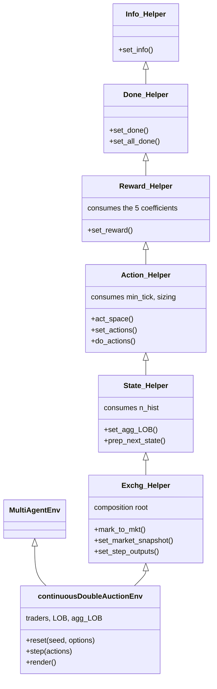
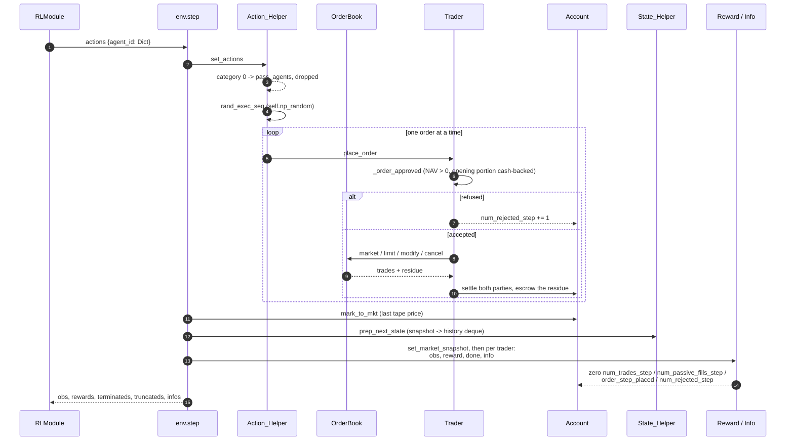
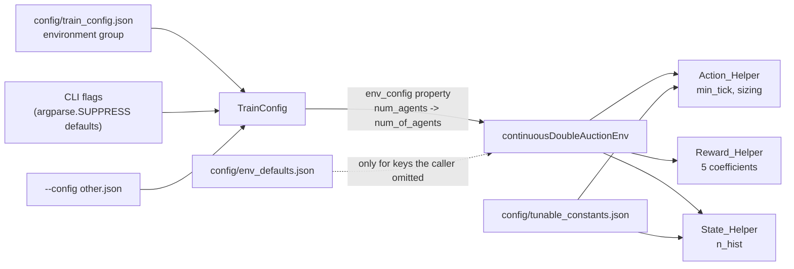
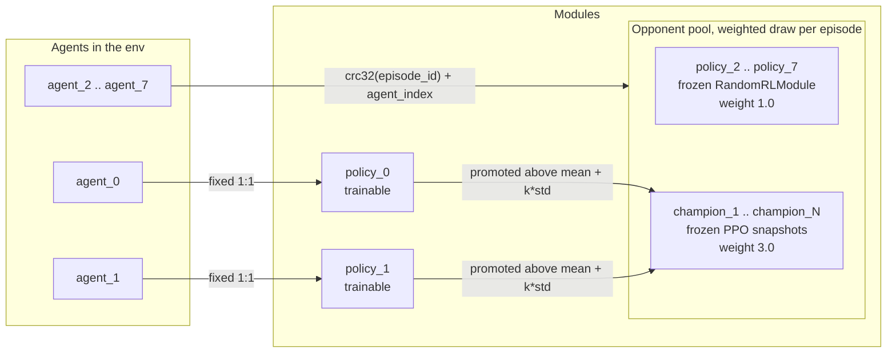
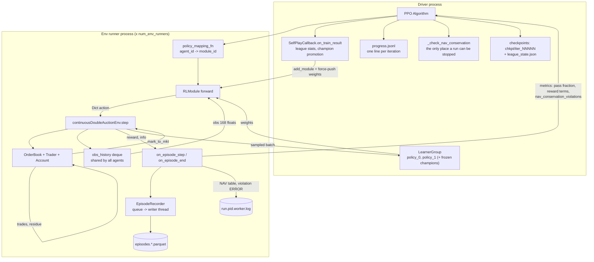

# 2. Architecture — How It Is Implemented

For what each layer does in detail, follow the links into
[03_matching_engine.md](03_matching_engine.md), [04_accounting.md](04_accounting.md),
[05_observation_space.md](05_observation_space.md), [06_action_space.md](06_action_space.md),
[07_reward_function.md](07_reward_function.md) and [08_self_play_league.md](08_self_play_league.md).

---

## 2.1 Technology stack

| Layer | Choice | Version | Notes |
|---|---|---|---|
| Language | Python | `python_requires=">=3.12"`; 3.12 is the only version CI tests | [`setup.py`](../setup.py), [`.github/workflows/tests.yml`](../.github/workflows/tests.yml) |
| RL framework | Ray RLlib **new API stack** | 2.56.1 | `RLModule` / `Learner` / `EnvRunner`, not `Policy` / `Trainer` |
| Env API | Gymnasium `MultiAgentEnv` | 1.2.2 (hard-pinned by Ray) | [`requirements.txt`](../requirements.txt) documents the pin rationale |
| DL backend | PyTorch | ≥2.13, <3 | `framework("torch")` |
| Book data structure | `sortedcontainers.SortedDict` | ≥2.4 | price → `OrderList` map |
| Numeric type for money | `decimal.Decimal` | stdlib | exact cash/quantity arithmetic |
| Rendering | `tabulate`, `pandas` | | `env.render()` logs ASCII tables at DEBUG |
| Per-step record | `pyarrow` (Parquet) | via `ray[rllib]` | one row per (episode, step, agent); see [11](11_logging_and_observability.md) §1.1 |
| Plotting | `matplotlib` | ≥3.11 | offline scripts in `visualize/` |
| Packaging | setuptools | | `install_requires` + `[rllib]` / `[plot]` / `[dev]` extras |
| CI | GitHub Actions | Python 3.12 | `test` job: unit tests → random smoke run → RLlib integration. `packaging` job: build the wheel, install it into a clean venv outside the checkout, step an env |
| Containers | Docker | CUDA 12.8 + cu128 torch wheels | `docker/ml/dockerfile_ray_torch`; see [19_docker.md](19_docker.md) |

---

## 2.2 Layer map

Four layers, each in its own package:

| Layer | Package | Responsibility |
|---|---|---|
| Matching engine | [`envs/orderbook/`](../gym_continuousDoubleAuction/envs/orderbook/) | Price–time priority limit order book |
| Trader + accounting | [`envs/agent/`](../gym_continuousDoubleAuction/envs/agent/), [`envs/account/`](../gym_continuousDoubleAuction/envs/account/) | Order gating, cash escrow, position and NAV tracking |
| Environment | [`continuousDoubleAuction_env.py`](../gym_continuousDoubleAuction/envs/continuousDoubleAuction_env.py), [`envs/exchg/`](../gym_continuousDoubleAuction/envs/exchg/) | Gym API, observation / action / reward / termination |
| Training | [`train/`](../gym_continuousDoubleAuction/train/) | Modules, league self-play callback, checkpointing, the per-step episode record |
| Cross-cutting | [`config_loader.py`](../gym_continuousDoubleAuction/config_loader.py), [`logging_setup.py`](../gym_continuousDoubleAuction/logging_setup.py) | Every configured value; every log record. Imported by all three layers above |
| Offline analysis | [`visualize/`](../gym_continuousDoubleAuction/visualize/) | Charts built from the episode Parquet record and `progress.jsonl` |

---

## 2.3 Package map

```
config/                                 the only place values live - see 18_configuration.md
├── train_config.json                     every TrainConfig value, including the env keys
├── env_defaults.json                     fallbacks for an env built without a full config dict
├── tunable_constants.json                space layout, ID prefixes, logging, visualize paths
├── cli_defaults.json                     flag defaults with no other config home
└── runtime_profiles.json                 where a run executes: hardware sets, platform paths

gym_continuousDoubleAuction/
├── __init__.py                       gymnasium register("continuousDoubleAuction-v0")
├── config_loader.py                  reads config/; a missing key raises, no Python defaults
├── logging_setup.py                  one logging config per process, exported to Ray's workers
├── CDA_rand.py                       random-agent smoke driver (CI stage 2)
├── CDA_train.ipynb                   notebook driver; imports TrainConfig / train from train.py
├── envs/
│   ├── continuousDoubleAuction_env.py   MultiAgentEnv: reset / step / render
│   ├── exchg/                           the "exchange" mixin family
│   │   ├── exchg_helper.py                composition root + render path + mark-to-market
│   │   ├── state_helper.py                observation construction + history deque
│   │   ├── action_helper.py               action space + action decoding + pricing
│   │   ├── reward_helper.py               reward function
│   │   ├── done_helper.py                 termination / truncation
│   │   └── info_helper.py                 per-agent info dict
│   ├── orderbook/                       matching engine
│   │   ├── orderbook.py                   OrderBook: process / cancel / modify + tape
│   │   ├── ordertree.py                   price → OrderList SortedDict, per side
│   │   ├── orderlist.py                   FIFO doubly-linked list per price
│   │   ├── order.py                       single order record
│   │   └── test/                          standalone scripts, not collected by pytest
│   ├── account/                         clearing / risk
│   │   ├── account.py                     position state machine
│   │   ├── cash_processor.py              cash ↔ cash_on_hold transfers
│   │   └── calculate.py                   NAV, P&L, mark-to-market
│   └── agent/
│       ├── trader.py                      order lifecycle + trade settlement
│       └── random_agent.py                (legacy) random action sampler, still in Trader's MRO
├── train/
│   ├── train.py                        TrainConfig, build_algo, checkpointing, progress.jsonl, CLI
│   ├── runtime.py                      platform + hardware profile resolution (Colab / docker)
│   ├── episode_record.py               EpisodeRecorder: the Parquet per-step record
│   ├── policy/policy_handler.py        MultiRLModuleSpec, module ID conventions
│   ├── model/model_handler.py          RandomRLModule + DefaultModelConfig
│   ├── callbk/…_self_play_callback.py  league: champions, matchmaking, metrics, the record
│   └── helper/helper.py                order-imbalance / mid-price utilities (unused)
├── visualize/                          offline charts from the episode Parquet + progress.jsonl
│   ├── run_all.py                        regenerates every chart
│   ├── episode_data.py                   loads the newest run's Parquet record
│   └── visualize_*.py                    book, NAV, rewards, execution, training, modules
└── test/                               474 unit tests
    └── integration/                    36 tests that build real Algorithms
```

`train/logger/`, `train/plotter/` and `train/storage/` — the legacy Ray-actor telemetry an earlier
revision of this document listed — have been deleted.

---

## 2.4 Class composition — the mixin chain

The environment is assembled by **multiple inheritance**, not composition:



Read the arrows as "is a base of". The MRO is the reverse: `continuousDoubleAuctionEnv` →
`Exchg_Helper` → `State_Helper` → `Action_Helper` → `Reward_Helper` → `Done_Helper` →
`Info_Helper` → `object`, and each `__init__` consumes its own keyword arguments before calling
`super().__init__(**kwargs)`.

Declared at
[`continuousDoubleAuction_env.py`](../gym_continuousDoubleAuction/envs/continuousDoubleAuction_env.py)
and
[`exchg_helper.py`](../gym_continuousDoubleAuction/envs/exchg/exchg_helper.py).

**MRO rule.** Every `__init__` in the chain must call `super().__init__()`, and each class must
consume its own keyword arguments — nothing unrecognised may reach `object.__init__`, which
raises `TypeError`. This was the root cause of a real bug: `State_Helper.__init__` forwarding
`n_hist=4` down the chain aborted `Action_Helper.__init__` mid-body, surfacing as
`AttributeError: 'continuousDoubleAuctionEnv' object has no attribute 'min_tick'`.
`test_config_wiring.py` now asserts `mkt_size_mean_mul` is initialised on a built env, which is an
MRO health check: it exists only if `Action_Helper.__init__` ran to completion.

The trader side uses the same idiom:

```
Trader(Random_agent)         →  owns  Account(Calculate, Cash_Processor)
```

**Cost of the pattern.** The five mixins are not behavioural variants — they are one class split
five ways, sharing mutable state (`self.LOB`, `self.traders`, `self.last_price`, `self.min_tick`)
with no declared contract. `State_Helper` reads attributes it neither owns nor declares, guarded
by defensive fallbacks such as `getattr(self, 'last_price', self.midpoint_fallback)` and
`getattr(self, 'min_tick', env_default("tick_size"))` — both of which are `Action_Helper`'s state,
read from `State_Helper`. `Info_Helper` does the same for `pass_agents`, `best_bid`, `spread` and
`model_actions`. Nothing is independently testable, and a name reused across
two mixins would collide silently. See
[14_perspective_ai_engineer.md](14_perspective_ai_engineer.md) §5.2.

---

## 2.5 The step lifecycle

`step(actions)` at
[`continuousDoubleAuction_env.py`](../gym_continuousDoubleAuction/envs/continuousDoubleAuction_env.py):

```
 1. self.agg_LOB = set_agg_LOB()                 # pre-action book snapshot (display only)
 2. actions = set_actions(actions)               # Dict action  →  LOB order dicts; record passes
 3. actions = rand_exec_seq(actions, None)       # random arrival order, from self.np_random
 4. seq_trades, seq_order_in_book = do_actions() # apply to book, settle fills
 5. mark_to_mkt()                                # prev_nav ← nav; re-mark all accounts
 6. state_input = prep_next_state()              # post-action snapshot, push into history
 7. set_step_outputs(state_input)                # market snapshot, then obs / reward /
                                                 # terminated / truncated / info per trader,
                                                 # then zero the per-step counters
 8. render()                                     # optional ASCII dump, DEBUG only
 9. t_step += 1
```



### Step 2 — action decoding

`_set_action_mkt_depth`
([`action_helper.py`](../gym_continuousDoubleAuction/envs/exchg/action_helper.py))
turns the neural-network `Dict` output into an order dict:

| Field | Meaning |
|---|---|
| `category ∈ [0,8]` | `0` = pass; `1-4` = bid {market, limit, modify, cancel}; `5-8` = ask {…} |
| `size_mean ∈ [-1,1]`, `size_sigma ∈ [0,1]` | parameters of a Gaussian the **environment** samples the size from |
| `price ∈ [0,9]` | book depth level 1–10 to quote at |
| `price_offset ∈ {0,1,2}` | passive (−1 tick) / join / aggressive (+1 tick) |

Size is drawn as `rint(abs(N(mean_mul · size_mean, size_sigma)))`, then `+ min_size` so it is at
least 1, where `mean_mul` is 49.5 for market orders and 499.5 for limit orders. Price is resolved
against the **raw, unnormalised** book (`agg_LOB_raw`), falling back to "ghost" levels stepped off
`last_price` when the requested depth level is empty. This raw/normalised split is deliberate and
correct: observations are normalised for the network, actions are priced in absolute currency.

Actions with `side is None` (category 0) are dropped before reaching the book. Full detail in
[06_action_space.md](06_action_space.md).

### Step 4 — order handling and settlement

`Trader.place_order`
([`trader.py`](../gym_continuousDoubleAuction/envs/agent/trader.py)):

```
_order_approved()  ── reject if NAV ≤ 0, or if the *opening* portion of the
                      order exceeds free cash (closing/covering is always free)
       │
       ├─ market → LOB.process_order
       ├─ limit  → _place_limit_order   (upsert: modifies an existing same-price order)
       ├─ modify → _modify_limit_order  (oldest resting order on that side, FIFO)
       └─ cancel → _cancel_limit_order  (+ release cash_on_hold)
       │
       ├─ _process_trades(trades, agents)      settle both sides of each fill
       └─ order_in_book_passive_party(...)     reserve cash for any resting residue
```

`_process_trades`
([`trader.py`](../gym_continuousDoubleAuction/envs/agent/trader.py))
walks each fill and updates **both** parties: the aggressor via `process_acc(trade,
'init_party')` and the resting side via `process_acc(trade, 'counter_party')`, found by ID scan
across all agents. When both IDs are the same — an agent crossing its own resting order — it
routes to `init_is_counter_cash_transfer` instead. See
[13_perspective_financial_trader.md](13_perspective_financial_trader.md) §3.1.

### Step 4b — position state machine

`Account.process_acc`
([`account.py`](../gym_continuousDoubleAuction/envs/account/account.py))
dispatches on current inventory sign:

| Current | Fill direction | Handler | Effect |
|---|---|---|---|
| flat | any | `_neutral` | open position at trade price |
| long | bid | `_size_increase` | update VWAP, add value |
| long | ask, size ≤ position | `_size_decrease` | realise part, re-derive VWAP |
| long | ask, size > position | `_covered_side_chg` | close out, then open the short remainder |
| short | mirror of the above | `_net_short` | |

Cash movements are isolated in `Cash_Processor`, which enforces the invariant that placing an
order moves cash into `cash_on_hold` rather than out of the account, so
**NAV = cash + cash_on_hold + position_val** is unaffected by order placement. Full detail in
[04_accounting.md](04_accounting.md).

### Step 5 — mark to market

`Exchg_Helper.mark_to_mkt`
([`exchg_helper.py`](../gym_continuousDoubleAuction/envs/exchg/exchg_helper.py))
takes the **last trade price on the tape** as the mark, updates `self.last_price` (which is also
the action-space price anchor), and re-marks every account. Per account
([`calculate.py`](../gym_continuousDoubleAuction/envs/account/calculate.py)):

```
profit       = |net_position| · (mkt − VWAP)   signed by position side
position_val = |net_position| · VWAP + profit
prev_nav     = nav
nav          = cash + cash_on_hold + position_val
max_nav      = max(max_nav, nav)          # high-water mark, monotone within an episode
```

Note the ordering: `prev_nav ← nav` happens **inside** `mark_to_mkt`, so `nav − prev_nav` in the
reward is a genuine one-step delta — but only on steps where the tape is non-empty. On a step
with no trades the previous mark persists and `prev_nav` is not updated, so `nav_change` covers a
multi-step gap. Before the first ever trade in an episode, NAV is never re-derived and rewards
are exactly 0.

### Step 6 — observation construction

`set_agg_LOB`
([`state_helper.py`](../gym_continuousDoubleAuction/envs/exchg/state_helper.py))
builds one 42-float snapshot:

```
 [ 0:10]  normalised bid prices   (M − P_bid)/M          ≥ 0
 [10:20]  sqrt bid sizes                                 ≥ 0
 [20:30]  normalised ask prices  −(P_ask − M)/M          ≤ 0
 [30:40]  −sqrt ask sizes                                ≤ 0
 [40]     log(M)                     price-level anchor
 [41]     log1p(spread / min_tick)   0.0 ⇒ no two-sided market
```

`M` is the L1 midpoint with a documented fallback chain (one-sided book → that side's best;
empty book → `last_price`; degenerate → 100.0), so `log(M)` is always defined. The final
observation is `n_hist` snapshots concatenated, default 4 → **168 floats**. On reset the deque is
pre-filled with `n_hist` copies of the initial snapshot so the shape is constant from step 0.

**The history deque is a single shared object on the environment**, and the same stacked vector
is handed to every agent — there is no per-agent view. Full spec and its defects in
[05_observation_space.md](05_observation_space.md).

### Step 7 — outputs

`set_step_outputs`
([`exchg_helper.py`](../gym_continuousDoubleAuction/envs/exchg/exchg_helper.py))
first calls `set_market_snapshot` once — best bid, best ask and the raw spread, which the info
dict reports and which the observation's `log1p_spread_ticks` otherwise discarded — then loops
over traders building obs / reward / done / info, and only then **resets the per-step counters**
(`num_trades_step`, `num_passive_fills_step`, `order_step_placed`, `num_rejected_step`). That
ordering is correct and easy to break: the reward reads three of those counters and the info dict
reads all four.

`set_all_done` then rebuilds `terminateds` and `truncateds` as all-`False` dicts and sets only
`__all__`. This is why a bankrupt agent is never individually terminated — see
[15_findings_and_recommendations.md](15_findings_and_recommendations.md) S2-4.

---

## 2.6 Configuration

The env is built from an `env_config` dict. **The env holds no literal default for any key**:
`continuousDoubleAuctionEnv._cfg` returns `self.config[key]` when the caller supplied it and
`config_loader.env_default(key)` otherwise, so a key absent from both raises by name rather than
resolving to a number written in Python. The full rules are in
[18_configuration.md](18_configuration.md); this is the env-side view.

| Key | Standalone default | `TrainConfig` value | Meaning |
|---|---|---|---|
| `num_of_agents` | 5 | 8 | Number of traders |
| `init_cash` | 1,000,000 | 1,000,000 | Starting cash per trader — must be > 0, see `env_defaults.json` |
| `tick_size` | 1 | 1 | The price grid; reaches `Action_Helper.min_tick` and the book, see §2.7 |
| `tape_display_length` | 10 | 10 | Tape rows kept for display |
| `max_step` | 64 | 4,096 | Steps before truncation |
| `is_render` | `True` | `False` | Log book, tape and accounts every step (DEBUG only) |
| `n_hist` | 4 | 4 | Observation history window |
| `initial_price_min` | 10 | 10 | Lower bound of the per-episode price anchor |
| `initial_price_max` | 100 | 100 | Upper bound of the per-episode price anchor |
| `min_size`, `mkt_max_size`, `limit_size_multiple` | 1 / 100 / 10 | same | Order sizing, consumed by `Action_Helper` |
| `order_penalty`, `trade_penalty`, `drawdown_penalty`, `passive_bonus`, `loss_multiplier` | 0.1 / 0.05 / 0.2 / 0.1 / 1.5 | same | Reward coefficients, consumed by `Reward_Helper` |

The standalone column is [`config/env_defaults.json`](../config/env_defaults.json) and the
training column is the `environment` group of
[`config/train_config.json`](../config/train_config.json). They differ deliberately: a bare env is
small and renders, a training env is large and silent. `TrainConfig.env_config` supplies every key
above, so a training run never reaches the fallbacks.



Two consequences worth flagging:

- **`is_render` defaults to `True`.** `TrainConfig` overrides it, and `render()` is additionally
  gated on the logger being enabled for DEBUG — so a direct `continuousDoubleAuctionEnv({...})`
  at the default INFO level builds no tables at all. Raise the level and it dumps the book, the
  tape and every account on every step.
- **`initial_price_min` / `initial_price_max` are reachable from training now.** They are
  `TrainConfig` fields and are forwarded by `env_config`, so a run can narrow the anchor range
  instead of always drawing from `[10, 100]`. That range is still what the checked-in config ships
  (S3-4 in [15_findings_and_recommendations.md](15_findings_and_recommendations.md) is about the
  10× relative-tick swing it produces, not about reachability).

### 2.7 `tick_size` reaches the action layer; the book's copy is inert

`tick_size` used to be two independent values — a hardcoded `min_tick = 1` in `Action_Helper` that
actually drove prices, and an `OrderBook` argument that was stored and never read — so setting the
key changed nothing anywhere. Two of the three halves are fixed:

| | Then | Now |
|---|---|---|
| `Action_Helper.min_tick` | hardcoded `1` | the `tick_size` config key — this is what builds every price |
| `reset()` | `OrderBook(1, ...)` | `OrderBook(self.tick_size, ...)` |
| `OrderBook.tick_size` | stored, never read | stored, never read — still inert |

There is no rounding or tick validation anywhere in the matching path; the book's parameter makes
it look as though there is. The recommendation is to **delete** the book's copy rather than
enforce it, because there is exactly one price producer in the system and `_set_price` emits
on-grid prices by construction. It is deferred only because `envs/orderbook/` is off-limits to
changes. See [18_configuration.md](18_configuration.md) §6 and S3-4 in
[15_findings_and_recommendations.md](15_findings_and_recommendations.md).

`log1p_spread_ticks` is computed against `min_tick` because that is the tick the action space
quotes in, which makes observation units match action units — see
[05_observation_space.md](05_observation_space.md) §3.2.

---

## 2.8 Training architecture

### Module layout

For `n` agents with `k` trainable
([`policy_handler.py`](../gym_continuousDoubleAuction/train/policy/policy_handler.py)):

```
policy_0 … policy_{k-1}     trainable PPO modules      ← fixed 1:1 to agent_0…agent_{k-1}
policy_k … policy_{n-1}     frozen RandomRLModule      ┐
champion_1, champion_2, …   frozen PPO snapshots       ┘ ← opponent pool, sampled per episode
```

Default: `n=8`, `k=2` → 2 learners against 6 pool slots.



Critically, module **classes** are declared through `MultiRLModuleSpec`, because on the new API
stack `multi_agent(policies={...})` reads only the dict *keys*; a `PolicySpec(policy_class=...)`
is silently discarded and every module is built as `DefaultPPOTorchRLModule`. The file's
migration note documents exactly this trap, and
`test_baseline_opponents_are_random_modules` guards it.

`RandomRLModule` emits `Columns.ACTIONS` directly from `action_space.sample()`, so it is a *true*
uniform sampler rather than a frozen randomly-initialised network — which for a `Dict` action
space with `Box` components is a materially different opponent distribution. It must be excluded
from `policies_to_train`; `_forward_train` raises.

Trainable modules use RLlib's default PPO torch module with `fcnet_hiddens=[256,256]`, `tanh`,
and `vf_share_layers=False`.

### Matchmaking

`SelfPlayCallback.get_mapping_fn`
([`league_based_self_play_callback.py`](../gym_continuousDoubleAuction/train/callbk/league_based_self_play_callback.py))
returns a closure that:

- maps `agent_i → policy_i` for `i < k` (always the learners);
- for `i ≥ k`, draws from the pool with weights `original_opponent_weight=1.0` for `policy_*`
  baselines and `champion_weight=3.0` for `champion_*` snapshots;
- seeds the RNG from `zlib.crc32(episode_id) + agent_index`, **not** `hash()`, so selection is
  reproducible across processes (`hash()` on `str` is salted by `PYTHONHASHSEED`).

### Champion promotion

`on_train_result` reads `module_episode_returns_mean` — already keyed by real `ModuleID`,
including `champion_*` — computes `threshold = mean + std_dev_multiplier · std` over the league,
and snapshots the best trainable module above it, subject to a cooldown and a rolling-window
eviction. The snapshot procedure has four load-bearing ordering constraints, each with a
dedicated integration test. Full detail in [08_self_play_league.md](08_self_play_league.md).

### Distributed execution

`TrainConfig` exposes `num_env_runners` (rollout parallelism) and `num_learners` (gradient
parallelism) with 0/0 as the CPU-friendly default. `resolved_gpus_per_learner()` forces the GPU
fraction to 0 when CUDA is absent, so a config written for a GPU box degrades to CPU with a
printed notice instead of failing. The integration suite covers all three topologies: local,
`num_env_runners=1`, and `num_learners=1`. See
[09_distributed_training.md](09_distributed_training.md).

Which values those knobs actually take on a given machine is a separate decision, made by
[`train/runtime.py`](../gym_continuousDoubleAuction/train/runtime.py) from the two hardware sets in
`config/runtime_profiles.json` — 2 CPUs + 1 GPU, or 1 CPU and none. That is what lets
`CDA_train.ipynb` run unchanged on Colab and in the docker image without a resource literal in the
notebook. See [18_configuration.md](18_configuration.md) §8.

---

## 2.9 Data flow

Where each value is produced and who consumes it, with the process boundary drawn in. Everything
inside `Env runner process` exists once per runner; everything in `Driver process` exists once.
At the `num_env_runners=0` default they are the same process — which is exactly the assumption
that broke three separate times, see [09_distributed_training.md](09_distributed_training.md).



The one arrow worth reading twice is `nav_conservation_violations`. The check runs in
`on_episode_end`, which is on the **runner**; a raise there is swallowed by RLlib's fault
tolerance and restarts the worker. So the hook reports a metric and the driver decides — see
[11_logging_and_observability.md](11_logging_and_observability.md) §1.5.

---

## 2.10 Things worth knowing before touching it

- **Per-agent `terminateds` are rebuilt as all-`False` every step.** Only `__all__` is ever set,
  so a single bankrupt agent keeps being stepped for the rest of the episode.
- **Rendering has side effects.** `_render` nulls `model_actions` / `LOB_actions` /
  `shuffled_actions` and clears `seq_trades` and `seq_order_in_book`, so toggling `is_render`
  changes state evolution.
- **The bare `import ray` in the env is gone** (S3-6); the `MultiAgentEnv` import is the real
  dependency, and `ray[rllib]` is in `install_requires` because of it.
- **A fair amount of commented-out dead code** (old `step`, old action space, old `modify_order`,
  old space getters) is left in place as inline history — roughly 200 LOC.
- **No module holds a literal copy of a configured value.** `test_config_sources.py` proves it by
  copying `config/` to a temp tree, changing values, pointing `$CDA_CONFIG_DIR` at it and
  asserting the change comes out the far end. Add knobs the way
  [18_configuration.md](18_configuration.md) §7 describes, not as a Python default.
- **The test suite is the best executable spec for the tricky parts** — position flips, crossed
  books, volume sync, observation normalization, ghost pricing. See [10_testing.md](10_testing.md).
