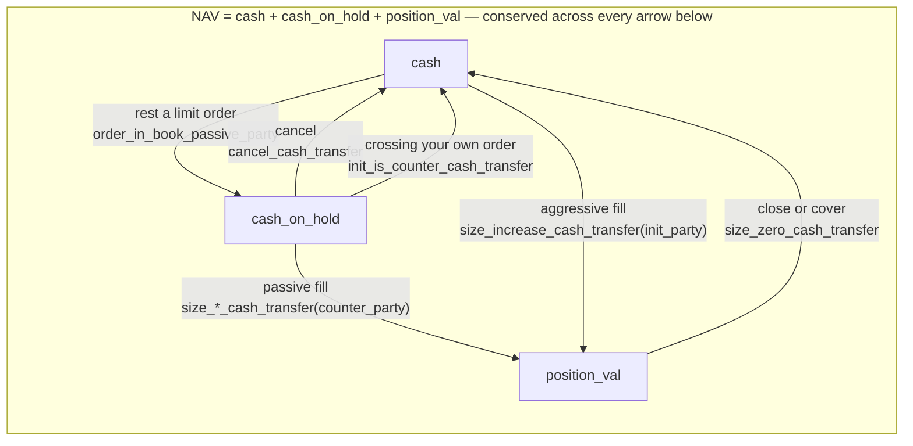
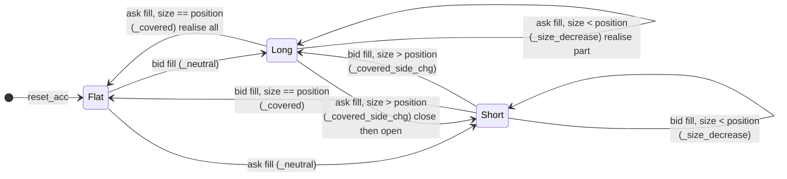

# 4. Accounting

The cash, position, and NAV model. This is the most carefully engineered part of the repository
and the part with the tightest test coverage.

Related: [03_matching_engine.md](03_matching_engine.md) (what produces the fills),
[07_reward_function.md](07_reward_function.md) (what consumes these numbers),
[10_testing.md](10_testing.md) §2 (the tests).

---

## 1. Quantities tracked per trader

[`account.py`](../gym_continuousDoubleAuction/envs/account/account.py):

| Field | Meaning |
|---|---|
| `cash` | Available liquid capital |
| `cash_on_hold` | Capital escrowed against resting limit orders |
| `position_val` | Market value of the open position |
| `net_position` | Signed quantity held — positive long, negative short |
| `VWAP` | Volume-weighted average entry price |
| `nav` | Net asset value = `cash + cash_on_hold + position_val` |
| `prev_nav` | NAV at the previous mark, used for the reward's `nav_change` |
| `init_nav` | NAV at *t* = 0, used for `total_profit` |
| `max_nav` | High-water mark of NAV, used for the drawdown penalty |
| `profit`, `total_profit` | P&L on current holdings; NAV − `init_nav` |
| `num_trades` | Cumulative fill count |
| `num_trades_step`, `num_passive_fills_step`, `order_step_placed`, `num_rejected_step` | Per-step counters, zeroed at the end of each step *after* the reward and the info dict have read them |
| `reward`, `reward_terms` | The step's reward and the five signed contributions that sum to it |
| `drawdown` | `max(0, max_nav − nav)` — the level the drawdown penalty charges, recorded rather than recomputed |

**Types are deliberate, and pinned by `test_type_policy.py`.** Money and prices are `Decimal`
everywhere; sizes and `net_position` are `int`, because a position is a count of contracts;
`reward` and `drawdown` are `float`, because they are learning signal rather than money and RLlib
requires float rewards. No field changes type mid-episode — `_covered` resets `position_val` and
`VWAP` to `Decimal(0)` rather than a bare `0` for exactly that reason.

All arithmetic is `Decimal`. This is what makes the simulation exactly zero-sum in NAV terms:
total NAV across all traders is conserved and equals total initial cash, and `total_sys_profit
≈ 0`. The invariant is checked at runtime in `exchg_helper.py` and again by the league callback
at episode end.

**[verified]** — 4 agents × 1,000,000 initial cash, 300 steps of uniformly random actions:
final total NAV **4,000,000.00**, expected 4,000,000.00.

---

## 2. The escrow model

[`cash_processor.py`](../gym_continuousDoubleAuction/envs/account/cash_processor.py) implements a
simple margin/escrow scheme:

- **Resting an order** (`order_in_book_passive_party`) moves `size × price` from `cash` to
  `cash_on_hold`. This is what stops agents placing unlimited orders.
- **Cancelling** (`cancel_cash_transfer`) moves it back.
- **Filling** converts the held amount into `position_val` and realised cash movement.
- **Self-matching** (`init_is_counter_cash_transfer`) balances the two legs when a trader's own
  order is both sides of a fill.

Both sides are escrowed. A limit *sell* holds cash as margin exactly as a limit *buy* does, so a
short position is cash-backed rather than free — effectively 100% initial margin, no leverage in
either direction. Confirmed by `test_limit_order_placement_hold`: a limit sell at 102 puts 102 on
hold.

**NAV is invariant across placement and cancellation.** Moving money between `cash` and
`cash_on_hold` does not change wealth, and the tests assert this explicitly.



Every arrow moves money between the three columns; none of them creates or destroys any. That is
what makes the episode-end conservation check (`Σ NAV == num_agents × init_cash`) meaningful
rather than approximate — it is exact in `Decimal`, and the tolerance exists as headroom for a
future change that legitimately removes cash, such as fees.

The one function that would have broken it was deleted rather than wired up: `modify_cash_transfer`
computed an escrow delta with no term for a fill, so a modify that crossed the spread would have
escrowed cash against quantity that was no longer resting. A modify is handled as
cancel-and-reprocess instead. See S3-20 in
[15_findings_and_recommendations.md](15_findings_and_recommendations.md).

---

## 3. Order approval

`Trader._order_approved`
([`trader.py`](../gym_continuousDoubleAuction/envs/agent/trader.py))
gates every order on two conditions:

1. **NAV must be positive.** A bankrupt trader can place nothing.
2. **The opening portion must be cash-backed.**

The second condition is the subtle one, and it is right. Only the part of an order that
*increases* exposure needs cash:

```python
if (side == 'bid' and net_pos >= 0) or (side == 'ask' and net_pos <= 0):
    opening_size = size                                # increasing
else:
    opening_size = max(0, size - abs(net_pos))         # decreasing, covering, or flipping

if opening_size <= 0:
    return True                                        # purely closing — always allowed
```

You never need capital to flatten. Otherwise `opening_size × est_price` is compared against
`cash` in `Decimal`.

For market orders (`price == -1.0`) the estimate is the best price on the **opposite** side,
falling back to the last tape price, falling back to 1:

```python
est_price = LOB.get_best_ask() or (LOB.tape[-1]['price'] if LOB.tape else 1)   # for a bid
```

`test_cash_check.py::test_position_flip_insufficient_cash` covers the hard case — long 10, sell
20, and only the 10-lot short leg needs cash.

> This supersedes an older documentation claim that the system "only validates `nav > 0`,
> potentially allowing high leverage." A real cash check exists and is tested seven ways.

**Rejections are counted now, but still cost nothing.** A refused order returns `([], [])`
without a penalty and without reaching the book — but it increments `num_rejected_step`, which
travels out in `info` and is reduced into the `order_rejection_fraction` metric per episode. That
closes the measurement half of S4-14: an agent that is quiet because it chose to be and one whose
every order is refused for want of cash are now distinguishable from the metrics alone, which
they were not when both showed up only as an absent trade.

Still silent: `modify` and `cancel` against a non-existent order return empty lists with no
counter at all. Given that agents cannot see their own resting orders
([05](05_observation_space.md) §7.7), that dead-action fraction remains unmeasured.

---

## 4. Position transitions

`Account.process_acc`
([`account.py`](../gym_continuousDoubleAuction/envs/account/account.py))
increments the trade counters — including `num_passive_fills_step` when the party is
`counter_party` — then branches on the current position sign:

| Transition | Handler | Behaviour |
|---|---|---|
| Flat → open | `_neutral` | Open the position at the trade price |
| Increase (same side) | `_size_increase` | Add to position, update VWAP |
| Decrease (opposite side, smaller than position) | `_size_decrease` | Realise P&L on the closed portion, release capital, re-derive VWAP |
| Full cover (exactly flat) | `_size_decrease` | Realise everything; position and `position_val` go to zero |
| **Flip** (opposite side, larger than position) | `_covered_side_chg` | Close the old position *and* open the new one atomically |



The flip case is the one most toy exchanges get wrong. If a trader is long 1 and sells 2, the
first unit closes the long (releasing capital) and the second opens a short (locking capital), in
a single transaction, with `net_position` moving from +1 to −1 and cash/NAV preserved throughout.
Four dedicated tests cover it — aggressor and passive, in both directions.

---

## 5. Mark to market

`Calculate.mark_to_mkt`
([`calculate.py`](../gym_continuousDoubleAuction/envs/account/calculate.py))
revalues every account at the **last tape price** each step:

```python
price_diff   = (VWAP - mkt_price, mkt_price - VWAP)[net_position >= 0]
profit       = |net_position| * price_diff
position_val = |net_position| * VWAP + profit
prev_nav     = nav
nav          = cash + cash_on_hold + position_val      # cal_nav()
max_nav      = max(max_nav, nav)                       # inside cal_nav()
total_profit = nav - init_nav                          # cal_total_profit()
```

Worked:

- **Long 1 @ 100**, price → 110: NAV +10. Price → 90: NAV −10.
- **Short 1 @ 100**, price → 110: NAV −10. Price → 90: NAV +10.

Three properties of this design matter downstream:

1. **`prev_nav ← nav` happens inside the mark**, so the reward's `nav − prev_nav` is a genuine
   one-step delta — but only on steps where the tape is non-empty. On a step with no trades the
   mark is not recomputed at all and `nav_change` spans a multi-step gap. Before the first ever
   trade of an episode, rewards are exactly 0.
2. **`max_nav` is monotone non-decreasing within an episode.** This is what makes the reward's
   drawdown term a *level* charged every step — see [07_reward_function.md](07_reward_function.md)
   §4.1.
3. **The mark is the last print, however thin.** A single 1-lot trade re-marks the entire market
   for every participant. Combined with the absence of self-match prevention, this is a direct
   manipulation channel — see
   [13_perspective_financial_trader.md](13_perspective_financial_trader.md) §3.2.

---

## 6. Worked example: partial fill

Agent A bids 2 @ 100; Agent B sells 1 @ 100.

| Stage | A's cash | A's hold | A's position value | A's NAV |
|---|---|---|---|---|
| After placing the bid | −200 | +200 | 0 | unchanged |
| After 1 unit fills | −200 | 100 | 100 | unchanged |

One unit stays escrowed against the still-resting half of the order; the other has become a
position. Wealth never moved.

---

## 7. Risk controls: what exists and what does not

### Present

- **Solvency gate** — no new orders once `nav <= 0`.
- **Buying-power check** on the risk-increasing portion only (§3).
- **Full cash collateral** on both longs and shorts.
- **High-water mark** tracked per account and taxed by the reward.

### Absent

| Gap | Detail |
|---|---|
| **No position limit** | Nothing caps `net_position`. Size is bounded only by cash and by the action space's `limit_max_size = 1000` (a full-scale draw is ≈ 500 contracts). |
| **No margin call / forced liquidation** | An agent can be marked to a negative NAV and simply sits there. |
| **No per-agent termination on bankruptcy** | **[verified]** — forcing `agent_0.nav = −50` yields `terminateds: {'agent_0': False, …}` while `done_set == {'agent_0'}`. `set_done` records it; `set_all_done` then overwrites every per-agent flag with `False`. The episode only ends when **every** agent is bust. |
| **No borrow / locate on shorts** | Unlimited short capacity subject only to cash. |
| **No transaction costs** | No fees, commissions, rebates, borrow cost or funding anywhere in the settlement path. |
| **No intraday risk limits** | No max loss, no max order size relative to NAV, no fat-finger check. |
| **Drawdown is punished but not constrained** | The reward taxes it; nothing prevents it. |

The **zombie-agent** problem deserves emphasis. A bankrupt agent cannot place new orders, so it
stops trading — but it keeps accruing the per-step drawdown penalty for the remainder of what may
be thousands of steps, and any resting orders it left in the book stay live and executable. Its
episode return is then dominated by a constant tax unrelated to its decisions, which is exactly
the signal champion promotion reads. Tracked as S2-4.
