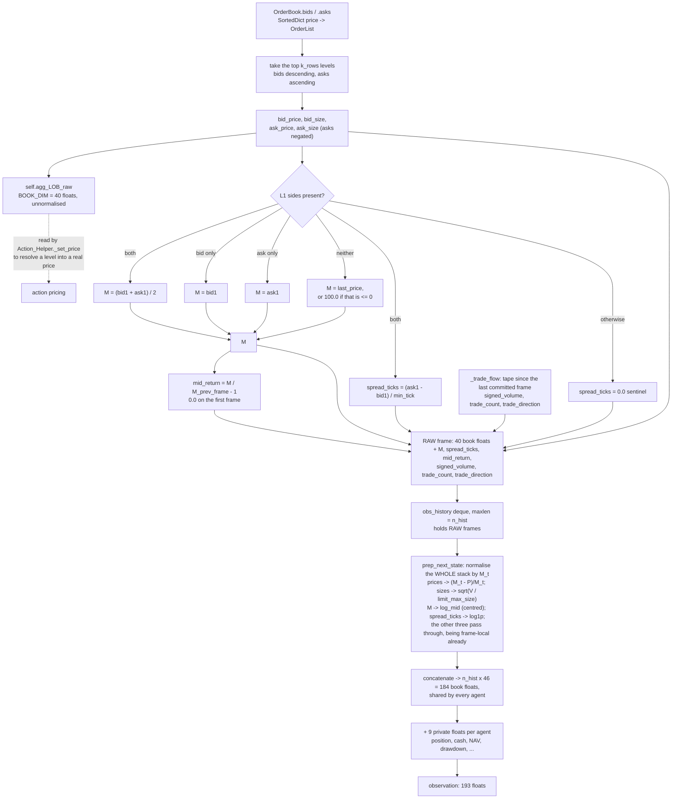

# 5. Observation Space

The complete specification of what agents see — layout, normalization, temporal stacking, market
scalars, and the raw/normalized split — followed by the measured feature scales and the design
defects.

Related: [02_architecture.md](02_architecture.md) §2.5 (step 6),
[06_action_space.md](06_action_space.md) (price levels resolve against the *un*normalized book),
[10_testing.md](10_testing.md) §4.

---

## 1. Shape at a glance

```
snapshot (one frame) = 46 floats
  index    0:10   normalized bid prices
          10:20   normalized bid sizes
          20:30   normalized ask prices
          30:40   normalized ask sizes
             40   log_mid              ln(M_frame) - log_mid_centre
             41   log1p_spread_ticks   0.0 if the book is not two-sided
             42   mid_return           M_frame / M_previous_frame - 1
             43   signed_volume        initiator-signed qty / limit_max_size
             44   log1p_trade_count    trades since the previous frame
             45   trade_direction      last initiator: +1 buy, -1 sell, 0 none

private block (per agent) = 9 floats
             0   position        tanh(net_position / limit_max_size)
             1   position_val    mark-to-market exposure / init_nav
             2   cash            free cash / init_nav
             3   cash_on_hold    escrowed against live orders / init_nav
             4   nav             nav / init_nav, so 1.0 at reset
             5   drawdown        (nav - max_nav) / init_nav, <= 0
             6   vwap_vs_mid     (M - VWAP) / M when a position is open, else 0
             7   realised_pnl    total_profit / init_nav
             8   time_left       1 - t_step / max_step

observation = n_hist frames concatenated, then the private block
  default n_hist = 4  →  shape (193,) = 4x46 + 9
  layout: [ O_{t-3} | O_{t-2} | O_{t-1} | O_t | private ]
  the most recent frame ends at index n_hist * SNAPSHOT_DIM, NOT at the end
```

**The book prefix is shared; only the private tail differs between agents.** The book is computed
once per step and handed to everyone — it is the public order book, and that half was never the
defect.

**Never slice the newest frame off the end of the vector.** `obs[-SNAPSHOT_DIM:]` returns the
private block plus a truncated final snapshot, and every field read from it is then misaligned.
Slice against `n_hist * SNAPSHOT_DIM` instead. This is the same failure that `[-40:]` produced
before `EXTRA_DIM` existed — 38 book values plus 2 scalars, silently misaligning every block slice
while still passing several assertions.

Widths are defined once, in
[`config/tunable_constants.json`](../config/tunable_constants.json) under `observation_layout`:

```jsonc
"k_rows": 10,      // book depth, price levels per side
"book_rows": 4,    // bid_price, bid_size, ask_price, ask_size
"extra_dim": 6,    // the market scalars; State_Helper.EXTRA_FIELDS names them
"private_dim": 9   // the per-agent block; State_Helper.PRIVATE_FIELDS names them
```

### 1.0 Why there is a private block at all

The reward is literally `f(nav, prev_nav, max_nav, …)` and, until this block existed, **none of
those were observable**. Every agent received the byte-identical public vector — measured,
`distinct obs vectors across agents: 1`. An agent long 100 lots and one short 100 lots therefore
saw the same input and needed opposite actions, which a policy, being a function of its
observation, cannot do. That is finding **S1-2**.

`drawdown` is the entry that could not have been recovered any other way: the reward's drawdown
term depends on `max_nav`, a path functional over the entire episode, so no amount of recurrence
could reconstruct it from a stream that never showed it.

Every field is normalised by the trader's own `init_nav` or is already a ratio, so the block is on
the same O(1) scale as the normalised book. An unbounded private field would saturate the `tanh`
MLP exactly as the raw sizes do (§7, S2-2). `State_Helper.PRIVATE_FIELDS` is the single definition
of the layout, and `__init__` checks its length against `private_dim`. `BOOK_ROW_ORDER` and
`EXTRA_FIELDS` are checked the same way against `book_rows` and `extra_dim`, so a width set in the
config that the builder does not produce raises at construction instead of misaligning every
consumer downstream — `extra_dim` was documentation only until §37.4, and setting it was a silent
no-op.

`book_dim` (= `book_rows × k_rows` = 40) and `snapshot_dim` (= 46) are **derived** in
`state_helper`, not stored, so they cannot disagree with `k_rows`. Inside the env, use the
instance attributes `self.k_rows` / `self.book_dim` / `self.snapshot_dim`, which
`State_Helper.__init__` sets from the config. The module-level `K_ROWS` / `BOOK_DIM` /
`SNAPSHOT_DIM` names read the same config at import and exist for consumers with no env instance —
the visualizers and the tests. See [18_configuration.md](18_configuration.md) §4.1.

**Never hardcode 40, 46, 160, 184, or 193.** Use `self.snapshot_dim`, or import `SNAPSHOT_DIM` (and
`BOOK_DIM` when you specifically mean the book block). The `[-40:]` slicing that predated `EXTRA_DIM` failed
*silently* rather than loudly when the width changed — it returned the last 38 book values plus
2 scalars, misaligning every block slice by 2 while still passing several assertions.

Ask prices and sizes are stored **negated**; the sign encodes side.

The declared space is `Box(-inf, inf, shape=(n_hist * SNAPSHOT_DIM + PRIVATE_DIM,), dtype=float32)`
([`continuousDoubleAuction_env.py`](../gym_continuousDoubleAuction/envs/continuousDoubleAuction_env.py)).
Every quantity here is in fact boundable; infinite bounds disable RLlib's observation filters and
any space-based sanity checking. See §7.6.

---

### 1.1 How one snapshot is built



Two things this picture makes concrete. The raw book is kept **beside** the normalised one and is
`BOOK_DIM`, not `SNAPSHOT_DIM` — the market scalars are observation-only, so action pricing is
untouched by them (§5). And the deque holds **raw** frames: normalisation is deferred to emission
so that one midpoint, `M_t`, normalises every frame in the stack. It used to hold frames each
already normalised by its own `M`, which is what made them incomparable (§7.1, now fixed).

---

## 2. Price and volume normalization

### 2.1 Level-1 midpoint `M`

Let `P_bid,1` and `P_ask,1 = |ask_price_list[0]|` be the Level-1 prices.

| Condition | `M` |
|---|---|
| both L1 sides present | `(P_bid,1 + P_ask,1) / 2` |
| bid side only | `P_bid,1` |
| ask side only | `P_ask,1` |
| empty book | `self.last_price` |
| result `<= 0` | `100.0` (hard floor) |

`M` is therefore always strictly positive, so no division or logarithm in the pipeline can fault.

### 2.2 Prices — fractional distance from `M`

For level *k* ∈ {0 … 9}:

$$\text{norm\_P\_bid}_k = \begin{cases} \dfrac{M - P_{bid,k}}{M} & P_{bid,k} > 0 \\ 0.0 & P_{bid,k} = 0 \end{cases}
\qquad
\text{norm\_P\_ask}_k = \begin{cases} -\left(\dfrac{|P_{ask,k}| - M}{M}\right) & |P_{ask,k}| \ne 0 \\ 0.0 & \text{otherwise} \end{cases}$$

Since `P_bid,k <= M <= |P_ask,k|`, bids come out `>= 0` and asks `<= 0` — the sign convention is
preserved, and the magnitude is the fractional distance from the top of the book.

**`M` here is `M_t`, the newest frame's midpoint, for every frame in the stack.** Normalisation
happens once at emission, not once per frame as it enters the deque, so the same absolute price
reads the same number in all four frames and a difference between frames is a real price move
(§7.1). The older frames' own midpoints are not lost — each keeps its own `log_mid`.

This is the right instinct, and the same thing a practitioner does before feeding a book to a
model: it makes the representation invariant to the episode's random price anchor.

### 2.3 Volumes — square root

$$\text{norm\_V\_bid}_k = +\sqrt{V_{bid,k} / \texttt{limit\_max\_size}} \ge 0 \qquad
\text{norm\_V\_ask}_k = -\sqrt{V_{ask,k} / \texttt{limit\_max\_size}} \le 0$$

The root dampens extreme volume spikes while preserving relative liquidity signals; the divisor is
what puts the result on the same order as the price block. Sizes carry no dependence on the
midpoint, so unlike prices they normalise identically in every frame of the stack.

> **This used to be a bare `sqrt(V)`**, which stabilised variance *within* the size block and left
> the cross-block mismatch untouched: sizes reached ±47 beside prices of ±0.4, a standard-deviation
> ratio of **220×** into a `tanh` first layer. Dividing by `limit_max_size` first brings it to
> **3.7×** and every book feature inside ±1.2 — see §6 for the measurements and §7.5 for the
> history.

### 2.4 Why normalize at all

Raw LOB snapshots carry large unbounded prices and high-variance volumes. Fed directly to a
network they cause gradient instability and slow convergence. Midpoint normalization makes the
price features scale-invariant; the `sqrt` transform compresses volume dynamic range.

---

## 3. Market-level scalars

Six scalars are appended to **every frame** (not once per stack). They are **always on** — there
is no config flag and no second code path. `State_Helper.EXTRA_FIELDS` is the definition of the
order, and `__init__` checks its length against `extra_dim`.

| # | Index | Scalar | What it carries |
|---|---|---|---|
| 1 | 40 | `log_mid` | The absolute price level midpoint normalisation discards |
| 2 | 41 | `log1p_spread_ticks` | How wide the market is, in the units the action space quotes in |
| 3 | 42 | `mid_return` | The motion of the denominator every price is divided by |
| 4 | 43 | `signed_volume` | Initiator-signed traded quantity since the previous frame |
| 5 | 44 | `log1p_trade_count` | How many trades happened in that interval |
| 6 | 45 | `trade_direction` | Which side the last one was initiated from |

The last four are the newer half, and they close two findings at once: the observation carried
**no information about executions at all** (S2-7 — the tape loop that should have produced three
of them iterated, counted and discarded, §7.3), and it could not distinguish a book that moved
from a midpoint that moved (S2-6, §7.1).

### 3.1 `log_mid` (index 40)

$$\texttt{log\_mid} = \ln(M_{frame}) - \ln\!\sqrt{\texttt{initial\_price\_min} \cdot \texttt{initial\_price\_max}}$$

Reuses the `M` already computed for normalization — no extra book queries. Note it is the
**frame's own** midpoint, not the `M_t` the prices are divided by: that is what lets an agent
recover the level each frame sat at after the stack has been put on one denominator (§2.2).

**Centred, and that matters.** Uncentred, `ln(M)` is a near-constant — measured at 4.55–4.64 over
a 400-step rollout — a standing +4.6 bias into a `tanh` first layer while every price feature
beside it had a standard deviation of 0.04. Subtracting the log of the geometric mean of the
price-anchor range spans it about −1.15…+1.15 instead, carrying identical information. Geometric
rather than arithmetic mean because the quantity is a logarithm, so that puts the two ends of the
range symmetrically about zero.

**Range:** ≈ 0.40 – 1.16 measured over 400 steps at the shipped `[10, 100]` anchor range
([16](16_verification_log.md) §16.12).

**Why it exists.** Midpoint normalization makes the observation scale-free, which *discards `M`
itself*. Two markets at price 10 and price 100 were previously indistinguishable — yet `min_tick`
is absolute (= 1), so one tick is a 10% move in the first market and a 1% move in the second.
Agents were being asked to choose tick-denominated price offsets without being able to perceive
what a tick was worth. `log_mid` restores that anchor.

### 3.2 `log1p_spread_ticks` (index 41)

$$\texttt{log1p\_spread\_ticks} = \ln\!\left(1 + \frac{P_{ask,1} - P_{bid,1}}{\texttt{min\_tick}}\right)
\quad\text{if both L1 sides exist, else } 0.0$$

Computed from the same `l1_bid` / `l1_ask` locals as `M`, so it is guaranteed consistent with the
top of book actually present in the observation.

**`min_tick`, not `tick_size` — deliberate, and now the same number.** `Action_Helper.min_tick`
*is* the `tick_size` config key: it is the tick the action space quotes in, and `_set_price` is
the only thing in the system that builds a price. Reading it here makes observation units match
action units by construction. (When this was written the two were independent — `min_tick` was a
hardcoded 1 and the config key was inert — so the choice was a workaround; it is now simply the
right source. See [02_architecture.md](02_architecture.md) §2.7.)

**The `0.0` sentinel is unambiguous.** A resting book can never be locked or crossed — any bid
`>= best ask` is filled on arrival ([03_matching_engine.md](03_matching_engine.md) §2.1) — so a
two-sided book always has `spread >= 1` tick, and every real measurement maps to
`log1p(x) >= log1p(1) = 0.693`. `log1p(0) = 0` sits cleanly below the valid range.

**Range:** 0 (sentinel), then ≈ 0.693 – 4.6 for spreads of 1 to 100 ticks. Measured 0.0 – 3.40,
non-zero on 89.0% of frames ([16](16_verification_log.md) §16.12).

**Why `log1p` rather than raw `spread / tick`:** raw spread is unbounded — a thin early-episode
book can produce 50+, which would sit beside price features of magnitude ~0.5. `log1p` compresses
it to the same order as `log_mid`, keeps the zero sentinel exact, and preserves monotonicity. The
cost is diminishing sensitivity at wide spreads, which is acceptable: the difference between a
40- and a 50-tick spread matters far less than between 1 and 2.

### 3.3 `mid_return` (index 42)

$$\texttt{mid\_return} = \frac{M_{frame}}{M_{previous\ frame}} - 1$$

The motion of the anchor itself, `0.0` on the first frame of an episode — the same value a market
that did not move reports, which is the right reading of "nothing has changed yet".

It is the other half of the §7.1 fix. Once the whole stack is normalised by one `M_t`, a price
that did not move reads identically in every frame; `mid_return` is where the information about
the *anchor* having moved goes instead, rather than being smeared through all forty book features.

**Range:** measured −0.19 – 0.23, non-zero on 48.0% of frames.

### 3.4 Trade flow (indices 43–45)

$$\texttt{signed\_volume} = \frac{1}{\texttt{limit\_max\_size}}\sum_{\text{fills since the last frame}} \pm q
\qquad
\texttt{log1p\_trade\_count} = \ln(1 + n)
\qquad
\texttt{trade\_direction} \in \{-1, 0, +1\}$$

`_trade_flow` walks the tape from `_tape_cursor` — where it stood when the last frame was
committed to the deque — to its end, so the interval is exactly one frame regardless of how many
times `set_agg_LOB` was called in between (it runs twice per step; only `prep_next_state`
advances the cursor).

**Signed by the *initiator's* side**, which is what makes it order flow rather than volume: a fill
whose aggressor bought is `+q`, one whose aggressor sold is `−q`. That is the quantity
microstructure research finds most predictive of short-horizon returns, and it is the single
largest public feature the observation used to lack.

`trade_direction` is the initiator side of the **last** fill in the interval, `0.0` if there was
none. Zero is unambiguous here: the two live values are ±1.

**Ranges:** `signed_volume` −0.080 – 0.108 (non-zero 57.5%), `log1p_trade_count` 0.0 – 1.61,
`trade_direction` ±1 — the last two non-zero on 57.8% of frames, which is the fraction of frames
in which any trade happened at all.

### 3.5 Why per-frame

Each frame becomes self-describing: `log_mid` lets an agent recover the level that frame sat at,
and the three flow scalars describe the interval that *ended* at it, so a stack of four frames is
four intervals of order flow rather than one. Appending at the *end* also keeps all existing
`[0:10] / [10:20] / [20:30] / [30:40]` block slicing correct.

---

## 4. Temporal history stacking

### 4.1 Why

A single snapshot at time *t* tells an agent nothing about **how the market arrived** at that
state — whether prices are trending, order flow is accelerating, or a large order is being
worked. A window of the *N* most recent snapshots enables learning momentum and mean-reversion
patterns, and distinguishes a stable book from a rapidly evolving one.

### 4.2 Design decisions

| Decision | Choice | Rationale |
|---|---|---|
| Observation format | Flat 1-D `(N × SNAPSHOT_DIM + PRIVATE_DIM,)` | Maximum compatibility with RLlib built-in policies (FCNet, LSTM expect flat inputs) |
| History scope | One shared environment-level `obs_history` deque | All agents observe the same public market; per-agent history would be redundant |
| Default window *N* | 4 | Balances temporal context against input dimensionality |
| Configurability | `config["n_hist"]` | Consistent with the existing RLlib config pattern |

### 4.3 Mechanism

`State_Helper` holds `self.obs_history = deque(maxlen=n_hist)`.

- `reset_traders_agg_LOB()` generates the initial **raw** frame *O₀* and fills the deque with *N*
  copies of it, then normalises and concatenates. Padding with copies of *O₀* rather than zeros
  avoids misleading agents into thinking there was prior inactivity.
- `prep_next_state()` appends the new raw frame (the deque drops the oldest automatically),
  advances `_tape_cursor` and `_prev_frame_mid`, and normalises the whole stack by `M_t`.

Every agent receives the same **book prefix** and its own private tail:

```python
for trader in self.traders:
    states = self.set_next_state(states, trader, stacked_obs, ...)
```

The reset path goes through `set_next_state` too, so the two blocks are laid out by exactly the
same code at step 0 as at every later step — a reset that ordered them differently would be
invisible until a policy trained on it behaved oddly on its first action.

**[verified]** — the number of distinct observation vectors across agents was **1** before the
private block existed, at reset and at every step. That was S1-2; §1.0 is the fix.

---

## 5. The raw book: `agg_LOB_raw`

Alongside the normalized observation, `set_agg_LOB()` keeps an **unnormalized** 40-element
snapshot in `self.agg_LOB_raw`. This is what `Action_Helper._set_price()` reads to turn an
agent's discrete price-level selection into an actual market price.

**`agg_LOB_raw` is `BOOK_DIM` (40), not `SNAPSHOT_DIM`.** The market scalars are an
observation-only addition; action price resolution
(`np.array(agg_LOB_source).reshape(4, 10)`) is untouched by them. This separation is the key
safety property of the design and is pinned by `test_agg_LOB_raw_still_book_sized`.

`_set_price()` accesses it via `getattr(self, 'agg_LOB_raw', self.agg_LOB)` so `State_Helper`
stays importable independently of the mixin chain.

### Timing

The observation returned at the end of step *t* reflects the book after all of *t*'s orders, and
the `agg_LOB_raw` used to resolve action prices at *t+1* is recomputed from that same book state.
There is no off-by-one between what the agent sees and what its price-level selections resolve
against.

One consequence worth knowing: *within* a step, `agg_LOB_raw` is frozen at the start while orders
execute sequentially, so a trader executing fourth prices its levels against a stale book. That
is consistent with the environment's "all traders suffer the same lag" assumption, but it does
mean a chosen level can already be crossed by the time it executes.

---

## 6. Measured feature scales

**[verified]** — 4 agents × 400 steps at default config, `reset(seed=7)` with the action spaces
seeded too ([16](16_verification_log.md) §16.12):

| Block | min | max | std |
|---|---|---|---|
| `bid_price` | 0.0000 | 0.3385 | 0.0663 |
| `bid_size` | 0.0000 | 1.1136 | 0.2471 |
| `ask_price` | −0.5856 | 0.0000 | 0.0823 |
| `ask_size` | −0.9214 | 0.0000 | 0.2433 |

| Scalar | min | max | std | non-zero |
|---|---|---|---|---|
| `log_mid` | 0.3963 | 1.1612 | 0.1722 | 100.0% |
| `log1p_spread_ticks` | 0.0000 | 3.4012 | 0.8147 | 89.0% |
| `mid_return` | −0.1935 | 0.2308 | 0.0374 | 48.0% |
| `signed_volume` | −0.0800 | 0.1080 | 0.0255 | 57.5% |
| `log1p_trade_count` | 0.0000 | 1.6094 | 0.4480 | 57.8% |
| `trade_direction` | −1.0000 | 1.0000 | 0.7592 | 57.8% |

Size/price standard-deviation ratio **3.7×**, and every book feature inside ±1.2 — a range a
`tanh` first layer can use.

**What it was before §37.4**, because the size of the change is the point: sizes were a bare
`sqrt(V)` reaching **±47** beside prices of ±0.4, a standard-deviation ratio of **220×**, and
`log_mid` was an uncentred 4.55–4.64. Two earlier probes on that code measured maxima of 47.01 and
51.19 for the size block; the absolute numbers moved with the book and the ratio did not.

The one-normaliser-per-stack property, measured directly rather than by correlation — a bid
resting at 90 while the midpoint moves 100 → 96:

| | frame at mid 100 | frame at mid 96 |
|---|---|---|
| normalised bid L1, **before** | 0.100 | 0.063 |
| normalised bid L1, **after** | 0.0625 | 0.0625 |
| `log_mid`, after | 0.0000 | −0.0408 |

`mid_return` on the newest frame is −0.0400, i.e. 96/100 − 1. The order had not moved; its
denominator had.

Round-trip verification of the transforms (inverting both must recover the live book). Recorded
before the private block and the four new scalars existed, so the shape is the book part alone at
its old width; the round trip itself is unaffected:

```
OBS SHAPE          = (168,)   <- book only, extra_dim 2; the observation is 193 floats now
best bid/ask raw   = 67.0 / 76.0
exp(log_mid)       = 71.500015     ← matches (67 + 76) / 2 = 71.5
expm1(log1p_spread)= 9.0           ← matches 76 - 67 = 9 ticks
total NAV          = 4,000,000     ← conserved
all finite         = True
```

Inverting `log_mid` now needs the centre added back first: `exp(log_mid + log_mid_centre)`.

---

## 7. Design defects

The observation is where the largest remaining problems are. Ordered by cost.

```mermaid
mindmap
  root((Observation defects))
    Information missing
      7.7 private state - fixed
        inventory, cash, NAV, drawdown now in the observation
        own resting orders still absent
        S1-2 closed by 17 section 30
      7.3 no trade flow - fixed
        signed_volume, trade count, direction
        S2-7 closed by 17 section 37.4
      time remaining - fixed
        time_left is PRIVATE_FIELDS[8]
    Representation
      7.1 per-frame normalizer - fixed
        the deque holds raw frames
        one M_t normalises the stack
        S2-6 closed by 17 section 37.4
      7.2 zero means three things
        absent level
        price exactly at M
        L1 of a one-sided book
        S3-14
      7.4 level index is non-stationary
        k-th occupied price, not a fixed distance
        S3-15
    Scaling
      7.5 size block was 80-250x the price block - fixed
        sqrt(V / limit_max_size), ratio now 3.7x
        S2-2 closed by 17 section 37.4
      7.6 infinite observation bounds
        disables RLlib filters
        S4-15
      redundant ask sign
        blocks weight sharing
        S4-17
```

**Three of these are now closed.** §7.1, §7.3 and §7.5 are kept rather than deleted because each
records a failure mode worth recognising again, and because the fix only makes sense against what
it replaced. What is still open is §7.2, §7.4, §7.6 and the resting-order half of §7.7.

### 7.1 Each frame in the stack is normalized by a different denominator — **fixed**

`set_agg_LOB` computed `M` from the book *at that moment*, and `prep_next_state` appended the
**already-normalized** frame to the deque. So frames *t−3 … t* each carried their own
`M_{t−3} … M_t`.

Consequence: **frames cannot be compared to each other.** A resting order whose absolute price
never changed appears to move whenever the midpoint moves; a real price move can appear as no
change if `M` moved with it. The entire purpose of stacking frames is to expose order flow — the
*differences* between frames — and those differences are contaminated by a time-varying
normalizer.

*Partially mitigated* by the per-frame `log_mid` scalar, which at least lets the agent recover
each frame's normalizer.

**Fixed exactly that way.** The deque holds raw frames and `prep_next_state` normalises the whole
stack once, by `M_t`; `mid_return` carries the anchor's own motion (§3.3), and each frame keeps
its own `log_mid`. A bid resting at 90 while the midpoint moves 100 → 96 read 0.100 then 0.063; it
now reads 0.0625 in both. [17](17_changelog.md) §37.4, measured in
[16](16_verification_log.md) §16.12.

### 7.2 Zero means three different things

`0.0` is the sentinel for "level absent". It is also the exact value of a price *at* the
midpoint. And on a one-sided book `M` falls back to that side's L1 price, so
`(M − P_bid,1)/M = 0` **exactly** — the best bid in a bid-only book is numerically identical to an
empty level. The same holds for an ask-only book.

This is not a corner case: the book starts empty every episode and is frequently one-sided early
on. There is no validity mask, so the network cannot disambiguate.

**Fix.** An explicit per-level occupancy channel (10 bits per side), or a clearly out-of-range
sentinel.

### 7.3 The tape loop is dead code — there is no trade-flow information at all — **fixed**

In `set_agg_LOB`
([`state_helper.py`](../gym_continuousDoubleAuction/envs/exchg/state_helper.py)):

```python
if self.LOB.tape != None and len(self.LOB.tape) > 0:
    num = 0
    for entry in reversed(self.LOB.tape):
        if num < self.LOB.tape_display_length:
            #tempfile.write(...)
            num += 1
        else:
            break
```

`entry` is never used. The body is a commented-out `write` copy-pasted from `OrderBook.__str__`.
The loop increments a counter and discards it. It *looks* like it is building tape features; it
builds nothing.

The observation therefore contained **zero information about executions**: no last traded price,
no trade direction, no signed volume, no trade count. In a continuous double auction, aggressive
order flow is the single most predictive public signal — more so than the resting book, which is
largely stale intentions. This was the largest missing *public* feature, and the placeholder loop
suggests it was intended to be there.

**Fixed.** That loop is now `_trade_flow`, and `signed_volume`, `log1p_trade_count` and
`trade_direction` are scalars 4–6 of every frame (§3.4). [17](17_changelog.md) §37.4. Note what is
*not* there: the last traded **price** is still absent as a feature, though `mid_return` and the
midpoint fallback chain make most of what it would carry recoverable.

### 7.4 Level index is a non-stationary coordinate

Position *k* in the vector means "the *k*-th occupied price", not a fixed price. The mapping from
index to distance-from-mid changes every step as levels are created and consumed. The action
space selects by the **same** unstable index, so a learned association such as "level 3 is a good
place to quote" has no fixed meaning across steps.

**Fix.** A fixed grid — one slot per tick offset from the midpoint, out to ±N ticks, holding the
volume at that price. This is stationary, makes empty levels naturally zero-volume rather than
sentinel-encoded, and makes observation and action share one coordinate system.

### 7.5 Feature scales differ by one to two orders of magnitude after "normalization" — **fixed**

See §6 for the measurements, before and after. The 22 well-scaled features (prices and the two
scalars) fed the same linear layer as the 20 size features and were up to ~250× smaller, so the
price half was close to invisible at initialization and the size units saturated `tanh`
immediately.

A bare `sqrt` stabilized variance *within* the size block and left the cross-block mismatch
untouched — arguably worse than no normalization, because the documentation asserted the
observation was normalized.

**Fixed** by giving size the same units-free property as price — `sqrt(V / limit_max_size)`
(§2.3) — and centring `log_mid` on the log of the geometric mean of the anchor range (§3.1). The
size/price standard-deviation ratio is **3.7×**, down from 220×, and every book feature is inside
±1.2. [17](17_changelog.md) §37.4.

The `tanh` MLP still runs with no `MeanStdFilter` and no normalisation connector configured; that
is now a choice rather than a gap, because the features arrive on one scale.

### 7.6 Redundancy and wasted capacity

- **The sign convention is redundant.** Side is already encoded by block position; negating asks
  adds no information. It does prevent weight sharing between the two sides, which is otherwise a
  natural symmetry to exploit.
- **4× stacking of slowly-changing absolute levels.** Consecutive frames are near-identical, so
  most of the 160 book dimensions are near-duplicates, while the informative quantity (the
  change) must be recovered as a difference of large, similar numbers — poor conditioning. A
  `state_diff` function that computes exactly this already exists, unused, with a comment saying
  it "should be used in obs preprocessing if needed". Either use it or delete it.
- **`Box(-inf, inf)` bounds.** Every quantity here is boundable.

### 7.7 No private state — **fixed**, except resting orders

Nothing in the vector encoded the agent's own inventory, cash, NAV or drawdown, yet the reward is a
deterministic function of exactly those. That was S1-2, the single biggest flaw, and it is closed:
§1 documents the 9-float private block that every agent now receives, and
[17_changelog.md](17_changelog.md) §30 records the change.

**What is still missing is own resting orders.** An agent sees `cash_on_hold` — how much cash is
escrowed against live orders — but not *which* orders that cash is committed to, so `modify` and
`cancel` remain partly blind. That is the larger half of what S1-2 left, and it is the one item on
§8's private list still unbuilt. The analysis of why it mattered is in
[12_perspective_rl_researcher.md](12_perspective_rl_researcher.md) §2.

---

## 8. A recommended layout

Roughly, per frame, all in tick units and depth shares:

```
market (public):
  log(M)                                    1    restores the anchor  [DONE]
  spread in ticks                           1                         [DONE]
  volume at +/-N tick offsets from mid     2N    fixed grid, stationary
  occupancy mask for that grid             2N    kills the zero collision
  signed traded volume last step            1    [DONE] signed_volume
  trade count / direction last step         2    [DONE] log1p_trade_count,
                                                        trade_direction
  M_t / M_{t-1} - 1                         1    [DONE] mid_return

private (per agent):
  net position, VWAP, unrealized P&L        3    [DONE] position, vwap_vs_mid,
                                                        position_val
  cash, cash_on_hold, NAV/init_cash         3    [DONE]
  drawdown from peak                        1    [DONE]
  own resting volume on the same grid      2N    still missing - see 7.7
  t_step / max_step                         1    [DONE] as time_left
```

Everything on the private list is shipped except own resting volume, and everything on the public
list except the fixed grid and its occupancy mask — which are the same item twice, and are §7.4
and §7.2. See §1 for the blocks as built, and `State_Helper.PRIVATE_FIELDS` / `EXTRA_FIELDS` for
the field orders.

**Time remaining is now in the observation.** It was missing and cheap, and the argument for it
still explains why it is there: this is a finite-horizon episode, so the optimal policy is
genuinely time-dependent — inventory should be flattened toward the end. `time_left` is
`PRIVATE_FIELDS[8]`, carried as `1 - t_step / max_step` so it *falls* to zero at truncation.

Stacking raw snapshots and normalising the whole stack once at emission is done (§7.1). Explicit
frame deltas, rather than relying on the network to difference the stack, are not: `mid_return`
supplies the anchor's delta and nothing supplies the book's.

---

## 9. Consumers of the observation width

Anything that slices an observation must use `SNAPSHOT_DIM` / `BOOK_DIM`:

| Site | Usage |
|---|---|
| [`continuousDoubleAuction_env.py`](../gym_continuousDoubleAuction/envs/continuousDoubleAuction_env.py) | `Box` shape is `(n_hist * SNAPSHOT_DIM + PRIVATE_DIM,)` |
| [`exchg_helper.py`](../gym_continuousDoubleAuction/envs/exchg/exchg_helper.py) `print_table` | Slices the book block before `reshape(4, K_ROWS)`, then prints trailing scalars on their own line. Without the slice, `reshape` raises `ValueError` on **every rendered step**. |
| [`visualize_orderbook.py`](../gym_continuousDoubleAuction/visualize/visualize_orderbook.py) | Slices the newest frame at `[(n_hist-1) * SNAPSHOT_DIM : n_hist * SNAPSHOT_DIM]`, deriving `n_hist` from the width after taking `PRIVATE_DIM` off — deliberately **not** `obs[-SNAPSHOT_DIM:]`, which returns the private block plus a truncated frame |
| `test_obs_normalization.py`, `test_observation_history.py`, `test_obs_market_features.py` | All shape literals derive from the constants |

Rendered output for the scalars looks like:

```
log_mid = 0.269698; log1p_spread_ticks = 2.302585; mid_return = -0.004000;
signed_volume = 0.012000; log1p_trade_count = 1.098612; trade_direction = 1.000000
```

---

## 10. Compatibility

Any policy checkpoint built against an older observation width will not load against the current
one, and an episode Parquet record written under one width has `obs` lists of a different length
than the reader expects. This is unavoidable whenever the observation dimension
changes; the width has changed four times (40 → 160 with stacking, 160 → 168 with the first two
market scalars, 168 → 177 with the private block, 177 → 193 with the four trade-flow and
mid-return scalars).
`SNAPSHOT_DIM` is a good constant but is not recorded in the checkpoint, so the mismatch is not
detected — it just fails.
