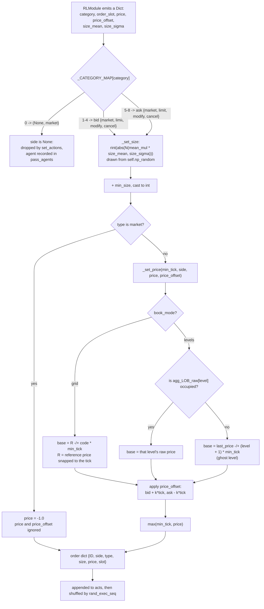

# 6. Action Space

The current `Dict` action space, its deterministic price anchoring, the two degenerate
dimensions, and the legacy `Tuple` design it replaced.

Related: [05_observation_space.md](05_observation_space.md) §5 (prices resolve against
`agg_LOB_raw`), [03_matching_engine.md](03_matching_engine.md) §3.5 (order targeting),
[10_testing.md](10_testing.md) §3.

---

## 1. Current structure

Each agent's action is a `gymnasium.spaces.Dict`
([`action_helper.py`](../gym_continuousDoubleAuction/envs/exchg/action_helper.py)):

| Key | Space | Config key | Description |
|---|---|---|---|
| `category` | `Discrete(9)` | `action_space.category_n` | Trade action — side and type combined |
| `size_mean` | `Box(-1.0, 1.0)` | `action_space.size_mean_low` / `_high` | Mean for size sampling |
| `size_sigma` | `Box(0.0, 1.0)` | `action_space.size_sigma_low` / `_high` | Sigma for size sampling |
| `price` | `Discrete(10)` | `observation_layout.k_rows` | Ticks from the reference price on the passive side (`book_mode: "grid"`, the default); book level index 0–9 in `levels` mode |
| `price_offset` | `Discrete(3)` | `action_space.price_offset_n` | Stance relative to that level: 0 passive, 1 join, 2 aggressive |

Which of the nine categories an agent can actually take on a step is part of its observation,
and the policy modules refuse the others: §7.

Every cardinality and bound comes from
[`config/tunable_constants.json`](../config/tunable_constants.json). `category_n` and
`price_offset_n` are validated against the code that decodes them — the `_CATEGORY_MAP` table, and
the requirement that `price_offset_n` be odd so the neutral "join" code is the middle one — so a
value the decoder cannot honour raises rather than being silently ignored. See
[18_configuration.md](18_configuration.md) §4.2.

### 1.0 From network output to a book order



`mean_mul` is 49.5 for market orders and 499.5 for limit orders, so the same `size_mean` means a
10× larger order on the limit path. Note that the *realised* size is drawn by the **environment**,
not by the policy distribution — §4.3 is about why that matters.

### 1.1 `category`

| Value | Meaning |
|---|---|
| 0 | Neutral — no action |
| 1 – 4 | Buy: market, limit, modify, cancel |
| 5 – 8 | Sell: market, limit, modify, cancel |

Category 0 sets `side = None`, and `set_actions` drops those entries before any price calculation
or matching — so "do nothing" costs nothing.

### 1.2 Size

Constants, from
[`action_helper.py`](../gym_continuousDoubleAuction/envs/exchg/action_helper.py):

```python
min_size            = 1
mkt_max_size        = 100
N                   = 10
limit_max_size      = mkt_max_size * N          # 1000
mkt_size_mean_mul   = (mkt_max_size - min_size) / 2      # 49.5
limit_size_mean_mul = (limit_max_size - min_size) / 2    # 499.5
```

The final size is
`rint(abs(N(mean_mul × size_mean, size_sigma)))`, then `+ min_size` so it is at least 1. A
full-scale limit draw (`size_mean = 1.0`) is therefore ≈ **500 contracts**, not 5,000.

> Both size dimensions are effectively degenerate — see §4.

### 1.3 `price_offset`

| Value | Bid | Ask |
|---|---|---|
| 0 — Passive | 1 tick **below** the level price | 1 tick **above** the level price |
| 1 — Join | exactly the level price | exactly the level price |
| 2 — Aggressive | 1 tick **above** the level price | 1 tick **below** the level price |

"Aggressive" is inverted between the sides, as it must be: buying higher and selling lower both
mean paying up for immediacy. Implemented as
`offset_multiplier = price_offset - 1`, added for bids and subtracted for asks.

### 1.4 Market orders ignore price

If `category` is 1 or 5 (market), `price` and `price_offset` are ignored and the internal order
price is set to `-1.0` — the sentinel telling the matching engine to execute immediately at
whatever is available. `test_market_order_mapping` proves this by submitting a deliberately
"dirty" price level with a market category.

### 1.5 Aiming a modify or cancel: `order_slot`

Since 2026-09-18 ([15](15_findings_and_recommendations.md) S3-24, phase 2) the Dict carries a
sixth head, `order_slot: Discrete(max_own_orders + 1)`, and it is what aims the two
order-management categories:

| `order_slot` | `cancel` | `modify` |
|---|---|---|
| 0 | every own order on that side | the **oldest** own order on that side (the pre-slot FIFO rule, so a policy that ignores the head loses nothing) |
| k ≥ 1 | the k-th own order from the touch — best price first, oldest first within a level, the order the own-book observation lists them in ([05](05_observation_space.md) §1.0.1) — **clamped to the deepest** when the agent has fewer than k | the same order, moved to the price `price` + `price_offset` names, with the size head's quantity |

The only miss left, counted in `num_unmatched_step` and shown to the agent as
`unmatched_last_step` in its next observation, is a modify or cancel on a side where it has
nothing resting. A **cancel no longer reads `price` at all**. Before this a cancel had to name its
order's exact price out of thirty codes and landed 7% of the time under random play; a modify
always took the oldest order and so could not choose which to move.

Why clamp a slot past the count rather than count it as a miss: measured under uniformly random
play — which is what the baseline opponents are — a head with dead upper slots made modify *worse*
than the FIFO rule it replaced (48% → 23% of issued modifies landed) while cancel rose only from
7% to 19%; a learned policy gains nothing from dead slots, because it can read its own-order
counts and aim exactly. Clamped, any slot lands whenever the agent has an order on that side:
35–36% of issued modifies and cancels under random play, 58–62% of those where it had anything
resting at all ([16](16_verification_log.md) §16.20). `max_own_orders` is 4, the measured p90 of
resting orders per agent ([18](18_configuration.md) §4.2).

- **Limit** still matches by price: a limit at a price the agent already rests at is an upsert.
  The match is made in `Decimal`, the type the book stores prices in, and `_set_price` snaps every
  price it emits to the `tick_size` grid before handing it over — so the price an agent names is
  the price level the book has, on any tick, not only on `tick_size` 1
  ([15](15_findings_and_recommendations.md) S3-4).
- A **cancel** is never cash-checked; it only releases escrow. A **modify** may spend the escrow
  of the order it replaces, so shrinking or re-pricing an order is always possible
  ([15](15_findings_and_recommendations.md) S2-13).

See [03_matching_engine.md](03_matching_engine.md) §3.5 for why the two differ.

---

## 2. Deterministic price anchoring

The mechanism that makes every action code carry a stable economic meaning, even when the book is
thin or empty.

### 2.1 The anchor

- **Initial:** at `reset()`, `last_price` is sampled as an integer from
  `[initial_price_min, initial_price_max]` (default `[10, 100]`) and cast to `float`.
- **Dynamic:** `mark_to_mkt` sets `last_price` to the **last traded price** from the LOB tape
  after every step that produced a trade.

### 2.1.1 Grid mode — the default since 2026-09-18

With `book_mode: "grid"` ([05](05_observation_space.md) §1.4, S3-15) the price code is a tick offset,
not a level index: a bid with code *j* is placed at `R − j × min_tick` and an ask at
`R + j × min_tick`, where `R` is the observation's reference price (the two-sided midpoint, else
the last trade, snapped to the tick). `price_offset` then shades by one tick as below. Every code
names a price, so §2.2 and §2.3 do not apply; the observation's cell `k_rows − j` (bids) or
`k_rows + j` (asks) is exactly where the order will show. Measured under random play, code *j*
lands at *j* ± 0.9 ticks on both sides — the 0.9 is the offset head — where the `levels` path
landed it anywhere from 0 to 20 ticks out ([16](16_verification_log.md) §16.24). Sections 2.2 and
2.3 describe the `levels` path, kept for comparison.

### 2.2 Populated levels (`levels` mode)

If the targeted book level exists, its price is read from the **unnormalized** `agg_LOB_raw`
([05_observation_space.md](05_observation_space.md) §5), and `price_offset` is applied.

### 2.3 Ghost levels (`levels` mode)

If the targeted level is empty, the price is extrapolated deterministically from the anchor:

- **Bid:** `Anchor − (level_idx + 1) × min_tick`
- **Ask:** `Anchor + (level_idx + 1) × min_tick`

So level index 0 targets 1 tick from the anchor and index 9 targets 10 ticks away. A final
`max(min_tick, set_price)` guard keeps prices strictly positive.

**Why this matters.** "Price level 1" always means "the most aggressive price near the current
valuation"; "price level 10" always means "a very passive price far from the centre." An agent
can learn that level 10 is where patient orders go even when nobody else is quoting there. There
is no discontinuity when the book goes thin — which is precisely the failure of the legacy design
(§5.2). It matters most early in an episode, when the book is empty.

---

## 3. Why relative pricing at all

By selecting *levels and offsets* rather than absolute currency values, the agent never has to
learn what a price of 10,000 means. It only needs to learn relative concepts — "be one tick
better than the current best", "quote at the third level of depth". The policy then generalizes
across price regimes instead of memorising one. This is the one part of the original design that
survived the redesign intact, and the `category × price-level × price-offset` factorisation is a
thoughtful piece of design: the passive/join/aggressive offset is exactly the decision a market
maker faces.

The corresponding cost, worth being explicit about: level index *k* means "the *k*-th occupied
price", not a fixed distance, so the coordinate system is non-stationary. See
[05_observation_space.md](05_observation_space.md) §7.4.

---

## 4. The two degenerate dimensions

### 4.1 Half the `size_mean` range is a no-op

`_set_size`
([`action_helper.py`](../gym_continuousDoubleAuction/envs/exchg/action_helper.py)):

```python
sample = self.np_random.normal(mean_mul * mean, sigma, 1)
return int(np.rint(np.abs(sample)).item())
```

The `abs()` folds the distribution. **[verified]**, same RNG seed:

```
mean=+0.5 -> [250.0, 250.0, 250.0, 250.0, 250.0]
mean=-0.5 -> [250.0, 250.0, 250.0, 250.0, 250.0]   identical: True
```

`size_mean` is declared on `Box(-1, 1)`, so the policy's Gaussian head spends half its range on a
mirror image. Worse, the optimum is bimodal at `±m`, which fights the unimodal Gaussian policy:
the head is pushed toward mean 0 by symmetric gradients, and mean 0 means *minimum* size. The
gradient also has a kink at exactly 0 — the worst possible place for one, since that is where a
Gaussian policy initializes.

**Fix:** declare the space as `Box(0, 1)`.

### 4.2 The `size_sigma` head is inert

`sigma` is passed straight to `np.random.normal` as an **absolute** standard deviation, while
means are 49.5·|m| (market) or 499.5·|m| (limit). **[verified]**:

```
sigma=0.0 -> [250.0, 250.0, 250.0];  sigma=1.0 -> [251.0, 249.0, 250.0]
```

Across `sigma ∈ [0,1]` the size varies by ±1 contract on a base of 250. The head is a null
control: the policy pays entropy cost forever for a parameter with no effect.

**Fix:** scale it (`sigma × mean_mul × k`) or delete it.

### 4.3 Environment-side sampling breaks the log-probability

Setting scale aside, the *architecture* of size selection is unusual: the policy emits
distribution **parameters**, and the environment draws the sample. The realised size is therefore
not part of the action whose log-probability PPO uses in the importance ratio. The policy is
credited or blamed for an outcome driven by an unrecorded random draw, and the agent never
observes the realisation.

This shows up as extra advantage variance that no amount of data removes. The standard
formulation is to have the policy emit the size directly (a `Box` action, with sampling handled
by the policy distribution, so `log π(a|s)` covers it), letting PPO's own exploration schedule
control the spread.

### 4.4 Dead helper methods

`_set_side`, `_set_type`, `_higher` and `_lower` are all superseded by the category mapping and
the offset arithmetic, and are never called. (`_set_price` also used to carry a `max_price`
parameter its body never read; that one is gone.)

---

## 5. The legacy design and why it was replaced

Retained because it explains the shape of the current design.

### 5.1 What it was

A `gym.spaces.Tuple` of five components:

1. **Side** `Discrete(3)` — 0 none, 1 bid, 2 ask
2. **Type** `Discrete(4)` — 0 market, 1 limit, 2 modify, 3 cancel
3. **Size Mean** `Box(-1.0, 1.0)`
4. **Size Sigma** `Box(0.0, 1.0)`
5. **Price Code** `Discrete(12)`

The price code mapped as:

| Price code | Target | Bid | Ask |
|---|---|---|---|
| 11 | Beyond the best price | Best bid + 1 tick | Best ask − 1 tick |
| 1 – 10 | A specific LOB level | Level price + 1 tick | Level price − 1 tick |
| 0 | Behind the worst visible price | Worst bid − 1 tick | Worst ask + 1 tick |

The commented-out `act_space` at
[`action_helper.py`](../gym_continuousDoubleAuction/envs/exchg/action_helper.py)
still preserves it inline.

### 5.2 The flaws that motivated the redesign

**The empty-book randomness trap — the most serious.** If a targeted level was empty, the
environment generated a completely random price:

```python
if price == 0:
    set_price = random.randrange(min_tick, max_price, min_tick)
```

An agent could learn that "price code 3" was a safe passive placement; when liquidity vanished,
price code 3 became a lottery ticket. That non-stationarity makes it extremely hard for a network
to converge on a stable value function. **Resolved** by the ghost-level anchoring in §2.3.

**Forced aggression.** Codes 1–10 always offset by 1 tick, so an agent could never *join* a level
at exactly its price. This designed-in penny war prevented agents from learning passive
liquidity-providing strategies. **Resolved** by the `price_offset` dimension, whose "join" value
is exactly the level price.

**Redundant boundary codes.** Codes 0 and 11 became unnecessary once levels and offsets could be
combined freely, and were dropped.

**Sparse and redundant space.** Many combinations were dead actions — if side was 0 (none), the
other four components were ignored; if type was 0 (market), the price code was ignored. A large
fraction of the mathematical action space had zero effect on the environment. **Partly resolved**
by collapsing side × type into a single `category`, which removes the side-0 dead branch.

**Blindness to market macro-structure.** The price code was hardcoded to the top 10 levels, so an
agent could not place deep orders far outside the current spread — no fishing for flash-crash
fills. **Not resolved**; the current space has the same 10-level horizon, now measured in ticks
from the anchor rather than in occupied levels.

**Discrete–continuous hybrid.** Mixing discrete and `Box` components in one space is awkward for
some algorithms — DQN cannot handle the continuous parts, and PPO/SAC need branching heads.
**Not resolved**; the current `Dict` has the same heterogeneity, though a flat `Dict` is easier
for RLlib to handle than a nested `Tuple`.

---

## 6. Simultaneous-move semantics

All agents act on the same observation, and arrival order is randomised per step by
`rand_exec_seq`
([`action_helper.py`](../gym_continuousDoubleAuction/envs/exchg/action_helper.py)).
This makes the step a simultaneous-move stage game with a random tie-break — clean and
defensible, and it means no agent can be systematically faster.

`step()` calls `rand_exec_seq(actions, None)`, and `None` now means "draw from the env's own
generator" rather than "fall through to a global stream". All three of the env's random draws —
the price anchor in `reset`, order sizes in `_set_size`, and this shuffle — read `self.np_random`,
the per-env `Generator` that `super().reset(seed=...)` seeds, so `reset(seed=...)` means what the
Gymnasium API says it means. `test_seeding.py` pins it, and deliberately seeds the *global* NumPy
stream to two different values while asserting the seeded episode is unchanged — which is the
direction that would have hidden the original bug. S3-5, fixed.

The explicit `seed` parameter still works for a caller that wants to pin this one shuffle without
touching the env's stream.

---

## 7. Action masking: what is impossible is never chosen

Added 2026-09-18 ([16](16_verification_log.md) §16.25). Three of the nine categories used to be
chosen and then do nothing, and from the policy's side a dead action and a pass are the same
event, so a policy could learn to avoid them only slowly: under random play **29.6%** of
agent-steps were a `modify` or `cancel` with nothing of the agent's resting on that side, and at
a thin-cash stress config a further **33.9%** were orders the cash check refused.

**The mask.** The last nine entries of each agent's private block
([05](05_observation_space.md) §1) are `can_<category>`, `1.0` where that category is *possible*
for that agent on the coming step, in `_CATEGORY_MAP` order. `Action_Helper.action_mask_for` sets
them, and "possible" is exact rather than advisory:

| Category | Possible when |
|---|---|
| pass | always — the mask can never be empty |
| bid / ask `modify`, `cancel` | the agent has at least one order resting on that side |
| bid / ask `market`, `limit` | `Trader._order_approved` would approve the **minimum size** at the **reference price** (market: at the best opposing quote), i.e. the same check that judges the order, so the mask and the refusal cannot disagree about affordability at that price |

**How it is applied.** `CDAPPOTorchRLModule` adds `−10⁹` to a masked category's logit on every
forward pass — inference, exploration and training alike — so the sampler draws no mass there,
`log_prob` of the drawn action is unchanged and the entropy counts only the live categories; the
`mlp` path now uses this module too (with RLlib's own encoder and catalog). `RandomRLModule`
redraws a masked category uniformly among the possible ones, so the baseline is "random among
what can be done". Where the mask sits in the observation and where the category logits sit in
`ACTION_DIST_INPUTS` are derived from the layouts, not assumed (`train/model/action_mask.py`).
`train.evaluate` inherits both. `action_mask: false` in the env config makes the env emit all
ones — same layout, information withheld — which is the unmasked baseline for
`train.compare --set action_mask=false`.

**What it does, measured** (random play, 20 seeded episodes × 400 steps, mask honoured by the
sampler the way `RandomRLModule` honours it):

| | unmatched | rejected | pass |
|---|---|---|---|
| shipped, unmasked | 29.6% | 0.0% | 11.0% |
| shipped, masked | **0.2%** | 0.0% | 15.5% |
| stress, unmasked | 25.4% | 33.9% | 11.0% |
| stress, masked | **0.2%** | 33.2% | 18.4% |

The unmatched fraction goes to a residual 0.2%: an order that rested when the mask was computed
and was filled by another agent's action earlier in the same step's shuffle. The rejection
fraction **barely moves**, and that is the second finding: at the stress config the refusals are
size-driven — the agent can afford a contract at the reference, so the category is possible, but
the size head then draws hundreds — and a category mask cannot touch that. Making the size head
affordable is a different mechanism (clamping the drawn size to what the cash check allows, which
changes the action's meaning), and it belongs with the size-head rows S3-1 to S3-3. The pass
fraction rises because a redraw among fewer categories lands on pass more often.

**What is left to learning.** Everything the mask does not cover: cancelling a good quote, quoting
away from the market, sizing past one's cash. That split is deliberate — the mask encodes the
env's rules, not a trading opinion — and it makes the activity metrics interpretable: after
masking, a non-negligible `unmatched_action_fraction` would be a bug, not a behaviour.
