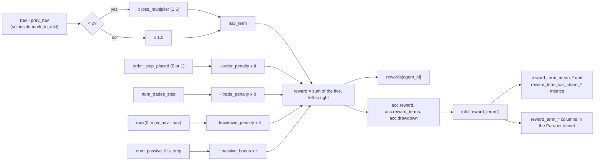

# 7. Reward Function

The five-term formula, the account plumbing that feeds it, its measured decomposition, and how to
tune it.

Related: [04_accounting.md](04_accounting.md) (where the inputs come from),
[12_perspective_rl_researcher.md](12_perspective_rl_researcher.md) §3 (the analysis),
[10_testing.md](10_testing.md) §5.

---

## 1. Stated objectives

From the function's own docstring
([`reward_helper.py`](../gym_continuousDoubleAuction/envs/exchg/reward_helper.py)),
the reward is shaped to encourage five behaviours:

1. **Maximize NAV** — the primary growth objective.
2. **Reduce the number of trades** — a per-fill penalty on execution.
3. **Selective order placement** — a penalty for entering the market at all, making "hold" the
   default best action unless conviction is high.
4. **Lower drawdown risk** — a drawdown penalty plus asymmetric loss aversion.
5. **Capture spread** — a bonus for passive fills, to encourage liquidity provision.

The intent is sound and reads like it was written by someone who trades. §5 shows how much of it
actually binds.

---

## 2. The formula

From
[`reward_helper.py`](../gym_continuousDoubleAuction/envs/exchg/reward_helper.py).
The five coefficients are `env_config` keys, set on the helper in
[`reward_helper.py`](../gym_continuousDoubleAuction/envs/exchg/reward_helper.py) —
see [18_configuration.md](18_configuration.md) §2.2:

```python
# Everything NAV-derived is a FRACTION OF STARTING CAPITAL, not dollars.
scale = float(trader.acc.init_nav)
nav_change = float(trader.acc.nav - trader.acc.prev_nav) / scale

# Set from the env config; the values below are the defaults.
order_penalty    = self.order_penalty      # 1e-05  (0.1 bps of init capital)
trade_penalty    = self.trade_penalty      # 2e-05  (0.2 bps)
drawdown_penalty = self.drawdown_penalty   # 0.2
passive_bonus    = self.passive_bonus      # 2e-05  (0.2 bps)
loss_multiplier  = self.loss_multiplier    # 1.0    (see below: 1.0 or nothing)

# 1. Loss aversion, currently off
nav_term = nav_change * (loss_multiplier if nav_change < 0 else 1.0)

# 2. The SIGNED CHANGE in distance from peak NAV, not the distance
previous_drawdown = float(trader.acc.drawdown)
current_drawdown  = float(max(0, trader.acc.max_nav - trader.acc.nav))
drawdown_change   = (current_drawdown - previous_drawdown) / scale

# 3. Comprehensive reward formula
reward = (nav_term
          - order_penalty    * trader.acc.order_step_placed
          - trade_penalty    * trader.acc.num_trades_step
          - drawdown_penalty * drawdown_change
          + passive_bonus    * trader.acc.num_passive_fills_step)
```

| Term | Sign | Driven by |
|---|---|---|
| `nav_term` | ± | NAV change as a fraction of starting capital |
| Order penalty | − | `order_step_placed` — 1 if a market or limit order was approved this step |
| Trade penalty | − | `num_trades_step` — actual fill events this step |
| Drawdown penalty | ± | the *change* in `max_nav - nav`; negative as drawdown opens, positive as it closes |
| Passive bonus | + | `num_passive_fills_step` — fills where this agent was the `counter_party` |

### 2.1 Three properties this formula has and the previous one did not

**Value targets are O(1).** Dividing by `acc.init_nav` — the account's own record of what the
trader started with, so it cannot drift from the ledger — is what unblocked the critic. PPO clamps
the value loss at `vf_clip_param` (RLlib's default 10.0), and dollar-scale NAV targets in the
10⁴–10⁷ range made `clamp(vf_loss, 0, 10)` flat, so the critic's gradient was exactly zero.
That is **S1-1**, and `integration/test_progress_and_vf.py` now asserts against it live rather than
pinning it as an expected failure.

**The drawdown charge telescopes.** Charging the *level* billed one early loss on every one of an
episode's 4,096 remaining steps, even to an agent that never traded again (**S2-1**). The signed
change sums over an episode to exactly `-drawdown_penalty × final_drawdown`, whatever path was
taken to get there.

The sign matters as much as the switch to a change. Clipping at `max(0, Δ)` — charging only newly
*opened* drawdown — reads like the cautious option and is not: below the peak it bills `nav_term`
a second time on every losing step and refunds nothing on the way back up, so a round trip costs
`drawdown_penalty × X`. That is an asymmetric loss multiplier wearing a different hat, and it
reintroduces precisely the negative-sum bias `loss_multiplier: 1.0` exists to remove.

**The reward is zero-sum when NAV is.** Total NAV is conserved exactly, so `Σ nav_change = 0`
across agents — and measured over 1,000 random-agent steps, `nav_term` now sums to **exactly
0.000000**. Any `loss_multiplier > 1` breaks that, which is what made passing dominant for every
agent (**S1-3**).

The five coefficients **are** configuration now. They were function-local literals with a code
comment acknowledging they "can be moved to config"; they are `env_config` keys, set on
`Reward_Helper.__init__`, defaulting from `config/env_defaults.json` and supplied by
`TrainConfig.env_config` from the `environment` group of `config/train_config.json`. They are
therefore captured in the checkpoint's config and sweepable — which matters, because for a
research repository reward shaping is the primary experimental axis.

The formula is also accumulated **as a dict of signed terms**, not as one expression:

```python
terms = {"nav_term": ..., "order_penalty": ..., "trade_penalty": ...,
         "drawdown_penalty": ..., "passive_bonus": ...}
reward = 0.0
for value in terms.values():
    reward += value
```

Two deliberate consequences. Iterating the dict means a term added later cannot be logged but left
out of the reward. And the left-to-right accumulation is *not* `sum()`: on Python 3.12+ the
builtin applies Neumaier compensated summation to floats, which is more accurate and disagrees
with the original expression on ~44% of random inputs — instrumenting the reward must not change
what the agent is trained on.

> **The reward is not zero-sum.** NAV *is* conserved across traders, but the four shaping terms
> are not, so returns are not comparable across policies playing different roles. The league
> callback nevertheless ranks policies against a pooled `mean + k·std` that includes the random
> baselines. A policy can clear that threshold by trading *less*, not by trading *better* — see
> [12_perspective_rl_researcher.md](12_perspective_rl_researcher.md) §3.2.

---



---

## 3. Account plumbing

The formula needs per-step and high-water-mark state that the account did not originally track.

**[`account.py`](../gym_continuousDoubleAuction/envs/account/account.py)** — added:

- `max_nav` — historical peak NAV, for the drawdown term.
- `num_trades_step` — fill events within one environment step.
- `num_passive_fills_step` — fills where the agent was the passive `counter_party`.
- `order_step_placed` — flag (0/1), set when a new market or limit order is approved.
- `num_rejected_step` — orders `_order_approved` refused this step. Not a reward input; it exists
  because `order_step_placed` is 0 both for an agent that never tried and for one whose every
  order was refused, and those are opposite behaviours.
- `reward`, `reward_terms`, `drawdown` — what the reward *was*, kept so it can be reported.

**[`calculate.py`](../gym_continuousDoubleAuction/envs/account/calculate.py)** — `cal_nav`
updates `max_nav` automatically whenever a new peak is reached.

**[`trader.py`](../gym_continuousDoubleAuction/envs/agent/trader.py)** — in `place_order`,
`order_step_placed` is set **only** for `market` and `limit` types. `modify` and `cancel` are
cost-free, so an agent can manage risk without being penalised for it.

**[`exchg_helper.py`](../gym_continuousDoubleAuction/envs/exchg/exchg_helper.py)** — the per-step
counters (now four, with `num_rejected_step`) are reset to 0 at the end of each step, *after*
`set_reward` **and** `set_info` have read them. That ordering is correct and easy to break.

Two fields exist purely so the reward is observable rather than only computed: `acc.reward_terms`
holds the five signed contributions, and `acc.drawdown` holds the level the penalty charged. Both
were previously derived inside `set_reward` and thrown away, which is what made §6.4 impossible to
measure.

---

## 4. Measured behaviour

**[verified]** — 4 agents, `init_cash = 1,000,000`, 300 steps of uniformly random actions, before
and after the normalisation described in §2.1. Rewards are in different units on the two sides
(dollars then, fractions of starting capital now), so read the *ratio to the all-pass baseline*,
which is exactly zero in both.

| | before | after |
|---|---|---|
| all agents pass, total return | `0.0` | `0.0` |
| random trading, total return | **−591,027** | **−0.0104** |
| total NAV, both policies | 4,000,000.00 | 4,000,000.00 |

The passivity bias is down by seven orders of magnitude, and NAV conservation is untouched — it is
a ledger invariant and the reward never touched it.

Decomposition over 1,000 random-agent steps × 4 agents, after:

```
term                 signed total    share of |magnitude|
nav_term                +0.000000                   81.9%
drawdown_penalty        -0.003909                   16.3%
trade_penalty           -0.028560                    0.9%
order_penalty           -0.017850                    0.6%
passive_bonus           +0.014280                    0.4%
```

Three things to read off it. `nav_term` sums to **exactly zero** across agents — the zero-sum
property is now visible in the reward, not only in the ledger. It also carries 82% of the total
magnitude, so the P&L signal dominates the shaping terms rather than the other way round. And
`passive_bonus` is exactly half `trade_penalty`, because every fill has one aggressor and one
passive side; that identity is a useful check that the counters are being attributed correctly.

Residual friction is −0.036 over 4,000 agent-steps, or −9e-6 per agent-step, against per-step NAV
moves of ~2e-3. Roughly 0.5% of the signal: a cost, not a tax.

### 4.1 The drawdown term was a level, not a delta — **fixed**

`max_nav` is monotone non-decreasing within an episode, so a drawdown opened at step 50 was
charged **every step until NAV recovered past the old peak**. Measured on the old reward it was
~2.4× the entire (already negative) NAV term. At `max_step = 4096`, a 1,000-unit drawdown incurred
early cost `0.2 × 1000 × ~4000 ≈ 800,000` — three orders of magnitude more than the NAV move that
caused it.

Three problems: (a) it was not potential-based, so it changed the optimal policy rather than only
shaping it; (b) its magnitude scaled with episode length, so `max_step` silently became a
risk-aversion hyper-parameter; (c) it is non-Markov in the agent's observation, because `max_nav`
is a path functional the agent cannot see. (c) is addressed separately, by putting `max_nav` into
the observation — see [05](05_observation_space.md).

**The fix, and a correction to the one this section used to recommend.** It previously proposed

```python
reward += -drawdown_penalty * max(0.0, new_dd - prev_dd)   # penalise deepening only
```

which is wrong in a way worth recording. Below the peak, a losing step has `nav_term = -X` *and*
`Δdrawdown = +X`, so it costs `-(1 + c)X`; the matching recovery pays only `+X`. A round trip nets
`-cX`. That is an asymmetric loss multiplier by another name, and it puts back exactly the
negative-sum bias that setting `loss_multiplier` to 1.0 removes — so the clipped form would have
left S1-3 half-open while looking like a fix for S2-1.

What shipped is the **signed** change:

```python
previous_drawdown = float(trader.acc.drawdown)
current_drawdown  = float(max(0, trader.acc.max_nav - trader.acc.nav))
drawdown_change   = (current_drawdown - previous_drawdown) / scale
```

The per-step charges telescope: over an episode they sum to `-drawdown_penalty × final_drawdown`
regardless of path. A round trip is free, ending in drawdown is still penalised, and the term
cannot be farmed — the sum is bounded above by zero because drawdown itself is.

`trader.acc.drawdown` is now load-bearing twice: it is the diagnostic doc/11 §2.3 wanted recorded,
**and** it is what the next step reads back as `previous_drawdown`. Dropping it would silently
restore the level penalty, since the "change" would then equal the level on every step.

### 4.2 The micro-terms were numerically irrelevant — **fixed**

`order_penalty = 0.1`, `trade_penalty = 0.05`, `passive_bonus = 0.1` sat against a NAV term whose
per-step magnitude ran −10,949 … +6,126. They were 5–6 orders of magnitude too small to influence
behaviour, so whatever economic intent they encoded was not being expressed. That is S2-3.

They are now expressed in the same units as everything else — fractions of starting capital, where
`1e-05` is one basis point. Calibration came from measurement rather than choice: over 8,000
random-agent steps, 37% of steps move NAV at all, and one that does moves it by a median
**1.9e-03** of starting capital (p90 7.3e-03). The penalties sit at 0.5–1% of that median move.

`passive_bonus` is set equal to `trade_penalty`, so a passive fill is net-free while an aggressive
one costs 0.2 bps. That is objective 5 ("capture spread") expressed as a price rather than as a
separate bonus competing with the trade penalty.

### 4.3 Doing nothing was a dominant strategy — **fixed**

Passing every step yielded **exactly zero**, versus −591,027 for random trading. With no position
there is no mark-to-market change; with no orders no order penalty; with no fills no trade
penalty; NAV never falls below `max_nav`, so no drawdown. Trading was therefore strictly dominated
unless an agent could extract more than its penalty budget from the others — and because the
market is zero-sum in NAV, the population as a whole never could. `(pass, …, pass)` was a Nash
equilibrium that was also the *joint optimum*, reachable by pure gradient descent from a random
start, because the fastest way to raise return early in training was to stop trading. That is
S1-3, and empty-market collapse was the predicted outcome.

Two changes removed the systematic bias: `loss_multiplier` from 1.5 to **1.0**, and the drawdown
level to a signed change. Random trading now scores −0.0104 against the same 0.0 baseline.

Passing still scores exactly zero, and that is correct rather than a remaining defect — in a
zero-sum market no reward can make trading positive-sum *on average*, and it should not try. What
matters is that the residual friction (~0.5% of a typical NAV move) is now far smaller than the
edge an agent with any skill can capture, so trading is no longer dominated for an agent that has
one. Whether that is enough to produce a liquid market in practice is a training question, and it
is what [23](23_probe_harness.md) and a real run are for.

---

## 5. Stated objectives versus realised ones

| Stated objective | Achieved? |
|---|---|
| "Maximizing NAV" | Yes — `nav_change` is the dominant signed term |
| "Reducing number of trades" | No — the 0.05 penalty is ~10⁵× too small |
| "Selective order placement" | No — same, the 0.1 penalty |
| "Lowering drawdown risk" | **Over-achieved** — the penalty is ~2× the entire NAV term **[verified]** and drives the policy to inaction |
| "Capturing spread" | No — the 0.1 passive bonus is negligible, and with zero fees there are no spread economics to capture |

The implementation collapses to "NAV change, minus an enormous drawdown tax". Putting every term
on a common scale — fractional-NAV units — would make the stated objective the realised one.

---

## 6. Tuning guide

Objective values for these scalars come from aligning them with the environment's financial scale
(tick size, order size, initial cash).

### 6.1 Conviction threshold — `order_penalty`

Defines the minimum expected profit required to justify moving at all.

```
order_penalty ≈ Avg_Expected_Profit_Per_Share × Min_Trade_Size
```

If an agent should only enter for a 2-tick move on 10 shares at a 0.01 tick:
`0.01 × 2 × 10 = 0.20`.

Recommended range: **0.01% – 0.1% of the average capital deployed per trade**.

### 6.2 Loss aversion — `loss_multiplier`

Prospect theory puts human loss aversion at roughly 2×.

| Setting | Value |
|---|---|
| Conservative | 1.5 (current) |
| Standard | 2.0 |

Multipliers above 1.0 create a gravity toward neutral positions, discouraging high-variance
gambling. Note the interaction with §4.3: because NAV is conserved across the population, any
multiplier above 1.0 makes the *summed* reward strictly negative, which is part of what makes
passivity dominant. Reducing it toward 1.0 is one of the levers for fixing S1-3.

### 6.3 Drawdown matching

Scale `drawdown_penalty` so that a deep drawdown (say 5%) exerts negative pressure equivalent to
several steps of normal profit:

1. Estimate `Avg_Profit_Per_Step`.
2. Set the coefficient so `Penalty(5% drawdown) ≈ 2 × Avg_Profit_Per_Step`.

**Warning:** set too high, the agent becomes catatonic the moment a drawdown begins — which is
the current state. Fix the level-versus-delta problem (§4.1) *before* tuning the coefficient;
otherwise you are tuning a term whose magnitude depends on `max_step`.

### 6.4 Component balance

During training, monitor each term's contribution to total reward variance. A healthy split:

| Component | Target share of variance |
|---|---|
| NAV change | ~70% |
| Penalties | ~20% |
| Bonuses | ~10% |

All five terms are logged individually, in `info["reward_terms"]`, as signed contributions that
sum exactly to the reward. They are also **already reduced**: `reward_term_mean_<term>` and
`reward_term_var_share_<term>` are emitted per episode, the shares normalised across the five so
they sum to 1. "The drawdown penalty is now 80% of the signal" is therefore something a run says
while it is happening, not something recovered afterwards from a file. See
[11_logging_and_observability.md](11_logging_and_observability.md) §1.2 and §2.4.

### 6.5 Make coefficients scale-invariant

Instead of hardcoding `0.1`, use a relative value such as `0.0001 * trader.acc.init_nav`.
Hyperparameters then stay meaningful regardless of the absolute cash level of the simulation.

Better still, **normalise the whole reward by `init_cash`** so rewards are O(10⁻³) and returns
are O(1). That single change fixes three separate problems at once:

- the frozen critic (S1-1) — value targets come back inside `vf_clip_param`;
- the drawdown scaling (S2-1);
- the micro-term irrelevance (S2-3).

It is the highest-leverage change in the repository. See
[12_perspective_rl_researcher.md](12_perspective_rl_researcher.md) §4.
