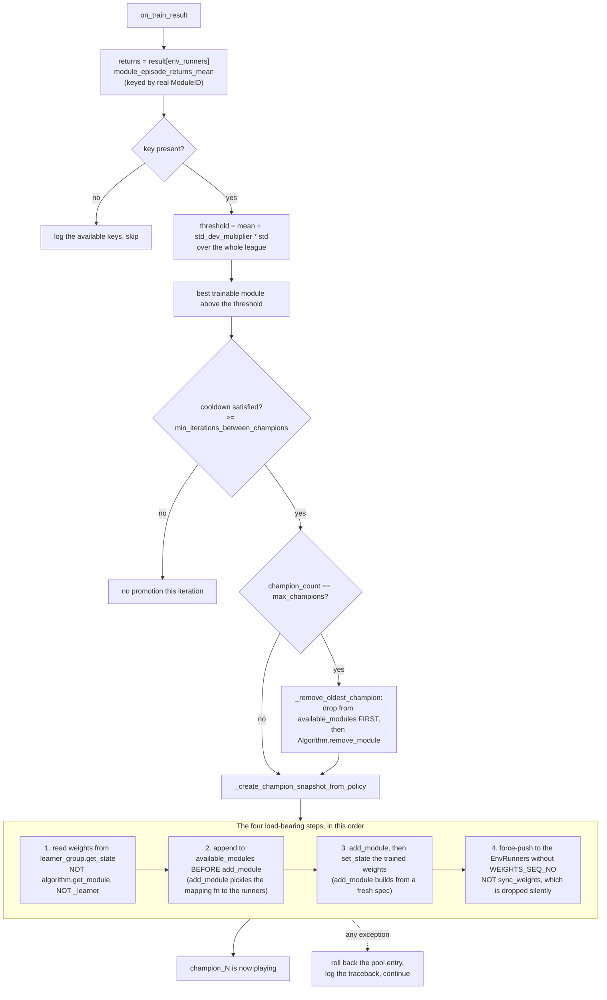

# 8. League-Based Self-Play

Champion snapshotting, matchmaking, configuration, monitoring, verification, and troubleshooting.

Related: [02_architecture.md](02_architecture.md) §2.8,
[09_distributed_training.md](09_distributed_training.md) (what changes when this runs across
processes), [10_testing.md](10_testing.md) §6,
[11_logging_and_observability.md](11_logging_and_observability.md) (what this callback records).

All of it lives in
[`league_based_self_play_callback.py`](../gym_continuousDoubleAuction/train/callbk/league_based_self_play_callback.py)
(~1,340 LOC) and
[`policy_handler.py`](../gym_continuousDoubleAuction/train/policy/policy_handler.py).

---

## 1. What changed, and why

**Before — competitive weight copying.** `policy_0` and `policy_1` competed; the winner's weights
were copied onto the loser every iteration. Both policies converged to the same strategy, and no
historical diversity survived.

**Now — independent evolution plus champions.** The trainable policies evolve independently with
no weight copying. When one performs exceptionally, a frozen snapshot of its module is added to
the opponent pool as `champion_N`. A rolling window keeps the last few champions.

Benefits: two independent learning trajectories, past strong strategies preserved as opposition,
league difficulty that grows over time, and resistance to catastrophic forgetting. League play is
the correct structural answer to non-transitivity — a simple "train against your latest self"
scheme cycles — and the weighted champion pool is a reasonable prioritised-fictitious-play
approximation.

---

## 2. Module layout

For `n` agents with `k` trainable:

```
policy_0 … policy_{k-1}     trainable PPO modules      ← fixed 1:1 to agent_0…agent_{k-1}
policy_k … policy_{n-1}     frozen RandomRLModule      ┐
champion_1, champion_2, …   frozen PPO snapshots       ┘ ← opponent pool, sampled per episode
```

Default: `n = 8`, `k = 2` → 2 learners against 6 pool slots.

Two wiring details are load-bearing and both are guarded by tests:

- **Module classes are declared through `MultiRLModuleSpec`**, never through
  `multi_agent(policies={...})`. On the new API stack the latter reads only the dict *keys*;
  `policy_class` and per-policy model config are discarded, and every module silently becomes
  `DefaultPPOTorchRLModule`. That is exactly what happened before the migration: the "random"
  baselines were frozen randomly-initialised PPO networks.
- **`RandomRLModule` must be excluded from `policies_to_train`.** Its `_forward_train` raises,
  which is deliberate: it converts a silent misconfiguration into a loud one.

`RandomRLModule` emits `Columns.ACTIONS` directly from `action_space.sample()`, so it is a *true*
uniform sampler. The distinction from a frozen random network is material for a `Dict` action
space: a Gaussian-initialised head draws `Box` components from a clipped Gaussian (so `size_sigma`
piles up at 0) and carries a fixed bias in the discrete heads for the whole run.

---

## 3. Usage

```python
from gym_continuousDoubleAuction.train.callbk.league_based_self_play_callback import SelfPlayCallback
from gym_continuousDoubleAuction.train.policy.policy_handler import create_multi_agent_config
from ray.rllib.algorithms.ppo import PPOConfig

callback = SelfPlayCallback(
    num_trainable_policies=2,             # k learning agents
    num_random_policies=6,                # m initial frozen baselines
    std_dev_multiplier=0.1,               # snapshot when return > mean + 0.1*std
    max_champions=8,                      # rolling window size
    min_iterations_between_champions=2,   # cooldown
    original_opponent_weight=1.0,         # baseline selection priority
    champion_weight=3.0,                  # favour champions 3:1
    episode_data_dir="episode_data",      # None disables the per-step record
)

policies, policies_to_train, rl_module_spec = create_multi_agent_config(
    obs_space, act_space, num_agents=8, num_trained_agents=2)

config = (
    PPOConfig()
    .environment("continuousDoubleAuction-v0", env_config={...})
    .framework("torch")
    .multi_agent(
        policies=policies,
        # CRITICAL: the dynamic mapper from the callback, not the static 1:1 one
        policy_mapping_fn=SelfPlayCallback.get_mapping_fn(callback),
        policies_to_train=policies_to_train,
    )
    # CRITICAL: this is what actually binds RandomRLModule to the baselines
    .rl_module(rl_module_spec=rl_module_spec)
    # Returns the same instance every call, so the driver-side champion pool
    # is the one the mapping fn reads.
    .callbacks(lambda: callback)
)

algo = config.build_algo()
```

In practice you do not write this by hand —
[`train.py`](../gym_continuousDoubleAuction/train/train.py) `build_config(cfg)` does it from a
`TrainConfig`.

> The older documentation pointed at a runnable
> `train/callbk/example_league_based_training.py`. **That file was deleted** in the Ray 2.56
> migration; use `train.py` instead.

---

## 4. Configuration parameters

Every constructor argument defaults to `None`, and a `None` is filled in from the
`league_self_play` group of [`config/train_config.json`](../config/train_config.json) (the two
policy counts from its `environment` group). There is no second set of defaults in Python — the
"constructor default" column an earlier revision of this table carried was exactly the duplicate
[18_configuration.md](18_configuration.md) exists to remove. `train.py` passes all of them
explicitly, so the config lookup is what a direct instantiation gets.

| Parameter | Value in `train_config.json` | Description |
|---|---|---|
| `num_trainable_policies` | `num_trained_agents` = 2 | Trainable policies (agents 0 … k−1) |
| `num_random_policies` | `num_agents - num_trained_agents` = 6 | Frozen baselines (agents k … n−1) |
| `std_dev_multiplier` | **0.1** | Threshold multiplier for `mean + N × std` |
| `max_champions` | 8 | Maximum champions in the league (rolling window) |
| `min_iterations_between_champions` | 2 | Cooldown between snapshots |
| `original_opponent_weight` | 1.0 | Selection priority for baselines |
| `champion_weight` | 3.0 | Selection priority for champions |
| `episode_data_dir` | `"episode_data"` | `"episode_data"` | Root of the Parquet per-step record; `None` disables it *and* the accumulation behind it |
| `episode_sample_every` | 10 | 10 | Record one episode in N, chosen by `crc32` of the episode id |
| `episode_max_bytes` | 2 GiB | 2 GiB | Cap on what each writer keeps, oldest deleted first |
| `episode_rows_per_file` | 65,536 | 65,536 | Rows buffered before a Parquet file is written |
| `nav_tolerance` | 1e-06 | 1e-06 | Absolute cash tolerance for the episode-end conservation check |
| `strict_nav_check` | `True` | `True` | Stop the run on a violation — acted on by the driver, not the hook |

### Tuning

**`std_dev_multiplier`** — too low snapshots mediocre policies and bloats the league; too high
(4.0) rarely finds any. **Recommended 1.5 – 2.5.**

The shipped `TrainConfig` value of **0.1 is far below that range**, and the consequence is
measurable: **[verified]**, a single `algo.train()` call from a fresh build promoted
`champion_1` on iteration 1, because with an empty `champion_history` there is no cooldown and
`mean + 0.1·std` is cleared by the better of two barely-trained modules. At the default
16-iteration run the pool saturates with near-random snapshots.

> Relative ranking works fine with **negative** returns, which are the norm here. With mean −1000
> and std 200, the threshold is −600; a policy returning −500 is genuinely exceptional relative to
> its peers. The problem is the multiplier, not the sign.

**`max_champions`** — too small (2–3) limits diversity; too large (15+) costs memory.
**Recommended 5 – 8.**

**`min_iterations_between_champions`** — too short (1–2) snapshots the same policy repeatedly;
too long (50+) misses intermediate strategies. **Recommended 10 – 20.**

**`champion_weight` : `original_opponent_weight`** — the goal is to focus training on the hardest
current opponents. Extreme bias (10:1) means agents rarely face baselines and may develop blind
spots to simple strategies; no bias (1:1) splits time evenly and slows progress against elite
play. **Recommended 3:1 to 5:1.**

---

## 5. Champion promotion

### 5.1 The trigger

`on_train_result`
([`league_based_self_play_callback.py`](../gym_continuousDoubleAuction/train/callbk/league_based_self_play_callback.py)):

```
returns   = result[ENV_RUNNER_RESULTS]["module_episode_returns_mean"]   # keyed by real ModuleID
threshold = mean(returns) + std_dev_multiplier · std(returns)
best trainable module with return > threshold  →  snapshot
   subject to: ≥ min_iterations_between_champions since the last one
               evict the oldest if champion_count == max_champions
```

Using `module_episode_returns_mean` rather than the old `agent_episode_returns_mean` with an
`agent_X → policy_X` remap is the correct choice, because opponent agents play *whichever* module
the pool assigned them that episode. The old fallback filed every opponent's return under
`policy_<agent index>` regardless of who actually played, and the league mean/std were computed
over those mislabelled entries.

If the key is missing, the callback logs the available keys and skips the check rather than
failing — a reasonable degradation.



### 5.2 The four ordering constraints

`_create_champion_snapshot_from_policy`
([`league_based_self_play_callback.py`](../gym_continuousDoubleAuction/train/callbk/league_based_self_play_callback.py))
is the most subtle code in the repository. Its four ordering constraints are **all** load-bearing,
each was a real bug, and each now has a dedicated integration test:

1. **Read weights from `learner_group.get_state(...)`** — not `algorithm.get_module()`, which
   returns the inference-only EnvRunner copy without the value head, and not
   `learner_group._learner`, which is `None` whenever `num_learners > 0`. The private-attribute
   version raised on every snapshot attempt under a remote LearnerGroup and was swallowed by the
   broad `except`, leaving the league permanently empty while printing one error line per
   iteration.
2. **Append the champion to `available_modules` *before* `add_module`.** `add_module` pickles the
   `new_agent_to_module_mapping_fn` closure — and with it a snapshot of `available_modules` — to
   ship to the remote EnvRunners. Appending afterwards leaves every remote runner's mapping
   function permanently one champion behind.
3. **`set_state` the trained weights into the Learner-side champion** after `add_module`, because
   `add_module` builds the module from a spec at fresh initialisation.
4. **Force-push the weights to the EnvRunners** with
   `foreach_env_runner(lambda r: r.set_state({COMPONENT_RL_MODULE: {...}}))`, deliberately *not*
   `sync_weights()`. `sync_weights` carries the LearnerGroup's `WEIGHTS_SEQ_NO`, and
   `EnvRunner.set_state` applies incoming module state only when the sequence number is 0 or
   strictly ahead. The number only advances on a training update, so a sync issued between two
   updates arrives with a number the runner already has and is dropped **silently**. Sending the
   state without a `WEIGHTS_SEQ_NO` key takes the documented "0 means force" branch instead.

Without constraint 4, the champion *acting in the environment* stays at its random initialisation
for the entire run while the trained snapshot sits unused in the LearnerGroup. Combined with the
`MultiRLModuleSpec` issue in §2, this meant **no self-play was taking place at all** before the
migration.

The spec itself comes from `RLModuleSpec.from_module(algorithm.env_runner.module[source])` with
`inference_only = False`, so the champion's structure matches the Learner-side source and the
state loads cleanly.

### 5.3 Failure handling

The whole body is wrapped in a broad `except Exception` that **rolls back the pool entry** so
matchmaking can never select a half-created module, then prints a traceback. The rollback is
right. The response to a *repeated* failure is not: it continues silently for hours. This exact
handler once masked the `learner_group._learner is None` bug for an entire training run.

### 5.4 Eviction

`_remove_oldest_champion` pops the oldest entry, removes it from `available_modules` **before**
calling `Algorithm.remove_module` (so the refreshed mapping function cannot return a module about
to be deleted), and passes `new_agent_to_module_mapping_fn` so remote runners are updated too.

> **Correction to the older documentation.** `doc/known_issues.md` §3.9 stated that removed
> modules are never freed and league memory grows monotonically. That was fixed: the callback now
> calls `Algorithm.remove_module`, with the previous behaviour described in a code comment.
> Failure to remove is caught and reported as non-fatal — training stays correct, the memory is
> just held.

---

## 6. Matchmaking

`get_mapping_fn`
([`league_based_self_play_callback.py`](../gym_continuousDoubleAuction/train/callbk/league_based_self_play_callback.py))
returns a closure over the callback instance:

```python
# Trainable agents (0 … k-1) always play their own policy, for stable learning.
agent_0 → policy_0
...
agent_{k-1} → policy_{k-1}

# Opponent agents (k … n-1) are drawn per episode from available_modules[k:],
# weighted:
#   Pool    = [policy_2, policy_3, champion_1]
#   Weights = [1.0, 1.0, 3.0]  →  [20%, 20%, 60%]

seed = (zlib.crc32(str(episode.id_).encode("utf-8")) + agent_num) % (2**32)
rng  = np.random.RandomState(seed)
return str(rng.choice(candidates, p=probs))
```

Two details worth knowing:

- **`zlib.crc32`, not `hash()`.** Python salts string hashes per process (`PYTHONHASHSEED`), so
  the previous `hash(episode.id_)` made the documented determinism hold only within a single
  interpreter — matchmaking differed across workers and across runs. `crc32` is stable
  everywhere.
- **The result is cast to plain `str`.** `rng.choice` returns `np.str_`, which compares equal to
  `str` but shows up as `np.str_('policy_2')` in logs and checkpoints.

If the pool is somehow empty, the function falls back to `policy_id(agent_num)`.

---

## 7. Monitoring

### Log output

Everything below goes through this package's logger, not `print` — the league statistics and the
promotion banner at INFO, the per-episode policy map at DEBUG. `logging_setup` writes them to
stdout and to a rotating `run.log` under the run directory, with `pid=` and `iter=` on every line
so a remote runner's lines can be attributed. See
[11_logging_and_observability.md](11_logging_and_observability.md) §1.3.

```
================================================================================
Iteration 25 League Stats:
Mean: -8604.12 | Std: 1178.44 | Threshold: -8486.28
Policy Returns: {'policy_0': -8975.02, 'policy_1': -6777.32, ...}
Best Trainable: policy_1 (-6777.32)
================================================================================

********************************************************************************
CREATING CHAMPION SNAPSHOT
Champion ID: champion_3
Source Policy: policy_1
Return: -6777.32
Iteration: 25
********************************************************************************

Champion champion_3 created successfully
League size now: 9 (2 trainable + 6 random + 1 champions)
Active champions: ['champion_1', 'champion_2', 'champion_3']
```

`on_episode_start` also logs the per-episode policy map, at DEBUG — and builds the line only when
DEBUG is enabled, because formatting it means calling the mapping function once per agent:

```text
episode 12345 started, policy map: agent_0 -> policy_0, agent_1 -> policy_1,
  agent_2 -> champion_1, agent_3 -> policy_3
```

> **This map is trustworthy.** It calls `env_runner.config.policy_mapping_fn` — the mapping the
> runner is actually using — rather than reimplementing selection or reading `self`. Both matter:
> the old reimplementation used an unweighted `(hash(episode.id_) + i) % len(candidates)` and
> named the wrong opponents, and on a remote runner `self.available_modules` contains no champions
> at all. The older documentation's warning that this printout is unreliable no longer applies.

### Metrics

The callback's own metrics, the ones about the league:

| Metric | Meaning | Window |
|---|---|---|
| `league_size` | `num_trainable + num_random + champion_count` | 1 |
| `league_mean_return` | Mean module return across the league | 10 |
| `league_std_return` | Std dev of module returns | 10 |
| `champions_promoted` | Champions created this iteration | `reduce="sum"` |
| `available_modules` | Size of the matchmaking pool | 1 |
| `idle_modules` | Modules that played no episode this iteration | 1 |

Plus the per-episode ones this callback emits from `on_episode_end` — NAV conservation, the
pass/rejection fractions, the reward-term split, the end-of-episode account state, the maker
ratio. **27 metrics in total**; the full table is in
[11_logging_and_observability.md](11_logging_and_observability.md) §1.2, which is the reference
for what a run surfaces. (An earlier revision of this section said six, which was true before
that work landed.)

`pass_action_fraction` is the one to watch against this document's own warning: a league whose
policies collapse to always-pass still clears the promotion threshold, because 0 beats a negative
mean. Returns will not show it; this will.

`vf_explained_var` is no longer among them, but it is not lost either: it is in the per-iteration
log line and, with every other value RLlib computes, in `progress.jsonl`. That is the general
shape now — the gap is aggregation into a metric worth alerting on, not capture. See
[11_logging_and_observability.md](11_logging_and_observability.md) §1.6 and §2.1.

Watch `league_size` and `league_mean_return` together: adding champions should raise difficulty
and depress mean return before agents adapt.

---

## 8. Checkpoint / restore

**[verified]** — league state *does* survive a checkpoint round-trip, which is better than the
design suggests:

```
BEFORE save    -> champion_history: ['champion_1', 'champion_2']
                  available_modules: [policy_0..policy_3, champion_1, champion_2]

AFTER restore  -> modules on env_runner:  [champion_1, champion_2, policy_0..policy_3]  ✅
               -> algo's own callback:    champions ['champion_1', 'champion_2']        ✅
               -> mapping fn draws:       {'policy_3', 'champion_1'}                    ✅
               -> callback returned by build_algo(): champion_history: []               ❌ (fixed)
```

`.callbacks(lambda: callback_instance)` closes over the instance, RLlib cloudpickles it into the
checkpoint, and the restored `Algorithm` gets a callback with its history intact.

The narrower real defect — `build_algo` returning the **fresh, empty** `callback_instance` from
`build_config` rather than the algorithm's own — is fixed: the restore path returns
`algo_callback(algo)`, and `None` with a warning if the restored algorithm has no
`SelfPlayCallback`. `train()` never used the returned callback, so training was unaffected; the
damage was to anything that *inspected* the league, which saw an empty one. Tracked as S3-8.

### 8.1 The sidecar, and what it repairs

The champion **modules** are in the checkpoint proper — RLlib manages them. Everything that
*indexes* them is not: `champion_history`, `champion_id_counter` and `available_modules` are plain
attributes on the callback, and reach the next run only because cloudpickle can reconstruct
`SelfPlayCallback`. Rename the class, change its `__init__`, or resume across a Ray upgrade, and
the modules come back while the league that indexes them does not. The counter then restarts and
mints a second `champion_1`, which `add_module` writes over a champion that is still playing.

So `save_checkpoint` writes `league_state.json` beside every checkpoint —
`SelfPlayCallback.league_state()`, as plain JSON, readable without importing anything. On restore,
`restore_league_state` reconciles three sources that can disagree:

| Source | Authority |
|---|---|
| The unpickled callback | Lowest — it is the one that can drift |
| `league_state.json` | Beats the callback: they can only differ if unpickling drifted |
| The modules actually present on the restored algorithm | Highest — matchmaking may only return a module that exists |

A champion in the sidecar with no module is dropped; a champion module with no sidecar entry is
adopted (appended as newest, since its true position is unknowable); the pool is rebuilt from the
reconciled history; and the ID counter is raised to at least the highest champion number in play,
never lowered. Each repair is printed. A clean restore prints
`league state verified: N champion(s)` instead.

One limit worth knowing: repairs apply to the **driver's** pool. With `num_env_runners > 0` the
remote runners hold their own pickled mapping fn, frozen at construction, and nothing short of
`add_module` / `remove_module` updates it — so a checkpoint that needs repairs is a reason to
prefer an earlier one that verifies clean, not something to train through.

---

## 9. Verification

### Unit tests

`test/test_probabilistic_mapping.py` verifies the agent-to-module mapping by statistical
sampling: it mocks a `SelfPlayCallback` and an `Episode`, simulates many episode starts, records
which module a given agent is assigned, and compares the empirical distribution against expected
thresholds. It checks that weighted selection respects the configured weights, that raw weights
normalize correctly, and that selection is stable given the episode and agent IDs.

| Property | Coverage | Note |
|---|---|---|
| Logic verification | High | Catches errors in weight application and name parsing |
| Statistical validity | High | Large sample gives a narrow confidence interval |
| Determinism | Moderate | Verifies the distribution, not per-episode stability |
| Edge cases | Moderate | Empty pools and zero weights are not tested |

`test/test_nav_callback.py` (16 tests) covers **both halves** of the episode-end NAV conservation
check. The hook half: a conserved episode logs a zero `nav_conservation_error` and a zero
`nav_conservation_violations`; a violating one logs the error, counts the violation, and
**returns** rather than raising. The driver half: `train._check_nav_conservation` raises
`NavConservationError` from that count under the default `strict_nav_check`, and downgrades to a
warning when strict is off. The split is the point — a raise inside the hook is swallowed by
RLlib's fault tolerance once sampling is remote, which is how a run could carry on training on a
ledger the check had already condemned. Tolerance is tested from both sides, exactness is tested
at a scale `float` cannot resolve, and a missing metric is asserted to read as "nothing seen"
rather than as a failure. See [11 §1.5](11_logging_and_observability.md).

### Integration tests

`test/integration/test_league_wiring.py` — 3 classes, 13 tests, covering local, remote-EnvRunner
and remote-Learner topologies. `test/integration/test_checkpoint_roundtrip.py` (7) does one real
save and restore and asserts the champion comes back **on the EnvRunner** with its acting weights;
`test/integration/test_distributed_observability.py` (10) runs a real `num_env_runners=1`
iteration and asserts every episode-hook metric reaches the driver. See
[10_testing.md](10_testing.md) §6.

---

## 10. Troubleshooting

| Symptom | Cause | Fix |
|---|---|---|
| No champions created | Returns never exceed the threshold | Lower `std_dev_multiplier` or train longer |
| Champions created every iteration | `std_dev_multiplier` far too low (the shipped 0.1) | Raise it to 1.5–2.5; raise `min_iterations_between_champions` |
| All champions from one policy | One policy dominates | Adjust learning rates, or lower the threshold |
| Champions never appear in episodes | The static `policy_mapping_fn` from `policy_handler.py` is in use | Use `policy_mapping_fn=SelfPlayCallback.get_mapping_fn(callback)` |
| Champions appear on the driver but not on remote workers | `available_modules` mutated after `add_module` | See §5.2 constraint 2; run `TestLeagueWiringRemoteEnvRunners` |
| `'NoneType' object has no attribute 'module'`, once per iteration | Reading `learner_group._learner` with `num_learners > 0` | See §5.2 constraint 1; run `TestLeagueWiringRemoteLearner` |
| Champion plays like a random network | Weights never force-pushed to the EnvRunners | See §5.2 constraint 4 |
| Baselines behave like biased networks, not uniform samplers | Module classes declared via `policies=` instead of `MultiRLModuleSpec` | See §2; `test_baseline_opponents_are_random_modules` guards it |
| Module ID collision after removal | Champion names reused | Fixed via the monotonic `champion_id_counter` |
| League fills with do-nothing policies | The reward makes passivity dominant (S1-3) | Fix the reward first; add a guard refusing to promote a champion with ~0 trades |
