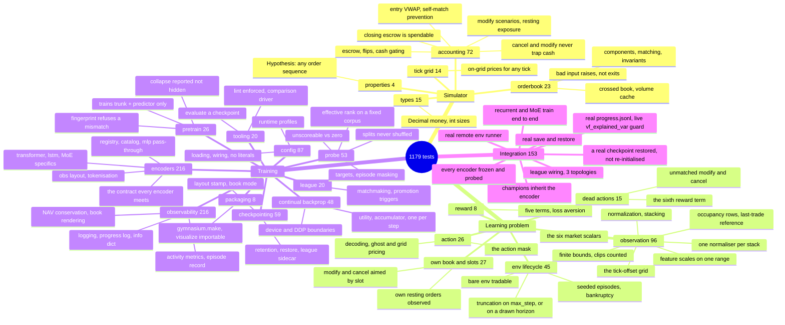

# 10. Testing

Every test file, what each case pins down, how to run the suite, what CI enforces, and what is
not covered.

Related: [03_matching_engine.md](03_matching_engine.md), [04_accounting.md](04_accounting.md),
[05_observation_space.md](05_observation_space.md), [06_action_space.md](06_action_space.md),
[07_reward_function.md](07_reward_function.md), [08_self_play_league.md](08_self_play_league.md).

---

## 0. Running the suite

Every suite is pytest-native: plain classes (no `unittest.TestCase`), `assert` statements instead
of `self.assertX(...)`, and pytest's built-in xunit-style hooks (`setup_method` / `setup_class` /
`teardown_class`) instead of `setUp` / `setUpClass` / `tearDownClass`. Converted from a
`unittest`-based suite; see [17_changelog.md](17_changelog.md).

```bash
# everything (1,251 tests: 1,095 unit + 156 integration)
python -m pytest gym_continuousDoubleAuction/test -q

# unit tests only, skipping the slow RLlib ones
python -m pytest gym_continuousDoubleAuction/test -q \
    --ignore=gym_continuousDoubleAuction/test/integration

# RLlib wiring, the real save/restore, the progress log and a real remote
# runner (153 tests, builds real Algorithms)
python -m pytest gym_continuousDoubleAuction/test/integration -q

# a single file
python -m pytest gym_continuousDoubleAuction/test/test_orderbook_new.py -v
```

**pytest is now required to run any of this**, not just a convenient runner. Two things that used
to work no longer do, because there is no `unittest.main()` call left to trigger them:

- `python gym_continuousDoubleAuction/test/test_orderbook_new.py` — exits immediately with no
  output; it only *defines* the test classes now.
- `%run ../gym_continuousDoubleAuction/test/test_observation_history.py` from a notebook — same
  no-op. Use `%run -m pytest -- ../gym_continuousDoubleAuction/test/test_observation_history.py`
  (or a shell cell) instead.

`python -m unittest discover` also no longer finds anything here — `unittest`'s loader only
collects `TestCase` subclasses, and none of these classes are one any more. **[verified]**:
`python -m unittest discover -s gym_continuousDoubleAuction/test -p "test_*.py"` reports
`Ran 0 tests`.

**[verified]** — `1023 passed` on the unit half. There is no xfail: the one that pinned S1-1 XPASSed when S1-1 was fixed and was deleted (see §6.2.2).

### File inventory

Counts re-measured with `--collect-only`.

| File | Tests | Area |
|---|---|---|
| `test_orderbook_new.py` | 21 | Matching engine components and integration; malformed input raises `ValueError`, never `SystemExit` (S3-7); the constructor takes no tick (S3-4) |
| `test_orderbook_properties.py` | 4 | Hypothesis: every book, escrow and ledger invariant, for any order sequence and under random env play at three ticks (S4-13) |
| `test_orderbook_crossed_book.py` | 1 | Crossed-book invariant |
| `test_orderbook_volume_sync.py` | 1 | Volume cache synchronization |
| `test_accounting.py` | 13 | Cash, position, NAV, position flips |
| `test_cash_check.py` | 19 | Order approval and cash gating; a cancel is never cash-checked, a modify may spend the escrow it releases (S2-13); escrow against a closing order is spendable (S1-5) |
| `test_unmatched_actions.py` | 12 | A `modify` / `cancel` on a side with nothing resting is counted, per step, in `info` and the record (S4-14); a slot past the count clamps rather than misses |
| `test_own_book_obs.py` | 10 | The own-book block: this agent's resting size at each public level, positive on both sides and on the public scale, the counts, alignment with the public book, and the dead-action flag (S3-24 phase 1, 3) |
| `test_observation_bounds.py` | 12 | The Box is finite and laid out as the vector is; identity bounds are exact; a missing or inverted bound fails construction by name; every emitted observation is inside the space; ordinary play clips nothing; an older frame's negative price entry is not clipped; a clip is counted per step in `info` and has a record column (S4-15) |
| `test_order_slot.py` | 17 | `order_slot`: cancel by slot, cancel-all, modify by slot and by FIFO, clamping, the cash check on the slotted order, the head in the action space, and a random-play hit-rate floor (S3-24 phase 2) |
| `test_dead_action_penalty.py` | 3 | The sixth reward term: zero by default and bit-for-bit neutral, charged per miss when set, forwarded by `TrainConfig` |
| `test_layout_version.py` | 9 | The layout stamp: written beside every checkpoint, passes for the current layout, refuses a version, field or `book_mode` mismatch by name (S4-19, S3-15) |
| `test_evaluate.py` | 4 | `train.evaluate`'s pure half: unbatching a Dict action, per-module means, the rendered table, the CLI defaults (S4-12) |
| `test_tick_grid.py` | 14 | Every action price sits on the `tick_size` grid; upsert and cancel find their order on a fractional tick (S3-4) |
| `test_modify_order.py` | 7 | The six modify-order accounting scenarios, plus a guard that the dead escrow helper stays deleted |
| `test_new_action_space.py` | 10 | Action decoding, ghost pricing, `tick_size` reaching the action layer, price levels matching book depth |
| `test_obs_normalization.py` | 12 | Price/volume normalization (both sides positive since S4-17), action unnormalization |
| `test_observation_history.py` | 6 | Temporal stacking, and the shared-book / private-tail split (S1-2) |
| `test_obs_market_features.py` | 18 | `log_mid` under every branch of the reference-price chain, `log1p_spread_ticks`, observation shape across `n_hist` |
| `test_action_mask.py` | 16 | The action mask (06 section 7): its place in the private block and in the logits is derived from the spaces; nothing resting masks modify and cancel, no cash masks opening orders, a position can still be closed, the mask agrees with the cash check under random play; the PPO module penalises masked logits and never samples them, the random baseline redraws, a masked random episode has no unmatched actions; the flag emits all ones |
| `test_episode_horizon.py` | 14 | Fixed horizons truncate at `max_step` as before; random ones are drawn inside the range, reproduce under a seed, truncate on the draw, and keep `time_left` against the upper bound; validation; batch sizing by the expected length |
| `test_grid_book.py` | 14 | The fixed tick-offset grid (S3-15): a quote sits in the cell of its tick offset, the same price lands in the same cell of every frame, out-of-window levels are not shown, price code j is j ticks from the reference whatever rests, own block and tokeniser alignment, `ObsLayout` reads both modes |
| `test_occupancy_channel.py` | 11 | The two occupancy rows equal `size > 0` on every cell of every step and ride with their frame; an absent level and a quote at the reference price differ; a one-sided book is referenced to the last trade, agreeing with `mark_price`; layout version 4 (S3-14) |
| `test_reward_logic.py` | 8 | Reward formula components: normalisation by `init_nav`, scale invariance, the signed drawdown telescoping, zero-sum symmetry |
| `test_env_lifecycle.py` | 10 | The bare env is tradable (S1-4) and truncation lands exactly on `max_step` (S3-19) |
| `test_seeding.py` | 11 | `reset(seed=...)` really seeds the episode: anchor, sizes, queueing order; the global NumPy stream is not the source; `sklearn` is not imported (S3-5, S3-6) |
| `test_nav_callback.py` | 18 | Episode-end NAV conservation, in both halves: the hook counts a violation without raising, the driver stops the run from the count, tolerance, exactness at a scale `float` cannot resolve, a missing metric reading as "nothing seen" |
| `test_logging_setup.py` | 61 | Level resolution and export, handler setup, no `print` in `envs/` or `train/`, the rotating run log, per-worker files, the `iter=` tag, dated stamps, concurrent configuration, two-process isolation, unhandled exceptions, warning capture, propagation control and `ray.LoggingConfig` |
| `test_probabilistic_mapping.py` | 1 | League matchmaking distribution |
| `test_config_loading.py` | 15 | `train_config.json` → `TrainConfig` → env |
| `test_config_sources.py` | 27 | No literal copy of a configured value survives in Python |
| `test_config_wiring.py` | 17 | Config keys reaching their consumers; `episode_data_path` absolute and run-scoped |
| `test_runtime_profiles.py` | 28 | `runtime_profiles.json` → hardware sets, platform paths |
| `test_checkpointing.py` | 50 | Checkpoint retention, restore selection, league state across a save |
| `test_champion_trigger.py` | 19 | League statistics with modules that played no episodes; promotion, pool size, idle count and time-since-champion as metrics |
| `test_progress_log.py` | 35 | `progress.jsonl` writer, numpy/NaN handling, `vf_explained_var` extraction, per-run directory isolation, the iteration broadcast to env runners |
| `test_info_dict.py` | 24 | Per-step `info`: back-compat, reward terms summing exactly, live counters, spread, pass/rejection fields, JSON, and 0-d numpy arrays — which only a *recurrent* module produces |
| `test_type_policy.py` | 15 | Decimal money/prices, int sizes, no field changing type mid-episode, book boundary |
| `test_activity_metrics.py` | 34 | `pass_action_fraction` / `order_rejection_fraction` / `obs_clip_fraction`: the S1-3 detector, per-episode tallies, pickling; the reward-term variance split, the maker-ratio metric and the end-of-episode account metrics |
| `test_episode_record.py` | 32 | The Parquet per-step record: declared schema and its drift guard against `Info_Helper`, identity columns, sampling rate, byte cap, eviction of episodes that never end, and the ways it must fail without raising |
| `test_encoder_registry.py` | 46 | The selectable-encoder seam: registry, `CDACatalog`, the `mlp` pass-through staying byte-for-byte what it was, `ObsLayout`, tokenisation |
| `test_encoder_architectures.py` | 170 | The contract every registered encoder must meet, run over all of them automatically, plus each one's specifics |
| `test_pretrain.py` | 26 | Offline JEPA pretraining: the loop trains only the trunk and predictor, a collapse is reported rather than hidden, and the checkpoint's fingerprint refuses a mismatched architecture |
| `test_visualize_orderbook.py` | 12 | The newest book snapshot is read from the middle of the observation, never off the end — the only arithmetic in `visualize/` that can be wrong without raising |
| `test_probe.py` | 53 | The reward-free probe harness's arithmetic on synthetic observations: target definitions, episode-boundary masking, the splits, the metrics, unscoreable cells, and that `snapshots` reads the book rather than the private tail |
| `test_bankrupt_termination.py` | 10 | A trader whose NAV reaches zero is terminated, and the episode ends when too few solvent traders remain |
| `test_resting_exposure.py` | 8 | Escrow against live orders: what a resting order commits, and the layered-closing-order exploit that used to leave a trader short |
| `test_self_match.py` | 14 | A trader cannot trade with itself: the crossing leg is withdrawn before the matcher, and the resting leg cannot become the mark (S2-5) |
| `test_entry_vwap.py` | 11 | `entry_vwap` is the price actually paid and stays positive while a position is open, where the rolled `carrying_vwap` can go negative |
| `test_obs_pipeline.py` | 13 | The raw-frame deque and the one-normaliser-per-stack property: a resting order reads the same in every frame (S2-6) |
| `test_obs_feature_scales.py` | 10 | Every observation block lands on one scale — the size/price ratio and the centred `log_mid` (S2-2) |
| `test_entry_points.py` | 8 | The two documented entry points work: `gymnasium.make("continuousDoubleAuction-v0")`, and `visualize/` being importable from a wheel |
| `test_cbp.py` | 48 | Continual Backprop's algorithm core, with no Ray and no `Algorithm` — §6.6.1 |
| `test_compare.py` | 12 | The encoder comparison driver's aggregation: means and standard deviations across seeds, the separation rule and its three-seed floor, the rendered table and its caveats |
| `test_lint.py` | 1 | The package is pyflakes-clean; any message fails the suite (S4-6) |
| **unit total** | **1,095** | |
| `integration/test_league_wiring.py` | 13 | RLlib wiring, 3 topologies |
| `integration/test_checkpoint_roundtrip.py` | 7 | One real save and restore: weights, league, iteration, optimizer |
| `integration/test_evaluate_checkpoint.py` | 3 | Train one iteration, save, and roll episodes with the checkpoint's own mapping fn and modules; determinism; the layout stamp refusing a foreign checkpoint (S4-12) |
| `integration/test_progress_and_vf.py` | 6 | A real short run's `progress.jsonl`; `vf_explained_var` reported, finite, and **above 1e-3** — a live guard since S1-1 was fixed |
| `integration/test_distributed_observability.py` | 10 | A real `num_env_runners=1` iteration: every episode-hook metric arrives on the driver, and the episode record is written by the *worker* into the driver's absolute run-scoped path |
| `integration/test_encoder_wiring.py` | 48 | Champions inherit the encoder; a restore cannot change it; the recurrent and MoE paths train end to end; a real checkpoint round-trip with a custom encoder |
| `integration/test_probe_harness.py` | 28 | The probe against the real env: a usable rollout corpus, every registered encoder frozen and read, the LSTM's state reset per episode, a real checkpoint restored with its weights |
| `integration/test_cbp_wiring.py` | 41 | Continual Backprop inside a real `Algorithm`: composition over the encoder's Learner, a real save and restore, and the restore guard — §6.6.2 |
| **integration total** | **153** | |

> **Stale references in older docs.** `test_orderbook.py`, `repro_orderbook_crossed_book.py`,
> `test_OrderBook.py`, `test_cda_nsp.py` and `test_orderbook_double_delete_order.py` do not exist.
> The current names are in the table above.

> **Side effect note, resolved.** The suite writes no `episode_data/` into the working tree:
> `test_nav_callback` builds its callback with `episode_data_dir=None`, and `test_episode_record`
> writes into `tmp_path`. The two `episode_data/test_ep_*.pkl` files an earlier revision noted as
> committed — output of the old tests, not fixtures anything read — are gone from the repository.
> Both `episode_data` and `gym_continuousDoubleAuction/episode_data` remain in `.gitignore`, since
> a *training* run still writes there by default.

### Coverage at a glance



---

## 1. Matching engine

### 1.1 `test_orderbook_new.py`

**Group A — component validation (`TestOrderComponents`)**

| Test | Verifies |
|---|---|
| `test_order_init` | `Order` parses a quote dict, casting every field to the right type (`Decimal` for price/quantity) |
| `test_order_list_append_remove` | FIFO time priority: first order is head *and* tail; a second becomes the new tail; `Order1.next` points at `Order2`; removing the head promotes `Order2` |
| `test_order_tree_insert_remove` | Prices map to `OrderList` objects, total volume increments on insert, and the price level is removed entirely when its last order leaves |

**Group B — trading logic (`TestOrderBookIntegration`)**

| Test | Verifies |
|---|---|
| `test_limit_order_placement` | A passive bid below every ask generates no trade and becomes the best bid |
| `test_limit_order_full_match` | An aggressive bid at 100 against a resting ask at 100 produces exactly one trade and empties the ask |
| `test_limit_order_partial_match` | A bid for 15 against a resting ask for 10 trades 10 and rests the remaining 5 on the bid side |
| `test_market_order_execution` | A market bid larger than the top level sweeps 100 then 101 |
| `test_cancel_order` | Cancelling by `order_id` returns that price level's volume to zero |
| `test_modify_order_quantity_decrease` | Reducing 10 → 5 updates book volume without losing priority |
| `test_modify_order_price_change` | Moving an order from 100 to 101 leaves `get_best_bid() == 101` — the order is correctly removed from one level and inserted into the other |

> **Correction.** `doc/testing.md` described `test_modify_order_price_change` as
> `@unittest.expectedFailure`, "documenting a known limitation rather than asserting
> correctness". There is no `expectedFailure` anywhere in the repository; the test asserts and
> passes.

**Group C — invariants (`TestOrderBookInvariants`)**

| Test | Verifies |
|---|---|
| `test_empty_book_market_order` | A market order against an empty book returns zero trades instead of crashing |
| `test_order_id_uniqueness` | Every processed order gets a unique, incrementing ID |

### 1.2 Crossed-book invariant — `test_orderbook_crossed_book.py`

`test_modify_order_does_not_cross_book`:

1. Place an ask: limit, 10 @ 100, `S1`. Best ask = 100.
2. Place a bid: limit, 10 @ 90, `B1`. Best bid = 90, spread = 10. Capture the `order_id`.
3. **Modify the bid to 110 @ 10** — a price well above the best ask.
4. Read back `best_bid` and `best_ask`. If both exist, assert `best_bid < best_ask`.

Either the engine matches the crossing modification immediately, or it must at minimum refuse to
leave `best_bid >= best_ask` resting. A failure here means the matching engine corrupted market
state during modification — and the `log1p_spread_ticks` sentinel would stop being unambiguous.

### 1.3 Double-delete regression — `test_orderbook_double_delete_order.py` (removed)

**This file no longer exists**; the case it describes is covered by
`test_modify_order_price_change` in §1.1. The description is kept because the failure mode is
worth knowing about when touching `modify_order`.

`test_modify_order_price_no_double_delete`. Changing an order's price is two micro-steps —
**remove** from the `OrderList` at 100, **insert** into the one at 101. The bug guarded against is
the update logic attempting the removal *again* after the order has already moved, surfacing as a
`ValueError` (removing an item not in the list) or an internal volume/length counter going
negative. The `modify_order` call is wrapped in `try/except`; the test asserts no `ValueError`.

### 1.4 Volume synchronization — `test_orderbook_volume_sync.py`

`test_partial_fill_volume_sync` verifies that `OrderTree`'s **cached** volume stays equal to the
**actual** sum of order volumes after a partial fill. A helper, `get_calculated_volume(side)`,
iterates `price_map` and sums every `OrderList` to produce ground truth.

1. Place an ask: limit, 10 @ 100. Assert `OrderTree.volume == 10` **and**
   `get_calculated_volume('ask') == 10`.
2. Place a bid: limit, 4 @ 100 — a marketable limit that partially fills the ask.
3. Assert `OrderTree.volume == 6` **and** `get_calculated_volume('ask') == 6`.

If the cached figure stays at 10, the cache has desynchronized from reality.

---

## 2. Accounting

### 2.1 `test_accounting.py` (13 tests)

Concepts under test are described in [04_accounting.md](04_accounting.md). Starting NAV is 1000
in most scenarios.

| # | Test | Verifies |
|---|---|---|
| 1 | `test_limit_order_placement_hold` | A limit buy 1 @ 100 moves 100 from cash to hold, NAV unchanged at 1000. A limit **sell** 1 @ 102 does the same with 102 as margin — shorts are cash-collateralised |
| 2 | `test_limit_order_cancellation` | Cancelling returns cash to its original balance and hold to zero, long or short |
| 3 | `test_market_short_matching` | A market sell hitting a passive bid: the maker's hold releases, position becomes +1, value 100; the taker pays 100 margin, position −1, value 100. Both NAVs stay 1000 |
| 4 | `test_market_long_matching` | The mirror image — a market buy against a passive ask |
| 5 | `test_partial_fill` | A bids 2 @ 100 (200 held), B sells 1. One unit stays held (100), one becomes position value (100) |
| 6 | `test_mark_to_market_long` | Long 1 @ 100: price → 110 gives NAV 1010; price → 90 gives 990 |
| 7 | `test_mark_to_market_short` | Short 1 @ 100: price → 110 gives NAV 990; price → 90 gives 1010 |
| 8 | `test_insufficient_funds` | **Empty `pass`** — see §7 |
| 9 | `test_market_order_empty_book` | No accounting changes when a market order finds no liquidity |
| 10–13 | `test_position_flip_{long_to_short,short_to_long}_{aggressor,passive}` | Flipping closes one position and opens the other atomically. Long 1, sell 2 → the first unit closes the long (releasing capital), the second opens the short (locking capital). `net_position` moves +1 → −1 (or the reverse) with cash and NAV preserved |

### 2.2 `test_cash_check.py` (19 tests)

Covers `Trader._order_approved` specifically ([04_accounting.md](04_accounting.md) §3). In the
first class a trader is initialised with only $100.

| Test | Verifies |
|---|---|
| `test_limit_buy_insufficient_cash` | A limit buy is blocked when `cash < size × price` |
| `test_limit_buy_sufficient_cash` | The same order is approved when cash suffices |
| `test_market_buy_insufficient_cash` | Market buys are gated too, using an estimated price |
| `test_cover_short_no_cash` | Covering an existing short needs **no** cash — `opening_size` is 0 |
| `test_sell_long_no_cash` | Selling out of an existing long likewise needs no cash |
| `test_position_flip_insufficient_cash` | On a flip, only the *opening* portion beyond flattening is cash-checked |
| `test_price_estimation_fallback_to_tape` | With no opposite-side quote, the market-order price estimate falls back to the last tape price |

`TestCancelAndModifyNeverTrapCash` (7 tests) starts a trader with every unit of its 1,000 cash
escrowed in one bid, the state S2-13 is about:

| Test | Verifies |
|---|---|
| `test_cancel_with_zero_free_cash_is_approved` | The cancel reaches the book and the escrow returns to cash; `num_rejected_step` stays 0 |
| `test_cancel_ignores_its_own_size_and_price` | A cancel with a 10⁶ size is not cash-checked |
| `test_shrinking_modify_with_zero_free_cash_is_approved` | 10 → 5 at the same price is approved and re-escrowed at 500 |
| `test_repricing_modify_spends_the_released_escrow` | 10 @ 100 → 10 @ 90 passes on `0 cash + 1000 released` |
| `test_modify_beyond_cash_plus_released_is_still_refused` | 10 @ 100 → 20 @ 100 is refused and the original order is untouched |
| `test_limit_upsert_at_same_price_spends_the_released_escrow` | A limit at an occupied own price upserts rather than being refused |
| `test_bankrupt_trader_still_cannot_act` | The `nav > 0` gate stays ahead of the cancel shortcut |

`TestClosingEscrowIsSpendable` (5 tests) is S1-5's tail: a trader long 10 with its exit ask
resting and no free cash may still open a bid backed by that ask's escrow; only the portion of a
resting ask that actually closes counts (30 resting against a long of 10 backs 1,000, not 3,000);
a flat trader has none; the order a modify replaces is not counted twice; and when both orders
fill against a real counterparty the two NAVs still sum to what they started at.

### 2.2.2 `test_unmatched_actions.py` (12 tests)

[15](15_findings_and_recommendations.md) S4-14's other half. At the `Trader`: a cancel or modify
with nothing resting, or at the wrong price, increments `num_unmatched_step`; matched actions and
ordinary new limits do not; `reset_acc` clears it. Through the env: the field is in `info` as an
`int`, is per step, and has a column in the episode record.

### 2.4 The own book and the order slot — `test_own_book_obs.py` (10), `test_order_slot.py` (17), `test_dead_action_penalty.py` (3), `test_layout_version.py` (7)

[15](15_findings_and_recommendations.md) S3-24 and S4-19. `test_own_book_obs.py`: the private
block's layout (`private_fields`, 32 at depth 10, own book at offset 9); the env declares the 216
width; the own book is empty at reset; an own bid at the touch shows to its owner only, at the
public book's scale; an own ask is negative and equals the public ask size when alone; two agents
at different levels each see their own at its level; orders past the shown depth are in the count
only, which saturates at the cap; a cancel clears it; the dead-action flag is set on the step of
a miss and only then. `test_order_slot.py`: cancel slot 1 is the touch, slot 3 the deepest, slot 0
every own order on the side and nobody else's, a slot past the count clamps, an empty side is the
only miss, asks count from the touch too, oldest first within a level, a cancel releases exactly
its order's escrow; modify slot 0 is the oldest, slot k moves the k-th, the cash check counts the
slotted order's release; the head is in the action space with `max_own_orders + 1` codes, an
absent slot decodes as 0, the env routes it on a fractional tick, and a random-play cancel hit
rate above 25% (it was 7%). `test_dead_action_penalty.py`: the sixth term exists, is zero and
bit-for-bit neutral by default, charges per miss when set, and is forwarded by `TrainConfig`.
`test_layout_version.py`: the stamp, the pass, the refusals by version and by field, and that
`_write_league_state` writes it.

### 2.5 `test_orderbook_properties.py` (4 Hypothesis tests)

The invariants §8 had listed as untested for three passes, asserted for *any* order sequence.
`TestBookInvariants` drives 60-order sequences of limit, market, modify and cancel from three
traders through `Trader.place_order` into one `OrderBook` and, after every order, walks both
trees: `num_orders`, `depth` and `volume` against the walk, every level's list length and volume,
timestamps ascending within a level, no locked or crossed book, every trade on the tape positive.
Two further properties: each trader's `cash_on_hold` equals the notional of its own resting
orders, and positions net to zero across traders. `TestEnvInvariants` steps the whole env with
random actions under a Hypothesis-chosen seed at ticks {1, 0.5, 0.1}: NAV conservation **exactly**
(`==`, since S3-23 was fixed), `cash + cash_on_hold >= 0`, every price-map key on the grid, every `info["NAV"]`
parsing back to the ledger exactly, finite rewards. Its first run found S3-23 and the modify
timestamp defect ([16](16_verification_log.md) §16.18).

### 2.2.1 `test_tick_grid.py` (14 tests)

[15](15_findings_and_recommendations.md) S3-4's float-grid caveat, which turned out not to be a
caveat. `TestSetPriceIsOnTheGrid` asserts that `_set_price` lands on the `tick_size` grid for every
level and offset, on both sides, for ticks {1, 0.5, 0.1, 0.05, 0.01, 0.3, 0.0001} — both the ghost
path and, with orders resting, the level path — and that `agg_LOB_raw` holds prices exactly
(float64). `TestFractionalTickBookStaysConsistent` runs a bare env at `tick_size` 0.1: re-quoting
the same level five times leaves one order at one level, a cancel at a fractional price finds and
removes its order with the escrow returned, and sixty steps of random play conserve NAV exactly
with every price-map key on the grid.

### 2.3 `test_modify_order.py` (7 tests)

Mathematically verifies all six modify-order accounting scenarios — price cross, price move,
quantity increase, quantity decrease, and the two cross-plus-quantity combinations — for both the
initiator and the counter-party, asserting exact `cash`, `cash_on_hold` and `net_position` after
each. The scenario table with expected figures is in
[03_matching_engine.md](03_matching_engine.md) §3.4.

---

## 3. Action space

### `test_new_action_space.py` (10 tests)

| Test | Verifies |
|---|---|
| `test_initial_price_integrity` | Across repeated resets, `last_price` is a `float` (Gym compatibility), is a whole number so ghost levels start on tick boundaries, and falls inside the configured `[min, max]` range |
| `test_bid_ghost_pricing` | With an empty book, sweeping `price` 0–9 with `price_offset=1` (join) gives `Anchor − (index + 1) × tick` |
| `test_ask_ghost_pricing` | The symmetric case: `Anchor + (index + 1) × tick` |
| `test_price_offsets_bid` | With `last_price` pinned, passive is 1 tick **lower** than the ghost level (98 vs 99), join matches exactly (99), aggressive is 1 tick **higher** (100) |
| `test_price_offsets_ask` | Passive is 1 tick **higher** (102 vs 101), join matches (101), aggressive is 1 tick **lower** (100) — validating the inverted sense of aggression on the sell side |
| `test_market_order_mapping` | A market category submitted with a deliberately "dirty" price level 9 and offset 0 still produces `type: 'market'` and `price: -1.0` |
| `test_trading_updates_anchor` | With `last_price` set to 100, an aggressive sell limit at 100 followed by a market buy updates `env.last_price` to the actual trade price on `LOB.tape` |
| `test_neutral_action` | `category: 0` leaves `env.LOB_actions` empty — neutral agents are filtered out before any price calculation or matching |

Modify and cancel accounting (categories 3, 4, 7, 8) is verified separately in
`test_modify_order.py`.

---

## 4. Observation

### 4.1 `test_obs_normalization.py` (12 tests)

**Group 1 — `agg_LOB_raw`**

| Test | Verifies |
|---|---|
| `test_agg_LOB_raw_exists_after_reset` | The attribute exists, is an `ndarray`, and has shape `(BOOK_DIM,)` after `reset()`. Without it `_set_price()` would silently fall back to normalized values and place orders at wildly wrong prices |
| `test_agg_LOB_raw_updated_after_step` | It refreshes after an order changes the book |

**Group 2 — sign preservation**

| Test | Verifies |
|---|---|
| `test_obs_signs_empty_book` | An empty book yields an all-zero **book block** with no NaN |
| `test_bid_obs_non_negative_with_orders` | After 4 bid orders, `snapshot[0:10]` and `snapshot[10:20]` are all `>= 0` |
| `test_ask_obs_non_negative_with_orders` | After 4 ask orders, `snapshot[20:30]` and `snapshot[30:40]` are all `>= 0` — the side is the block, not a sign (S4-17; before 2026-09-18 this test asserted `<= 0` and caught a dropped negation) |

**Group 3 — midpoint correctness**

| Test | Verifies |
|---|---|
| `test_midpoint_price_normalization_correctness` | With `last_price` pinned to 100, a bid at 99 and an ask at 101 give `M = 100`. Level-1 bid = `(100 − 99)/100 = 0.01`; level-1 ask = `−((101 − 100)/100) = −0.01` |
| `test_level1_bid_ask_symmetric_distance` | Same book: `\|norm_bid[0]\| == \|norm_ask[0]\|` |

**Group 4 — volume**

| Test | Verifies |
|---|---|
| `test_volume_normalization_sqrt` | `snapshot[10] == +sqrt(raw_bid_size)` and `snapshot[30] == −sqrt(raw_ask_size)`, read back against `agg_LOB_raw` |

**Group 5 — division-by-zero safety**

| Test | Verifies |
|---|---|
| `test_empty_book_uses_last_price_anchor` | With an empty book and `last_price = 50.0`, no NaN or Inf appears; the `np.where` mask prevents division on empty levels |
| `test_zero_last_price_fallback` | With a corrupted `last_price = 0.0`, `M` clamps to `100.0` and no NaN or Inf appears |

**Group 6 — action unnormalization**

| Test | Verifies |
|---|---|
| `test_action_price_from_populated_book_is_raw` | With a bid resting at 99, selecting level 0 (join) resolves to `agg_LOB_raw[0]` = 99, **not** the normalized 0.01 |
| `test_action_price_is_positive` | Over 10 random multi-agent steps, every resolved non-market price is strictly positive |

### 4.2 `test_observation_history.py` (6 tests)

Shape across `n_hist` values, including the default 4, moved to
`test_obs_market_features.py::test_observation_shape_across_n_hist`; the MRO health check —
asserting `mkt_size_mean_mul` is initialised, which it is not if `Action_Helper.__init__` aborts
mid-body — moved to `test_config_wiring.py`. What is left here is the stacking behaviour and the
shared/private split.

| Test | Verifies |
|---|---|
| `test_reset_padding_identical_copies` | All *N* segments after reset are identical copies of *O₀* — no zero-padding artefacts |
| `test_sliding_window_updates` | After each `step()`, the last *book* frame matches the newest snapshot and the total shape is unchanged |
| `test_the_book_prefix_is_shared_across_agents` | The public book is public — every agent sees the same one |
| `test_agents_see_distinct_private_state` | After trading, no two agents have the same private tail |
| `test_the_private_block_is_the_declared_width` | `PRIVATE_FIELDS` and `private_dim` agree, and the observation is `n_hist × SNAPSHOT_DIM + PRIVATE_DIM` |
| `test_the_private_block_is_bounded_and_finite` | It shares a `tanh` MLP with the book, so an unbounded field would saturate it (S2-2) |

> **This file used to cement a design flaw as a requirement.**
> `test_shared_history_multi_agent_uniformity` asserted that every agent received the identical
> vector — which was true, and was S1-2. It is replaced by the two tests above, which split the
> claim: the book prefix must *still* be shared (that half was never the bug) and the private tail
> must not be.

> **`test_sliding_window_updates` is the one that would have caught the slicing trap.** The newest
> frame no longer ends where the vector does, so it indexes `book_dim - SNAPSHOT_DIM : book_dim`.
> Slicing off the end returns the private block plus a truncated snapshot — right shape, every
> field misaligned.

### 4.3 `test_obs_market_features.py` (18 tests)

Covers the two market-level scalars ([05_observation_space.md](05_observation_space.md) §3):

- Constant arithmetic: `SNAPSHOT_DIM == BOOK_DIM + EXTRA_DIM`.
- Observation shape across `n_hist ∈ {1, 2, 4, 6, 10}`.
- `agg_LOB_raw` stays `(BOOK_DIM,)` before and after book changes
  (`test_agg_LOB_raw_still_book_sized`).
- `log_mid` correctness for two-sided, bid-only, ask-only and empty books, plus the non-positive
  `last_price` fallback to 100.0.
- `log1p_spread_ticks` correctness on a known two-sided book, the 1-tick floor, and monotonicity
  across widening spreads.
- The sentinel is exactly `0.0` for one-sided and empty books, and every real spread is
  `>= log1p(1)`, so the sentinel is separable.
- Both scalars appear in **every** frame of the stack, not just the last.
- Existing block slicing and sign conventions are unaffected.
- No NaN or Inf across a random multi-agent rollout.

These tests build books by inserting directly via `env.LOB.process_order(...)` at known prices
rather than going through the action pipeline, so expected values are exact rather than dependent
on stochastic size sampling.

---

## 5. Reward

### `test_reward_logic.py` (8 tests)

| Test | Verifies |
|---|---|
| `test_max_nav_high_water_mark` | The peak NAV is maintained correctly through gains and losses |
| `test_trade_and_passive_counters` | Aggressive versus passive fills are counted separately |
| `test_reward_formula_components` | The full multi-factor formula against a known scenario |
| `test_asymmetric_loss_reward` | Losses are penalised more heavily than equivalent gains |

The suite instantiates a bare `Reward_Helper()` with a `MockTrader`, which works only because
`set_reward` touches nothing else on `self` — a symptom of the mixin design, not a property of it.

---

## 6. Training and league

### 6.1 Unit level

`test_probabilistic_mapping.py` (matchmaking distribution) and `test_nav_callback.py`
(episode-end NAV conservation: raising by default, the tolerance, the metric, and the non-strict
path) are described in [08_self_play_league.md](08_self_play_league.md) §9.

Note `test_probabilistic_mapping.py` is a bare module-level function rather than a class — it was
already pytest-native before the rest of the suite was converted, and needed no changes. It
collects the same way as everything else under `pytest`, but — like every file in this suite now
— running it directly (`python test_probabilistic_mapping.py`, or `%run` from a notebook) does
nothing, since there is no `unittest.main()` call left anywhere to trigger execution. See §0.

### 6.1.1 `test_checkpointing.py` — 11 classes, 50 tests

What survives a save/restore, and what a restore is allowed to change. RLlib's loader and the
env build are stubbed, so these run in seconds; the same behaviours were also exercised against
real checkpoints in [16 §16.8.1](16_verification_log.md). The stubbing is what §6.2.1 exists to
complete: nothing here touches RLlib's own serialisation.

| Class | What it pins |
|---|---|
| `TestCheckpointDiscovery` | Saves are ordered oldest-first; `iter_N.tmp` (an interrupted save) and non-checkpoint directories are skipped; a checkpoint in the old single-directory layout is still found, and sorts oldest |
| `TestRetention` | Each save is its own directory; `chkpt_keep` prunes the **least recently written**; `<= 0` keeps all; a stale higher-numbered save from an earlier run never prunes a fresh one (S3-17); the old-layout checkpoint is never pruned; the save is staged then renamed; re-saving an iteration replaces it |
| `TestLeagueSidecar` | `league_state.json` is written beside every checkpoint; `algo_callback` finds the live instance |
| `TestLeagueStateReconciliation` | Agreement repairs nothing; a callback that lost its history is rebuilt from the sidecar; a champion with no module is dropped; a module with no champion entry is adopted; the ID counter never goes backwards |
| `TestRestoreCandidates` | `restore_path` null means every checkpoint; a path narrows it to that one; not restoring ignores the tree; a path without `is_restore` raises; a path that is not a checkpoint raises and lists the ones that are, newest first |
| `TestCommandLine` | `--from-checkpoint` implies `--restore`; `--restore` alone leaves the path unset |
| `TestForeignCheckpoints` | A fresh run names the checkpoints it found and did not write, newest first, and deletes none of them; a restoring run is not warned; `build_algo` warns on the scratch path |
| `TestRestoreSelection` | The newest checkpoint is picked; an unreadable one falls back to the previous; a **pinned** one raises instead of falling back; the **algorithm's own** callback is returned, not the fresh one; no checkpoint starts from scratch |
| `TestIterationAccounting` | `num_iters` is a target, not an amount; `num_iters_is_delta` counts from the restore point; a completed run trains nothing; checkpoints land on true iteration numbers; the final save is not duplicated |
| `TestTrainReturnsTheLastResult` | `train()` returns the final iteration's result beside the algo, so inspecting the league costs no extra `algo.train()`; a run with nothing to do returns an empty one |
| `TestEmptyIterationIsReported` | An iteration whose result has no `env_runners` block trained on no samples and warns, naming `sample_timeout_s` and the batch; silent when `num_env_runners=0`, where there is no timeout to miss |

Two of these encode bugs that were live in the codebase rather than hypothetical:

- **`test_counter_never_goes_backwards`** — the monotonic champion ID counter lives on the
  cloudpickled callback. If it restarts, `add_module` re-mints `champion_1` over a champion that
  is already playing.
- **`test_returns_the_algorithms_own_callback`** — S3-8. Training was never affected, which is
  what made it survive: only code *inspecting* the returned league saw the empty one.

### 6.2 `integration/test_league_wiring.py` — 3 classes, 13 tests

The module docstring names the three real bugs the suite exists to prevent:

1. Baseline opponents declared as `PolicySpec(RandomPolicy, ...)` built as
   `DefaultPPOTorchRLModule` instead.
2. Champion snapshots getting their trained weights written into the LearnerGroup but never
   synced to the EnvRunners.
3. The champion trigger reading old-API-stack metric keys that no longer exist.

| Class | Topology | Covers |
|---|---|---|
| `TestLeagueWiring` | local (0/0) | Module classes, `policies_to_train` exclusion, champion creation, weight equality, mapping-fn draws, metric keys |
| `TestLeagueWiringRemoteEnvRunners` | `num_env_runners=1` | Module presence on the remote actor, weight equality across the process boundary, `config.policy_mapping_fn` draw distribution |
| `TestLeagueWiringRemoteLearner` | `num_learners=1` | Champion snapshotting through `learner_group.get_state` rather than `_learner` |

Both remote classes **guard their own premise** — `test_sampling_actually_happens_remotely`
asserts `num_healthy_remote_workers() == 1`, and `test_learner_group_is_actually_remote` asserts
`not learner_group.is_local`. Without those, a silently-degraded remote setup would make every
other assertion pass vacuously over an empty list. That is a level of test discipline most
codebases lack.

The remote probe is also written with real care: the nested closure in
`TestLeagueWiringRemoteEnvRunners.setUpClass` carries a comment explaining both pickling traps —
closing over `cls`, and module-level helpers being pickled by reference into a worker that cannot
import `test_league_wiring`.

These tests build real `Algorithm`s and run real training iterations, so they take minutes.

### 6.2.1 `integration/test_checkpoint_roundtrip.py` — 1 class, 7 tests

`test_checkpointing.py` (§6.1.1) pins the driver logic around checkpointing against a `FakeAlgo`
whose `save()` writes a one-key marker file and whose loader is monkeypatched out. That left the
thing checkpoints exist for untested: whether a restored run resumes with its learned weights or
quietly starts over from a random initialisation. This module does **one real save and one real
restore** through `save_checkpoint` and `build_algo`, on a PPO sized for speed (~26s).

| Test | What it pins |
|---|---|
| `test_the_checkpoint_is_where_the_driver_expects_it` | The save lands at `chkpt/iter_NNNNN` with its `league_state.json` sidecar |
| `test_trained_weights_survive` | Every LearnerGroup parameter of `policy_0` is bit-identical after the restore |
| `test_the_champion_module_comes_back_and_acts_the_same` | The champion is present **on the EnvRunner** with the acting weights it was saved with — a champion restored only into the LearnerGroup leaves the league matchmaking against a random network |
| `test_league_bookkeeping_comes_back` | The returned callback is the algorithm's own; champion history, pool membership and the monotonic ID counter all survive |
| `test_iteration_count_comes_back` | `num_iters`-as-a-target depends on this |
| `test_optimizer_betas_are_plain_floats` | `_fix_checkpoint_optimizer_betas` — stubbed out everywhere else in the suite, so this is its only execution |
| `test_the_restored_algorithm_trains_further` | The resumed run takes another gradient step, gets an `env_runners` block, and moves its weights |

Two things this suite had to get right, and which are worth preserving in any edit:

- **Weights are compared on the LearnerGroup, not the EnvRunner.** RLlib syncs only the acting
  path to runners, so a runner's `critic_encoder` and `vf.*` tensors sit at their initial values
  even in a run that never restarts. The first draft compared runner state and "failed" against a
  perfectly good checkpoint. `_acting_only()` names the subset a runner does keep current, and the
  champion test uses it.
- **The iteration under test creates a champion of its own**, so the assertions record whatever
  champion IDs exist at save time rather than a hardcoded `champion_1`.

Verified to fail for the right reason: flipping the restore to `is_restore=False` fails 5 of the
7, the two survivors being the ones that do not depend on the restore.

### 6.2.2 `integration/test_progress_and_vf.py` — 1 class, 6 tests

`test_progress_log.py` (§6.1) covers the `progress.jsonl` writer and the `vf_explained_var`
extraction against a `FakeAlgo` whose results are hand-built, which leaves the assumption
underneath both untested: that a *real* PPO iteration on this env produces a `learners` block
containing that key, and that a real result dict survives the JSON round trip. A rename in RLlib
would sail past every unit test and leave the run logging nothing. This trains a real PPO for
three iterations (~15s) and reads the file back.

| Test | What it pins |
|---|---|
| `test_one_line_per_iteration` | The file exists and `training_iteration` runs 1..N with no gaps |
| `test_a_real_result_survives_the_json_round_trip` | The nested `env_runners` and `learners` blocks are still *in* the line, not merely that it parses |
| `test_vf_explained_var_is_reported_for_every_trainable_module` | The key RLlib really emits, for exactly the modules in `policies_to_train` |
| `test_the_metric_is_finite` | A NaN is a diverged value loss |
| `test_the_critic_actually_explains_something` | **A live assertion** — `\|vf_explained_var\| >= 1e-3`. It was a strict xfail until S1-1 was fixed; the fix made it XPASS, which failed the build exactly as the marker's reason said it would, and the marker was then deleted |
| `test_the_file_carries_it_too` | The on-disk record, not just the returned result, has the metric for every iteration |

The one thing worth preserving in any edit here is the assertion that is deliberately *absent*.
`!= 0.0` is the obvious guard against a critic that never received a gradient, and it is worthless
on this repository: while S1-1 was open a run reported values around 1e-5 — the signature
[17](17_changelog.md) §17.3 records as "0.0 to 1.8e-07" — and every one of them is nonzero, so it
would have passed on a critic that was entirely dead. Floating-point noise is not evidence of
learning, which is why the threshold is `1e-3` and not "nonzero". That threshold is now the guard
that stops [17](17_changelog.md) §29.1 silently regressing.

### 6.3 `test_runtime_profiles.py` — 28 tests

Covers [`config/runtime_profiles.json`](../config/runtime_profiles.json) and
[`train/runtime.py`](../gym_continuousDoubleAuction/train/runtime.py), the pair that lets
`CDA_train.ipynb` run unchanged on Colab and in the docker image
([18_configuration.md](18_configuration.md) §8). Four groups:

| Group | Asserts |
|---|---|
| `TestHardwareProfiles` | Exactly the two sets `gpu` / `cpu` exist; both stay inside the stated bounds (≤2 CPUs, ≤1 GPU, ≥1 CPU); the gpu set asks for a GPU and the cpu set does not; every override names a real `TrainConfig` field, and one that does not raises |
| `TestResolution` | The `USE_GPU` toggle in all three states; `$CDA_PLATFORM` / `$CDA_USE_GPU` pinning; an unknown platform raising by name; `ray_init_common` merging; a platform missing a required key raising |
| `TestApply` | Profile fields land on the `TrainConfig`; output roots are applied and `null` ones are not; `episode_data_dir=None` is never re-enabled by a root |
| `TestEnvVars` | `apply_env_vars()` exports the configured names, and an already-exported value wins |

Two of these are the ones that would actually catch a regression:

- **`test_env_runners_fit_the_cpu_budget`** — asserts
  `num_env_runners × num_cpus_per_env_runner ≤ ray_init.num_cpus` for both sets. Env runners are
  Ray actors: ask for more CPUs than `ray.init()` was given and they sit **pending forever**
  rather than failing, which reads as a hang with no error.
- **`test_training_values_are_untouched`** — asserts a profile moves no field that changes the
  learning problem (agent counts, batch sizes, `lr`, reward coefficients, `seed`). This is the
  property that makes a Colab run and a docker run comparable; without it, "runs anywhere" would
  quietly mean "trains differently anywhere".

Both fixtures monkeypatch `runtime.cuda_available`, so the suite tests both hardware paths on a
machine with no GPU — and gives the same result on one with a GPU.

---

### 6.4 Selectable encoders

Three files, added with the `encoder` group ([18](18_configuration.md) §5.4). What makes them
worth reading is the shape of the problem: the shipped default, `mlp`, is a **pass-through** that
touches none of the new code, so it can pass while every line of the custom path is broken. The
suite is built around that gap.

### 6.4.1 `test_encoder_registry.py` — 46 tests

The seam itself, not the architectures.

| Group | Pins |
|---|---|
| Registry | `mlp` is selectable but not registered; an unknown `encoder_type` raises naming the alternatives; `_passthrough` is buildable yet refused from config |
| `ObsLayout` | The `(time, level, field)` grid derives from the declared observation space; a space that is not a whole number of snapshots raises; a non-flat space raises |
| Tokenisation | All three tokenisations match their declared shape; `time` is a pure reshape that loses nothing; a level token really is that level's four fields — which is what pins the field-major transpose the right way round; the market scalars ride on their own global token |
| `mlp` pass-through | No `catalog_class`, a plain `DefaultModelConfig`, and a spec equal to `default_model_config()` — the compatibility guarantee for every checkpoint written before encoders existed |
| Review regressions | Token width fits both kinds of token, so a fifth market scalar is not silently dropped; an `mlp` spec block is validated rather than ignored; `model_config_get` has one definition |

**`_passthrough` is the load-bearing idea here.** It is a registered *test fixture* — an encoder
too simple to be the cause of a failure — that `validate_encoder_type` refuses from a config file
but `known_encoder_type` allows a test to build. It exists solely to travel the whole custom route
(`CDAModelConfig` → `CDACatalog` → `build_encoder_config` → `ActorCriticEncoderConfig` → the stock
pi/vf heads) so that route is covered without shipping an architecture nobody asked for.

### 6.4.2 `test_encoder_architectures.py` — 9 classes, 165 tests

`TestEveryEncoder` is parametrised over **every registered encoder**, so a new one is covered the
moment it is registered rather than when someone remembers to write its tests. What it pins is the
contract the rest of RLlib depends on:

| Test | Why it exists |
|---|---|
| `test_produces_usable_policy_and_value_outputs` | Real spaces, finite outputs; a recurrent module emits one value per timestep, not per row |
| `test_state_out_is_emitted_only_when_stateful` | A stateless encoder must not pretend to carry state, and a recurrent one must |
| `test_state_round_trips` | Checkpointing and champion snapshots both depend on it |
| `test_vf_share_layers_is_honoured` | `compute_values` reaches for `encoder.critic_encoder`; an encoder that lost it would silently recompute the shared path |
| `test_non_inference_attributes_contract` | The inference-only optimisation strips by *name*; a hand-rolled wrapper would break it silently rather than fail |
| `test_eval_forward_is_deterministic` | PPO's ratio compares a rollout log-prob against a recomputed one — a live dropout shows up as noise in the gradient, not as an error |
| `test_gradients_reach_the_encoder` | An encoder detached from the loss trains as a constant and reports nothing |

`sample_batch` builds `(B, T, obs)` with a `STATE_IN` tree for a stateful module and `(B, obs)`
otherwise. Without that the harness could not cover a recurrent encoder at all — it would just
fail on shape.

The per-architecture classes then cover what is specific: `TestTransformer` (every tokenisation
and pooling, the mandatory input LayerNorm, `d_model` divisibility, a misspelled knob raising),
`TestPositionalIndex` (that `positional_index` and `tokenize` *agree* on what token *i* is — a
mismatch would give every token the wrong position, silently), `TestLSTM` (statefulness, the
stateful wrapper, `inference_only` forced off, separate actor/critic states, and that memory
actually carries — an LSTM wired so `STATE_IN` never reached it would still train and simply have
no memory), `TestMoETransformer` (the auxiliary loss reaching `fwd_out` and carrying gradient,
routing fractions summing to `top_k`, stats cleared when taken, and that the term does not scale
with `num_layers` or `vf_share_layers`), and `TestCommonSpecKeys`.

### 6.4.3 `integration/test_encoder_wiring.py` — 9 classes, 48 tests

The claims that only hold once a real `Algorithm` exists.

| Class | Covers |
|---|---|
| `TestChampionsInheritTheEncoder` | `RLModuleSpec.from_module` clones the module class, catalog and model config, so a league running a custom encoder does not quietly fill with stock-MLP champions |
| `TestRestoreCannotChangeTheEncoder` | `encoder_type` / `encoder_spec` are structural, so changing one alongside `is_restore` is a hard error — and an *unchanged* one still restores cleanly |
| `TestRecurrentEncoderTrainsEndToEnd` | Sampling, the env steps and the learner update all survive a stateful module |
| `TestMoEAuxLossReachesTheOptimiser` | The load-balancing term is computed three layers from the loss; every link is invisible from either end |
| `TestCustomEncoderCheckpointRoundTrip` | A real save and `from_checkpoint`, which `get_state`/`set_state` cannot show because it never leaves the process |

`TestJEPAAuxLossReachesTheOptimiser` makes the same claim for the latent-prediction term, and adds
one the MoE class does not need: that selecting `jepa` swaps in **both** its RLModule and its
Learner. `TestOtherEncodersAreUnaffectedByJEPA` is the other half — every encoder that existed
first must still resolve to the default module and learner classes. Together they are the
mechanical form of the isolation claim, alongside a `git diff` over the eight shared files.

Two of these were written *because* the unit tests could not have caught what they found.
`test_the_fingerprint_survives_a_champion_snapshot` pins a live bug: `add_module` normalises every
`model_config` to a plain dict, so a `getattr`-based read reported the `mlp` default from the first
champion onward — silently disabling the structural restore check for the rest of the run, on the
normal path, since every real run creates champions. And the recurrent class exists because
selecting `lstm` broke the **info dict** — `_plain` could not handle the 0-d arrays the
time-dimension connectors produce, so every env step failed nowhere near the model.

---

### 6.4.4 The JEPA classes — 42 tests

Three classes in `test_encoder_architectures.py`: `TestJEPA` (17), `TestJEPAWorldModel` (7) and
`TestJEPAReviewRegressions` (18). The encoder is covered by `TestEveryEncoder` for the contract
automatically; `TestJEPA` covers what decides whether the *objective* is doing anything.

| Test | What it pins |
|---|---|
| `test_the_policy_latent_ignores_the_mask` | Two training forwards draw two masks; the latent must not move between them. If masking reached the policy, the agent would act on a random subset of the book and PPO's ratio would compare log-probs taken under different masks |
| `test_the_objective_runs_only_in_train_mode` | `eval()` produces no stats at all. Mask sampling is stochastic, so an objective on the inference path injects noise into the ratio rather than raising |
| `test_the_target_trunk_takes_no_gradient` | It moves by EMA and never by gradient. If it learned by gradient it would stop lagging, and the asymmetry that discourages collapse would be gone |
| `test_the_target_trails_the_online_trunk` | It does move, and by roughly one decay step — a target that never moved would make the objective trivial |
| `test_collapse_is_visible_in_latent_std` | **The load-bearing one.** A collapsed encoder maps everything to one latent, which makes the prediction *perfect* — loss near zero, reading as success. Only `latent_std` separates that from a working encoder |
| `test_a_mask_never_hides_everything_or_nothing` | Over every (tokenisation × axis × ratio): an empty mask leaves nothing to predict, a total one leaves no context. Both are silent |
| `test_a_dense_encoder_produces_no_jepa_loss` | The plumbing is inert for every other architecture |

`TestJEPAWorldModel` (7 tests) covers the action-conditioned term. The two worth naming:
`test_a_batch_without_next_obs_is_not_an_error` — PPO's own batch has none and `compute_values`
runs on one, so raising on a key PPO never promised would break every path but training — and
`test_the_prediction_depends_on_the_action`, without which the model would be predicting the next
book from the current one and ignoring what the agent did, which is a different and much less
interesting object.

`test_a_mask_never_hides_everything_or_nothing` found a real bug while being written: a `level`
mask under `time` tokenisation indexed a level axis that tokenisation does not have. It now falls
back to a random mask, so a `tokenization × mask_axis` sweep needs no special cases.

`TestJEPAReviewRegressions` (18 tests) was added by the review recorded in [17](17_changelog.md)
§34, one or more tests per finding, each written to fail against the commit before its fix. The
three worth naming:

| Test | What it pins |
|---|---|
| `test_an_inference_only_module_builds` | The finding that mattered most. `RLModuleSpec.build` catches an `AttributeError` from `__init__` and falls back to a deprecated constructor, so a module that could not be built inference-only failed *silently* — and a champion snapshot is an inference-only copy, so a `jepa` league would have died at its first promotion with an unrelated-looking error |
| `test_a_mask_leaves_context_at_every_n_hist` | The original mask test swept tokenisations and axes at one `n_hist`. The clamp was against `n_hist - 1` snapshots rather than the token count, so `n_hist: 1` masked the whole sequence and the objective silently predicted from nothing |
| `test_evaluation_does_not_step_the_ema` | The EMA update ran on validation batches, so the number a probe or a pretraining validation pass reported depended on how many times it had been evaluated |

---

### 6.5 The probe harness

Two files, added with `train/probe/` ([23](23_probe_harness.md)). The harness produces *numbers
people will cite*, so what these pin is not that it runs but the handful of properties that decide
whether its numbers mean anything.

#### 6.5.1 `test_probe.py` — 45 tests

Runs on synthetic observations built by hand, not on env rollouts: the arithmetic is the subject,
and a target checked against the same expression that computes it checks nothing.

| Area | What it pins |
|---|---|
| Snapshot readers | `snapshots` is the *newest* frame of the stack; `depth_imbalance` uses the `+sqrt(V)` / `-sqrt(V)` sign convention rather than working around it (a balanced book is exactly 0, a one-sided one exactly ±1); an empty book is neutral, not a sentinel |
| Targets | `mid_return` is the `log_mid` difference; `realized_vol` of a constant drift is exactly zero and refuses `horizon` 1; every registered target builds and is finite |
| `horizon_mask` | **Never crosses an episode boundary.** A return read across a reset is a jump between unrelated random price anchors — the largest "signal" in the corpus and entirely artificial |
| Splits | No episode appears in two splits; the fallback below three episodes is contiguous; **no split is ever shuffled**; the three partition the rows |
| Metrics | R² of the mean predictor is 0 and of a constant target is 0 (not 1); balanced accuracy of a constant predictor is 0.5 — the reason it is balanced, since `two_sided` is true in almost every step |
| `fit_and_score` | A linearly readable target scores > 0.99; pure noise does **not** score hugely negative, because the alpha grid reaches far enough to decline the overfit; a single-class or constant target is *unscoreable* rather than a floor value; the intercept is not penalised |
| Report | Every feature set is scored on identical rows with an identical split; a misaligned set raises; a target below its `min_horizon` is skipped, not fatal; a tie names no winner |
| Parquet | One row per `(episode, step)` by default, and `per_agent=True` keeps them all. The rows at one step are **no longer identical** — §4.2 gave each agent its own private tail — so the default now *drops* N-1 agents' private state rather than dropping duplicates, and the tests pin both halves of that. See [17](17_changelog.md) §34.5 |

The two most load-bearing are `test_pure_noise_does_not_score_above_zero` and the row-selection
tests. Both pin the difference between a harness that reports representation quality and one that
reports overfitting while looking identical.

#### 6.5.2 `integration/test_probe_harness.py` — 28 tests

The parts that can only break where the harness meets the rest of the system.

| Class | Covers |
|---|---|
| `TestRolloutCorpus` | The stream is `max_step + 1` per episode (the reset observation is a real book state), matches the env's width, is seed-reproducible, and **the book is not empty** — a corpus of empty books scores every feature set at the floor and says nothing, which is exactly what `init_cash: 0` produces (S1-4) |
| `TestEveryEncoderIsProbeable` | Parametrised over every registered encoder: latents are one per observation and finite, **deterministic** (a live dropout makes the score irreproducible rather than wrong), and probing does not change a single weight |
| `TestStatefulEncodersSeeTheirEpisode` | The LSTM's latent moves along its episode and its state resets at every boundary — batched like a stateless encoder it would silently score a memory re-initialised at every row, which would look completely normal in the report |
| `TestCheckpointRestore` | A checkpoint is found in RLlib's layout, restores **its weights** rather than a fresh initialisation, and a missing module id raises naming what is there |
| `TestEndToEnd` | The matrix scores `raw` against a real encoder on identical rows and renders |

`test_restores_the_weights_not_a_fresh_initialisation` is the one worth reading. A re-initialised
encoder produces perfectly good latents and a perfectly plausible score — the report would simply
credit the run's training with its initialisation, and nothing would look wrong. The missing-module
test found a live bug while being written: the path resolver fell back to loading the checkpoint
*root* as a module, so a mistyped `--module-id` surfaced as a missing-file error about an internal
pickle instead of naming the modules that were there.

### 6.5.1 `test_probe.py::TestEffectiveRank` — 8 tests

The rank measurement the probe harness gained after the Learner's own turned out to be
confounded ([25](25_continual_backprop.md) §3.8). Rank-one and collapsed matrices score as
expected; degenerate inputs report **0** rather than 1, since an empty or all-zero matrix has no
directions at all; a corpus too short for the feature width is flagged rather than reported
straight, because rank is bounded by `min(rows, width)` and a short corpus caps every set at the
same number.

`test_it_agrees_with_the_torch_definition` is the load-bearing one. There are two
implementations of effective rank — torch in `cbp.py`, because the Learner works in torch and
`cbp.py` must not import RLlib or the probe package; numpy in `probe/rank.py`, because the
harness works in numpy. Nothing but that test keeps them the same measurement, and both
docstrings promise it does.

They differ in exactly one place, and
`test_the_one_deliberate_divergence_is_the_degenerate_row_count` is what makes that deliberate
rather than accidental: a matrix with fewer than two rows is `0` in the probe, where the value
lands in a report column read as a rank, and `NaN` on the Learner, where it lands in a metric
series and a plotted `0.0` would read as total collapse.

---

### 6.6 Continual Backprop

Two files, and the split is the same one `cbp.py` makes: the algorithm is testable without RLlib,
the wiring is not. See [25_continual_backprop.md](25_continual_backprop.md).

### 6.6.1 `test_cbp.py` — 48 tests

No Ray, no `Algorithm`. The formulas are checked against hand-computed values rather than against
the implementation.

| Group | Pins |
|---|---|
| Layer discovery | The default network yields **four** replaceable layers, not two — the last hidden layer's outgoing weights are in the `pi`/`vf` head, and a walker confined to the encoder silently finds half of them. A shared trunk yields one layer with two consumers. A frozen layer yields none |
| Config | Every unknown setting raises by name; `metrics_only` is active but never replaces |
| Utility | Each of the three measures against its paper equation; the outgoing sum spans every consumer; bias correction leaves age 0 alone |
| Replacement | Outgoing zeroed, incoming resampled inside the init distribution's bound, bookkeeping and Adam moments reset |
| Accumulator | A rate too small to replace anything still accumulates; **at most one replacement per step**; immature units are never selected |
| Determinism | The same generator gives the same weights, and replacement does not disturb the global RNG stream |
| Device placement | State is allocated on the layer's device and the RNG on the learner's — asserted as a property, since a CPU-only box cannot execute the GPU path |
| DDP unwrapping | A stub with `TorchDDPRLModule`'s two relevant behaviours yields the same layers, under the same names |

**`test_frozen_layers_are_skipped` is the load-bearing one.** Discovery finds the `jepa` encoder's
EMA `target_trunk`, because it is structurally identical to the trunk it mirrors. Replacing a unit
there would break the EMA relationship the whole objective rests on, and — since nothing updates
that trunk by gradient descent — nothing would ever undo it. `requires_grad` is what separates
them.

`test_the_last_hidden_layer_consumes_into_the_head` is the other: it asserts the policy head's 26
outputs and the value head's 1, so a regression that stopped at the encoder boundary fails loudly
rather than quietly halving the mechanism.

### 6.6.2 `integration/test_cbp_wiring.py` — 41 tests

The claims that need a real `Algorithm`, modelled on `TestMoEAuxLossReachesTheOptimiser` and
`TestOtherEncodersAreUnaffectedByJEPA`.

| Class | Covers |
|---|---|
| `TestCompositionPreservesTheEncodersLearner` | CBP subclasses the encoder's Learner rather than competing for RLlib's single slot, so `compute_loss_for_module` — and with it the MoE and JEPA terms — still resolves to the base |
| `TestTunedAdamIsIndependentOfCBP` | The optimiser knobs compose without CBP and vice versa. Bundling them would make every CBP-vs-baseline comparison a comparison of both |
| `TestTunedAdamReachesTheOptimiser` | The configured betas and weight decay land on the built optimiser |
| `TestCBPRunsInsideARealUpdate` | Four layers per trainable module and none for the frozen baselines; units actually replaced; the one-per-step cap holds against the optimiser-step count; metrics logged; training still produces a finite loss |
| `TestMetricsOnlyChangesNothing` | An absurd replacement rate replaces nothing, while the correlates are still logged and the utility still accumulates |
| `TestCBPStateSurvivesACheckpoint` | Utility and ages round-trip; a checkpoint **without** the CBP block still restores; a block missing one layer leaves that layer alone |
| `TestCBPSurvivesARealSaveAndRestore` | A real `save_to_path` and `build_algo(is_restore=True)`, which `get_state`/`set_state` cannot show because they never leave the process — and where champions are present from `build()` |
| `TestRestoreCannotChangeCBP` | Enabling continual backprop or retuning Adam alongside `is_restore` raises, including on a checkpoint predating the groups; a tuning knob edited while the mechanism is off does not; and a `learner_config_dict` key colliding with an AlgorithmConfig one raises rather than silently shadowing it, since the groups are flattened into a single fingerprint namespace |

Two things these tests have to do deliberately. They **force the replacement rate up**: at the
shipped `1e-4` nothing fires in a test-length run, so every assertion about replacement would pass
vacuously — which is [25](25_continual_backprop.md) §3.6 restated as a testing problem. And
`test_units_were_actually_replaced` exists precisely so that a mechanism silently doing nothing
cannot pass the rest of the class.

`test_state_round_trips_through_set_state` found a real bug rather than confirming one: `get_state`
used `.detach().cpu()`, which returns *the same object* for a tensor already on the CPU, so the
state dict aliased the live tensors and a checkpoint would have recorded whatever they later
drifted to.

**On what this suite cannot reach.** A code review found four bugs after these tests were passing,
and none was in the algorithm: all four were at boundaries the suite does not cross — GPU, DDP, and
a restore with a changed config. The suite runs CPU-only at `num_learners: 0` and only ever
restores an unchanged config, which is precisely the envelope the bugs lived outside. The device
and DDP tests added afterwards assert the *property* (state allocated from the weight's device, a
wrapper unwrapped before discovery) rather than executing it, because a CPU-only box cannot do the
latter. That is weaker than the real thing and is the honest limit here; see
[25 §3.7](25_continual_backprop.md).

`test_champions_in_the_restored_league_are_not_attached` found a worse one, and only the *real*
restore could have. Continual backprop was attaching to league champions — frozen snapshots that
share the `MultiRLModule` with the trainable policies — so a replacement would have silently
mutated an opponent that is supposed to be constant. A fresh run cannot catch it, because the
league is empty when the learner is built. The test asserts a champion is present first, so it
fails loudly rather than passing vacuously if the league ever comes back empty.

---

## 7. Continuous integration

[`.github/workflows/tests.yml`](../.github/workflows/tests.yml), replacing the old `.travis.yml`
(which pinned Python 3.7.7 and ran two scripts that no longer exist):

| Trigger | `push` to `master` / `update_lib`, any `pull_request`, `workflow_dispatch` |
|---|---|
| Python | 3.12 on `ubuntu-latest` — the only version `python_requires` claims, after numpy stopped shipping 3.10/3.11 wheels |
| Install | CPU torch wheel explicitly first (so the CUDA wheel is not pulled transitively), then `requirements.txt`, then `pip install -e ".[dev]"` |

The `test` job runs three staged steps, so an env-level break and an RLlib-level break are
distinguishable from the step name alone:

1. **Env + order book unit tests** — `pytest gym_continuousDoubleAuction/test -q`
2. **Random-agent env smoke run** — `python gym_continuousDoubleAuction/CDA_rand.py`
3. **RLlib integration** — `pytest gym_continuousDoubleAuction/test/integration -q`

Step 1 also lints: `test_lint.py` runs pyflakes over the package and fails on any message, which
is how S4-6's linter reached CI without a workflow edit (the push credential has no `workflow`
scope - [17](17_changelog.md) §37.6). `pyflakes` and `hypothesis` are in the `dev` extra the
install step already pulls.

Coverage is not a CI step (the workflow file cannot be edited from these sessions) but is one
command locally, and the number it produced on 2026-09-18 is in §8:

```bash
python -m pytest gym_continuousDoubleAuction/test -q --ignore=gym_continuousDoubleAuction/test/integration --cov
```

A second job, **`packaging`**, covers what none of those can see: what a *user* gets from
`pip install`. Every step above installs the full `requirements.txt` from a checkout, which is
exactly why both halves of S3-6 / S3-18 went unnoticed — `install_requires` did not name
`ray[rllib]` or `six`, and no config JSON reached the distribution at all, so an installed copy
raised `FileNotFoundError` on import while CI stayed green. The job builds the wheel, asserts it
carries `config/*.json`, installs it into a clean venv, and — from a directory with no checkout in
it, so the import cannot resolve to the source tree — constructs an env and steps it.

> **Correction.** `doc/known_issues.md` §4 and `doc/testing.md` §7 stated that "nothing enforces
> the test suite — there is no CI". That has not been true since the Ray 2.56 migration.

---

## 8. Gaps

Honest accounting of what the suite does **not** cover.

| Gap | Risk |
|---|---|
| ~~**The learning-signal assertion is an xfail, not a guard**~~ | **Closed.** S1-1 is fixed and the `vf_explained_var >= 1e-3` threshold in `integration/test_progress_and_vf.py` is a live assertion — see §6.2.2. What is still unchecked is narrower than it was: `vf_loss` saturation, and "returns improve" across iterations. |
| ~~**`test_accounting.py::test_insufficient_funds` is an empty `pass`**~~ | **Closed.** It asserts the refusal, the untouched ledger and the approved affordable half. |
| **No information-content tests for the observation** | The suite would pass unchanged with the varying-denominator stack, the zero-collision ambiguity and the dead tape loop all present — and all three are present ([05](05_observation_space.md) §7). |
| ~~**`test_shared_history_multi_agent_uniformity` encodes a defect as a requirement**~~ | **Closed.** S1-2 is fixed and the test is replaced by a pair that splits the claim — the book prefix stays shared, the private tail must not be. See §4.2. |
| ~~**Reproducibility is untested**~~ | **Closed.** `test_seeding.py` (11 tests) asserts two identically-seeded episodes match and two differently-seeded ones do not, across all three randomness sources — and does it while seeding the *global* NumPy stream to different values, so it cannot pass for the wrong reason. What remains untested is reproducibility of a whole multi-worker *training run*, which is a different claim. |
| **No encoder is tested for whether it *learns*** | **Still the largest gap, now with the tool to close it and one dry run of it.** §6.4 proves only mechanics, and `train/probe/` routes around the reward entirely ([23](23_probe_harness.md)). The protocol in [18](18_configuration.md) §5.5 is one command, `python -m gym_continuousDoubleAuction.train.compare`, run once at smoke scale to prove the path and once more, before and after the S3-24 layout change, at three seeds × 8 iterations of the scaled-down protocol ([16](16_verification_log.md) §16.18, §16.20). Both runs are at a scale where the policies are still near random, so they prove plumbing. **The run at scale - 16 iterations, three seeds, every registered encoder, `jepa` included - has not been done.** Until it is, no claim that one encoder trades better than another, or that agents learn to use the new order-management heads, is supported by anything in this repository. |
| **Edge cases in league matchmaking** | Empty pools and zero weights are untested. |
| ~~**No property-based tests**~~ | **Closed.** `test_orderbook_properties.py` (§2.5). Its first run found two defects the example suite had not, which is the argument for it. |
| ~~**No coverage measurement**~~ | **Measured, not yet thresholded.** `pytest --cov` (pytest-cov in the `dev` extra, scoped by `pyproject.toml`) on the unit suite: **79.1%** line-and-branch over `envs/` and `train/`. Least covered: the two CLI `__main__` modules (0%, exercised only by hand), `cbp_learner` (13.5%, its tests are in the integration suite), `CDA_rand` (20%, the CI smoke run), `evaluate` (27% from the unit half; the integration test covers the rest), `policy_handler` (41%), `compare` (51%), `exchg_helper` (52%, the render path). A threshold at 79% would ratchet the CLI mains first, which is the wrong thing to spend a failing build on; set one once those are either tested or accepted as untested. |
| **No performance regression test** | Nothing catches a 10× slowdown in the matching engine. |
| **`envs/orderbook/test/example.py` and `genOrders.py`** | 353 LOC of standalone scripts not collected by pytest and not run by CI. |
| **`visualize/` is almost entirely untested** | `test_visualize_orderbook.py` covers the one slice that can be silently wrong; the other eight modules in the package have no tests. That gap is what let the private-block layout change reach a plotting path unnoticed for three commits ([17](17_changelog.md) §36.1) — every one of those modules reads recorded data and renders it, so a wrong read looks like a plausible chart rather than an error. |
