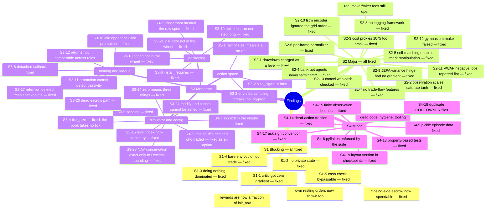

# 15. Consolidated Findings and Recommendations

Severity-ranked across all three perspectives and both source documentation sets. **[verified]**
marks a finding confirmed by executing the code; raw output is in
[16_verification_log.md](16_verification_log.md).

---

## The register at a glance



---

## Severity legend

| Level | Meaning |
|---|---|
| **S1 — Blocking** | Prevents the system from doing what it is built to do |
| **S2 — Major** | Substantially degrades results or correctness |
| **S3 — Moderate** | Real defect with a bounded blast radius |
| **S4 — Minor** | Hygiene, maintainability, polish |

---

## S1 — Blocking

### S1-1 · PPO's critic receives zero gradient **[verified, fixed]**

`vf_clip_param` defaults to 10.0 and is never overridden, while value targets are NAV sums in the
10⁴–10⁷ range. `torch.clamp(vf_loss, 0, 10.0)` is flat there, so `∂L_vf/∂θ = 0` for every sample.

```
vf_loss            10.0             ← pinned at the clip bound
vf_loss_unclipped  13,015,503  /  10,513,565
vf_explained_var   8.91e-05    /  5.42e-05      ← critic explains ~0% of variance
total_loss         9.25        /  9.48          ← 10.0 of which is a constant
```

PPO degenerates to REINFORCE with a batch-standardised baseline. Silent: the reported
`total_loss` looks small and stable because 10.0 of it is a constant.

**Fixed.** Every NAV-derived quantity in `set_reward` is now divided by `trader.acc.init_nav` —
the account's own record of what the trader started with, rather than a second copy of `init_cash`
that could drift from it. Value targets are O(1), the clamp no longer binds, and the substantive
`vf_explained_var` assertion in `integration/test_progress_and_vf.py` — which was a *strict xfail*
pinning this finding — XPASSed on the first real run after the change and is now a live regression
guard. The same change also closed S2-3 and made S2-1's fix expressible.
→ [12 §4](12_perspective_rl_researcher.md#4-the-critic-cannot-learn--vf_clip_param-saturation),
[07 §2.1](07_reward_function.md)

### S1-2 · Observation contains no private state **[verified, fixed]**

Every agent received the byte-identical 168-float public book vector (`distinct obs vectors
across agents: 1`). Absent: `net_position`, `VWAP`, `nav`, `max_nav`, `cash`, own resting orders,
agent identity, time remaining.

The reward is literally `f(nav, prev_nav, max_nav, …)` — all unobserved. Two states with
identical books but opposite inventory require opposite optimal actions and were
indistinguishable. The drawdown term depends on `max_nav`, a path functional over the whole
episode, so this was not partial observability a recurrent net could recover. It also made the
`modify` and `cancel` categories (4 of 9) blind.

**Fixed.** The observation is now `[ n_hist × snapshot | private ]` - 193 floats when this was
first closed, 216 since the own-book block (S3-24 phase 1) completed it: the book prefix is still
shared and computed once, and a per-agent block is appended.
`State_Helper.PRIVATE_FIELDS` is the single definition of its layout and `__init__` checks its
length against `private_dim`. Every field is normalised by the trader's own `init_nav` or is
already a ratio, so the block is O(1) and cannot saturate the `tanh` MLP the way raw sizes do
(S2-2).

`test_shared_history_multi_agent_uniformity` — which asserted the defect as a requirement — is
replaced by `test_agents_see_distinct_private_state`, plus a test that the book prefix is *still*
shared, since that half was never the bug.

Three consequences worth knowing:

- **The observation width is structural.** No checkpoint written before this loads.
- **`obs[-SNAPSHOT_DIM:]` is now wrong everywhere.** It returns the private block plus a truncated
  final snapshot. Slice against `n_hist * SNAPSHOT_DIM` — `ObsLayout.book_flat_dim` and
  `split_private` exist for this. Four test files and the probe harness held that assumption.
- **The private block is not tokenised with the book.** Token width is
  `max(book_rows, extra_dim)`, so folding it in would widen every book token to 9 channels and
  right-pad with zeros. It gets its own projection and joins as one token — `blocks.PrivateToken`,
  shared by every tokenising encoder so they stay comparable.

**Still open:** own resting orders and agent identity are not in the block. Resting orders are the
larger gap — `modify` and `cancel` remain partly blind, since an agent can see its escrowed cash
but not which orders that cash is committed to.
→ [12 §2](12_perspective_rl_researcher.md#2-the-observation-contains-no-private-state),
[05 §1.0](05_observation_space.md)

### S1-3 · Doing nothing is a dominant strategy **[verified, fixed]**

| Policy | Total return, 4 agents × 300 steps |
|---|---|
| All agents `category=0` (pass) | **0.0 exactly** |
| Random trading | **−591,027** |

NAV is conserved exactly (total 4,000,000.00 at both ends), so `Σ nav_change = 0`, but the
loss-aversion multiplier and the drawdown level make the reward strictly negative-sum.
`(pass, …, pass)` is both a Nash equilibrium and the joint optimum, and gradient descent finds it
early because the fastest way to raise return is to stop trading. Empty-market collapse is the
predicted outcome.

**Fixed.** `loss_multiplier` 1.5 → **1.0**, the drawdown level → a signed change (S2-1), and the
micro-penalties rescaled to reward units (S2-3). Re-measured on the same 4 agents × 300 steps:

| | before | after |
|---|---|---|
| all agents pass | `0.0` | `0.0` |
| random trading | **−591,027** | **−0.0104** |

Passing still scores exactly zero, which is correct rather than residual: in a zero-sum market no
reward can make trading positive-sum *on average*. What changed is that the friction is now ~0.5%
of a typical NAV move instead of dominating it, so trading is no longer dominated for an agent with
any edge. Measured over 1,000 steps, `nav_term` sums to **exactly 0.000000** across agents.
→ [12 §3.3](12_perspective_rl_researcher.md#33-doing-nothing-is-a-dominant-strategy),
[07 §4.3](07_reward_function.md)

### S1-4 · The default standalone env could not trade **[verified, fixed]**

`config/env_defaults.json` shipped `init_cash: 0`. `Trader._order_approved` refuses on
`nav <= 0` before it inspects anything else, so every trader in a bare env started bankrupt: no
order was ever placed on any side, `Done_Helper.set_done` put all five agents in `done_set` on
the first pass, and `terminateds["__all__"]` came back `True` after a single `step()`. The
configured `max_step: 64` was unreachable.

| `continuousDoubleAuctionEnv({})` | Before | After |
|---|---|---|
| Trades in 64 steps | **0** | 134 |
| Steps before `terminateds["__all__"]` | **1** | 64 (truncated) |
| Final NAVs | `['0','0','0','0','0']` | spread around 1,000,000 |

This is the form `gymnasium.make("continuousDoubleAuction-v0")` produces and the one
[01](01_overview.md) documents as "small, cheap and prints what it is doing". The value was
written down in three places and its consequence in none of them.

CI did not catch it: the only bare-env job is the `CDA_rand.py` smoke run, which builds its own
env config from `cli_defaults.json` — where `init_cash` is 1,000,000 — and so overrode the one
value that broke it.

**Fixed:** `init_cash` is 1,000,000 in `env_defaults.json`, matching `cli_defaults.json` and
`train_config.json` so all three agree. `test_env_lifecycle.py::TestBareEnvIsTradable` reads the
checked-in file deliberately — a fixture supplying its own cash would reproduce exactly the blind
spot the smoke run had.

### S1-5 · The cash check is bypassable; position is not bounded by capital **[verified, fixed]**

`Trader._order_approved` waived the cash check for the portion of an order that reduces the
*current* net position, and nothing netted an order against the trader's **other resting orders**.
So N individually-"closing" orders were each approved against the same lots.

Executed: a trader long 10 with `cash = 0` rested ten 10-lot asks across ten price levels — every
one approved, `cash` driven to −10,550 — and when they filled it held a **90-lot short built from a
10-lot long, without a single refusal**. Since the approval is what bounds risk, this is not a
rounding error in the ledger; it is the absence of a position limit.

This is the one finding that contradicts the register's own summary below, which praises the
buying-power logic as "subtle and right". It is right per order and wrong in aggregate.

**Fixed.** `_order_approved` computes the closable position as `abs(net_position)` minus this
trader's own resting quantity on that side, excluding the order an upsert or a modify is about to
replace (a `limit` at a price it already rests at, or a `modify`, releases the old order in the same
call that would otherwise be charged for it). The same sequence now refuses nine of the ten and the
position goes flat instead of flipping. Pinned by `test_resting_exposure.py`.

**The tail, measured and then closed (2026-09-18).** The escrow charges full notional for *any*
resting order, including one that only closes, and the cash check treated that escrow as spent. So
a trader long 10 with its exit ask resting could not open anything else, although the ask's fill
could only reduce its risk. Measured under random play ([16](16_verification_log.md) §16.18):

| `init_cash` | refusals | while closing-side escrow existed | would have passed had it counted |
|---|---|---|---|
| 20,000 | 3,712 | 1,602 (43%) | 793 (21%) |
| 100,000 | 607 | 508 (84%) | 409 (67%) |

Fixed in the approval predicate rather than the ledger: `Trader._closing_escrow` sums the escrow
held against this trader's resting orders on the side that reduces its position, capped at the
quantity that actually closes (`|net_position|`, oldest order first), and `_order_approved` counts
it as spendable beside `cash` and the replaced order's release. The ledger is untouched, so every
partial-fill path in `Cash_Processor` still sees escrow equal to full notional. The one visible
consequence is that `cash` may sit below zero by at most that closing escrow while both orders
rest; `cash + cash_on_hold` never does, and NAV is unaffected — `test_orderbook_properties.py`
asserts the first under random play, and `test_cash_check.py::TestClosingEscrowIsSpendable`
pins the cases. The same measurement after the fix: 3,241 and 340 refusals respectively.


---

## S2 — Major

### S2-1 · Drawdown is penalised as a level, not an increment **[verified, fixed]**

`max_nav` is monotone within an episode, so a drawdown is re-charged **every step** until NAV
exceeds the old peak. Measured over 300 steps × 4 random agents: drawdown = **−416,473**, roughly
**2.4×** the entire NAV term (−174,502). At `max_step=4096` a 1,000-unit early drawdown costs
~800,000.

Side effects: not potential-based (changes the optimum, not just the shaping); magnitude scales
with `max_step`, making episode length a hidden risk-aversion knob; non-Markov in the observation.

**Fixed — but not with the fix this entry used to propose.** `max(0, new_dd - prev_dd)` charges
`nav_term` a second time on every losing step below the peak and refunds nothing on the way back
up, so a round trip costs `drawdown_penalty × X`: an asymmetric loss multiplier by another name,
which would have left S1-3 half-open while looking like a fix for this. What shipped is the
**signed** change, `(current_drawdown - previous_drawdown) / init_nav`, whose per-step charges
telescope to `-drawdown_penalty × final_drawdown` over an episode regardless of path. A round trip
is free, ending in drawdown is still penalised, and the term cannot be farmed.
→ [12 §3.4](12_perspective_rl_researcher.md#34-the-drawdown-term-is-a-level-not-a-delta),
[07 §4.1](07_reward_function.md)

### S2-2 · Unnormalised observation scales saturate the `tanh` MLP **[verified, fixed]**

| Feature block | Range (one 300-step rollout) |
|---|---|
| normalised prices | ±0.58 |
| sqrt sizes | **±47** |
| `log_mid` | 3.68 … 4.04 |

An ~80–250× spread (book-dependent; a second run measured ±0.26 vs ±51) into a `tanh` first layer
with no `MeanStdFilter` or normalisation connector. Size features saturate and dominate; price
features contribute almost nothing.

**Fixed**, in three places. Level volumes are `sqrt(V / limit_max_size)` — `limit_max_size` is the
scale orders are drawn on, and over 9,565 populated levels that lands at a median of 0.52, a p99 of
0.94 and a maximum of 1.32. `log_mid` is centred on the log of the geometric mean of the price-anchor
range, a constant of the configuration rather than of the episode, so the information is unchanged
and the feature spans about ±1.15 instead of being a standing +4.6 bias. And the private `position`
field no longer divides by `limit_max_size`, which is not a maximum of anything — it scales the mean
of the Gaussian `_set_size` draws from and clamps nothing — while inventory accumulates across
fills; there is now a `position_scale` key, defaulted to the measured p95 of 1,500.

Re-measured: the size/price standard-deviation ratio falls from **220× to 3.7×**, every book feature
lands inside ±1.2, and inventory exceeds its scale on **0.0%** of agent-steps against 13.2%.
`test_obs_feature_scales.py` asserts the *property* — that the blocks are comparable and bounded —
rather than the formulas, which stay pinned where they were.
→ [05 §7.5](05_observation_space.md#75-feature-scales-differ-by-one-to-two-orders-of-magnitude-after-normalization)

### S2-3 · Transaction-cost proxies are ~10⁵× too small **[verified, fixed — real fees still open]**

`order_penalty=0.1`, `trade_penalty=0.05`, `passive_bonus=0.1` against per-step NAV moves of
−10,949 … +6,126. Three of the reward's five stated objectives — "reducing number of trades",
"selective order placement", "capturing spread" — therefore have no effect. There are no real
fees anywhere in the simulator, so market making has no revenue model and crossing the spread has
no cost.

**Half fixed.** The *scale* problem is closed: the coefficients now multiply quantities already
expressed as fractions of starting capital, so `1e-05` is one basis point of it, and they were
calibrated against measurement rather than chosen — over 8,000 random-agent steps, 37% of steps
move NAV at all and one that does moves it by a median 1.9e-03 of starting capital, so the
penalties sit at 0.5–1% of that. `passive_bonus` is set equal to `trade_penalty`, making a passive
fill net-free while an aggressive one costs 0.2 bps, which expresses "capture spread" as a price.

**Still open:** these remain *proxies charged against the reward*, not fees charged against NAV.
Real maker/taker fees in basis points of notional, applied inside settlement so they flow through
the ledger, would also require relaxing the NAV-conservation assertion to account for them. That
is a simulator change, not a reward change, and it is unaffected by this fix.
→ [13 §4](13_perspective_financial_trader.md#4-there-are-no-transaction-costs),
[07 §4.2](07_reward_function.md)

### S2-4 · Bankrupt agents are never terminated **[verified, fixed]**

Forcing `agent_0.nav = −50`:

```
terminateds: {'agent_0': False, 'agent_1': False, 'agent_2': False,
              'agent_3': False, '__all__': False}
done_set:    {'agent_0'}
```

`set_done` records bankruptcy, then `set_all_done` overwrites every per-agent flag with `False`.
The agent keeps emitting transitions, keeps accruing the per-step drawdown tax (S2-1), and its
resting orders stay live and executable. Its module return is then dominated by a constant
unrelated to its policy — and that return is what champion promotion reads.

**Fixed.** `set_done` decides and applies termination in the same call — which also settles the
`done_set`-is-monotone worry, since an agent goes at the moment its NAV is non-positive and no later
step can terminate a recovered one. It keeps the observation and reward of its terminal transition,
loses its resting orders, and drops out of `agents` (not `possible_agents`, which stays the fixed
roster).

One consequence was worth catching: the NAV conservation check read only the final step's `info`, so
a terminated agent's NAV vanished from the total and any episode containing a bankruptcy would have
read as a violation — halting a strict run over a ledger that was intact. `on_episode_step` now
carries each agent's last reported NAV forward, and a test pins that a *genuine* breach is still
caught when an agent terminated.

### S2-5 · Self-matching enables mark manipulation **[verified, fixed]**

An agent can cross its own resting order (`same ID both sides: True`). The accounting handles it
consistently, so NAV stays conserved — but `mark_to_mkt` uses the **last tape print** as the mark
for *everyone*. An agent holding inventory can self-trade one contract at a chosen price and
instantly re-mark the whole market, including its own reward. Every regulated venue mandates
self-match prevention for exactly this reason.

It was also **free**: `_process_trades` sends a self-trade down a branch that never calls
`process_acc`, so neither `num_trades` nor `num_trades_step` incremented and `trade_penalty` never
charged for it. Any "refuse to promote a champion that does not trade" guard would have been evadable
the same way.

**Fixed, and it took both halves.** `Trader._prevent_self_match` withdraws the trader's own resting
orders that an incoming order would cross, before it reaches the matcher — the "cancel resting order"
SMP mode. It lives in `Trader` rather than as a `trade_id` skip in `process_order_list`, where it
would naturally go, because `envs/orderbook/` is off-limits (S3-4).

Prevention alone was not enough, which is the part worth reading twice. The *resting leg* of a
prevented self-cross survives, and with the mark falling back to whichever side of the book was
populated, that lone order simply became the mark — the same 1,000 NAV moved with no trade at all. So
`mark_price` uses the midpoint only when the book is genuinely two-sided, and falls back to the last
trade rather than to a one-sided quote. Moving the mark now takes a real two-sided market, and moving
the mid in one means posting a better quote somebody else can lift — a price someone can take the
other side of, which is the whole difference. The source is a `mark_price_source` config key ("mid"
or "last") because the change moves NAV dynamics and a run should be able to reproduce the old
behaviour.
→ [13 §3.1](13_perspective_financial_trader.md#31-self-matching)

### S2-6 · Every frame in the observation stack has a different normalizer **[verified, fixed]**

`set_agg_LOB` computes `M` from the book at that moment; `prep_next_state` appends the
already-normalized frame to the deque. Frames *t−3 … t* each carry their own `M_{t−3} … M_t`, so
**they cannot be differenced meaningfully** — which is the entire purpose of stacking them. A
resting order at a fixed absolute price appears to move whenever the midpoint moves.

Partially mitigated by the per-frame `log_mid`, which lets the agent recover each frame's
normalizer, but the network must then learn to undo the rescaling itself.

**Fixed** exactly that way. The deque holds raw frames and `prep_next_state` normalises the whole
stack once, by `M_t`. Concretely: a bid resting at 90 while the midpoint moved 100 → 96 used to read
0.100 in one frame and 0.063 in the next — the order had not moved, its denominator had. It now reads
0.0625 in both, `log_mid` still differs across them (0.0 → −0.0408) because each frame keeps its own
midpoint, and a new `mid_return` scalar records the move as −0.04. Nothing is lost; it is no longer
smeared through every price in the book.
→ [05 §7.1](05_observation_space.md#71-each-frame-in-the-stack-is-normalized-by-a-different-denominator)

### S2-7 · No trade-flow information — the tape loop is dead code **[verified, fixed]**

`set_agg_LOB` iterates the tape, uses nothing, and increments a discarded counter. The body is a
commented-out `write` copy-pasted from `OrderBook.__str__`. The observation therefore contains
**zero information about executions**: no last traded price, no trade direction, no signed
volume, no trade count.

In a continuous double auction, aggressive order flow is the single most predictive public
signal — more so than the resting book, which is largely stale intentions. Order-imbalance
helpers already exist in `train/helper/helper.py`, unused.

**Fixed.** The loop is now `_trade_flow`, and three scalars join the snapshot: `signed_volume` —
each fill signed by its **initiator's** side, which is what makes it order flow rather than volume —
`log1p_trade_count` and `trade_direction`. Over a 400-step rollout each is non-zero on ~58% of steps.
`extra_dim` goes 2 → 6 and is now checked against a new `EXTRA_FIELDS` tuple, on the same rule as
`book_rows` and `private_dim`; it was documentation before, so setting it was a silent no-op. The
observation is 193 floats rather than 177, so no earlier checkpoint loads.

The flow cursor advances only in `prep_next_state`, never in `set_agg_LOB`, because the latter runs
twice per step and only one call commits a frame — a display-only snapshot must not eat the step's
trade flow.
→ [05 §7.3](05_observation_space.md#73-the-tape-loop-is-dead-code--there-is-no-trade-flow-information-at-all)

### S2-8 · No logging framework; the callback prints 42 diagnostics per episode — **fixed**

*Was:* zero `import logging`; ~86 `print()` calls in `envs/` + `train/`; every remote worker
printing independently with no level filter, no attribution and no off switch; the
NAV-conservation check — a **hard ledger invariant** — printing `FAILED` rather than raising.

*Now:* all of `envs/` and `train/` reports through `logging_setup.get_logger`, at levels, with the
pid in the format and the level exported to worker processes; a violation raises by default and
emits `nav_conservation_error` either way. `test_logging_setup.py` fails the build if a `print`
comes back.

Still open, tracked in [11 §4](11_logging_and_observability.md#4-recommended-additions): only
three custom values reach TensorBoard, and no per-iteration history is written to disk.

### S2-9 · The JEPA anti-collapse hinge contributes zero gradient **[verified, fixed]**

`_jepa_loss` derived `std`, the off-diagonal covariance and
`variance_penalty = relu(VARIANCE_TARGET − std)` from `target`, which is built inside
`torch.no_grad()` by a trunk whose parameters are additionally `requires_grad_(False)`. Confirmed at
runtime: `std.grad_fn is None`, `variance_penalty.requires_grad is False`.

Nothing raised, and nothing could — adding a constant to a tensor that *does* carry a `grad_fn` is
legal, and the sum still backpropagates, just not through the term meant to do the work. So the
mechanism `jepa.py`, `train_config.json`'s `_note_collapse` and `pretrain/__init__` all describe as
"the only thing actively pushing back once a collapse starts" did not exist. The encoder had
collapse *detection* and no collapse *prevention*; `variance_coeff` was a dead knob that still
entered `encoder_fingerprint`, so changing it invalidated every checkpoint while changing nothing;
and the constant was silently folded into the logged `jepa_aux_loss`, making it incomparable with
`predict_loss`.

**Fixed.** The statistics come from `predicted`, the online counterpart of `target` — same
positions, same count, gradients reaching the predictor and, through `context`, the trunk —
layer-normed exactly as the target is so `VARIANCE_TARGET` means the same on both sides. VICReg
applies its variance and covariance terms to the embeddings being *trained*; BYOL stops the gradient
on the target branch alone. Reading them off the target was a deviation from both.

Worth knowing for the test: "a gradient reaches the trunk" passes either way, because one arrives
from the prediction loss regardless. The guard runs the same batch and mask twice, differing only in
`variance_coeff`, and asserts the gradients differ — a constant's derivative is zero however large
the coefficient in front of it.

### S2-10 · The `lstm` encoder is invariant to the order of the grid it exists to preserve **[verified, fixed]**

`TokenEmbedConfig` — the tokenizer that is the entire difference between this project's LSTM and
RLlib's stock `use_lstm=True` — was `tokenize → Linear → LayerNorm → mean`. A mean of per-token
linear projections is a linear function of the token *sum*, hence permutation-invariant on both
axes.

Measured on the real observation space: permuting the book levels moved the latent by **1.8e-07**
and reversing the history by **1.2e-07**, float32 noise either way. Its 44 book tokens collapsed to
their per-field mean before anything nonlinear. Since the `encoder` group exists to ask which
architecture reads this market better, an lstm-vs-transformer comparison was measuring something
else.

**Fixed**, and the second half is the part that is easy to miss. Positional embeddings alone do not
help: `mean(W·xᵢ + pᵢ)` is `W·mean(xᵢ) + mean(pᵢ)`, so under a linear projection and a mean the
position is an input-independent constant — verified, the permutation delta stayed at 0.000000 with
the embeddings in place. A token-wise nonlinearity between the two is what makes position bear on
the result. With both, the deltas are 0.070 (levels) and 0.078 (time) under the shipped
`pool="mean"`.

The guard is in the **every-encoder contract**, not in the LSTM's own tests: an architecture that
cannot see where a level sits, or which snapshot came first, is not answering the question the group
exists to ask.

### S2-11 · `VWAP` goes negative on a partial close, and the observation then reports "flat" **[verified, fixed]**

`Account._size_decrease` rolls realised P&L into the remaining lot's basis. The roll is load-bearing
and must stay — on the short side `position_val` is `2·raw_val − mkt_val`, so removing it moves NAV
— but it leaves `VWAP` free to go negative: long 2 @ 100, sell 1 @ 250 gives **−50**.

`set_private_state` computed `vwap_vs_mid` under a `vwap > 0` guard and fell through to `0.0`, which
is the encoding for **flat**. An agent holding an open position was told it held none, on a measured
**5.0%** of open-position agent-steps. `info["VWAP"]` exported the same non-price into the episode
Parquet.

**Fixed.** `Account.entry_vwap` is the price actually paid for the lots still held, maintained by
the three methods that open or reset a position and untouched by `_size_decrease`, rolling from its
own previous value so an earlier partial close cannot leak into it. The observation and
`info["VWAP"]` read it; the ledger's rolled basis stays available as `carrying_vwap`. Re-measured:
0.0% of open positions report a non-positive basis, and the worked case reports `vwap_vs_mid` 0.6.

### S2-12 · `gymnasium.make(...)` raises **[verified, fixed]**

`setup.py`'s own docstring documents it. Run from a clean directory:

```
TypeError: action space does not inherit from `gymnasium.spaces.Space`,
actual type: <class 'NoneType'>
```

Only the plural `observation_spaces` / `action_spaces` were set — the pair RLlib's new API stack
reads — while `PassiveEnvChecker` reads the singular ones inherited from `MultiAgentEnv`. Nothing in
the test suite or the CI packaging job exercised `make`; both construct the class directly, so it
stayed broken while every job was green.

**Fixed.** The singular spaces are set to a single agent's, which is exactly what RLlib defines them
as (`@OldAPIStack`). `metadata` also moves from the pre-gymnasium `render.modes` to `render_modes`,
and the registration passes `disable_env_checker=True` — `PassiveEnvChecker` is a *single-agent*
checker and this env returns a dict keyed by agent id, which is a category error rather than a
finding. That flag is set only after fixing the spaces; doing it first would have hidden the
`TypeError` rather than fixed it. The CI packaging job now calls `make`.


### S2-13 · A cancel was cash-checked like a new order, so an over-committed trader could not cancel **[verified, fixed]**

`Trader._order_approved` ran the same check for every order type: compute the "opening" size,
multiply by the price, compare against `cash`. For a `cancel` that is meaningless — a cancel
places nothing, it *returns* escrow to cash — but it was applied anyway, with the cancel's own
(irrelevant) size and price as the notional. The consequence is exactly backwards from what a
solvency gate is for: **a trader whose cash was fully escrowed in resting orders was refused the
one action that would have freed it.**

Measured, before the fix ([16](16_verification_log.md) §16.17):

```
after limit  10 @ 100:  cash 0    on_hold 1000   rejected 0
after cancel        :   cash 0    on_hold 1000   rejected 1   orders resting 1
after modify 5 @ 100:   cash 0    on_hold 1000   rejected 1   resting qty 10
```

The same trap caught a `modify` that shrank an order, and a `modify` that re-priced one at the
same or lower notional: `cancel_cash_transfer` hands the old order's escrow back *before* the new
quote is processed, but the check did not know that and compared against the pre-release `cash`.

Why it matters for learning rather than only for tidiness: the refusal is silent to the agent
(`num_rejected_step` increments, nothing else happens), so from the policy's side "cancel" simply
does nothing whenever it is over-committed. The agents most in need of managing their quotes are
the ones for whom quote management was switched off, and the `order_rejection_fraction` metric
counted these as if they were orders quoted past the agent's means.

**Fixed.** A `cancel` is approved unconditionally once the `nav > 0` gate passes (a bankrupt
trader is terminated and its orders pulled by `cancel_all_orders`, not by an action). For `modify`
and for a `limit` at a price the trader already rests at — the upsert path — the escrow the
replaced order releases is added to the cash the check may spend, so re-pricing and shrinking
always pass and only a genuine increase in notional beyond `cash + released` is refused.
`_replaced_order` returns the order as well as its id, so the same lookup that excludes it from
`_resting_exposure` (S1-5) supplies the released amount. Seven tests in `test_cash_check.py` pin
each case, including that a bankrupt trader still cannot act.


---

## S3 — Moderate

### S3-1 · Half the `size_mean` action range is a no-op **[verified]**

`_set_size` applies `abs()` to the Gaussian sample, so `mean=+0.5` and `mean=−0.5` produce
identical sizes under the same seed. `size_mean` is declared on `Box(-1, 1)`; the optimum is
bimodal at `±m`, which a unimodal Gaussian head resolves by drifting toward 0 — i.e. minimum
size. The gradient kink sits exactly where the policy initializes.
**Fix:** declare `Box(0, 1)`.

### S3-2 · The `size_sigma` head is inert **[verified]**

`sigma ∈ [0,1]` is used as an *absolute* standard deviation while means are 49.5·|m| or 499.5·|m|.
Across its full range the size varies by ±1 contract on a base of 250. The policy pays entropy
cost for a control that does nothing.
**Fix:** scale it, or delete it.

### S3-3 · Size is sampled by the environment, outside the policy's log-prob

The policy emits distribution parameters and the env draws the sample, so the realised size is
not part of the action whose log-probability PPO uses in the importance ratio — and the agent
never observes the realisation. Irreducible advantage variance.
**Fix:** emit size directly as a `Box` action.

### S3-4 · The order book's `tick_size` is inert **[verified, fixed]**

`tick_size` used to exist as two independent values: a hardcoded `min_tick = 1` in
`Action_Helper` that actually drove prices, and an `OrderBook` argument that was stored and never
read. Setting the config key therefore changed nothing anywhere.

**Fixed, in three steps across three passes.** `Action_Helper.min_tick` comes from the `tick_size`
config key, so the key controls the grid agents quote on. `reset()` stopped rebuilding the book
with a literal. And on 2026-09-18 the book's dead parameter was deleted: `OrderBook` takes only
`tape_display_length`, `OrderBook(0.0001, 10)` is a `TypeError`, and the `inert_tick_size_copy`
block that documented the literal is gone from `tunable_constants.json`. There is now exactly one
definition of the tick, the action layer's, and the code no longer suggests a guarantee the
matching path does not provide — the book keys its price map on whatever `Decimal` it is handed and
never did enforce a grid. The `envs/orderbook/` package was off-limits until this pass; the
invariant suite (`test_orderbook_properties.py`) is what made lifting that safe.

**The float-grid caveat, re-measured and fixed.** An earlier version of this entry said
`_set_price` "emits on-grid prices by construction" and that off-grid drift was rare — one
combination over all anchors and six ticks. That analysis covered only the *anchor* path
(`ref_price ± k × min_tick`). The *level* path, taken whenever the targeted book level is
occupied, read the resting price out of `agg_LOB_raw`, which was a **float32** array: a level at
100.1 read back as `100.0999984741211`, and adding a float offset to that gave
`100.19999694824219`. `OrderBook.process_order` keys its price map on `Decimal(str(price))` with
no rounding, so **every re-quote at an occupied level on a non-integer tick opened a new price
level one ulp away from the one the agent meant**, and `Trader._get_order_ID` — which compared the
book's `Decimal` against the action's `float` — never found the trader's own order, so cancels
were silent no-ops and a limit at the same price rested a second order instead of upserting.
Measured at `tick_size` 0.1: one new level per step from an agent quoting the same level every
step ([16](16_verification_log.md) §16.17).

Three changes close it, all on the action side: `agg_LOB_raw` is float64 (the emitted observation
is still cast to float32 at emission); `_set_price` snaps its result to the tick grid in `Decimal`
before returning it; and `_get_order_ID` compares prices as `Decimal(str(price))`, the same
conversion the book applies on the way in. `test_tick_grid.py` (14 tests) asserts every level and
offset lands on the grid for seven ticks including 0.3 and 0.0001, that re-quoting a level upserts,
that a cancel at a fractional price finds its order, and that NAV is conserved under random play
at `tick_size` 0.1.

Related, and still open as a *default*: the price anchor is drawn from `randint(10, 100)`, so with
a fixed tick the *relative* tick varies **10×** across episodes — a large uncontrolled
non-stationarity, only partly mitigated by exposing `log_mid`. What has changed is that this is
now a choice rather than a limitation: `initial_price_min` / `initial_price_max` are `TrainConfig`
fields and are forwarded by `env_config`, so a run can narrow the range. The checked-in config
still ships the wide one.

### S3-5 · Seeding is entirely non-functional **[verified, fixed]**

`reset(seed=...)` forwarded to `MultiAgentEnv.reset`, which seeds `self._np_random` — which
nothing read. All three of the env's random draws went to the global `np.random` instead: the
initial price anchor in `reset`, order sizes in `Action_Helper._set_size`, and the queueing order
in `rand_exec_seq`, whose one caller passes `seed=None` and whose
`sklearn.utils.shuffle(..., random_state=None)` falls through to sklearn's own global
`np.random.mtrand._rand`.

**No episode was reproducible**, which for a research environment whose entire output is
simulated data is disqualifying — none of the generated-LOB figures could be regenerated.

One correction to the original entry, because it changes how urgent this is. **Training runs
were reproducible** — by accident rather than by design. RLlib's `EnvRunner.__init__` calls
`update_global_seed_if_necessary`, which seeds global `random` and `np.random` from
`config.seed + worker_index`, and that covered all three sources. Measured: with global NumPy
seeded, two runs of the same env and actions were identical; with only `reset(seed=123)`, they
diverged. Three caveats made it worth fixing anyway:

* `run.seed` is `null` in the checked-in `train_config.json`, so nothing was seeded by default;
* the seeding happens once per worker at construction, so episode *N* could not be reproduced
  without replaying 1..*N*−1;
* `restart_failed_env_runners` is on by default, and a restarted runner re-seeds from the same
  value — rewinding its stream mid-run, so a run that loses a worker was not reproducible even
  in principle.

**Fixed:** all three sources now read `self.np_random`, gymnasium's per-env `Generator`, which
`super().reset(seed=...)` seeds. `seed=None` deliberately does not re-seed, per the Gymnasium
contract, so consecutive episodes still differ. `rand_exec_seq` honours its `seed` parameter —
accepted since it was written and never used — and shuffles with `Generator.permutation`, which
removed the `scikit-learn` dependency along with it (see S3-6). `test_seeding.py` pins this;
its load-bearing case seeds the *global* stream to two different values and asserts the seeded
episode is unchanged, which fails against the old code in the direction that hid the bug.

### S3-6 · `install_requires` does not match the imports **[verified, fixed]**

`envs/` imports `ray`, `sklearn.utils`, and `six`, none of which were in `install_requires`.
`pip install gym_continuousDoubleAuction` without extras fails on first import. CI never catches
it because it always installs the full `requirements.txt`.

One claim in the original entry was wrong and worth correcting, because acting on it as written
would have left the real dependency in place: **`import ray` in the env is not entirely unused.**
There were *two* ray imports in `continuousDoubleAuction_env.py` — a genuinely dead bare
`import ray`, and `from ray.rllib.env.multi_agent_env import MultiAgentEnv`, which is the base
class. A clean-venv install failed on the second, not the first.

`six` is a Python-2 shim replaceable by `io.StringIO`, but it is imported from
`envs/orderbook/`, which is off-limits to changes (see S3-4) — so it is declared rather than
removed.

`sklearn` is gone entirely. It pulled ~30 MB into every EnvRunner to shuffle ≤8 dicts, and was
the same call that made runs irreproducible; `rand_exec_seq` now uses the env's own
`Generator.permutation`, so fixing S3-5 removed the dependency rather than merely declaring it.

**Fixed:** the dead `import ray` is gone; `ray[rllib]` and `six` are in `install_requires`, which
now matches what the package actually imports, and `scikit-learn` is in neither
`install_requires` nor `requirements.txt` because nothing imports it. The `rllib` extra keeps its
name and carries the rest of the *training* stack (`torch`, `tensorboardX`), so
`pip install -e ".[rllib]"` is unchanged. A second, independent packaging defect was found while
fixing this one — see S3-18.

### S3-18 · The config tree was not in the built distribution **[verified, fixed]**

`setup.py` declared neither `package_data` nor `include_package_data`, and `config/` sits at the
repo root rather than inside the package — so a wheel built from this tree carried **zero** JSON
config files. `config_loader.config_dir()` searches `<pkg>/../config` and `<pkg>/config`; in
`site-packages` neither exists.

The failure lands at *import*, not at first use, because the config reads are default arguments
evaluated at class-definition time in `Exchg_Helper`, `Reward_Helper`, `Action_Helper`,
`State_Helper`, `Trader` and `Account`. Every non-editable install was therefore unusable, which
is why the "Resolved since" entry claiming `setup.py` was fixed for non-editable installs has
been corrected below — it fixed `find_packages()` and left this.

**Fixed:** a `build_py` subclass stages `config/*.json` into `gym_continuousDoubleAuction/config/`
at build time and `package_data` ships it — which is exactly the second location `config_dir()`
already searched and never found. Nothing moves, no documented path changes, and the staged copy
is git-ignored and never preferred in-tree (the repo root is checked first). `MANIFEST.in` carries
the root tree into an sdist so the staging has something to read there too.

### S3-19 · Every episode ran one step longer than `max_step` **[verified, fixed]**

`Done_Helper.set_all_done` compared `self.t_step > self.max_step - 1`, but `step()` increments
`t_step` *after* `set_step_outputs` has computed the flags. The condition first held at
`t_step == max_step`, i.e. on the `max_step + 1`-th step, so `max_step=10` produced 11 calls to
`step()`.

The consequence is quiet rather than dramatic. `TrainConfig.train_batch_size` is defined as
`max_step * num_episodes_per_iter`, so at the checked-in defaults the env delivered 16,388 steps
against a declared batch of 16,384 — and the `sample_timeout_s` sizing note in
`train_config.json` is derived from the same understated figure. Every episode length quoted in
the documentation was off by one for the same reason.

Nothing caught it because the existing loops all stop on `truncateds["__all__"]` without counting
the steps taken to get there.

**Fixed:** the test now reads `self.t_step + 1 >= self.max_step`, written in terms of *steps
taken* rather than as a comparison against `max_step - 1`, which is what made it easy to get
wrong. `test_env_lifecycle.py::TestEpisodeLength` pins the count at several horizons and asserts
that truncation is reported *on* the final step rather than after it.

### S3-20 · The escrow-delta path for order modification was dead **[verified, fixed]**

`Cash_Processor.modify_cash_transfer` computed `diff = order_val - qoute_val` and moved `diff`
between `cash` and `cash_on_hold` — a modify treated as a pure escrow adjustment. Nothing called
it, verified by grep across the package.

It was deleted rather than wired up, because **it is only correct where the live path already
is.** A modify is handled as cancel-and-reprocess: `cancel_cash_transfer` returns the whole old
order value to cash, `OrderBook.modify_order` re-runs the quote through `process_limit_order`,
and whatever is left resting is re-escrowed by `order_in_book_passive_party` — net cash movement
`order_val - residual_val`. When the modify does not match, `residual_val == qoute_val` and the
two are the same expression, which is why NAV conservation never told them apart:

| Modify (bid 10@100) | Escrow-delta would do | Live path does |
|---|---|---|
| → 6@100, no match | cash **+400**, hold −400 | cash **+400**, hold −400 |
| → 14@100, no match | cash **−400**, hold +400 | cash **−400**, hold +400 |
| → 10@101, hits ask@101 | cash −10, hold **+10** | cash −10, hold **−394** |
| → 10@103, hits ask@101 | cash **−30**, hold **+30** | cash **−22**, hold **−382** |

Row 3 shows the escrow leg wrong by the traded value; the cash leg coincides there only because
the fill happened *at* the quoted price, so `residual_val + trade_val == qoute_val` exactly. Row
4 breaks that identity — the fill is 2 ticks better than quoted — and both legs are wrong.

The function has no term for a fill, so it holds cash against quantity no longer in the book.
Re-processing is not an implementation detail of modify; it is what lets a modify cross the
spread, which this function assumes never happens.

**Fixed:** deleted, with the reasoning left at the call site. The six scenarios in
`test_modify_order.py` already constrain the behaviour — three of them cross the book and assert
exact `cash` / `cash_on_hold` / `net_position`, which an escrow-shuffle cannot produce — and a
seventh test now asserts the helper stays gone.

### S3-7 · `sys.exit()` used for error handling in the matching engine **[fixed]**

Six live occurrences in `orderbook.py`. `SystemExit` derives from `BaseException`, so inside a
Ray actor it kills the worker rather than surfacing a traceback. Currently unreachable, but one
action-space change away.

**Fixed (2026-09-18).** All six raise `ValueError` naming the method and the value it refused
(`process_order(): order quantity must be > 0, got 0 (trade_id 1)`), the two commented-out copies
are deleted with the dead code around them, and `test_orderbook_new.py::
TestMalformedInputRaisesInsteadOfExiting` pins each path and asserts that nothing raises
`SystemExit`. `import sys` is gone from the module.

### S3-8 · `build_algo` returns a detached callback on the restore path **[fixed]**

League state *does* survive checkpointing (cloudpickle preserves the callback closure — restored
modules, history and mapping all verified correct). But `build_algo` returned the **fresh, empty**
callback from `build_config` rather than the algorithm's live one. `train()` ignored it, so
training was unaffected; any caller that used it (notebook, tests) drove a detached object.

**Fixed:** the restore path returns `algo_callback(algo)`, the instance RLlib unpickled — the one
holding the restored champion pool — and `None`, loudly, if the restored algorithm has no
`SelfPlayCallback` at all. Four adjacent checkpoint defects went with it: the single overwritten
checkpoint directory, config edits silently discarded on restore, the driver's iteration counter
restarting at zero, and champion metadata existing only inside the cloudpickled callback. See
[18 §5.2–5.3](18_configuration.md#52-the-run-group), [16 §16.8](16_verification_log.md), and
`test_checkpointing.py`.
→ [14 §5.9.1](14_perspective_ai_engineer.md#591-checkpointrestore-what-actually-happens)

### S3-9 · No risk-adjusted performance metrics

NAV, trade count and reward are recorded. Absent: Sharpe/Sortino, max drawdown *as a reported
metric*, hit rate, turnover, inventory statistics, maker/taker ratio, realised-vs-unrealised P&L
split, adverse-selection mark-outs. The counters for several of these already exist and are
discarded after the reward consumes them. `info["NAV"]` is a **string**, round-tripped through
`float()` by every consumer, discarding the exactness `Decimal` was chosen for.

**Partly addressed:** the episode-end NAV conservation check now parses `info["NAV"]` back with
`Decimal` and compares against a `Decimal` total, so that one consumer is exact by construction;
`float()` remains only at the metrics boundary. [16 §16.10](16_verification_log.md) shows the
round trip was harmless at the default `init_cash = 1e6`, but that **above `init_cash ≈ 1e10` the
float check could not resolve its own `1e-6` tolerance** — a genuine breach read as exactly `0.0`
and would have passed a corrupt ledger silently. It also corrects the claim that `nav_tolerance`
was absorbing float noise. The missing risk-adjusted metrics above, and the remaining `float()`
consumers of `info["NAV"]`, are untouched.

### S3-10 · A trader can hold only one resting order per price level **[verified]**

A second limit at the same price *replaces* the first (level volume 7, not 12) —
`_place_limit_order` upserts via `_get_order_ID`. Layering, iceberg and multi-clip quoting are
not expressible. Different price levels are unaffected.

### S3-11 · No entropy bonus, and champion promotion cannot detect passivity **[verified]**

`entropy_coeff = 0.0` (RLlib default). If the learners collapse to "always pass" (S1-3), they
still clear the promotion threshold — 0 beats a negative league mean — so the league fills with
champion snapshots of the do-nothing policy. Related: with `std_dev_multiplier=0.1` a champion is
promoted on the very first eligible iteration **[verified]**, so at the default 16-iteration run
the pool saturates with barely-trained snapshots.
**Fix:** positive decaying `entropy_coeff`; raise `std_dev_multiplier` to 1.5–2.5; refuse to
promote a champion whose trade count is ~0.

### S3-12 · The league ranks a signal that is not comparable across roles

The four shaping terms are not zero-sum, so returns depend on the role a module played that
episode. The promotion threshold is a pooled `mean + k·std` over *all* modules including the
frozen random baselines. A policy can clear it by trading *less*, not *better*.

### S3-13 · γ=0.99 against 4,096-step episodes **[verified]**

Effective horizon ~100 steps = 2.5% of an episode. Strategies with payoff horizons longer than
that (inventory accumulation, sustained market making) are invisible to the return. Only 4
episodes per training iteration also means very few samples of the episode-level randomness
(price anchor, opponent draw). `lambda_=1.0` (RLlib's PPO default, not the usual 0.95) makes
advantages pure Monte-Carlo.

### S3-14 · Zero means three different things in the observation **[verified, fixed]**

`0.0` was the sentinel for "level absent", the exact value of a price *at* the midpoint, and — on
a one-sided book, where `M` fell back to that side's L1 price — the value of the best quote
itself. The book starts empty every episode and is frequently one-sided early on, and there was no
validity mask.

**Measured before the fix, 2026-09-18** (20 seeded random-play episodes × 400 steps per config,
[16](16_verification_log.md) §16.23). Shipped config: 92.0% of steps two-sided, **7.8% one-sided**,
0.1% empty; **627 of 53,604 occupied price cells (1.17%) read exactly 0.0**, every one the lone best
quote of a one-sided book; a further 2,273 of 159,960 occupied cells in the older frames read 0.0.
Stress config (6 agents, 20,000 cash, anchors 5–500, tick 0.1): 23.5% two-sided, **32% one-sided,
44.5% empty**; **2,556 of 11,663 occupied cells (21.9%) read 0.0**. No occupied cell away from L1
ever read 0.0 in the newest frame: the ambiguity was entirely the one-sided case.

**Fixed** by both proposed routes at once ([05](05_observation_space.md) §1.3, §2.1): two occupancy
rows per snapshot (`1.0` where the level holds an order, carried in the raw frame so every frame
keeps its own), and the last trade as the reference price of a one-sided book, which is the chain
`mark_price` has used since S2-5, so the observation and the NAV mark agree. After: the occupancy
row equals `size > 0` on every cell of every step; the occupied cells still reading 0.0 (0.66%
shipped, 11.2% stress) are quotes resting exactly at the last print — a real state, now labelled.
Observation layout version 4, 296 floats. `train.compare` before and after in §16.23.

**What the measurement also settled.** The extreme price tails found while deriving the S4-15
bounds — an ask at 23× the midpoint, a `vwap_vs_mid` of −31 — were traced cell by cell: every one
sat in a book whose midpoint had **random-walked down to one to three ticks**, mostly two-sided.
They are not this row's; they are S3-15's additive-tick coordinate at work, and they are the first
numbers that row has had against it.

### S3-15 · Level index is a non-stationary coordinate **[verified, fixed]**

Slot *k* meant "the *k*-th occupied price", not a fixed distance from mid, and the action space
selected by the same unstable index. A learned association such as "level 3 is a good place to
quote" had no fixed meaning across steps.

**Measured before the fix, 2026-09-18** (20 seeded random-play episodes × 400 steps per config,
[16](16_verification_log.md) §16.24). Shipped config: the best level sat **3.8 ± 2.5 ticks** from
the reference (range −20 to +27), the second **7.0 ± 3.8**, the fifth **12.9 ± 4.8**; the price at
a given slot changed between consecutive steps on **35–54%** of the steps it was occupied on both.
The action's price code *j* landed at a realised distance of 3.6 ticks (code 0) rising only to 9.4
(code 9) with a standard deviation of ~5 ticks throughout, codes 1–6 indistinguishable at 6.5–7.2.
Same picture at the stress config.

**Fixed** by exactly the proposed grid ([05](05_observation_space.md) §1.4, [06](06_action_space.md)
§2.1.1): `book_mode: "grid"`, two size rows over `2 × k_rows + 1` tick offsets from the reference
price, every frame re-gridded against the newest reference, and price code *j* quoting *j* ticks
from the reference on the passive side. After: code *j* lands at ***j* ± 0.9 ticks** (the offset
head) on both sides at both configs, and a ±10-tick window covers **93%** of resting volume against
73% before, because the agents now quote on the grid; ±16 covers 99.5%. The `levels` layout is
kept as `book_mode: "levels"` for comparison, the mode travels in the layout stamp, and
`train.compare --set book_mode=...` runs either. Observation layout version 5, 224 floats.
`train.compare` before and after in §16.24.

### S3-16 · One undrawn opponent kills champion promotion for the rest of the run **[verified, fixed]**

`on_train_result` filtered `None` from `module_episode_returns_mean` but not `NaN`, which is what
RLlib reports for a module the mapping fn did not draw that iteration. One NaN makes the league
mean, std and threshold NaN, and `best_return > threshold` is False against NaN, so no champion
is ever promoted again. Self-reinforcing: each champion added to the pool makes an undrawn
baseline likelier.

Observed in both GPU runs of 2026-08-15 — Colab T4 froze at 4 champions from iteration 12 of 16,
the RTX 4060 docker run from iteration 10 — with `mean=nan std=nan threshold=nan` logged every
iteration after that and no other symptom.

**Fixed.** NaN is filtered alongside `None`, and the excluded modules are named at INFO. Pinned by
`test_champion_trigger.py`.

### S3-17 · Retention deleted each fresh checkpoint in a dirty directory **[verified, fixed]**

`_prune_checkpoints` ranked by iteration number. A run starting from scratch in a directory that
still held an earlier run's `iter_00012/14/16` therefore saw its own `iter_00002` as the oldest of
four and deleted it immediately after the rename that made it real — and the same at 4, 6, 8, 10.
Both GPU runs of 2026-08-15 left the whole first half of the run unrecoverable while preserving
the previous run's saves.

The worse half is restore selection: `list_checkpoints` reports the highest iteration number as
newest, so for the first eleven iterations a `--restore` would have resumed the *earlier* run —
in that instance, the run that trained on nothing ([17 §16](17_changelog.md)).

**Fixed.** Retention ranks by mtime, with the iteration number as tiebreaker, so the save just
written is never the one pruned. A fresh run that finds checkpoints it did not write now warns and
names them, newest first; nothing is deleted, because the directory belongs to the operator.
Pinned by `TestRetention` and `TestForeignCheckpoints` in `test_checkpointing.py`.

### S3-21 · `visualize/` is in no built distribution **[verified, fixed]**

It had no `__init__.py`, so `setuptools.find_packages()` omitted it and a built wheel carried none of
it — while [01](01_overview.md) documents `python -m gym_continuousDoubleAuction.visualize.run_all`
as an entry point. It worked in-tree and under an editable install, which is why nothing noticed,
and the CI packaging job builds a wheel but never imported it.

**Fixed.** Verified by building a wheel: it now carries 11 visualize modules, and a clean venv
outside the checkout imports the package. The packaging job fails if `visualize/run_all.py` is
absent from the wheel. It imports the *package* rather than `run_all`, which needs matplotlib and —
through `visualize_modules → policy_handler` — the whole training stack including torch; that
coupling is now stated in `visualize/__init__`, since `pip install gym_continuousDoubleAuction`
installs these modules but cannot run them.

### S3-22 · The encoder fingerprint does not identify the encoder **[verified, fixed]**

`encoder_fingerprint` hashed the spec *as written* rather than merged against the encoder's
registered defaults. Wrong in both directions, and the two failures are opposites:

- **False mismatch.** A config stating a value equal to its registered default and one omitting it
  describe the identical architecture and fingerprinted differently — a hard error at
  `verify_fingerprint` and `_check_restored_config` over nothing at all.
- **False match**, which is worse. A checkpoint whose spec omitted a key kept its fingerprint when
  the value in `*_DEFAULTS` was later edited, so the architecture changed and the guard said
  nothing — the silent shape mismatch the fingerprint exists to prevent.

The pretrainer had it from the other end. `pretrain(encoder_spec=None)` is documented as "reads the
config file's" and did not: `None` reached `build_module`, which turns a falsy spec into `{}` and
resolves to the *registry* defaults, and `save` then wrote `encoder_fingerprint(encoder_type, None)`.
So a pretrained encoder was built from whatever the code shipped rather than from what the run would
be configured with, and its weights could not load into a training run built from that config block.

**Fixed.** The fingerprint hashes `encoder_settings`, the canonical merged form the encoder is
actually built from, and no longer raises on a spec that does not validate for the type it is asked
about — it reports an identity, and a caller comparing two of them wants "these differ", not an
exception. `pretrain.resolve_spec` is one definition used by `pretrain`, `save` and
`verify_fingerprint`. Verified end to end.

**Also fixed:** `pretrain` refuses `world_model: true` rather than accepting it. It optimises only
the trunk and the predictor, and its loop supplies no `NEXT_OBS`/`ACTIONS`, so the
action-conditioned term never runs — its parameters would be saved randomly initialised and pulled
into a training run by a `strict` load, silently.


### S3-23 · NAV conservation is exact only to Decimal context rounding **[verified, fixed]**

[16](16_verification_log.md) §16.10 established that conservation is "exact under Decimal" and
the config note for `nav_tolerance` says the expected error is 0. The Hypothesis suite found
otherwise on its first run (seed 161, `tick_size` 1): a 4-agent total of `399999.9999999999999999999999`
against 400,000. Re-measured on the tree *before* this pass's ledger change, so it is not a
regression: over 12,000 random-play steps at `init_cash` 100,000, **17.6% of steps** carry a
non-zero conservation error, the worst being `7E-22`.

The cause is the VWAP-based ledger. `_size_increase` stores `VWAP = (|pos| x VWAP + trade_val) /
total_size`, a quotient that rounds at the 28-digit context whenever it does not terminate, and
`mark_to_mkt` then builds `position_val` as `|pos| x VWAP + |pos| x (mark - VWAP)`, two products
that round independently. Algebraically the VWAP cancels; numerically it leaves a residual of one
unit in the 22nd place. §16.10's probe happened on a 300-step sequence where the residuals
cancelled, which is what "exactly conserved 300/300" recorded.

Nothing downstream is wrong: the error is 27 orders of magnitude below the tolerance, and the
tolerance is what the training-time check applies. What is wrong is the *claim*. It is corrected
here, in §16.10's heading, and in `test_orderbook_properties.py`, which asserts conservation to
`nav_tolerance` rather than to zero and says why.

**Fixed (2026-09-18, the same day).** `Account.cost_basis` is the position's basis as the exact
`Decimal` sum of trade values, and it is what every ledger path reads and writes: `_size_increase`
adds the trade value, `_size_decrease` subtracts it (the realised-P&L roll is unchanged, it is
now simply *stated* as a sum), `_covered` resets it, `_neutral` and `_covered_side_chg` set it to
the opening value, and `mark_to_mkt` forms `position_val` from it with one product,
`|pos| × mark`. `VWAP` is a derived property, `cost_basis / |net_position|`, kept for display and
for the tests that build a position by hand through its setter. Re-measured over the same 12,000
random-play steps: **0 steps with a non-zero residual**, at `tick_size` 1 and at 0.1; the property
suite asserts conservation with `==` again ([16](16_verification_log.md) §16.19). The
`nav_tolerance` note's claim of exactness is true once more, and says why.


### S3-24 · `modify` and `cancel` cannot be aimed, so they are mostly dead actions **[verified, fixed]**

Two of the eight order categories are order management, and an agent cannot use either on
purpose. Measured under uniformly random play, 5 seeds × 400 steps × 6 agents
([16](16_verification_log.md) §16.19):

| action | issued | agent had ≥1 resting order | hit an order |
|---|---|---|---|
| `cancel` | 2,738 | 73% | **7%** of issued (10% of those with an order) |
| `modify` | 2,659 | 71% | 48% of issued (67% of those with an order) |

Agents hold 1.6 resting orders on average (median 1, p90 4, none on 26% of agent-steps). Three
causes, in the order they bite:

1. **The agent cannot see its own orders.** The private block carries `cash_on_hold` — how much is
   escrowed — but not where. Which levels hold its orders, how many, on which side: none of it
   is observable ([05](05_observation_space.md) §7.7, the S1-2 tail). A cancel is therefore a guess
   about state the policy was never shown.
2. **A cancel is aimed by exact price.** `_get_order_ID` matches the agent's order at the price
   `price_code` + `price_offset` resolves to. There are 10 levels × 3 offsets = 30 codes, the agent
   typically has one order, and two of the three offsets name a price one tick off any level - so
   even a policy that *knew* where its order sat has one code in thirty that hits it, and a random
   one hits 7% of the time.
3. **A modify is aimed by FIFO, and re-priced by level.** It always targets the agent's oldest
   order on that side, and its `price_code` names the *new* price, so it cannot choose which order
   to move. Its 48% hit rate is simply "did the agent have any order on that side".

The 2026-09-18 pass made both actions *honest* — a cancel is never cash-checked (S2-13), prices sit
on the grid so a hit is possible on any tick (S3-4), and a miss is counted (S4-14) — but not
*aimable*. This is the plan for that, in the order the pieces depend on each other. Every phase is
a structural change to the observation or action layout, so the whole plan is one new
checkpoint generation, not several.

**Phase 1 — show the agent its own orders (closes the S1-2 tail).** Add an "own book" block to
the private tail: for each of the `k_rows` levels on each side, this agent's resting size at that
level, on the same `√(V / limit_max_size)` scale and sign convention as the public book, plus two
scalars for own order count per side over a cap. That is `2 × k_rows + 2 = 22` floats, taking the
observation from 193 to 216. It slots into the level tokenisation the encoders already use — a
level token gains an "own size" channel — so `obs_layout.py` and `tokenize.py` change in one place
each. `PRIVATE_FIELDS` and `observation_layout.private_dim` are the two definitions to move
together; the constructor check catches a mismatch. Deliverable: the block, its tests (own size at
a level equals the sum of own orders there; zero elsewhere; sign; the shared/private split test in
`test_observation_history.py` extended), and [05](05_observation_space.md) §1 and §7.7 rewritten.
About a day.

**Phase 2 — aim by slot, not by price.** Add an `order_slot: Discrete(max_own_orders + 1)`
component to the action `Dict`. For `cancel`, `order_slot = k` names the agent's k-th own order on
that side counted from the touch (best price first, oldest first within a level, the same order
Phase 1 lists them in); `price_code` and `price_offset` are ignored, and slot 0 means "all on this
side". For `modify`, `order_slot` names the order and `price_code` + `price_offset` name where it
goes, so a modify can finally choose which order to move; the `size` head keeps its meaning. A slot
beyond the agent's count is `num_unmatched_step`, as now. `Trader._get_order_ID` grows a
`by_slot` path; `_prevent_self_match`, `_resting_exposure` and `_replaced_order` are unaffected
because they resolve through the same lookup. `RandomRLModule` samples the new component for free
and RLlib's `Dict` action distribution handles it without a custom model. Deliverable: the
component, `tunable_constants.json` → `action_space.max_own_orders` (8, above the measured p90 of
4), the decode in `_set_action_mkt_depth`, and tests that a cancel at slot k removes exactly that
order on any tick. Expected effect on the same random-play measurement: a cancel hits whenever
`slot ≤ count`, so roughly 60–70% of issued rather than 7%. About a day.

**Phase 3 — make a miss visible to the policy, not only to the log.** `num_unmatched_step` reaches
`info`, the record and the metrics; the policy sees none of those. Two options, both small, in
order of preference: (a) add `unmatched_last_step` (0/1) to the private block so the consequence
of a dead action is in the next observation, which is what a recurrent or stacked policy can learn
from; (b) a `dead_action_penalty` reward coefficient, default **0.0**, because any non-zero value
makes the game negative-sum (S1-3) and has to be weighed against that. Ship (a); expose (b) as a
knob and leave the decision to a measured run. Half a day.

**Phase 4 — prove it learned.** Run `train.compare` before and after at the scaled-down protocol,
three seeds, reading `unmatched_action_fraction`, `pass_action_fraction` and the maker ratio
beside returns: the claim to test is "agents that can aim cancels quote more and hold fewer stale
orders", and the first two metrics are the ones that would show it. Then the Hypothesis suite
extended with slot-aimed sequences, so the book and escrow invariants are asserted under the new
action shape too. Half a day plus the runs.

**Sequencing and risk.** Phases 1 and 2 are both structural (`n_hist`-class changes: a checkpoint
from before cannot be restored after), so land them in one change and record a layout version in
the checkpoint while at it — that is S4-19, and this is the moment it stops being hypothetical.
Phase 2 without Phase 1 gives an agent a precise instrument it cannot see the target of; Phase 1
without Phase 2 shows it a target it cannot hit. The modify semantics change (FIFO → slot) is the
one behaviour change an existing policy would feel; the comparison in Phase 4 is what says whether
it mattered.

**Done (2026-09-18, all four phases; [17](17_changelog.md) §47, [16](16_verification_log.md) §16.20).**

- *Phase 1.* `State_Helper.private_fields(k_rows)` is `[9 base | own bid sizes (k) | own ask
  sizes (k) | own counts (2) | unmatched_last_step]`, 32 at `k_rows` 10; the observation is 216
  floats. `own_book` reads the live book after the step's orders, so level k of the own book is
  level k of the newest snapshot, and `tokenize` writes the two own sizes into channels 4 and 5 of
  the newest snapshot's level tokens - the channels the scalars' width had left as zero padding -
  so the transformer, LSTM, MoE and JEPA encoders see them per level at no extra width.
- *Phase 2.* `order_slot: Discrete(max_own_orders + 1)`, `max_own_orders` 4 (the measured p90).
  Slot k is the k-th own order from the touch; 0 is "all" for a cancel and the oldest for a modify.
  **One design change against the plan as written:** a slot past the agent's count is *clamped*
  to its deepest order rather than counted as a miss. Measured under random play, a head with dead
  upper slots made modify worse than the FIFO rule it replaced (48% → 23% of issued modifies
  landed) while cancel rose only from 7% to 19%, and a learned policy gains nothing from dead
  slots because it can read its own-order counts. Clamped: 35–36% of issued modifies and cancels
  land, 58–62% of those where the agent had anything resting, and the only miss left is a side
  with nothing on it. A cancel no longer reads `price`.
- *Phase 3.* `unmatched_last_step` in the private block, and a sixth reward term
  `dead_action_penalty` shipped at 0.0 with the S1-3 warning on the knob.
- *Phase 4.* `train.compare` collects the rejection, unmatched and maker metrics; run before and
  after at three seeds × 8 iterations of the scaled-down protocol (§16.20). At that scale the
  policies are still near random, so the run proves the protocol and the plumbing, not the
  learning claim; that needs the run at scale. The Hypothesis suite drives slot-aimed modifies and
  cancels through every invariant.
- *S4-19.* `envs/layout_version.py` stamps every checkpoint with the observation and action layout
  versions and field lists; `build_algo` refuses a mismatch by name.


### S3-25 · Within a step, the shuffle decided who traded and at what price **[verified, fixed - as an option]**

All agents act at the same instant, but the engine matched the step's orders one by one in a
random order, so a crossing pair traded at whichever price arrived first and the first arrival had
first claim on resting liquidity. Measured under random play ([16](16_verification_log.md)
§16.26): the first agent in the shuffle filled on **58.1%** of its fresh orders and the last on
**49.1%**, monotonically down the queue; trading steps printed at 1.58 prices on average and up
to 5.

**Fixed as `step_clearing: "batch"`** ([06](06_action_space.md) §8): the step's new orders clear
together against the resting book at one uniform price (volume-maximising, then least imbalance,
then nearest the reference), resting orders keep time priority, the marginal level is rationed
under `matching_rule`. After: the fill curve is flat (57.7% to 57.1%), every trading step prints
one price, and executed volume falls from 51 to 43 contracts a step - the call auction's price for
its fairness. `sequential` stays the default, because a continuous double auction is what the
project simulates; `matching_rule: "pro_rata"` is the other pluggable regime. NAV is conserved
exactly under every combination, and `train.compare --set` runs them under identical seeds. The
first batch run also surfaced a settlement bug - a resting order filled at a better price than its
limit released more escrow than it held - found not by NAV conservation, which the error preserved,
but by the S4-15 clip counter on `cash_on_hold`; `Trader.settle_batch` re-bases the escrow first.

---

## S4 — Minor

| ID | Finding |
|---|---|
| S4-1 | **Fixed.** The `g_store` trio (~270 LOC) was deleted earlier; `train/helper/helper.py` (33 LOC, imported by nothing) is deleted too (2026-09-18). Its order-imbalance idea reached the observation by another route: S2-7's `signed_volume` |
| S4-2 | **Fixed.** `envs/agent/random_agent.py` is deleted and `Trader` no longer inherits from it; `RandomRLModule` is the one random policy (2026-09-18) |
| S4-3 | **Fixed.** Every dead method listed is deleted: `OrderBook.__str__0`, `Order.__str__0`, `OrderList.to_str`, the shadowed `Order.next_order`/`prev_order`, `State_Helper.state_diff`, `Action_Helper._set_side/_set_type/_higher/_lower`. The unread `max_price` parameter of `_set_price` was removed earlier |
| S4-4 | **Fixed.** All ~200 LOC of commented-out code are gone: the old `modify_order` and `get_volume_at_price` in `orderbook.py`, the old `step` and space getters in `continuousDoubleAuction_env.py`, the old `Tuple` `act_space` in `action_helper.py` |
| S4-5 | **Fixed.** `test_accounting.py::test_insufficient_funds` asserts the refusal, the untouched ledger and the approved affordable half; it was an empty `pass` under a 15-line comment |
| S4-6 | **Mostly fixed.** pyflakes is enforced by `test_lint.py` (zero findings). `pyproject.toml` now carries a `ruff` configuration selecting the same pyflakes rule family, so `ruff check .` locally and CI agree; a `pytest` block; and `coverage` tables scoping `pytest --cov` to the package (`pytest-cov` is in the `dev` extra). Measured on the unit suite: **79.1%** line-and-branch, with the two CLI `__main__` modules, `cbp_learner`, `CDA_rand` and `evaluate` the least covered ([10](10_testing.md) §7). Type hints are on the public API of every module in `envs/` (`Trader`, `Account`, `Calculate`, `Cash_Processor`, the five helper mixins). Deliberately not done: a formatter pass over 18,000 lines, which is one commit of pure churn to be made on purpose, and a coverage threshold, which at 79% would ratchet the wrong things first (the CLI mains) |
| S4-7 | **Fixed.** `is_render` defaults to `false` in `env_defaults.json` (`CDA_rand --render` and a DEBUG `cda_log_level` are the two ways to ask for it), and `_render` is read-only: the nulling of `model_actions`/`LOB_actions`/`shuffled_actions` and clearing of `seq_trades`/`seq_order_in_book` is gone, so toggling the render cannot change what the next step sees. Every one of those fields is reassigned at the top of `step()` or in `do_actions` anyway |
| S4-8 | **Fixed.** `docker/ml/dockerfile_ray_torch` `COPY`s `requirements.txt` on its own layer and installs from it (plus jupyterlab and notebook); the hand-maintained copy of the list is gone, and torch stays the CUDA wheel because the file's `torch>=2.13.0,<3` is already satisfied |
| S4-9 | **Fixed.** The per-step record is Parquet with a declared schema, written off the sampling thread and bounded by `episode_sample_every` / `episode_max_bytes`; the two committed `.pkl` files are deleted. Nothing in the repository writes a pickle |
| S4-10 | **Partly fixed.** The defensive `getattr` reads are gone: `pass_agents`, `best_bid`/`best_ask`/`spread` and `_snapshot_stale` are initialised where their mixin is constructed, `agg_LOB_raw`, `last_price`, `min_tick` and `model_actions` are read directly, so a missing attribute is now an `AttributeError` at the read rather than a silently wrong default. The mixin architecture itself - five helpers sharing one `self` - stands; unwinding it into composed objects is a redesign of the env, not hygiene |
| S4-11 | **Fixed, after measuring.** The counter-party lookup is O(1) in the env (trader IDs index the roster; the scan is the fallback for arbitrary lists) - though at 0.2 µs for eight agents it never mattered. The pre-action `set_agg_LOB` was 5.9% of a 1.05 ms step and is now rebuilt only when the book changed since the post-action snapshot - which is exactly when `set_done` pulled a bankrupt trader's orders, tracked by `_snapshot_stale` - or when the render wants its "@ t-1" table. Behaviour is unchanged: the two snapshots were identical in every other case ([16](16_verification_log.md) §16.21) |
| S4-12 | **Fixed.** `python -m gym_continuousDoubleAuction.train.evaluate --checkpoint <iter_n>` restores a checkpoint, refuses a foreign layout by name, and rolls episodes with its own `policy_mapping_fn` assigning modules - so the random baselines and champions play their parts - taking actions through `forward_inference` the way the env runner does, including the unsquash of the normalised Box heads. Per module it reports return, NAV change, trades and the three activity fractions; `--seed` pins episode seeds so two checkpoints are compared on the same anchors; `--deterministic` takes the mode. [26](26_runbook.md) §26.9.1; `test_evaluate.py` and `integration/test_evaluate_checkpoint.py` |
| S4-13 | **Fixed.** `test_orderbook_properties.py` (Hypothesis) asserts, for any order sequence: every tree cache equals a walk of its contents, time priority within a level, no locked or crossed book, escrow equals own resting notional, positions net to zero; and under random env play at three ticks, NAV conservation **exactly**, `cash + cash_on_hold >= 0`, and every price on the grid. Its first run found two things the example suite had not: S3-23, and a size-reducing modify that bumped a resting order's timestamp while keeping its queue position |
| S4-14 | **Fixed.** Refused orders increment `num_rejected_step`; `is_pass_action` separates a deliberate pass; and a `modify` / `cancel` that names no resting order increments `num_unmatched_step`, which reaches `info`, the episode record and the `unmatched_action_fraction` metric. The three fractions together bound how much of an episode's activity changed nothing in the book. Whether a dead action should be *penalised* is a reward-design question and is left as such. **Since 2026-09-18 the impossible half is masked** ([06](06_action_space.md) §7): the observation says which categories are possible and the modules refuse the rest, taking the unmatched fraction from 29.6% to 0.2% under random play; the rejection fraction at a thin-cash config barely moves (33.9% → 33.2%), because those refusals are size-driven and a category mask cannot reach the size head - a measured pointer at S3-1 to S3-3 |
| S4-15 | **Fixed, after measuring.** The Box has finite bounds from `observation_bounds` in `tunable_constants.json`, one `[low, high]` per feature family: exact where the range is an identity (`(M − P)/M < 1`, tanh, the `[0, 1]` fields), otherwise measured over 20 episodes × 400 steps of random play at the shipped config and 20 at a stress config, with at least 4× headroom ([05](05_observation_space.md) §1.2, [16](16_verification_log.md) §16.22). `set_next_state` clips to them and counts what it clipped: `num_obs_clipped_step` in `info` and the record, `obs_clip_fraction` in the metrics and `train.compare`. The counter is the answer to "a wrong bound is a silent clip" - it found one on the first smoke test (older frames' price rows go negative against the newest midpoint; the `[0, 1]` bid bound clipped 192 elements in 50 steps) and reads 0 over the 112,000 agent-steps measured with the shipped bounds. Layout version 3 with S4-17 |
| S4-16 | **Fixed.** `test_shared_history_multi_agent_uniformity` encoded S1-2 as a requirement. It is replaced by a pair that splits the claim: the book prefix must still be shared between agents, the private tail must not be |
| S4-17 | **Fixed, after measuring.** Ask prices and sizes are positive in the raw snapshot, the normalised frame, the own-book block and the L1 read; `_set_price`, the probe's `depth_imbalance` and the order-book visualizer read them so. `OBSERVATION_LAYOUT_VERSION` is 3 and a version-2 checkpoint is refused by name (S4-19) - same width, different meaning, which a shape check would never catch. `train.compare` at the S3-24 protocol (mlp and transformer, three seeds, 8 iterations) before and after: [16](16_verification_log.md) §16.22 |
| S4-18 | **Fixed** (earlier than this row admitted: the tree has carried only `CODEOWNERS` for several passes; the row was stale) |
| S4-19 | **Fixed.** `envs/layout_version.py` writes the observation and action layout versions, the private-field list and the action-key list into every checkpoint's `league_state.json`; `train.build_algo` compares before restoring and refuses a mismatch naming what differs. A pre-stamp sidecar is layout 1 by definition |

---

## Resolved since the older documentation set

Recorded so nobody re-files them. Each was a real defect at the time.

| Was | Now |
|---|---|
| `custom_model: "model_disc"` never registered | `ModelCatalog` is not read on the new stack; the indirection was removed. Trainable modules use the default PPO module via `DefaultModelConfig` |
| Training code straddled two RLlib API stacks | Entirely new-API-stack. `PolicySpec` wiring replaced by `MultiRLModuleSpec`; the broken `CustomRLModule` (which read `config.action_space.n` against a `Dict` space) and dead old-stack modules deleted |
| Champion trigger read `policy_reward_mean` / `custom_metrics` | Reads `module_episode_returns_mean`, already keyed by real `ModuleID` |
| The printed policy map used different logic than the real mapping | `on_episode_start` calls `env_runner.config.policy_mapping_fn` — the authoritative one |
| Champion snapshots never reached the EnvRunners | Force-pushed with a `WEIGHTS_SEQ_NO`-free `set_state`, with the reasoning in a comment |
| Matchmaking seeded from salted `hash()` | Seeds from `zlib.crc32` — reproducible across processes |
| Evicted champions leaked memory | `Algorithm.remove_module` is called |
| Per-episode pickles were unconditional | Replaced by a bounded Parquet record on a background thread; `episode_data_dir=None` / `--no-episode-data` now disables the accumulation as well as the write (S4-9) |
| `episode_data/` was untracked noise | In `.gitignore`, both paths, with an explanatory comment |
| **No CI** — dead `.travis.yml` | GitHub Actions on Python 3.12: a `test` job (unit → random smoke run → RLlib integration) and a `packaging` job that builds the wheel and uses it from a clean venv outside the checkout |
| `setup.py` broken for non-editable installs | ~~`find_packages()`, real `install_requires` and extras, `__init__.py` files added~~ **Premature.** That pass fixed package discovery and left two defects that still made every non-editable install fail: `install_requires` did not name `ray[rllib]`, `scikit-learn` or `six` (S3-6), and no config JSON was in the distribution at all (S3-18). Both are fixed now, and a wheel built from this tree has been installed into a clean environment and used to construct an env |
| `observation_space`/`action_space` were plain dicts | `observation_spaces`/`action_spaces` (plural, new stack) plus per-agent getters; agent ordering stable across processes |
| Trainable network was an 8-unit bottleneck | `fcnet_hiddens=[256,256]`, `tanh`, `vf_share_layers=False` |
| `test_modify_order_price_change` was `@unittest.expectedFailure` | A normal passing test; the no-crossed-book invariant holds on every modification path |
| `CDA_env_rand.py` used positional constructor args | Takes a config dict, keys actions by agent ID, samples from the env's own action space, and runs in CI |

---

## What is genuinely good

It would misrepresent the repository to list only defects. The following are above the standard
for research code:

- **The matching engine is correct**, including the subtle parts: price/time priority, FIFO
  queues per level, priority loss on size increase and retention on decrease, book-walking for
  aggressive limits, and correct partial fills.
- **The ledger is exact and conserved.** `Decimal` throughout, and total NAV equals total initial
  cash to the cent after 300 random steps **[verified]**.
- **Buying-power logic is subtle** — only the risk-*increasing* portion of an order is
  cash-checked, so closing and covering always succeed, and market orders are priced off the
  contra side with a tape fallback. It said "and right" here until S1-5: the rule was right per
  order and wrong in aggregate, because nothing netted an order against the trader's *other*
  resting orders, so N individually-closing orders were each approved against the same lots. Left
  in the list, amended, because the design is sound and the defect was one missing term in it.
- **Position flips are atomic** (`_covered_side_chg`) — the case most toy exchanges get wrong,
  with four dedicated tests.
- **The RLlib new-API-stack migration was done properly.** Module classes declared through
  `MultiRLModuleSpec` (the only thing the new stack reads), `RandomRLModule` as a true uniform
  sampler rather than a frozen random network, and per-module metrics keyed by real `ModuleID`.
- **The distributed self-play code is the strongest in the repo.** Four load-bearing ordering
  constraints in champion creation, each explained in comments at the RLlib-internals level and
  each covered by a regression test — including the `WEIGHTS_SEQ_NO` force-push and the
  `crc32`-vs-`hash()` determinism fix.
- **Integration tests guard their own premise.** `test_sampling_actually_happens_remotely` and
  `test_learner_group_is_actually_remote` prevent the remote suites from degrading into vacuous
  duplicates — a discipline most codebases lack.
- **Observation normalisation is well reasoned.** Midpoint-relative prices make the
  representation invariant to the random price anchor, and the two scalars that restore what the
  transform discards (`log_mid`, `log1p_spread_ticks`) are documented with their exact rationale,
  including why `0.0` is a safe sentinel.
- **Deterministic ghost-level pricing** replaced a random-price fallback that turned action codes
  into lottery tickets in thin books — correctly motivated and well tested.
- **Dependency pins are explained, not just asserted** (`gymnasium` ↔ Ray coupling; CPU-vs-CUDA
  torch wheel selection; Ray's `/dev/shm` requirement).
- **1,127 unit tests pass** (plus 156 integration), covering every position-flip path, cash-check edge case, modify-order
  scenario and observation invariant, and — since the encoder group — the contract every selectable
  network must meet.

---

## Suggested sequencing

Roughly two to three weeks of work, ordered so each step unblocks the next.

**Phase 1 — make learning possible (≈2 days)**
1. ~~Scale all reward terms to fractional-NAV units (fixes S1-1, S2-1, S2-3 together)~~ — **done**,
   by `acc.init_nav` rather than a configured `init_cash`, so the scale cannot drift from the
   ledger it normalises
2. Assert the critic learns in CI — **done**: `vf_explained_var >= 1e-3` is a live assertion in
   `integration/test_progress_and_vf.py`. **`grad_clip` is still unset**, which is the open half
   of this item
3. ~~Make the drawdown penalty an increment~~ — **done**, as a *signed* change. The clipped
   `max(0, Δ)` form recommended in [12 §3.4](12_perspective_rl_researcher.md) is an asymmetric
   loss multiplier in disguise and was deliberately not shipped; see [07 §2.1](07_reward_function.md)
4. Normalise observation feature scales (S2-2)

**Phase 2 — make the problem well-posed (≈3–4 days)**
5. ~~Add the private-state observation block (S1-2); delete the uniformity test~~ — **done**,
   9 floats per agent. Own resting orders are the remaining gap
6. Terminate and flatten bankrupt agents (S2-4)
7. `size_mean → Box(0,1)`; scale or drop `size_sigma` (S3-1, S3-2)
8. Positive decaying `entropy_coeff`; raise `std_dev_multiplier`; refuse zero-trade champions (S3-11)
9. ~~One `np.random.Generator` threaded through the env (S3-5)~~ — **done**. All three draws read
   `self.np_random`; `test_seeding.py` pins it, and `scikit-learn` left with the fix

**Phase 3 — fix the observation pipeline (≈3 days)**
10. Normalize the whole stack by the current `M_t`; expose `M_t / M_{t−1} − 1` (S2-6)
11. Finish the tape loop into trade-flow features; wire in `helper.py`'s order imbalance (S2-7)
12. ~~Occupancy mask (S3-14); the fixed tick-offset grid (S3-15)~~ — **both done**; the grid is
    the default layout and the level view is kept for comparison

**Phase 4 — market realism (≈3 days)**
13. Maker/taker fees in bps inside settlement (S2-3)
14. Self-match prevention; mark to mid (S2-5)
15. ~~Per-episode desk metrics through `metrics_logger` (S3-9)~~ — **partly done**: NAV spread,
    drawdown, inventory, trade count and maker ratio are metrics ([11 §1.2](11_logging_and_observability.md)).
    Sharpe and max-drawdown-over-the-episode still need the NAV trajectory, which the per-step
    record now holds

**Phase 5 — engineering hygiene (≈3 days)**
16. ~~`logging` replaces `print`; a conservation violation stops the run (S2-8)~~ — **done**. The
    stop moved to the driver once [21 §2.1](21_logging_review.md) found that raising in the episode
    hook stops nothing at `num_env_runners > 0`
17. ~~Fix `install_requires`; drop `sklearn` and the unused `import ray` (S3-6)~~ — **done**, with
    a `packaging` CI job so an installed copy is exercised rather than assumed. `six` is declared
    rather than dropped, because it is imported from the off-limits `envs/orderbook/`
18. `sys.exit` → `raise ValueError` (S3-7)
19. Delete dead code (S4-1..4) — the `g_store` trio (S4-1) and the `build_algo` restore path (S3-8) are done
20. Add `ruff` / `black` / `pre-commit` / `pytest-cov`
