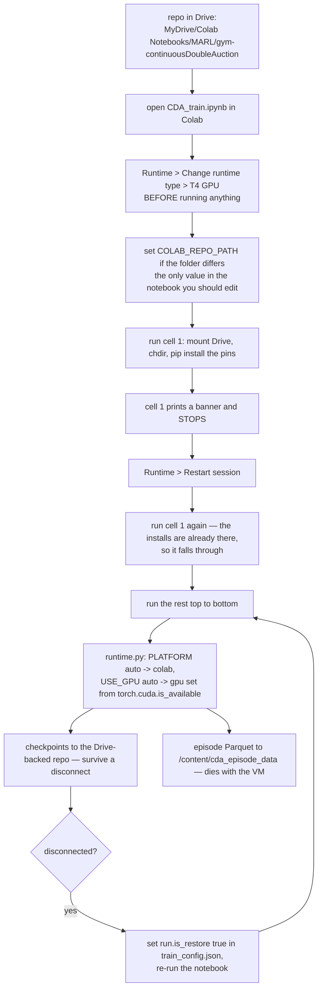

# 20. Google Colab

[`CDA_train.ipynb`](../gym_continuousDoubleAuction/CDA_train.ipynb) runs on a free Colab VM with no
edits beyond one path. This document covers getting there, the one restart Colab forces on you,
what to expect from the free tier, and how to survive a disconnect.

The docker image is the other supported target and is documented separately in
[19_docker.md](19_docker.md). Both read the same
[`config/runtime_profiles.json`](../config/runtime_profiles.json)
([18_configuration.md](18_configuration.md) §8), so a run means the same thing on either.

---

## 20.1 Quick start

1. **Put the repo in Drive.** Upload or `git clone` it into a folder in your Drive. The default the
   notebook expects is:

   ```
   MyDrive/Colab Notebooks/MARL/gym-continuousDoubleAuction
   ```

2. **Open `gym_continuousDoubleAuction/CDA_train.ipynb`** in Colab (File → Open notebook → Google
   Drive).

3. **Select a GPU runtime *before* running anything** — Runtime → Change runtime type →
   Hardware accelerator → **T4 GPU**. Changing it later restarts the kernel and discards
   everything the notebook has done.

4. **Set `COLAB_REPO_PATH` in the first cell** if your folder is not the default above:

   ```python
   COLAB_REPO_PATH = '/content/gdrive/MyDrive/<your path>/gym-continuousDoubleAuction'
   ```

   This is the only value in the notebook you should ever need to change. It cannot come from
   config, because it is how config is *found*.

5. **Run cell 1.** It mounts Drive (accept the permission prompt), changes to the repo, and installs
   the pinned packages. It will then stop and ask for a restart — see §20.2.

6. **Restart, run cell 1 again**, then run the rest of the notebook top to bottom.

`PLATFORM` and `USE_GPU` are both `'auto'` and should stay that way: Colab is detected from
`COLAB_RELEASE_TAG`, and the hardware set follows `torch.cuda.is_available()`.



---

## 20.2 The restart, and why it is not optional

Installing `ray[rllib]` moves packages Colab has already imported into the running kernel. Carrying
on in the same session is the classic Colab failure: imports that appear to succeed against
half-replaced modules, or a `numpy` ABI error several cells later that points nowhere useful.

So cell 1 installs, prints a banner, and stops:

```
========================================================================
Installed. Runtime > Restart session, then run this cell again.
========================================================================
```

Use **Runtime → Restart session**, not *Disconnect and delete runtime* — a restart keeps `/content`
and the Drive mount; deleting the runtime throws away the VM.

Re-running cell 1 after the restart is a **no-op**: it checks each pinned package with
`importlib.metadata.version` and installs only what is missing or at the wrong version, so the
second run prints `colab bootstrap : packages already present` and continues. The same is true of
every later session on the same VM.

### What gets installed, and what deliberately does not

`platforms.colab.pip_packages` in `runtime_profiles.json` lists `ray[rllib]`, `gymnasium`,
`sortedcontainers` and `tabulate`. **`torch`, `numpy`, `pandas` and `scikit-learn` are absent on
purpose.** Colab preinstalls all four, and this repo's pins would replace Colab's CUDA-enabled
torch build with a CPU wheel — you would install a GPU runtime and then train on the CPU. Do not
"fix" this by running `pip install -r requirements.txt` in the notebook.

---

## 20.3 What you should see

Cell 2 prints what it resolved. Three lines matter:

```
platform         : colab
hardware profile : gpu
ray.init         : {'ignore_reinit_error': True, 'include_dashboard': False, 'num_cpus': 2, 'num_gpus': 1}
```

**`hardware profile : cpu` on a GPU runtime** means `torch.cuda.is_available()` is False — you are
on a CPU runtime (step 3), or the accelerator was changed without a restart. Setting `USE_GPU=True`
will not fix it: it falls back to the `cpu` set and says so, rather than placing the learner on a
device that is not there.

Cell 4 then prints the resolved `TrainConfig`, including which fields the profile moved and where
output will go.

---

## 20.4 What the free tier gives you

A free Colab VM is **2 vCPUs** with a T4, which is exactly the ceiling the `gpu` parameter set is
written for: 2 env runners sampling in parallel, one in-process learner on the GPU.

**The GPU is not the bottleneck, and you should not expect it to be.** The environment matches
orders in Python; measured throughput is **~516 env-steps/sec on one core**, against a 256×256 MLP
update a T4 finishes in seconds. At the configured `max_step=4096` and 4 episodes per iteration:

| | Per iteration | 16 iterations (the configured run) |
|---|---|---|
| Env steps | 16,384 | 262,144 |
| Sampling, 1 core (`cpu` set) | ~32 s | ~9 min |
| Sampling, 2 runners (`gpu` set) | ~16 s | ~4 min |

Plus the PPO update and Ray overhead per iteration. **Budget 20–40 minutes** for the default
16-iteration run — dominated by CPU sampling either way. The GPU buys the update, not the run.

> Those are extrapolations from a measured single-core rate on a 2-CPU box, not a timing taken on
> Colab. Treat them as an order of magnitude.

**Session limits:** free Colab disconnects after ~90 minutes idle and caps sessions at ~12 hours.
The default run fits comfortably; a longer one may not — see §20.5.

---

## 20.5 Where output goes, and surviving a disconnect

The Colab platform entry splits the two output roots deliberately:

| Output | Goes to | Survives a disconnect |
|---|---|---|
| `results/chkpt` — the newest 3 checkpoints, saved every 2 iterations | the Drive-backed repo | **yes** |
| `episode_data/<run_id>/` — the per-step Parquet record | `/content/cda_episode_data` on the VM's local disk | no |

The reason is size. An episode is **~34MB at `max_step=4096` and 8 agents** (measured), so recording
all 64 episodes of a default run would write ~2.2GB. Pushing that through the Drive FUSE layer is
slow and eats your Drive quota; checkpoints are small and are the thing you actually need back.

`episode_sample_every` (default 10) records one episode in ten, which brings the default run to
~220MB, and `episode_max_bytes` (default 2GiB) caps what each writer keeps. If you do not want the
record at all, set `episode_data_dir` to `null` in the `league_self_play` group of
`config/train_config.json` — which now switches off the buffering as well as the files.

### Resuming after a disconnect

Checkpoints are on Drive, so a killed session is recoverable. Set `is_restore` to `true` in the
`run` group of `config/train_config.json`, then re-run the notebook:

```json
"run": {
  "is_restore": true,
  ...
}
```

`build_algo()` restores from the newest readable checkpoint when that flag is set, and starts from
scratch when there is none — so leaving it `true` is safe on a fresh machine, and there is no
notebook edit involved either way.

**The run picks up where it stopped.** `num_iters` is the iteration to train *through*, and RLlib
stores the iteration number in the checkpoint, so a 16-iteration run killed at 9 does 7 more, not
16 more. Reconnect as many times as Colab makes you: the run still ends at iteration 16. If it has
already reached the target it says so and exits without training. To extend a finished run, set
`num_iters_is_delta` true and `num_iters` to how many more you want.

League state survives the round trip — weights, the champion pool and the mapping function are all
restored, because the callback instance is cloudpickled with the algorithm
([16_verification_log.md](16_verification_log.md) §16.8). `build_algo()` returns that restored
callback, so the champion history you read from it is the one the algorithm is playing. A
`league_state.json` beside each checkpoint records the same thing in plain JSON; on restore it is
reconciled against the champion modules that actually came back, and the run prints either
`league state verified: N champion(s)` or the list of repairs it made.

**Do not change anything else in `train_config.json` in the same edit.** Restoring rebuilds the
algorithm from the config inside the checkpoint, so the file's `lr`, reward coefficients and batch
sizes are ignored — the run now prints a `WARNING` naming each one. Changing `num_agents` or
`n_hist` is refused outright, because the restored weights no longer fit. Only the `run` group
still applies to a restored run.

**A disconnect mid-save is recoverable.** Saves are staged and renamed, so a killed session leaves
either a complete checkpoint or an `iter_N.tmp` directory that is ignored; the last 3 checkpoints
are kept (`chkpt_keep`), and a restore that cannot read the newest falls back to the one before it.

**To resume from an older checkpoint** — a league that collapsed, a run you want to branch — name
it with `restore_path` in the same `run` group. `null`, the default, takes the newest, which is
what a disconnect wants:

```json
"run": {
  "is_restore": true,
  "restore_path": "results/chkpt/iter_00008"
}
```

It names one save, not the directory holding them; pointing at `results/chkpt` raises and lists
what is available. There is no separate notebook knob — `PLATFORM` and `USE_GPU` remain the only
two — but cell 4 prints the resolved `restore` line, so you can see which checkpoint a run will
pick up before starting it. See [18_configuration.md](18_configuration.md) §5.2.

---

## 20.6 Troubleshooting

| Symptom | Cause | Fix |
|---|---|---|
| `FileNotFoundError: [Errno 2] ... '/content/gdrive/MyDrive/...'` in cell 1 | `COLAB_REPO_PATH` does not exist — the `os.chdir` to it is the first thing that touches the path, so the error names it exactly. | Check it in the Drive file browser. It must be the folder containing `config/` and `setup.py`, not its parent, and Drive paths are case- and space-sensitive (`Colab Notebooks` has a space). |
| `FileNotFoundError` on `config/runtime_profiles.json` specifically | The chdir succeeded, so the path exists but is not the repo root. | Same fix: point at the folder containing `config/`. |
| `ModuleNotFoundError: gym_continuousDoubleAuction` in cell 2 | Cell 1 was skipped, or the restart was done without re-running it. | Run cell 1 again. It is a no-op if the packages are already there. |
| Cell 1 says "restart" every time | The install is failing, so the pins never match. | Read the `pip install` output above the banner. |
| `hardware profile : cpu` on a GPU runtime | Accelerator not selected, or selected after the kernel started. | Runtime → Change runtime type → T4 GPU, then re-run from cell 1. |
| Numpy/ABI errors, or odd import failures after installing | The restart was skipped. | Runtime → Restart session, then re-run from cell 1. |
| Drive mount prompt loops | Colab occasionally fails to mount on a recycled VM. | Runtime → Disconnect and delete runtime, then start over. |
| Training is much slower than §20.4 | Sampling is CPU-bound and the free tier gives 2 vCPUs; a busy VM gives less. | Expected. Lower `num_iters` or `max_step` in `train_config.json` for a shorter run. |
| `checkpoint is already at iteration N ... nothing to do` | `is_restore` is true and the run reached `num_iters` already. | Raise `num_iters`, or set `num_iters_is_delta` true to run that many more. |
| `WARNING: restoring keeps the checkpoint's own config` | Config values were edited in the same pass as `is_restore`. A restore rebuilds from the checkpoint's config. | Expected, and the message names every ignored key. To train with the new values, set `is_restore` false or point `log_base_dir` at a new directory. |
| `ValueError: Cannot restore: the configuration changes the shape of the problem` | `num_agents` or `n_hist` differs from the checkpoint, so the restored weights do not fit. | Revert the key, or start a fresh run. |
| `checkpoint unreadable ... falling back to the previous one` | The newest save was killed partway through, or written by a different Ray version. | None needed — the restore already stepped back one checkpoint. |
| `restore_path ... is not a checkpoint directory` | The path names the tree (`results/chkpt`) rather than one save inside it. | The message lists the checkpoints available, newest first. Copy one. |
| `restore_path is set ... but is_restore is false` | The two `run` keys disagree, so the pinned checkpoint would be ignored. | Set `is_restore` true, or `restore_path` back to `null`. |

---

## 20.7 Related

- [19_docker.md](19_docker.md) — the other supported target, and the one to prefer when you have a
  local GPU
- [18_configuration.md](18_configuration.md) §8 — the parameter sets both platforms select between,
  and the `$CDA_PLATFORM` / `$CDA_USE_GPU` overrides
- [09_distributed_training.md](09_distributed_training.md) §5.1 — why the `gpu` set is sized the
  way it is
- [11_logging_and_observability.md](11_logging_and_observability.md) — what training records while
  it runs
