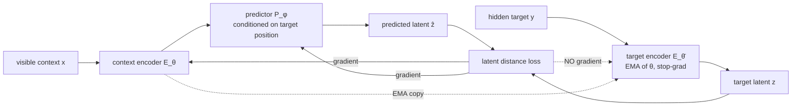
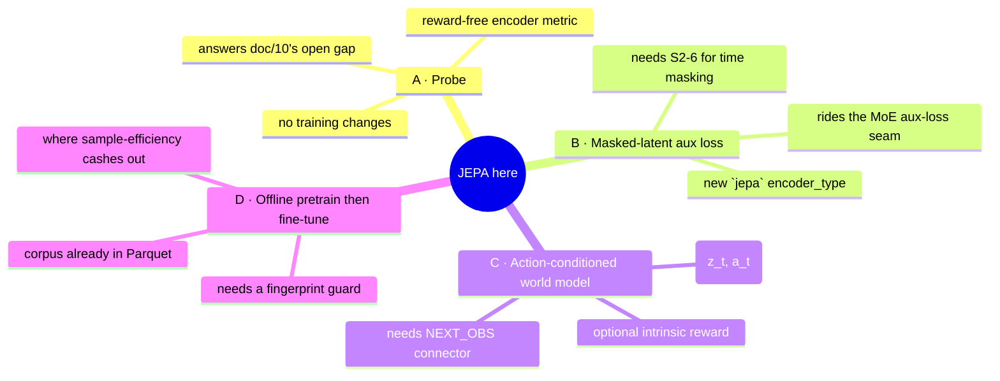
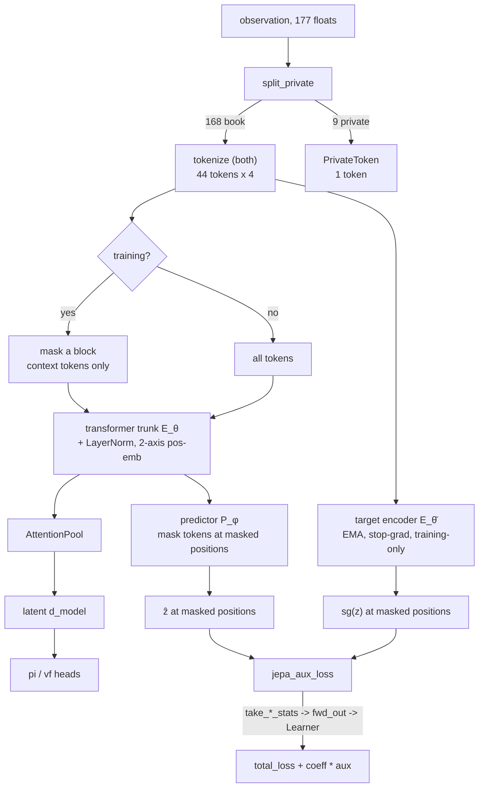
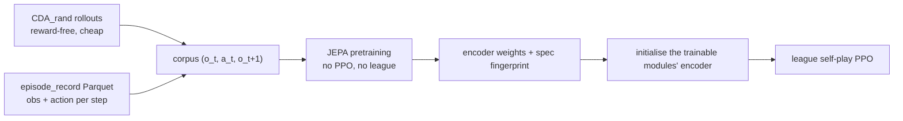

# 22. JEPA: What It Is and How It Could Serve This Project

A research note, not a change. It asks one question: **does the Joint-Embedding Predictive
Architecture family have anything to offer a closed, zero-sum, multi-agent limit-order-book
market whose agents are the only source of liquidity?**

The answer is a qualified yes, with the qualification doing real work. JEPA is a good fit for
*this observation* and a poor fit for *this reward*, and three of the four proposals below are
designed to exploit the first without depending on the second.

Related: [05_observation_space.md](05_observation_space.md) (what would be encoded),
[12_perspective_rl_researcher.md](12_perspective_rl_researcher.md) §2, §4, §6, §7 (the defects
this interacts with), [15_findings_and_recommendations.md](15_findings_and_recommendations.md)
(S1-1, S1-2, S1-3, S2-6), [18_configuration.md](18_configuration.md) §5.4–5.5 (the encoder group
and the comparison protocol), [10_testing.md](10_testing.md) §6.4 (the contract a new encoder
must meet).

---

## 1. What JEPA is

A Joint-Embedding Predictive Architecture predicts **in representation space**, not in input
space. Given a signal split into a visible context `x` and a hidden target `y`, it trains three
parts:

| Part | Symbol | Role |
|---|---|---|
| Context encoder | `E_θ` | Embeds the visible part |
| Target encoder | `E_θ̄` | Embeds the hidden part. Weights are an EMA of `θ`; **gradients are stopped** |
| Predictor | `P_φ` | Maps the context embedding, plus a description of *where* the target sits, to a predicted target embedding |

The loss is a distance between `P_φ(E_θ(x), pos_y)` and `sg(E_θ̄(y))`. Nothing reconstructs the
input.



**The degenerate solution is the whole design problem.** `E ≡ 0` makes the loss zero. The
asymmetry — EMA target plus stop-gradient — is the primary defence: the predictor is chasing a
target that keeps moving, which a constant encoder cannot satisfy while the EMA lags. It has
repeatedly been found insufficient on its own, and the standard reinforcements are VICReg-style
variance and covariance terms (keep per-dimension variance above a floor, decorrelate dimensions)
or an auxiliary supervised head that *anchors which distinctions the representation must keep*.

### 1.1 The family

| Variant | Signal | What is masked / predicted |
|---|---|---|
| I-JEPA | images | Several target blocks from one context block |
| V-JEPA / V-JEPA 2 | video | Spatiotemporal blocks; a video **world model** |
| V-JEPA 2-AC | video + robot actions | `z_{t+1}` from `(z_t, a_t)`; supports zero-shot planning by rolling the latent forward under candidate action sequences |
| TD-JEPA | RL transitions | Long-horizon latent dynamics via TD learning, from offline reward-free data |
| T-JEPA, TS-JEPA, Fin-JEPA | tabular, time series, equity features | Augmentation-free masked or next-latent prediction |

The two that matter here are **I-JEPA's masking discipline** (§4.2) and **V-JEPA 2-AC's
action-conditioning** (§4.3).

### 1.2 What JEPA is not

- Not an encoder architecture. It is a *training objective* that wraps one. The encoder underneath
  can be the transformer this repo already ships.
- Not a reward fix. It changes what the representation learns, not what the policy is paid for.
- Not generative. It cannot produce a book snapshot, only a latent one, so it cannot be used as a
  simulator — and this project already has a real matching engine, so it does not need to be.

---

## 2. Why this codebase is an unusually good fit

Five reasons, in descending order of strength.

### 2.1 The observation is already the grid JEPA masks

[`tokenize.py`](../gym_continuousDoubleAuction/train/model/encoders/tokenize.py) turns the book part of the
observation - 184 of its 193 floats, the private tail having been split off first - into
`(B, n_hist × (k_rows + 1), 4)` tokens whose position is a `(time, level)`
pair, and [`transformer.py`](../gym_continuousDoubleAuction/train/model/encoders/transformer.py)
already carries a **two-axis learned positional embedding** for exactly that grid. A JEPA
predictor needs precisely one thing the encoder does not: the ability to say "predict the latent
at position `(t, level)`". That is `time_embedding(t) + level_embedding(level)` — already
written, already tested (`test_both_is_time_major`).

The masking vocabulary falls straight out of the two axes:

| Mask | Predict from | The question it forces the encoder to answer |
|---|---|---|
| Deep levels, given the touch | levels 0–2 → levels 3–9 | What shape of book depth is consistent with this touch? |
| The touch, given the depth | levels 3–9 → levels 0–2 | Where should the best bid/ask be, given resting liquidity behind it? |
| One side, given the other | bids → asks | Is the book balanced? What does this imbalance imply? |
| The newest snapshot, given the older ones | `t-3..t-1` → `t` | Where is the book heading? |

Every one of those is a microstructure question, and none of them needs a reward.

### 2.2 Input-space reconstruction is the wrong objective here — measurably so

The standard alternative to JEPA is a masked autoencoder that reconstructs the hidden input. This
repo has already measured why that would fail. From
[18](18_configuration.md) §5.4, the per-channel standard deviations of a `both` token
`[bid_price, bid_size, ask_price, ask_size]` over 40 real steps are:

```
[1.27, 8.17, 0.046, 9.52]
```

The size channels are `√volume` and run ~200× the ask-price channel. A squared-error
reconstruction loss in input space is *dominated by size jitter* — the least predictable, least
economically meaningful quantity in the observation. It would spend the encoder's capacity
memorising queue noise.

JEPA's answer is structural rather than a matter of tuning: the target is produced by an encoder
that is itself being trained, so **anything genuinely unpredictable is free to be discarded from
the representation**, and the loss stops paying attention to it. This is the single strongest
argument for JEPA specifically, as opposed to self-supervision generally, in this environment.

### 2.3 The reward currently carries almost no signal, and JEPA does not need it

Three findings compound:

- **S1-1** — `vf_clip_param = 10` against NAV-scale targets pins `vf_loss` at the clip bound.
  `vf_explained_var ≈ 9e-05`. PPO is REINFORCE with a batch-standardised baseline.
- **S1-3** — the reward is strictly negative-sum over a NAV-conserving market. All-pass scores
  exactly `0.0`; random trading scores `−591,027`. Passivity is both a Nash equilibrium and the
  joint optimum.
- **§7** — the default budget is ~262k env steps against a realistic need of 10⁷–10⁸.

So the gradient currently reaching the encoder is a high-variance signal pointing at a degenerate
policy, delivered in small quantities. A latent-prediction loss is **dense (every token, every
step), always defined, and independent of the reward being correct**. It is the one training
signal in this system that is not downstream of S1-1 and S1-3.

That cuts both ways, and §3 is about the other way.

### 2.4 The auxiliary-loss seam already exists, built and documented

[`moe_learner.py`](../gym_continuousDoubleAuction/train/model/moe_learner.py) solves a problem
that took care to get right: `ActorCriticEncoder._forward` keeps only `ENCODER_OUT` and discards
every other key an encoder returns, so an auxiliary term cannot ride out of the encoder. The
existing chain is:

```
encoder stashes stats  →  take_moe_stats()  →  CDAPPOTorchRLModule._forward_train
    →  fwd_out[MOE_AUX_LOSS]  →  CDAPPOTorchLearner.compute_loss_for_module
    →  total_loss + coeff * aux
```

A JEPA encoder is the **second consumer of that seam**, and it is the second consumer that tells
you whether it should be generalised. Today the names are `moe_*` and `_collect` hard-codes the
MoE stat keys. Two encoders producing auxiliary losses is the point at which
`ENCODER_AUX_LOSS` / `ENCODER_AUX_METRICS` and a small per-encoder registry cost less than a
second parallel chain named `jepa_*`. This is a refactor the JEPA work would pay for, not a cost
it would impose.

### 2.5 An unlabelled corpus already exists, in a queryable format

[`episode_record.py`](../gym_continuousDoubleAuction/train/episode_record.py) writes one Parquet
row per `(episode, step, agent)` with a declared schema that includes:

```
episode_id : string      step : int32       agent_id : string
obs        : list<float> action : list<double>
```

Sorted by `(episode_id, step)` that is exactly `(o_t, a_t, o_{t+1})` — the tuple a JEPA world
model trains on — readable by `ray.data.read_parquet`, pandas or DuckDB without this package
installed. Additional reward-free data is free from
[`CDA_rand.py`](../gym_continuousDoubleAuction/CDA_rand.py), which runs uniformly-random agents
against the real matching engine.

The pretraining corpus is not a thing that would need building. It is a thing that would need
*reading*.

---

## 3. Where the fit breaks — read this before §4

Four objections. None is fatal; all change what may honestly be claimed.

### 3.1 A better encoder makes a better do-nothing agent — **prerequisite met**

> **Status.** S1-1 and S1-3 are fixed ([17](17_changelog.md) §29), so this no longer blocks
> anything. It is kept because it is the reason the ordering in §7 is what it is, and because the
> *measurement* it warns about is still unmade.

While S1-1 and S1-3 stood, the policy gradient pointed at passivity. A JEPA-pretrained encoder
that perfectly represents book dynamics, attached to a policy being paid to stop trading, learns
to stop trading with an excellent internal model of what it is declining to do. Any measured
"win" would have been an artefact.

This is the same trap [18](18_configuration.md) §5.5 already warns about for architecture
comparisons, one level deeper. **S1-1 and S1-3 were prerequisites for the RL-facing proposals
(§4.3, §4.4), and were not prerequisites for the evaluation-facing ones (§4.1, §4.2)** — which is
why the probe harness could be built and used first. The gate is now open and unwalked: no
multi-seed training comparison has been run, so nothing yet says whether a JEPA encoder makes a
better *trader*. §5.5's protocol is what would answer it.

### 3.2 The observation had no private state — **mostly fixed**

> **Status.** S1-2 is closed for inventory, cash, NAV, drawdown, VWAP and time remaining: the
> observation carries a 9-float private tail ([17](17_changelog.md) §30). **Resting orders are
> still absent**, so the third bullet below is half-collected and the first still stands.

S1-2: every agent received the byte-identical public book vector — `distinct obs vectors across
agents: 1`. A JEPA world model over *that* observation modelled the market's evolution and could
not represent inventory, VWAP, NAV, drawdown or resting orders, because none of them was in its
input.

Consequences, and where each now stands:

- **Still open.** The latent cannot fully support the four of nine action categories (`modify`,
  `cancel`) that stay partly blind: an agent sees `cash_on_hold` but not *which* orders that cash
  is committed to.
- **Unchanged, and not a defect.** An action-conditioned predictor (§4.3) conditioned on *this*
  agent's action is fitting the conditional expectation over seven unobserved opponent actions.
  Its loss has a nonzero floor, and that floor is the residual multi-agent stochasticity rather
  than underfitting — §33.4 of [17](17_changelog.md) says the same about the shipped world model.
- **Collected.** With the private block in place, action-conditioning is now the materially more
  interesting object it promised to be: "what does the book — and my position — look like after I
  send this order" is a *market-impact* model, which is the quantity the project exists to study.

### 3.3 The per-frame normalizer contaminates a predictive target

S2-6: each stacked frame is normalised by its **own** L1 midpoint `M_t`, so a price at `t-3` and
the same price at `t` have different encodings. For a *classification*-flavoured encoder that is a
nuisance. For a *predictive* objective it is worse: "predict the latent of frame `t` from frames
`t-3..t-1`" partly means "predict the renormalisation", and the predictor can score well by
modelling an artefact of the observation pipeline rather than the market.

`log_mid` is in the observation, so `M_t` is recoverable and the artefact is learnable rather than
information-destroying — which is precisely the problem. **Fix S2-6 (normalise the whole stack by
the current `M_t`) before running any time-axis masking**, or the ablation in §4.2 will not mean
what it says.

### 3.4 The scale is small, and JEPA's evidence is at scale

44 tokens of 4 channels; encoders of 225k–1.4M parameters ([18](18_configuration.md) §5.5). The
JEPA results that made the architecture interesting are at internet scale — V-JEPA 2 on over a
million hours of video. The nearest published analogues in this domain are small on purpose:
Fin-JEPA is a 367K-parameter PriceEncoder plus causal-transformer predictor over daily equity
features, and reports beating an identity baseline by 10.1% — a real result, and a modest one.

Expect a modest effect, size it against parameter count and throughput as §5.5 requires, and do
not write the press release first.

---

## 4. Four proposals, cheapest first



### 4.1 Proposal A — JEPA as an evaluation instrument (no training changes)

[10](10_testing.md) §7 records the gap plainly: *"No encoder is tested for whether it learns…
Nothing runs long enough to say whether the transformer or the LSTM beats the MLP, which is the
question the `encoder` group exists to answer."* And §3.1 above says the reward cannot settle that
question while S1-1 stands.

A JEPA-style latent-prediction score settles it **without** the reward:

1. Take any trained (or randomly initialised) encoder and freeze it.
2. Fit a small predictor head on frozen latents to predict held-out targets: the masked-block
   latents of §2.1, and directly interpretable microstructure quantities at `t+k` — mid-price
   move, spread, depth imbalance, realised volatility, whether a trade occurs.
3. Report the probe's score.

This is cheap (no PPO involvement), reward-free (immune to S1-1/S1-3), and it converts
[18](18_configuration.md) §5.5 from a protocol with no metric into one with a metric. It also
serves the project's stated goal directly: §1.3 frames this as a *microstructure emergence study*,
and emergence is currently reported only through NAV and trade counts. A linear probe for
order-flow imbalance or price impact on a learned latent is evidence about what the agents have
come to represent — which is a stronger claim about emergence than a P&L table.

**Implemented.** `train/probe/`, documented in [23_probe_harness.md](23_probe_harness.md). No
changes to `train.py`, the encoder registry, or the league — it builds encoders through
`build_trainable_module_spec`, freezes them, and reads them.

### 4.2 Proposal B — a `jepa` encoder with a masked-latent auxiliary loss — **implemented**

Register a new `encoder_type: "jepa"` that is the existing transformer plus a training-only
head, and let PPO and the JEPA objective share one trunk.



**Wiring, concretely.** Everything below already has a precedent in the repo:

| Piece | Where it goes | Precedent |
|---|---|---|
| `JEPA_DEFAULTS` + `@register("jepa", …)` | `encoders/jepa.py` | `moe_transformer.py` |
| Config block | `encoder_specs.jepa` in `train_config.json` | a block existing is the signal the encoder is implemented |
| Aux loss out of the encoder | `take_jepa_stats()` → `fwd_out` → Learner | `take_moe_stats`, `moe_learner.py` |
| Mask-position conditioning | reuse `positional_index()` | `transformer.py` |
| Per-encoder `lr` | `COMMON_SPEC_KEYS` | already central |

**Five details that decide whether it works:**

1. **Do not double the loss.** `vf_share_layers` is `false`, so the actor and critic are
   *separate* encoder instances. `_collect` in `moe_learner.py` walks
   `("encoder", "actor_encoder", "critic_encoder")` and the MoE term had to be *averaged*, not
   summed, precisely because the critic's blocks would otherwise silently double it. A JEPA loss
   must be computed on **one** branch — the actor's — or it inherits the same confound.
2. **Declare the training-only parts.** `DefaultPPOTorchRLModule.get_non_inference_attributes()`
   returns `["vf"] + (["encoder.critic_encoder"] if not vf_share_layers)`. The EMA target encoder
   and the predictor are training-only and must be added, or every champion snapshot and every
   inference-only copy carries a duplicate encoder it never runs. Note that
   `test_non_inference_attributes_contract` asserts that exact two-element list today, so it would
   have to become encoder-aware — a deliberate change, not an incidental one.
3. **Keep the EMA buffer out of the optimiser** and *inside* the `state_dict`, so
   `test_state_round_trips` and the champion-snapshot path keep passing.
4. **Eval must be deterministic.** `test_eval_forward_is_deterministic` exists because PPO's ratio
   compares a rollout log-prob against a recomputed one. Mask sampling is stochastic, so masking
   must be **strictly off outside `_forward_train`** — the inference path sees all tokens. This is
   a harder constraint than dropout's and the reason the diagram branches on `training?`.
5. **Log the collapse metric.** `moe_learner.py` logs `moe_max_expert_share` with a documented
   rationale: *"a collapsed MoE and a working one have identical losses and identical
   throughput."* A collapsed JEPA is worse — its aux loss goes to **zero**, which reads as
   success. Log the mean per-dimension standard deviation of the target latents
   (`jepa_latent_std`) and the off-diagonal covariance magnitude, and add a VICReg variance hinge
   to the loss. Without that metric this proposal is untestable in the way that matters.

**Expected effect:** a better-conditioned trunk and a dense gradient that survives S1-1. Not a fix
for S1-3.

**As built.** `encoders/jepa.py` plus `train/model/jepa_learner.py`, and nothing else on any other
encoder's path — verified by `git diff` over the eight shared files, which is a test in
`TestOtherEncodersAreUnaffectedByJEPA`.

Two things came out differently from this section's plan, both for the better:

- **The aux-loss seam was not generalised.** §3a proposed renaming `moe_learner` into a shared
  seam, on the reasoning that two consumers is when that pays. It would have edited code on every
  custom encoder's path, which the isolation requirement forbids. `JEPARLModule` and
  `CDAJEPALearner` *subclass* the MoE ones instead, so `CDAJEPALearner` still adds the MoE term and
  a league mixing the two works. The refactor remains the better design in the abstract and is
  still available later.
- **The encoder composes rather than subclasses `TorchTransformerEncoder`.** Subclassing would have
  needed an `_encode_tokens()` hook extracted from the parent that `moe_transformer` inherits.
  Instead `jepa.py` imports `tokenize`, `positional_index`, `TransformerBlock`, `AttentionPool` and
  `PrivateToken` as they stand and duplicates ~15 lines of the forward sequence. That duplication
  is the price of the isolation, paid deliberately.

An encoder can now declare its own RLModule and Learner through `@register(module_class_path=…,
learner_class_path=…)`. Nothing else declares either, so every previously registered encoder
resolves to exactly the classes it resolved to before — which is what made this additive.

**What the probe says so far.** Scored against `mlp` and `transformer` on the reward-free targets,
`jepa` is competitive and wins nothing decisively. That is the expected reading rather than a
disappointment: the probe scores encoders **untrained**, so it is measuring JEPA's *architecture* —
which is essentially the transformer's — and not its *objective*, which has had no chance to train.
Scoring the objective needs `--checkpoint` after a real run, or Phase 4's pretraining.

### 4.3 Proposal C — an action-conditioned latent world model — **implemented**

The V-JEPA 2-AC analogue, and the proposal most specific to what this project is *for*. Predict
`ẑ_{t+1} = P_φ(z_t, a_t)` against `sg(E_θ̄(o_{t+1}))`, where `a_t` is this agent's `Dict` action.

The learned object is **the latent market impact of an order** — how the book responds to a
market order versus a passive quote versus a cancel. That is a first-class microstructure
quantity, and this environment can generate it endogenously, which is exactly the setting §1.3
describes.

**What it needs that the repo does not have:**

- `Columns.NEXT_OBS` in the learner batch. PPO does not add it. Ray 2.56.1 ships
  `AddNextObservationsFromEpisodesToTrainBatch`; it is attached via
  `config.learners(learner_connector=…)`. **[verified present in the pinned Ray]**
- An action embedding for the `Dict` action space: `category` (9) and `price` (10) and
  `price_offset` (3) as embeddings, `size_mean` / `size_sigma` as scalars. Note S3-1/S3-2 — half
  of `size_mean` is a no-op and `size_sigma` is inert — so two of the five components carry less
  information than their shape suggests.
- Care at episode boundaries: `o_{t+1}` across a `truncated` step is the next episode's reset
  observation and must be masked out of the loss.

**As built.** `world_model: true` in the `jepa` spec block. `train.py` attaches RLlib's
`AddNextObservationsFromEpisodesToTrainBatch` only when that is on, through
`encoders.needs_next_obs`, so no other architecture pays for the extra column. The encoder reads
`NEXT_OBS` and `ACTIONS` straight off the batch it is already handed, and returns no world-model
term at all when they are absent — which is every path but the connector-fed training one, and is
why `compute_values` and a hand-built batch keep working.

The prediction reuses the trunk output already computed for the policy latent, so the term costs
one extra *target* pass rather than two more. Its target is mean-pooled rather than run through
`self.pool`: the pool is trained by the policy gradient, and putting it inside the target path
would make the world model's target move for reasons unrelated to the market.

**The optional, and more speculative, extension.** The predictor's error is a curiosity signal.
RLlib ships the pattern as a learner connector that adds
`intrinsic_reward_coeff * fwd_out[Columns.INTRINSIC_REWARDS]` into `Columns.REWARDS`
**before** GAE runs
(`ray/rllib/examples/learners/classes/intrinsic_curiosity_learners.py`). Passing is the action
whose latent consequence is most predictable, so curiosity pushes *against* the S1-3 equilibrium.

Three honest caveats on that extension:

1. It is a patch over a reward-design bug. Fix S1-3 properly (drawdown as an increment, costs in
   bps, drop the asymmetric multiplier) rather than paying the agent to be surprised.
2. It breaks return comparability across the league — already S3-12 — and any module with a
   different coefficient is on a different scale.
3. The connector must skip `RandomRLModule` opponents entirely: `_forward_train` raises by design.

### 4.4 Proposal D — offline pretraining, then fine-tune — **implemented**

Where the sample-efficiency claim actually cashes out against §7's "262k steps is a smoke-test
budget".



**Why the corpus is nearly free:** §2.5. Sorting the Parquet by `(episode_id, step)` yields the
transition tuples; the observation is shared across agents (S1-2), so deduplicate on
`(episode_id, step)` or the corpus is 8× redundant — a redundancy that would otherwise silently
inflate the apparent dataset size by the agent count.

**Distribution shift is the main risk.** A book made by uniformly-random agents does not look like
a book made by a trained league — different spreads, different depth, different arrival
intensity. Pretraining only on `CDA_rand` output would fit the wrong market. Mitigation: refresh
the corpus from league episodes as training proceeds (`sample_every` already exists on the
recorder), or treat random-agent data as a warm-start only.

**The guard this repo's discipline demands.** `encoder_type` and `encoder_spec` are
`STRUCTURAL_CONFIG_KEYS`, and `_encoder_fingerprint` exists because reading a model config with
`getattr` alone silently reported the `mlp` default from the first champion onward — disabling the
structural check for the rest of the run. Pretrained weights are subject to exactly that failure
mode: loading a `d_model: 128` checkpoint into a `d_model: 256` encoder must be a hard error.
**Write the encoder fingerprint beside the pretrained weights and refuse a mismatch**, on the same
principle and preferably through the same function.

---

## 5. What would have to be measured

A JEPA change that is not measured against these is not evidence.

| Metric | Where | Why it must exist |
|---|---|---|
| `jepa_aux_loss` | Learner, per module | The term itself. Meaningless alone — see the next row |
| `jepa_latent_std` | Learner, per module | **Collapse detector.** A collapsed JEPA has aux loss → 0, which looks like success. This is the direct analogue of `moe_max_expert_share` and exists for the identical reason |
| `jepa_latent_offdiag_cov` | Learner, per module | Dimensional collapse: variance held up while dimensions become redundant |
| `vf_explained_var` | already logged | S1-1's tell. If this is still ~0, no encoder result means anything |
| Probe score (§4.1) | offline | Reward-free encoder quality, comparable across architectures |
| Parameter count | already logged at startup | §5.5 point 4. A win at 2× the parameters is a different claim |
| `env steps sampled` / iteration | already logged | The other half of that claim |

And the protocol from [18](18_configuration.md) §5.5 applies unchanged: pin `seed`, run at least
three per architecture, separate runs never a resume, and either re-tune `lr` per architecture or
say plainly that you did not.

---

## 6. Honest assessment

**What JEPA plausibly buys here**

- A dense, reward-independent training signal for the encoder — the only one in the system that
  is not downstream of the broken critic.
- An objective whose *structural* design discards unpredictable size jitter, which the measured
  channel statistics say is the dominant failure mode of the obvious alternative.
- A reward-free metric for the encoder comparison the `encoder` group exists to enable and that
  [10](10_testing.md) §7 records as untested.
- An explicit model of order → book response: a microstructure object the project is aimed at and
  currently does not produce.
- Reuse of a seam that already exists, plus the second consumer that justifies generalising it.

**What it does not buy**

- Nothing about S1-1, S1-3, S2-1 or S2-3. The reward stays negative-sum and the critic stays flat.
- Nothing about S1-2. A world model over a shared public observation cannot represent private
  state, so `modify` and `cancel` stay blind.
- No large effect should be expected at 44 tokens and ~10⁵–10⁶ parameters. The comparable
  published result on financial series is a ~10% improvement over an identity baseline from a
  367K-parameter model.

**The one-line verdict.** JEPA is the *right* self-supervised objective for this observation and
the wrong first thing to spend effort on. Items 1–3 of
[12](12_perspective_rl_researcher.md) §9 come first. But Proposal A is independent of all of them
and answers a question the project has already written down and cannot currently answer — so it
is the piece worth starting.

---

## 7. Suggested sequence

| Step | Work | Depends on | Effort |
|---|---|---|---|
| 0 | S1-1 (`vf_clip_param` / reward scaling), S1-3 (reward sign), S2-6 (shared normalizer) | — | S–M |
| 1 | ~~**Proposal A** — offline probe harness and reward-free encoder scores~~ — **done**, see [23](23_probe_harness.md) | **nothing** | S |
| 2 | Generalise the aux-loss seam: `ENCODER_AUX_LOSS`, encoder-aware `_collect` and `get_non_inference_attributes` | — | S |
| 3 | ~~**Proposal B** — the `jepa` encoder~~ — **done**, all three mask axes | — | M |
| 4 | Time-axis masking in Proposal B | 0 (S2-6), 3 | S |
| 5 | ~~**Proposal D** — offline pretraining, with a fingerprint guard~~ — **done**, see [24](24_pretraining.md) | 3 | M |
| 6 | ~~**Proposal C** — action-conditioned world model~~ — **done**, `world_model: true` | 0, 3 | M–L |
| 7 | Intrinsic reward from predictor error | 0, 6 | M, and only if S1-3 is genuinely fixed first |

Steps 1 and 2 are worth doing whatever is decided about the rest: one closes a documented testing
gap, and the other is a refactor the second auxiliary loss makes overdue.

---

## 8. Sources

- [V-JEPA 2 — Meta AI Research](https://ai.meta.com/research/vjepa/)
- [V-JEPA: The next step toward advanced machine intelligence](https://ai.meta.com/blog/v-jepa-yann-lecun-ai-model-video-joint-embedding-predictive-architecture/)
- [I-JEPA: the first AI model based on Yann LeCun's vision](https://ai.meta.com/blog/yann-lecun-ai-model-i-jepa/)
- [TD-JEPA: Latent-predictive Representations for Zero-Shot Reinforcement Learning](https://arxiv.org/abs/2510.00739)
- [Why and How Auxiliary Tasks Improve JEPA Representations](https://arxiv.org/abs/2509.12249)
- [T-JEPA: Augmentation-Free Self-Supervised Learning for Tabular Data](https://arxiv.org/pdf/2410.05016)
- [Fin-JEPA: Joint-Embedding Predictive Representation Learning for Financial Time Series](https://papers.ssrn.com/sol3/papers.cfm?abstract_id=6855118)
- [Representation Learning of Limit Order Book: A Comprehensive Study and Benchmarking](https://arxiv.org/abs/2505.02139)
- [Connecting Joint-Embedding Predictive Architecture with Contrastive Self-Supervised Learning (NeurIPS 2024)](https://proceedings.neurips.cc/paper_files/paper/2024/file/04a80267ad46fc730011f8760f265054-Paper-Conference.pdf)
- [JEPA: Fundamentals, Mathematics, and Literature Review — University of Tartu](https://kodu.ut.ee/~hadachi/Lecture_Notes/JEPA.html)
- [awesome-jepa — curated JEPA resources](https://github.com/AbdelStark/awesome-jepa)
