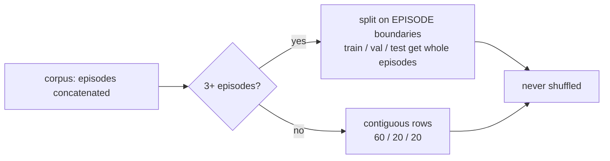

# 23. The Reward-Free Probe Harness

`train/probe/` scores what an observation encoder has learned to represent, **without going
through the reward**. It is the implementation of Proposal A in
[22_jepa_integration.md](22_jepa_integration.md) §4.1.

Related: [10_testing.md](10_testing.md) §7 (the gap this closes),
[18_configuration.md](18_configuration.md) §5.4–5.5 (the encoder group and the comparison
protocol this supplies a metric for),
[05_observation_space.md](05_observation_space.md) (what the targets are read out of),
[15_findings_and_recommendations.md](15_findings_and_recommendations.md) (S1-1, S1-2, S1-3).

---

## 1. The question it answers

[10](10_testing.md) §7 states the gap:

> **No encoder is tested for whether it *learns***. §6.4 proves every encoder builds, trains for
> an iteration, checkpoints and survives a champion snapshot — mechanics, not merit. Nothing runs
> long enough to say whether the transformer or the LSTM beats the MLP, which is the question the
> `encoder` group exists to answer.

The obvious way to close it — train each architecture, compare returns — could not work when this
was written. Both blockers below are now fixed ([17](17_changelog.md) §29), so the strong form of
the question is open; what remains is that no multi-seed comparison has actually been run. The
harness is still the cheaper way in, because it does not need one.

| Finding | Consequence for an architecture comparison |
|---|---|
| **S1-1** | `vf_clip_param = 10` against NAV-scale targets pins `vf_loss` at the clip bound. `vf_explained_var ≈ 9e-05`. PPO is REINFORCE with a batch baseline |
| **S1-3** | The reward is strictly negative-sum over a NAV-conserving market; all-pass scores exactly `0.0` and random trading `−591,027`. Passivity is the joint optimum |

Run an encoder comparison through that reward and the winner is whichever architecture descends
fastest to doing nothing. This harness asks a narrower question that does not touch the reward:

> **How much microstructure does the latent make linearly available?**

Freeze an encoder, fit a ridge readout from its latents to a public quantity a few steps in the
future, score it held out. No policy, no reward, no value function — so the answer stays valid
however S1-1 and S1-3 are eventually fixed.

---

## 2. Running it

```bash
python -m gym_continuousDoubleAuction.train.probe
python -m gym_continuousDoubleAuction.train.probe --encoders mlp transformer lstm moe_transformer
python -m gym_continuousDoubleAuction.train.probe --parquet <log_dir>/episodes
python -m gym_continuousDoubleAuction.train.probe --checkpoint <chkpt>/iter_12 --module-id policy_0
```

Defaults live in [`config/cli_defaults.json`](../config/cli_defaults.json) under `cda_probe`; this
module holds no literal default, on the same rule as `CDA_rand`. The report goes to the logger, so
it also lands in `run.log`; `--out` writes it to a file as well.

| Flag | What it selects |
|---|---|
| `--encoders` | Architectures scored **untrained** — the inductive-bias baseline |
| `--checkpoint` / `--module-id` | A trained module, scored alongside them |
| `--targets` / `--horizons` | Which microstructure quantities, how far ahead |
| `--episodes` / `--steps` / `--agents` / `--seed` | The random-agent rollout corpus |
| `--parquet` / `--max-rows` | Use `episode_record` output instead of rollouts |

---

## 3. How to read the output

```
| target        | h | metric | rows | raw     | mlp     | transformer | best        |
|---------------|---|--------|------|---------|---------|-------------|-------------|
| mid_return    | 1 | r2     | 2400 | -0.0013 | -0.0013 | -0.0013     | tie         |
| spread_change | 1 | r2     | 2400 | +0.0071 | +0.0775 | +0.1457     | transformer |
| two_sided     | 1 | bal.ac | 2400 | +0.4994 | +0.9987 | +0.9981     | tie         |
```

**Read a row, never a cell.** Scores are not comparable across targets — an R² and a balanced
accuracy are different quantities — and are comparable across feature sets only because every set
is fit on identical rows with an identical split and an identical ridge grid.

Three kinds of column, and the comparison needs all three:

| Column | What it is | Why it must be there |
|---|---|---|
| `raw` | The observation itself, all 177 floats | The floor. Every latent is a *function* of this vector |
| `<encoder>` | That architecture **at initialisation** | The inductive-bias term: tokenisation, the two-axis positional encoding and the input LayerNorm, before any training |
| `<module>@ckpt` | The same architecture with trained weights | Trained minus untrained is what training actually taught it |

**Reporting a trained encoder without its untrained twin is the mistake the harness is shaped to
prevent.** [18](18_configuration.md) §5.5 already warns that comparing architectures at one
learning rate measures the learning rate; comparing a trained encoder against only `raw` has the
same shape, and credits the architecture with whatever its initialisation was already worth.

Two cell values are not numbers:

- **`-`** — that set could not be scored *at all* (too few rows for three splits), not that it
  scored zero.
- **`tie`** in the `best` column — the top two are within `TIE_MARGIN` (0.005), which is inside
  the harness's own run-to-run variation. A different seed reorders them.

A whole (target, horizon) that nothing could score is **dropped**, not rendered as a row of floor
values. A target with one class or no variance is a fact about the corpus; printed beside real
results it reads as a fact about the encoders.

---

## 4. Why the probe is linear

This is the load-bearing design decision, so it is worth stating plainly.

An encoder's latent is a **deterministic function of the observation it was computed from**. A
probe with enough capacity therefore scores identically on the latent and on `raw` — it would just
re-derive the encoder — and the comparison would measure the probe.

A **linear** probe cannot do that. It can only read what the encoder has already made linearly
separable. So:

> "the latent beats `raw` under a linear readout" **is** the claim that the encoder reorganised the
> information rather than merely preserving it.

Raising the probe's capacity would not make a result stronger. It would make it vacuous.

Ridge, closed-form, follows from the same reasoning: `w = (X'X + λI)⁻¹X'y` is deterministic, has
one hyperparameter, and needs no optimiser, learning rate or epoch count. Every one of those would
otherwise be a knob tuned per feature set — and tuning per feature set is how a comparison quietly
starts measuring the tuning. `λ` is chosen on a validation split from a fixed grid, identically for
every feature set and every target.

The grid reaches `1e7` deliberately. `raw` is 168 standardised features, and a short corpus gives a
few hundred training rows; under-regularised, that fit scores an R² of **−125** and the report ranks
overfitting rather than representation. With the grid reaching far enough the validation split
simply declines those fits and the score falls back toward 0 — the honest answer for "these
features carry nothing usable at this sample size".

---

## 5. The splits



**Never shuffled.** Rows are consecutive book states: `obs[t]` and `obs[t+1]` share three of their
four snapshots. A shuffled split puts near-duplicates of a test row in the training set, and the
number reported is then a memorisation score. This is the single easiest way to get a spectacular
and meaningless result out of this harness.

**On episode boundaries where possible**, which is strictly stronger. It removes the adjacent-row
leak at the seams entirely, and gives the test split its own random price anchors — each episode
draws one on reset — so the score measures generalisation to an unseen market rather than to the
tail of a market already trained on.

`int(g × fraction)` alone starves a split at small group counts: at three episodes it allocates
1 / 0 / 2 and the validation split is empty, so the episode split would silently never engage at
exactly the sizes a quick run uses. Train and validation each therefore take at least one episode,
with test keeping the remainder.

---

## 6. The targets

Every target is a **public microstructure quantity read out of a future snapshot** — nothing is a
reward, a NAV, or a policy output.

| Target | Kind | Definition |
|---|---|---|
| `mid_return` | regression | `log_mid[t+k] − log_mid[t]` |
| `mid_moves` | binary | whether the L1 midpoint changes at all |
| `spread_change` | regression | change in `log1p(spread in ticks)` |
| `imbalance_change` | regression | change in signed depth imbalance |
| `two_sided` | binary | whether a two-sided market exists at `t+k` |
| `realized_vol` | regression | dispersion of the per-step midpoint changes over `(t, t+k]`. Needs `k ≥ 2` |

**Differences, not levels, wherever a level would be trivially persistent.** A target that barely
changes over `k` steps is predicted almost perfectly by *any* feature set including `raw`, and so
separates none of them. `two_sided` is the one retained level, kept because it is the regime
indicator the others are conditional on.

`log_mid` is why a price target is expressible at all: midpoint normalisation throws the price
level away everywhere else in the snapshot, so without that scalar a market at 10 and one at 100
would be indistinguishable and "did the price move" would have no answer
([05](05_observation_space.md) §2).

**Targets read the newest *book* frame, not the end of the observation.** An observation ends with
the per-agent private block, so `corpus.snapshots` slices against `layout.book_flat_dim`. Slicing
off the end would hand every target the private tail plus a truncated snapshot — an array of the
right shape with every field misaligned.

Private state is deliberately *not* a target. These score how well an encoder represents **the
market**, and an agent's own inventory is an input to the encoder, not a fact about the book. A
target read from the private block would be scoring the encoder on copying its own input.

**Episode boundaries are masked out.** A return read across a reset is a jump between unrelated
random price anchors — the largest "signal" in the corpus, and entirely artificial.

Adding one is a `@register` decorator and a function of `(snapshots, layout, horizon)`; the
parametrised test picks it up automatically.

---

## 7. The corpus

| Source | Command | What it is |
|---|---|---|
| Rollouts (default) | *(none needed)* | The real env stepped by uniformly-random agents, as `CDA_rand` does. Self-contained: no prior training run, so a probe can be scored on a fresh clone |
| Parquet | `--parquet <dir>` | What `episode_record` wrote during a real training run |

They are **not interchangeable**. A book made by uniformly-random agents does not look like a book
made by a trained league — different spreads, different depth, different arrival intensity — so an
encoder scored on random-agent data is being asked how well it represents a market it will never
see. Rollouts are the default because they always work; Parquet is the one to use once a run exists.

### Which rows the Parquet reader keeps, and why the answer changed

`episode_record` writes one row per `(episode, step, agent)`, so a file from an 8-agent run holds
eight rows per step. The reader keeps one per `(episode_id, step)` by default, and the rollout
reader likewise keeps one agent.

The *reason* for that default has changed, and the change matters. While S1-2 was open every agent
received the byte-identical public book vector, so the eight rows were exact duplicates: keeping
one discarded nothing and avoided a leak, because a row's duplicates would otherwise land on both
sides of the split. **That premise no longer holds.** [17](17_changelog.md) §30 gave each agent its
own private tail, so the eight rows now differ in their last `private_dim` floats. Keeping one is
therefore a real choice — it drops seven agents' private state — and it is still the right default
for the public-book targets this harness scores, none of which read the private tail.

Pass `--per-agent` (or `per_agent=True` to `from_parquet`) to keep every row. Do that when the
private block is the subject, and be aware of what you are buying: the eight rows at a step share an identical book prefix, so a split
that separates them still leaks the book. Episode-level splitting (§5) is what contains that, and
it is applied either way.

This is the sort of thing a comment gets to be quietly wrong about for a long time. It was found by
the review in [17](17_changelog.md) §34.5 — a regression introduced by the private-state work
itself, which fixed the reader's `snapshots` slice and left the row selection reasoning behind it
untouched.

---

## 8. What it does not tell you

It says nothing about whether an encoder makes a better **trader**. A latent that linearly carries
the next midpoint move is evidence that the architecture represents the market, not that PPO can
exploit it. That second question needed S1-1 and S1-3 fixed first; both are now fixed
([17](17_changelog.md) §29), so it is answerable for the first time — but answering it means a
multi-seed training comparison under [18](18_configuration.md) §5.5, not a probe report. This
harness is deliberately independent of the reward, which is why its own answer survived those
fixes unchanged.

It is also scored on a corpus, and a corpus has a distribution. A win on random-agent rollouts is a
win on random-agent books.

---

## 9. Layout

| Module | Owns |
|---|---|
| `corpus.py` | The observation stream: rollouts, Parquet, deduplication, episode marking |
| `targets.py` | The microstructure targets and the episode-boundary masking |
| `features.py` | `raw`, frozen latents from a built or restored module, checkpoint resolution |
| `probe.py` | The ridge readout, its splits, its metrics, its degeneracy checks |
| `report.py` | The (feature set × target) matrix and its rendering |
| `__main__.py` | The CLI |

Tests: [`test/test_probe.py`](../gym_continuousDoubleAuction/test/test_probe.py) (41, the
arithmetic, on synthetic observations) and
[`test/integration/test_probe_harness.py`](../gym_continuousDoubleAuction/test/integration/test_probe_harness.py)
(25, against the real env, every registered encoder, and a real checkpoint).
