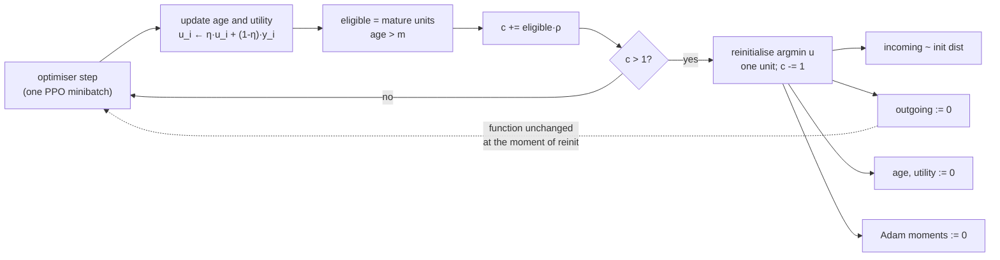

# 25. Continual Backprop: What It Is and How It Could Serve This Project

It asks one question: **does Continual Backprop — backprop plus the continual, selective
reinitialization of low-utility hidden units — have anything to offer a league-based self-play
trainer whose opponents change under it by construction?**

The answer is a qualified yes, and the qualification is different from the one in
[22_jepa_integration.md](22_jepa_integration.md). JEPA was a good fit for *this observation* and a
poor fit for *this reward*. Continual Backprop is a good fit for *this training regime* and,
now that it has been measured in it, is a fix for a problem this system does not yet have: at
~20,000 optimiser steps the effect is not detectable (§3.3).

**Status.** This began as a research note and is now also a description of shipped code and of a
measurement that has been taken. §4.1 (instrumentation) and §4.2 (the mechanism) are implemented,
off by default, in [`train/model/cbp.py`](../gym_continuousDoubleAuction/train/model/cbp.py) and
[`cbp_learner.py`](../gym_continuousDoubleAuction/train/model/cbp_learner.py); §4.3 and §4.4 are
not.

**The measurement has now been run, and the answer is that the effect is not detectable here** at
~20,000 optimiser steps — §3.3 has the numbers. It also found that §4.1's own instrument was
confounded and would have reported the opposite; §3.8 is that, and `train/probe/rank.py` is the
fix. Sections 1, 3.1 and 4 were rewritten against the papers themselves after the first draft
reasoned about the algorithm from memory and got two things wrong — §3.1 says which.

It also differs from every previous extension in one structural way that decides the whole design:
**Continual Backprop is not an encoder, and it must not be wired through the encoder registry.**
§2.5 is that argument, and it is the most load-bearing section in this note.

Related: [08_self_play_league.md](08_self_play_league.md) (the non-stationarity this exploits),
[02_architecture.md](02_architecture.md) §2.5 (the step lifecycle),
[18_configuration.md](18_configuration.md) §5.4 (the encoder group and the comparison protocol),
[23_probe_harness.md](23_probe_harness.md) (the reward-free measurement this needs),
[10_testing.md](10_testing.md) §6.4 (the contract a new component must meet),
[15_findings_and_recommendations.md](15_findings_and_recommendations.md) (S1-1, S1-3),
[12_perspective_rl_researcher.md](12_perspective_rl_researcher.md) §9.

---

## 1. What Continual Backprop is

Standard backprop initialises a network **once**, at step zero, from a carefully chosen random
distribution — and then never does it again. That asymmetry is the whole observation: the
randomness that makes a fresh network trainable is a one-off injection that training steadily
consumes. Units saturate, their gradients vanish, the effective rank of each layer falls, and the
network keeps fitting the current batch while progressively losing the ability to fit the *next*
distribution. That is **loss of plasticity**, and it is invisible to training loss: a network that
has lost plasticity still descends, it simply stops being able to learn anything new.

Continual Backprop makes initialisation continuous. It is backprop plus a *generate-and-test*
process running alongside it:

| Part | Symbol | Role |
|---|---|---|
| Utility | `u_i` | How much unit `i` is worth. A running average decayed at rate `η`, bias-corrected by `1 - η^age`. The two papers define it differently; see below |
| Age / maturity | `a_i`, `m` | A freshly reinitialised unit is protected from replacement for `m` steps, so it gets a chance to become useful |
| Replacement rate | `ρ` | Fraction of *eligible* units replaced per step. Small — `1e-4` is the papers' working value |

Each optimiser step, in each layer, a fractional counter advances and at most one unit is replaced
(Nature Algorithm 1):

```
age += 1;  update u
eligible = units with age > m
c += |eligible| · ρ
if c > 1:  r = argmin u over eligible;  replace r;  c -= 1
```

- **incoming** weights are re-sampled from the layer's original initialisation distribution,
- **outgoing** weights are set to **zero**,
- the unit's utility, mean activation and age are reset,
- and the optimiser's per-parameter state for those weights — Adam's two moment estimates — is
  reset too (arXiv Algorithm 2).

Two details of that pseudocode carry real weight. **`c` is an accumulator, not a per-step
quantity**: at `ρ = 1e-4` over 256 units the per-step figure is 0.026, so anything that rounded it
to an integer would replace nothing, ever. And it is **`if`, not `while`** — one replacement per
layer per step however high `ρ` goes, which is what bounds how far a single step can move the
function, and is why §3.1 resolves the way it does.

**Which utility.** Nature's Algorithm 1 uses the *contribution* utility alone,
`|h_i| · Σ_k |w_out|`. arXiv builds it up in two further steps: subtract the running mean
activation (`|h_i - f̂_i|`, because gradient descent transfers the mean part of a removed unit's
contribution to the consumer's bias anyway), then divide by `Σ_j |w_in|` — the *adaptation* utility,
on the grounds that under Adam a unit with small incoming weights can change its function faster
and so is worth more than its contribution alone suggests. Appendix C ablates all of them and finds
the full form best, including on the RL problem, which is why `cbp_utility: "overall"` is the
default here and the other two are selectable.



**Zeroing the outgoing weights is the design's keystone**, and it is worth being precise about
what it does and does not buy, because the intuitive reading — "the replacement is
function-preserving" — is half right and the wrong half matters.

A replacement changes the layer's output in exactly two ways, and they behave very differently.
Measured on this repo's own `blocks.feedforward(d_model=64, ff_dim=256)` over a 256-row batch,
replacing 3 units:

| Stage | What it does | Max change in layer output |
|---|---|---|
| Zero the outgoing weights | Drops the old unit's existing contribution | `0.098` (lowest-utility units) / `0.174` (highest-utility) |
| Re-sample the incoming weights | Injects the fresh random unit | **`0.0000000000` — exactly zero** |

The second row is the guarantee, and it is exact rather than approximate: once the outgoing weights
are zero, the new random incoming weights are multiplied by zero, so **the reinitialisation itself
injects no perturbation at all**. Without the zeroing, a freshly randomised unit would fire its
noise straight into the residual stream.

The first row is *not* zero, and no amount of zeroing makes it so — removing a unit's contribution
necessarily changes the function. What bounds it is **selection**: utility is defined as precisely
that contribution, so ranking by utility and replacing the minimum is what keeps the disturbance
small. The table shows the mechanism working even on a freshly initialised network, where utilities
are nearly uniform (`0.30` vs `0.67`, barely 2×) and the gap is correspondingly modest. In a
network that has actually lost plasticity the low-utility units are near-dead, the utility spread
is far wider, and the disturbance from replacing them is correspondingly closer to nothing — which
is the regime CBP is built for.

So the accurate statement is: **the replacement adds no new noise, and the contribution it removes
is the smallest one available.** That is what distinguishes CBP from periodic wholesale resets,
which discard learned behaviour indiscriminately and have to relearn it.

### 1.1 What it is not

- **Not an architecture.** It is a modification to the *update rule*. It composes with any network
  made of units with identifiable incoming and outgoing weights — including the stock MLP this
  project ships as its default.
- **Not a loss term.** Nothing is added to the objective. Nothing is differentiated. It runs
  *after* the optimiser step, which is what makes §3.1 tractable.
- **Not regularisation in the usual sense.** L2 pulls every weight toward zero continuously; CBP
  leaves the useful units entirely alone and resets only the ones carrying no signal. The two are
  complementary and the literature often combines them.
- **Not a reward fix.** Like JEPA, it changes how well the network can keep learning, not what the
  policy is paid for. §3.2.

### 1.2 The family

| Method | Mechanism | Relation to CBP |
|---|---|---|
| Continual Backprop | Utility-ranked selective reinit, outgoing weights zeroed | The subject of this note |
| ReDo | Reinitialise *dormant* neurons (near-zero activation) on a schedule | Same family; a coarser eligibility test than utility |
| Shrink-and-Perturb | Periodically shrink all weights toward zero and add noise | Global, not selective; disturbs useful units too |
| L2-init / regenerative regularisation | Regularise toward the *initial* weights rather than zero | Continuous and global; no discrete replacement event |
| Plasticity injection | Freeze the trained net, add a fresh zero-sum branch | One-shot, capacity-growing |

CBP is the one that is both **selective** (only dead capacity is touched) and **continuous** (no
scheduled disruption), which is why it is the right first thing to try in a run that is meant to
last for tens of millions of steps.

---

## 2. Why this codebase is a good fit

Five reasons, in descending order of strength.

### 2.1 League self-play makes the learning problem non-stationary *by construction*

This is the strongest argument, and it is structural rather than incidental. Plasticity loss is a
phenomenon of **continual** learning — of a task distribution that keeps changing. Most single-task
RL benchmarks have to manufacture that with task sequences. This project produces it as a direct
consequence of its own design:

From [08_self_play_league.md](08_self_play_league.md) and the `league_self_play` group:

| Knob | Shipped value | What it does to the data distribution |
|---|---|---|
| `max_champions` | 8 | A rolling pool of frozen past selves |
| `min_iterations_between_champions` | 2 | A new champion can enter every other iteration |
| `champion_weight` / `original_opponent_weight` | 3.0 / 1.0 | Champions are sampled 3× as often as the baselines |

So the opponents a learner faces are **resampled from a pool that keeps turning over**, and each
new champion is a snapshot of a policy that has itself moved. The observation distribution, the
book dynamics, and the reward-generating process all shift with it. [12](12_perspective_rl_researcher.md)
§9 and [18](18_configuration.md) §5.4 already note that this non-stationarity is why
`vf_share_layers` is `false` — the project has *already* made one architectural decision on exactly
these grounds.

What the docs do not yet consider is the cumulative effect on the network's ability to keep
learning. Before this note, grepping the whole `doc/` tree for *plasticity*, *dormant* or
*dead unit* returned nothing at all. Non-stationarity is discussed repeatedly; plasticity loss,
which is its long-run consequence, is not discussed anywhere. **That is a genuine gap, and it is the one this note fills.**

### 2.2 The shipped default network *is* the papers' Continual PPO network — **[verified]**

Not "close to". The same. arXiv Appendix D specifies, for the reinforcement-learning experiments:

> Policy Network: (256, tanh, 256, tanh, Linear) + Standard Deviation variable
> Value Network: (256, tanh, 256, tanh, linear)
> … We used separate networks for policy and value function

From the `ppo` group:

```json
"fcnet_hiddens": [256, 256],
"fcnet_activation": "tanh",
"vf_share_layers": false
```

Which builds exactly that, separate trunks included ([16](16_verification_log.md) §16.14):

```
encoder.actor_encoder.net.mlp.0: Linear 193->256    encoder.critic_encoder.net.mlp.0: Linear 193->256
encoder.actor_encoder.net.mlp.1: Tanh               encoder.critic_encoder.net.mlp.1: Tanh
encoder.actor_encoder.net.mlp.2: Linear 256->256    encoder.critic_encoder.net.mlp.2: Linear 256->256
encoder.actor_encoder.net.mlp.3: Tanh               encoder.critic_encoder.net.mlp.3: Tanh
pi.net.mlp.0:  Linear 256->26                       vf.net.mlp.0:  Linear 256->1
```

Tanh saturates at both ends; a saturated unit has a vanishing local gradient, so once it drifts out
it does not come back, and its capacity is gone for the rest of the run. The papers measured that
directly — arXiv Appendix G reports ~90% of features saturated under plain backprop. So the
mechanism CBP targets is not hypothetical for this default; it is the case the method was built
for, on this architecture.

Two consequences. For scope: `mlp` is the **shipped default**, so a plasticity intervention is
relevant to the configuration almost every run uses, not only to the custom encoders — which §2.5
turns into a hard design constraint. And for validation: the mechanism can be checked against a
known-good reference rather than invented, because the network it runs on is the one the reference
results were produced with.

**One structural consequence, and it is easy to miss.** The second hidden layer's *outgoing*
weights are in the head (`pi` / `vf`), not in the encoder. A layer walker confined to `encoder`
finds one replaceable layer per network where there are two, and silently leaves half the units
unreplaceable. `find_replaceable_layers` joins across that boundary, and
`test_cbp.py::test_the_last_hidden_layer_consumes_into_the_head` is what keeps it joined.

### 2.3 The budget this project needs is the regime where plasticity loss appears

[22](22_jepa_integration.md) §2.3 records the gap: the default budget is ~262k env steps
(`num_iters: 16`) against a realistic need of 10⁷–10⁸. Plasticity loss is a *long-run* failure. It
does not show up in 16 iterations, and it is precisely what degrades a run that has been scaled up
to the length this project knows it needs.

So CBP is best understood as **infrastructure for the scale-up that has to happen anyway**. It is
not worth much at the shipped budget, and it may be worth a great deal at the intended one. That
is an unusual and favourable property: the work can be done and tested now, cheaply, and it pays
off exactly when the expensive runs start.

### 2.4 The measurement instrument already exists, and does not go through the reward

This is the reason CBP can be evaluated *here* when it could not be evaluated in most codebases.

[23_probe_harness.md](23_probe_harness.md) freezes an encoder and fits a ridge readout from its
latents to a future public microstructure quantity, scored held out. No policy, no reward, no value
function. The claim CBP makes is "the network retains the ability to learn", and the probe measures
something very close to its observable consequence: *how much the representation still makes
linearly available*.

A plasticity experiment therefore has a ready-made, reward-independent dependent variable — which
matters enormously, because §3.2 is about the reward being unusable as one.

The probe also suggests the shape of the result: run the probe at iteration 10, 100 and 1000 with
and without CBP. Plasticity loss predicts the no-CBP curve *falls* late in training. That is a
falsifiable prediction this repo can already test.

### 2.5 The seam exists — but it is the Learner, **not** the encoder registry

Every prior extension to the learning stack went through `train/model/encoders/`. MoE and JEPA both
did, and the registry is genuinely good: `@register(name, defaults, module_class_path,
learner_class_path)` plus a spec block in `train_config.json` is a complete extension point for an
architecture.

**Continual Backprop must not go through it, for three independent reasons.**

**First: it would exclude the default.** `encoder_type: "mlp"` is a deliberate *pass-through*. From
`model_handler.build_trainable_module_spec`, `mlp` returns a stock `DefaultModelConfig` with no
`catalog_class` and never reaches `CDACatalog` at all — that is the documented compatibility
guarantee for every checkpoint written before encoders existed. An encoder-registry CBP would
therefore be unavailable for the exact configuration §2.2 identifies as most at risk.

**Second: `learner_class_for` is algorithm-wide and single-valued.** From
`encoders/__init__.py`, as `build_config` used to call it directly:

```python
learner_class=learner_class_for(cfg.encoder_type, CDAPPOTorchLearner)
```

RLlib takes **one** Learner for the whole algorithm, resolved from the *configured encoder*. The
existing learners form a linear chain — `PPOTorchLearner` ← `CDAPPOTorchLearner` (MoE) ←
`CDAJEPALearner` (JEPA) — and that works only because each new one subclasses the last. If CBP
registered its own learner against an `encoder_type`, then `jepa` + CBP would be unexpressible:
you would have to choose between the JEPA loss and the plasticity mechanism, or write a
combinatorial `CDAJEPACBPLearner` for every pairing. **CBP is orthogonal to the encoder, so it must
compose with the learner chain rather than occupy a slot in it.**

**Third: it needs optimiser state, which only the Learner has.** Resetting Adam's moment estimates
for the replaced unit's weights is part of the algorithm, not an optional refinement — a
reinitialised weight inheriting a large second-moment estimate takes tiny steps and stays dead.
The encoder cannot see the optimiser. The Learner owns it (`get_optimizer_for_module`,
`_get_optimizer_state`).

The right shape is therefore a **mixin composed over whichever learner the encoder selected**:

```python
class CBPLearnerMixin:
    """Selective reinitialisation, after the optimiser step. Encoder-agnostic."""
    def apply_gradients(self, gradients_dict):
        super().apply_gradients(gradients_dict)
        if self._cbp_config.active and self._cbp_config.fire_on == "adam_step":
            self._cbp_run()
```

and a single composition point in `train.py`, applied *after* `learner_class_for` has done its job:

```python
base = learner_class_for(cfg.encoder_type, CDAPPOTorchLearner)
learner_cls = with_continual_backprop(base) if cbp else base
```

`with_continual_backprop` builds `type(f"CBP{base.__name__}", (CBPLearnerMixin, base), {})` — so
the MoE term, the JEPA term and CBP all survive together, and every existing encoder resolves to
exactly what it resolves to today when CBP is off. This is the same isolation property
`jepa` was held to, obtained a different way because the mechanism is a different *kind* of thing.

**Which hook it composes onto is settled in §3.1, not here, and the answer is not the one this
section originally gave.** The first draft argued for `after_gradient_based_update` — confirmed
against the installed RLlib (2.56.1) to run **once** per `update()`, after the whole minibatch and
epoch loop — on the grounds that a mid-update replacement disturbs PPO's ratio. arXiv Algorithm 3
does it per optimiser step anyway, so the shipped default is `apply_gradients` and
`cbp_fire_on: "iteration"` keeps the once-per-update placement available. Nothing in *this*
section's argument depends on which of the two it is: both are methods on the Learner, and that is
the claim being made.

**[verified]** The composition was measured rather than assumed — see
[16](16_verification_log.md) §16.13. Composing the mixin over `CDAPPOTorchLearner` and over
`CDAJEPALearner` leaves `compute_loss_for_module` resolving to the base learner in both cases, so
the MoE and JEPA terms survive, while the generate-and-test hook resolves to the mixin's.

---

## 3. Where the fit breaks — read this before §4

### 3.1 PPO's ratio and the mid-update reinitialisation — **the papers do it anyway**

An earlier draft of this note reasoned from first principles that replacement must happen once per
iteration, in `after_gradient_based_update`, to protect PPO's ratio. **arXiv Algorithm 3 does the
opposite**, and it is worth quoting because it settles the question:

> **Algorithm 3: Continual PPO**
> for iteration = 1, 2 … do
>  Collect data: Run the current policy to collect a set of trajectories
>  for epochs = 1, 2 … do
>   Divide and shuffle the collected trajectories into mini-batches
>   for each mini-batch do
>    Compute the objectives for policy and value networks
>    **Update the weights of both networks using Adam**
>    **Update the weights of both networks using generate-and-test**

Generate-and-test runs after *every* optimiser step, inside the minibatch loop. That configuration
is what produced the paper's RL results over 100M steps, where Continual PPO was the best performer
and "continually performed as well as it did initially".

The concern itself is real, and is the same class of hazard `encoders/blocks.py` documents for
dropout: the ratio `exp(logp_new - logp_old)` compares a log-prob recorded during rollout against
one recomputed on the learner, and a replacement between minibatches moves the network underneath a
`logp_old` recorded before it. Three things bound it, which is presumably why it works:

- The replaced unit's outgoing weights are zeroed, so `logp_new` is unchanged at the instant of
  replacement; only the removed contribution of the lowest-utility unit moves it at all.
- Nature Algorithm 1 replaces **at most one unit per layer per step** — it is `If c > 1`, not
  `while`. However high the rate is set, one step cannot cascade.
- At the shipped rate a replacement happens roughly once per 39 optimiser steps.

So the implementation follows the paper: `apply_gradients`, which RLlib calls once per minibatch
immediately after the optimiser step, is a one-to-one correspondence with "update using Adam;
update using generate-and-test". `cbp_fire_on: "iteration"` keeps the conservative placement
available for anyone who wants to measure the difference.

### 3.2 Preserved plasticity, in a reward that pays for passivity, preserves the ability to learn nothing

The reward findings bite here exactly as they bit JEPA, and slightly harder.

- **S1-3** — the reward is strictly negative-sum over a NAV-conserving market. All-pass scores
  exactly `0.0`; random trading scores `−591,027`. Passivity is both a Nash equilibrium and the
  joint optimum.
- **S1-1** — `vf_clip_param = 10` against NAV-scale targets pins `vf_loss` at the clip bound;
  `vf_explained_var ≈ 9e-05`.

CBP keeps the network *able to keep learning what it is being taught*. If what it is being taught
is to descend into doing nothing, CBP's effect on returns will be to help it get there and stay
there more reliably. Unlike JEPA, CBP has no reward-independent training signal of its own — it is
a modification to how the reward's gradient is applied, so it inherits that gradient's problems
wholesale.

**Consequence for evaluation, and it is not optional:** CBP must be scored on the **probe**
(§2.4), not on episode return, until S1-3 is fixed. A returns-based comparison would measure which
variant converges to passivity faster and report it as a win or a loss more or less at random.

### 3.3 The effect is **not** detectable here at ~20,000 optimiser steps — **[measured]**

This section used to say the question was unknown. It has now been asked, with
`cbp_metrics_only: true`, and the answer at this scale is no. Full numbers in
[16](16_verification_log.md) §16.16; the short form:

| | optimiser steps | effective rank |
|---|---|---|
| On the **training minibatch** | 17,875 | 97.1 → 73.2, **−24.6%**, both policies |
| On a **fixed corpus**, 8 layers | 19,500 | **+2.5% to −1.9%** |

The first number is what the instrument this note proposed actually reported, and it is
**wrong** — or rather, it is right about something else. The rank of an activation matrix
depends on the inputs as much as on the network, and here the policy chooses its own inputs:
under S1-3 passivity is the joint optimum, so a converging agent visits an ever narrower set
of book states and the rank of what it sees falls with the network unchanged. Hold the
observations fixed and nothing is left.

Two further readings agree. The training-batch rank is **not monotone** — it fell to 68.2 by
iteration 178 and recovered to 73.2 by 275 as the league turned over, ρ weakening from −0.90
to −0.71 — and capacity loss does not come back. And dead and saturated units sat at **exactly
zero** on every layer throughout, where arXiv Appendix G reports ~90% of features saturated
under plain backprop.

**So the honest position is now narrower and better founded than "unknown".** The regime is
still right (§2.1, §2.3) and the architecture is still the susceptible one (§2.2), but at
~20,000 optimiser steps, on a scaled-down environment, at one seed, the disease is not
detectable. That does not rule it out at the 10⁶–10⁸ scale the project needs; it does mean
there is nothing here yet for the mechanism to fix, and switching it on would be treating a
patient who is not ill.

Shipping the mechanism before measuring the disease would have been backwards, which is the
mistake [22](22_jepa_integration.md) avoided by putting a pure instrument first. §4.1 did the
same — and §3.8 is what happened when the instrument itself turned out to need one.

### 3.4 "Unit" is unambiguous in some places in this codebase and not in others

CBP needs a layer whose units have a clean incoming/outgoing split. The codebase offers three
tiers:

| Site | Unit | Verdict |
|---|---|---|
| Stock MLP `fcnet_hiddens` (`mlp`, the default) | Hidden unit between two `nn.Linear`s | **Clean.** The canonical case |
| `blocks.feedforward` — `Linear(d_model, ff_dim) → GELU → Linear(ff_dim, d_model)` | The `ff_dim` hidden unit | **Clean.** Incoming and outgoing are both explicit |
| `token_embed.token_mlp`, `moe.py` expert FFNs, `jepa.predict` | Same two-Linear shape | **Clean** |
| Attention projections (`q`, `k`, `v`, `out`) | A head dimension | **Messy.** Outgoing is entangled with the head structure |
| Anything immediately followed by `LayerNorm` | — | **Care needed.** LayerNorm re-centres and re-scales, so a zeroed outgoing weight is function-preserving for that unit's *contribution*, but the normalisation statistics shift |
| `nn.Embedding` (`time_embedding`, `level_embedding`) | — | **Out of scope.** No "incoming weights" in the relevant sense |

The sound scope for a first implementation is therefore **feed-forward hidden units only** — the
first three rows. That covers the default MLP entirely, and covers the FFN half of every
transformer block, which is where most of the parameters live anyway. Attention is explicitly
excluded and should be documented as excluded, not silently skipped.

Two further traps this codebase has already been bitten by, in a different guise:

- **`vf_share_layers: false` builds two independent encoder instances.** Both would be walked and
  both would have units replaced. Unlike the MoE aux loss — which *double-counted* and had to be
  averaged, and unlike JEPA, which takes the first sub-encoder only — here treating both
  independently is actually **correct**: they are separate networks with separate capacity. But it
  must be a deliberate decision with a comment, not an accident, and the *metrics* must be reported
  per sub-encoder or they will silently average two different things.
- **Champion snapshots are inference-only copies.** CBP's per-unit utility and age buffers exist
  only to train. If they are registered as module buffers they will ride into every champion
  snapshot as dead weight — exactly the problem `_TRAINING_ONLY` and
  `get_non_inference_attributes` solve for JEPA. Keeping the state on the **Learner** rather than
  on the module avoids the whole issue by construction, which is another argument for §2.5's shape.

### 3.5 CBP's state is checkpoint state, and getting that wrong fails silently

Utility estimates and unit ages are *learned* quantities. A resume that does not restore them
starts every unit at age 0 with utility 0, which means the maturity threshold protects everything
for `m` steps and then the first eligible sweep replaces units ranked by a utility estimate built
from almost no data. On a project whose `chkpt_freq` is 2 and which is explicitly designed around
long, resumable runs, that is a real failure and an invisible one — the run continues, converges
worse, and nothing reports why.

So CBP state goes through `Learner.get_state` / `set_state`, pinned by a real save-and-restore in
`integration/test_cbp_wiring.py`.

**The knobs themselves are a different story, and this note got it wrong first time.** It said CBP's
settings are not `STRUCTURAL_CONFIG_KEYS` — true — and concluded that a resume may therefore
legitimately turn CBP on or change `ρ` — false, and the config file repeated the error. They are
consumed when the Learner class is chosen and the optimiser is built, both of which happen *before*
a restore; `Algorithm.from_checkpoint` then rebuilds from the checkpoint's own config and discards
them. So enabling CBP alongside a resume did nothing whatsoever, logged no metric, and raised no
warning — `_config_fingerprint` did not carry the keys, so the existing "will NOT take effect"
notice could not fire either.

They are now `UNRESTORABLE_CONFIG_KEYS`: a third category beside structural and ignorable, raising
with its own message, because "cannot restore" read as "your checkpoint is dead" would throw away a
perfectly good one. The weights fit; only the settings cannot apply. Changing one means a fresh
run, which is the same conclusion the encoder group reaches by a different route.

### 3.6 The papers' hyperparameters cannot be copied — this repo updates ~320× less often

CBP's accumulator and its maturity threshold are both counted in **optimiser steps**. That unit is
where the papers' numbers and this repo's reality diverge badly:

| | Adam steps / iteration | env steps / iteration | Adam steps per env step |
|---|---|---|---|
| Continual PPO (arXiv App. D) | 10 epochs × 32 minibatches = **320** | 4,096 | 0.078 |
| This repo (defaults) | 4 epochs × 1 (`minibatch_size: null`) = **4** | 16,384 | 0.00024 |

Take the Nature paper's own PPO values — `ρ = 1e-4`, `m = 1e4`, 256 units — and transplant them:

- **`m = 10,000` updates is 2,500 iterations here.** The default run is `num_iters: 16`. No unit
  would ever become mature, so continual backprop would **never fire once**, in an entire run.
- Ignoring maturity, the accumulator fills every ~39 optimiser steps ≈ every 10 iterations ≈ 1.6
  replacements per default run.

Hence `cbp_maturity_threshold: 100` — the arXiv CBP default, not the Nature PPO one — and hence the
cadence note in `train_config.json`.

**This is also the reason `cbp_replacements` is a required metric rather than a nice one.** A
continual backprop that never fires produces exactly the same logs, the same losses and the same
returns as one that is working perfectly; the only difference is a counter. `cbp_mature_unit_frac`
pinned at `0.0` is the specific diagnosis. Anyone reporting "CBP made no difference" without
quoting both numbers has not yet established that it ran.

The lever, if more replacement is wanted without raising `ρ`, is `minibatch_size`: it multiplies
the number of optimiser steps per iteration, which is the clock CBP actually runs on.

### 3.7 The boundaries a CPU-only, single-learner test suite cannot see

Four bugs shipped in the first implementation and a code review found all four. None was in the
algorithm — the utility formulas, the accumulator, the one-per-step cap and the optimiser resets
were all correct against the papers and covered by tests. Every one was at a **boundary the test
suite does not cross**, and the suite runs CPU-only, at `num_learners: 0`, and never restores with
a changed config. That is the whole envelope the bugs lived outside of.

| Boundary | What broke |
|---|---|
| GPU | CBP state allocated on the CPU while the module had already been moved to CUDA by `super().build()`. `h - f̂` raises on the first forward pass of any GPU run |
| GPU, later | A CPU `torch.Generator` filling a CUDA tensor. Does not raise at build time — only when the accumulator first crosses 1.0, tens of optimiser steps in |
| `num_learners > 1` | RLlib wraps each module in `TorchDDPRLModule`, which forwards no attributes, so the trunk-to-head join found nothing and the default network silently got 2 replaceable layers instead of 4. It also prefixes every `named_modules` name with `module.`, which would have made state keys differ between distributed and single-learner runs |
| Restore | §3.5 |

The three code fixes are small — derive the device from `layer.incoming.weight`, build the
generator on the learner's device, call `unwrapped()` before discovery. What is worth keeping is
the shape of the mistake: the mechanism was tested thoroughly against the specification it was
written from, and not at all against the configurations it would actually run in. `doc/19` and
`doc/09` describe those configurations; neither was consulted while writing the tests.

The device and DDP fixes are covered by tests that assert the *property* rather than executing it,
since a CPU-only box cannot do the latter — a `meta`-device tensor stands in for CUDA, and a stub
with DDP's two relevant behaviours (a `module` submodule, no attribute forwarding) stands in for
the wrapper. That is weaker than running on the real thing and is the honest limit of what this
suite can pin.

### 3.8 The instrument needed an instrument

§4.1's argument was that instrumentation is safe: it cannot change a run's trajectory, so the
worst case is that it tells you nothing. That is true about the *run* and false about the
*conclusion*. A metric that cannot break training can still be believed, and this one was
wrong by 24.6 percentage points in the direction that would have caused someone to switch the
mechanism on.

The flaw is not subtle in hindsight. Effective rank is a property of a matrix of activations,
and a matrix of activations has two parents: the network and the inputs. In the supervised
settings both papers measure it in, the inputs are a fixed dataset, so the network is the only
thing that can move it. In reinforcement learning the policy chooses its own inputs, and in
*this* reinforcement-learning problem S1-3 gives it a strong reason to narrow them. Carrying
the metric across from the papers carried an assumption that does not hold here.

The general form is worth stating because it will recur: **a plasticity correlate measured on
on-policy data confounds the network with the policy's behaviour.** That applies to the other
two as well. Dead-unit fraction and weight magnitude happen to be robust to it — weights do not
depend on the batch at all, and a unit dead on one input distribution is usually dead on
others — which is why only the rank went wrong. It is not why only the rank *could* have.

The fix is `train/probe/rank.py`. The probe harness already exists to answer questions about
an encoder without going through the reward, and it already holds a corpus fixed while the
encoder varies — which is exactly the property the metric was missing. The Learner-side version
is kept, because "what the network is doing on the data it is actually training on" is a real
thing to want, and is renamed `cbp_batch_effective_rank` so the reader is told what it is
measured on before they interpret it.

---

## 4. Four proposals, cheapest first

### 4.1 Proposal A — plasticity instrumentation only (no training change) — **implemented**

**The one to do first, and it is independent of everything else in this note.** Shipped as
`cbp_metrics_only: true`, which computes the utility and logs the correlates without replacing
anything.

Add a metrics pass that walks the trainable modules' feed-forward layers each iteration and logs,
per module:

The first three are the papers' own **three correlates of loss of plasticity**, and the Nature
paper's claim for CBP is precisely that it is the only method keeping all three healthy at once:

| Metric | Definition | Source |
|---|---|---|
| `cbp_dead_unit_frac` | Fraction of units whose mean \|activation\| is below `cbp_dead_unit_threshold` | Nature Fig. 2d, ED Fig. 4 |
| `cbp_mean_weight_magnitude` | Mean \|w\| of incoming weights | Nature ED Fig. 4 |
| `cbp_batch_effective_rank` | Stable rank of the **training minibatch's** activations. Confounded by the policy's own input distribution — §3.8; `train/probe/rank.py` is the comparable version | Nature Methods |
| `cbp_saturated_unit_frac` | Fraction with mean \|activation\| > 0.9 — the tanh failure | arXiv App. G |
| `cbp_utility_min` / `_median` | The CBP utility spread: how unequally capacity is used | arXiv eqs. 5–7 |
| `cbp_mature_unit_frac` | Fraction old enough to be replaceable | §3.6 |
| `cbp_replacements` | Cumulative replacements | §3.6 |

Computing the utility statistic **without acting on it** is most of CBP's implementation, exercised
and logged, with zero effect on training. Proposal B then becomes "act on the number you are already
computing".

Effort: **S**. Risk: **none** — it cannot change a run's trajectory. Value: it answers §3.3, which
everything else is blocked on.

### 4.2 Proposal B — `CBPLearnerMixin`, the mechanism itself — **implemented**

Two modules, splitting algorithm from wiring the way `encoders/` splits architecture from
`moe_learner.py`:

```
train/model/cbp.py          # the algorithm. Imports no RLlib, so the formulas
                            # are testable without building an Algorithm.
    find_replaceable_layers()   # incl. the trunk-to-head join (§2.2)
    update_utility()            # the three measures
    select_and_replace()        # the accumulator and the one-per-step cap
    plasticity_metrics()        # the three correlates

train/model/cbp_learner.py  # the RLlib wiring
    CBPLearnerMixin             # hooks, apply_gradients, metrics, get/set_state
    TunedAdamMixin              # the papers' betas and weight decay, separately
    with_continual_backprop()   # composes over any base learner
```

- **Where:** `apply_gradients`, once per minibatch, immediately after the optimiser step — the
  paper's placement (§3.1). `cbp_fire_on: "iteration"` moves it to
  `after_gradient_based_update`.
- **Scope:** feed-forward hidden units, plus the trunk-to-head layer (§2.2). Attention and
  embeddings excluded (§3.4). Layers no optimiser trains are skipped, which is what keeps it off
  the `jepa` encoder's EMA target trunk — discovery finds that trunk, because it is structurally
  identical to the one it mirrors, and replacing a unit in it would break the EMA relationship
  permanently since nothing would ever update it back.
- **Activations:** forward hooks on each layer's activation module, reducing to per-unit statistics
  *inside the hook*. Necessary rather than tidy: `mean|h - f̂|` needs the running mean as it stood
  at the forward pass and cannot be recovered afterwards — and keeping `h` would pin the autograd
  graph until the next forward, which is the leak `jepa_learner.setup()` documents.
- **State:** utility, mean activation, age and accumulator held on the **Learner**, so champion
  snapshots and inference-only copies never see them (§3.4), and routed through `get_state` /
  `set_state` so a resume is correct (§3.5).
- **Optimiser:** Adam moments zeroed for the replaced slices. The per-weight *timestep* reset
  Algorithm 2 also specifies is **not** implemented and cannot be with stock `torch.optim.Adam`,
  which keeps one scalar `step` per parameter tensor rather than per element. Cost of omitting it:
  the new unit's effective step ramps up over ~`1/(1-β₁)` updates instead of being full size at
  once. Documented in `_reset_optimizer_slots`.
- **Composition:** applied over `learner_class_for(...)`'s result, so MoE and JEPA terms survive
  (§2.5). Off by default, and when off the composition is skipped entirely so the resolved learner
  class is *identical* to today's — asserted by
  `test_cbp_wiring.py::test_off_resolves_to_exactly_the_base_learner`, the counterpart of
  `TestOtherEncodersAreUnaffectedByJEPA`.

Two config groups, not one (`config/train_config.json`). The optimiser group is separate on
purpose: both papers run every algorithm except the standard-PPO baseline with `β₁ = β₂ = 0.99`,
and the Nature paper pairs CBP with L2 in *every* RL experiment — so enabling CBP and retuning Adam
together would measure the two at once, which is the confound the split exists to prevent.

Effort: **M**. Risk: **contained** — the off-by-default path resolves to the same class object.

### 4.3 Proposal C — CBP during offline pretraining

`train/pretrain/` trains a JEPA encoder on observations alone before any PPO run
([24](24_pretraining.md)). That loop has **no PPO ratio at all**, so §3.1's constraint vanishes and
replacement can run as often as the algorithm wants. It is also the cleanest possible test of the
mechanism: a supervised-style objective with a well-defined loss, where "did plasticity degrade"
has an unambiguous answer.

Effort: **S** once B exists. Value: it is the best *scientific* test in the repo, precisely because
it is the setting with the fewest confounds.

### 4.4 Proposal D — plasticity-aware champion snapshotting

Speculative, and listed for completeness rather than recommended. A champion's utility profile is a
fingerprint of which capacity it was actually using. Two champions with near-identical returns but
disjoint high-utility units are *behaviourally* different in a way the league's current
weighted-sampling scheme cannot see. Utility profiles could inform matchmaking diversity.

Effort: **L**. Depends on A and B, and on S1-3 being fixed first, since without that every champion
is converging on the same passive behaviour and there is no diversity to preserve.

---

## 5. What would have to be measured

The comparison protocol is [18](18_configuration.md) §5.5, with one substitution forced by §3.2.

| Question | Instrument | Predicted if plasticity loss is real here |
|---|---|---|
| Does plasticity degrade at all? | Proposal A metrics over a long run, plus `train/probe/rank.py` across checkpoints | `cbp_dead_unit_frac` and `cbp_saturated_unit_frac` rise; the **fixed-corpus** rank falls |
| Does CBP prevent it? | Same metrics, CBP on vs off | The curves stay flat with CBP on |
| Does it help the *representation*? | Probe score (§2.4) at iterations 10 / 100 / 1000 | No-CBP probe score falls late; CBP's does not |
| Does it cost anything early? | Probe + return at low iteration counts | Indistinguishable — `ρ = 1e-4` is small |
| Does it help returns? | **Deferred until S1-3 is fixed** (§3.2) | Not interpretable before then |

The metric names are the ones the Learner actually emits ([11](11_logging_and_observability.md)),
and the rank in the first row is deliberately **not** `cbp_batch_effective_rank`: that one is
measured on the training minibatch and is confounded by the policy's own input distribution, which
is §3.8 and the reason `train/probe/rank.py` exists.

Multi-seed, since [23](23_probe_harness.md) already notes no multi-seed comparison has ever been
run here and a single-seed plasticity result would be worthless.

One further check, specific to this repo: reinitialisation draws random numbers, and
`test_seeding.py` pins determinism. CBP must draw from a stream that keeps a seeded run
reproducible, or it will break a property the project already guarantees.

---

## 6. Honest assessment

**What is genuinely strong.** The regime argument (§2.1) is the best one, and it is structural
rather than a matter of taste: the league *is* a continual-learning problem, the project has
already made one architectural decision on those grounds, and no document currently follows that
observation to its long-run conclusion. The default tanh MLP is the susceptible configuration
(§2.2). A reward-free measurement instrument already exists (§2.4), which is the thing most
codebases lack and the reason this can be evaluated honestly here. And the intervention is cheap,
off by default, and orthogonal to every extension already shipped.

**What is genuinely weak.** The disease has now been looked for here and not found (§3.3) — at
~20,000 optimiser steps, on a scaled-down environment, at one seed — so the strongest claim
available today is "the conditions are right", not "this is happening". And the reward problem
(§3.2) is worse for CBP than it was for JEPA: JEPA had a dense training signal independent of the
reward, whereas CBP only modulates how the reward's own gradient is applied. Preserved plasticity
under S1-3 preserves the capacity to learn passivity.

**The scope discipline that matters.** §2.5 is the part most likely to be got wrong by someone
implementing this quickly, because the encoder registry is the obvious seam, is well documented,
and has absorbed the last two extensions. It is the wrong one here. Routing CBP through it would
make the mechanism unavailable to the shipped default and mutually exclusive with `jepa` — two
silent, structural limitations that would be discovered much later and be expensive to undo.

**The one-line verdict.** Continual Backprop is the right *kind* of mechanism for this project's
training regime, aimed at a failure this project has not yet confirmed it has, and gated behind the
same reward problems as everything else. So: build the instrument (§4.1), find out whether the
plasticity actually degrades, and only then decide about the algorithm. Proposal A is independent
of S1-1 and S1-3, costs almost nothing, cannot affect a run, and answers a question nobody here has
asked yet.

---

## 7. Suggested sequence

| Step | Work | Depends on | Effort |
|---|---|---|---|
| 0 | S1-1 (`vf_clip_param` / reward scaling), S1-3 (reward sign) | — | S–M |
| 1 | ~~**Proposal A** — plasticity metrics, including the utility statistic computed but unused~~ — **done**, `cbp_metrics_only` | **nothing** | S |
| 2 | ~~**Proposal B** — the mechanism, off by default, composed over `learner_class_for`~~ — **done** | 1 | M |
| 3 | ~~Checkpoint round-trip and seeding tests for CBP state~~ — **done**, `test_cbp.py` + `integration/test_cbp_wiring.py` | 2 | S |
| 4 | ~~Run with `cbp_metrics_only: true` and decide whether §3.3 is answered yes~~ — **done at ~2×10⁴ optimiser steps; answer is no** (§3.3, [16](16_verification_log.md) §16.16) | 1 | S |
| 4b | ~~Fix the confounded rank metric~~ — **done**, `train/probe/rank.py` (§3.8) | 4 | S |
| 5 | **Re-run step 4 at 10⁶–10⁸ steps on real hardware**, multi-seed, reading `train/probe/rank.py` rather than the batch metric | 4b | S code, L compute |
| 6 | Probe-scored CBP-on/off comparison, multi-seed, with tuned Adam held fixed across arms — **only if step 5 finds something** | 5, [23](23_probe_harness.md) | M |
| 7 | **Proposal C** — CBP in the offline pretrainer, the cleanest test: no policy, so no input-distribution confound at all | 2 | S |
| 8 | Returns-based comparison | 0, 6 | M, and only if S1-3 is genuinely fixed first |
| 9 | **Proposal D** — utility profiles in league matchmaking | 0, 2 | L |

**Step 5 is now the blocking one, and it is compute rather than code.** Everything through 4b is
done; what is missing is scale. A null at 2×10⁴ optimiser steps on a scaled-down environment does
not rule out loss of plasticity at the 10⁶–10⁸ the project actually needs (§2.3), and that run
wants real hardware, several seeds, and the *fixed-corpus* rank rather than the batch one.

Step 7 is worth promoting if step 5 stays null: the offline pretrainer has no policy, so the
confound §3.8 is about cannot arise there at all, which makes it the cleanest place in the
repository to ask whether this network loses plasticity under sustained updates.

---

## 8. Sources

The two the implementation follows, and which every algorithmic claim above is taken from:

- [Loss of plasticity in deep continual learning — Dohare, Hernandez-Garcia, Lan, Rahman, Mahmood & Sutton (Nature, 2024)](https://www.nature.com/articles/s41586-024-07711-7) — Algorithm 1 (the accumulator and the one-per-step cap), the contribution utility, the three correlates, and the RL recipe: CBP with L2 at weight decay 1e-4, replacement rate 1e-4, and tuned Adam at β₁ = β₂ = 0.99.
- [Continual Backprop: Stochastic Gradient Descent with Persistent Randomness — Dohare, Sutton & Mahmood (arXiv 2108.06325)](https://arxiv.org/abs/2108.06325) — Algorithm 2 (the Adam state resets), Algorithm 3 (Continual PPO, and the per-minibatch placement §3.1 turns on), Appendix C (the utility ablation), Appendix D (the network this repo happens to ship as its default).

Related work, for the alternatives §1.2 compares against:

- [Maintaining Plasticity in Continual Learning via Regenerative Regularization (L2 Init)](https://arxiv.org/abs/2308.11958)
- [The Dormant Neuron Phenomenon in Deep Reinforcement Learning (ReDo) — Sokar et al., ICML 2023](https://arxiv.org/abs/2302.12902)
- [Understanding plasticity in neural networks — Lyle et al., ICML 2023](https://arxiv.org/abs/2303.01486)
- [On Warm-Starting Neural Network Training (Shrink-and-Perturb) — Ash & Adams, NeurIPS 2020](https://arxiv.org/abs/1910.08475)
- [Deep Reinforcement Learning with Plasticity Injection — Nikishin et al., NeurIPS 2023](https://arxiv.org/abs/2305.15555)
- [The Primacy Bias in Deep Reinforcement Learning — Nikishin et al., ICML 2022](https://arxiv.org/abs/2205.07802)
- [Loss of Plasticity in Continual Deep Reinforcement Learning — Abbas et al., CoLLAs 2023](https://arxiv.org/abs/2303.07507)
- [Adaptive Rational Activations / plasticity in RL — background on activation saturation](https://arxiv.org/abs/2102.09407)
