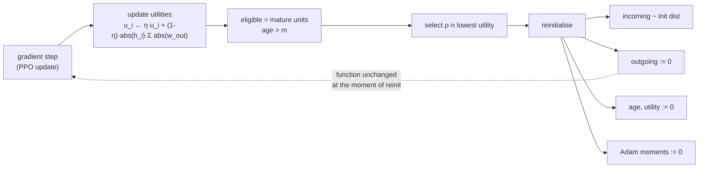

# 25. Continual Backprop: What It Is and How It Could Serve This Project

A research note, not a change. It asks one question: **does Continual Backprop — backprop plus the
continual, selective reinitialization of low-utility hidden units — have anything to offer a
league-based self-play trainer whose opponents change under it by construction?**

The answer is a qualified yes, and the qualification is different from the one in
[22_jepa_integration.md](22_jepa_integration.md). JEPA was a good fit for *this observation* and a
poor fit for *this reward*. Continual Backprop is a good fit for *this training regime* and is
currently **unmeasured** in it: the mechanism it fixes has never been shown to occur here, and §4.1
is therefore an instrument rather than an algorithm.

It also differs from every previous extension in one structural way that decides the whole design:
**Continual Backprop is not an encoder, and it must not be wired through the encoder registry.**
§2.5 is that argument, and it is the most load-bearing section in this note.

Related: [08_self_play_league.md](08_self_play_league.md) (the non-stationarity this exploits),
[02_architecture.md](02_architecture.md) §2.5 (the step lifecycle),
[18_configuration.md](18_configuration.md) §5.4 (the encoder group and the comparison protocol),
[23_probe_harness.md](23_probe_harness.md) (the reward-free measurement this needs),
[10_testing.md](10_testing.md) §6.4 (the contract a new component must meet),
[15_findings_and_recommendations.md](15_findings_and_recommendations.md) (S1-1, S1-3),
[12_perspective_rl_researcher.md](12_perspective_rl_researcher.md) §9.

---

## 1. What Continual Backprop is

Standard backprop initialises a network **once**, at step zero, from a carefully chosen random
distribution — and then never does it again. That asymmetry is the whole observation: the
randomness that makes a fresh network trainable is a one-off injection that training steadily
consumes. Units saturate, their gradients vanish, the effective rank of each layer falls, and the
network keeps fitting the current batch while progressively losing the ability to fit the *next*
distribution. That is **loss of plasticity**, and it is invisible to training loss: a network that
has lost plasticity still descends, it simply stops being able to learn anything new.

Continual Backprop makes initialisation continuous. It is backprop plus a *generate-and-test*
process running alongside it:

| Part | Symbol | Role |
|---|---|---|
| Contribution utility | `u_i` | How much unit `i` contributes downstream. Running-average of `\|h_i\| · Σ_j \|w_ij^out\|`, decayed at rate `η` |
| Age / maturity | `a_i`, `m` | A freshly reinitialised unit is protected from replacement for `m` steps, so it gets a chance to become useful |
| Replacement rate | `ρ` | The fraction of *eligible* units in a layer reinitialised per step. Small — `1e-4` is the paper's working value |

Each step, in each eligible layer, the `ρ · n_eligible` lowest-utility mature units are
reinitialised:

- **incoming** weights are re-sampled from the layer's original initialisation distribution,
- **outgoing** weights are set to **zero**,
- the unit's utility and age are reset,
- and the optimiser's per-parameter state for those weights — Adam's two moment estimates — is
  reset too.



**Zeroing the outgoing weights is the design's keystone**, and it is worth being precise about
what it does and does not buy, because the intuitive reading — "the replacement is
function-preserving" — is half right and the wrong half matters.

A replacement changes the layer's output in exactly two ways, and they behave very differently.
Measured on this repo's own `blocks.feedforward(d_model=64, ff_dim=256)` over a 256-row batch,
replacing 3 units:

| Stage | What it does | Max change in layer output |
|---|---|---|
| Zero the outgoing weights | Drops the old unit's existing contribution | `0.098` (lowest-utility units) / `0.174` (highest-utility) |
| Re-sample the incoming weights | Injects the fresh random unit | **`0.0000000000` — exactly zero** |

The second row is the guarantee, and it is exact rather than approximate: once the outgoing weights
are zero, the new random incoming weights are multiplied by zero, so **the reinitialisation itself
injects no perturbation at all**. Without the zeroing, a freshly randomised unit would fire its
noise straight into the residual stream.

The first row is *not* zero, and no amount of zeroing makes it so — removing a unit's contribution
necessarily changes the function. What bounds it is **selection**: utility is defined as precisely
that contribution, so ranking by utility and replacing the minimum is what keeps the disturbance
small. The table shows the mechanism working even on a freshly initialised network, where utilities
are nearly uniform (`0.30` vs `0.67`, barely 2×) and the gap is correspondingly modest. In a
network that has actually lost plasticity the low-utility units are near-dead, the utility spread
is far wider, and the disturbance from replacing them is correspondingly closer to nothing — which
is the regime CBP is built for.

So the accurate statement is: **the replacement adds no new noise, and the contribution it removes
is the smallest one available.** That is what distinguishes CBP from periodic wholesale resets,
which discard learned behaviour indiscriminately and have to relearn it.

### 1.1 What it is not

- **Not an architecture.** It is a modification to the *update rule*. It composes with any network
  made of units with identifiable incoming and outgoing weights — including the stock MLP this
  project ships as its default.
- **Not a loss term.** Nothing is added to the objective. Nothing is differentiated. It runs
  *after* the optimiser step, which is what makes §3.1 tractable.
- **Not regularisation in the usual sense.** L2 pulls every weight toward zero continuously; CBP
  leaves the useful units entirely alone and resets only the ones carrying no signal. The two are
  complementary and the literature often combines them.
- **Not a reward fix.** Like JEPA, it changes how well the network can keep learning, not what the
  policy is paid for. §3.2.

### 1.2 The family

| Method | Mechanism | Relation to CBP |
|---|---|---|
| Continual Backprop | Utility-ranked selective reinit, outgoing weights zeroed | The subject of this note |
| ReDo | Reinitialise *dormant* neurons (near-zero activation) on a schedule | Same family; a coarser eligibility test than utility |
| Shrink-and-Perturb | Periodically shrink all weights toward zero and add noise | Global, not selective; disturbs useful units too |
| L2-init / regenerative regularisation | Regularise toward the *initial* weights rather than zero | Continuous and global; no discrete replacement event |
| Plasticity injection | Freeze the trained net, add a fresh zero-sum branch | One-shot, capacity-growing |

CBP is the one that is both **selective** (only dead capacity is touched) and **continuous** (no
scheduled disruption), which is why it is the right first thing to try in a run that is meant to
last for tens of millions of steps.

---

## 2. Why this codebase is a good fit

Five reasons, in descending order of strength.

### 2.1 League self-play makes the learning problem non-stationary *by construction*

This is the strongest argument, and it is structural rather than incidental. Plasticity loss is a
phenomenon of **continual** learning — of a task distribution that keeps changing. Most single-task
RL benchmarks have to manufacture that with task sequences. This project produces it as a direct
consequence of its own design:

From [08_self_play_league.md](08_self_play_league.md) and the `league_self_play` group:

| Knob | Shipped value | What it does to the data distribution |
|---|---|---|
| `max_champions` | 8 | A rolling pool of frozen past selves |
| `min_iterations_between_champions` | 2 | A new champion can enter every other iteration |
| `champion_weight` / `original_opponent_weight` | 3.0 / 1.0 | Champions are sampled 3× as often as the baselines |

So the opponents a learner faces are **resampled from a pool that keeps turning over**, and each
new champion is a snapshot of a policy that has itself moved. The observation distribution, the
book dynamics, and the reward-generating process all shift with it. [12](12_perspective_rl_researcher.md)
§9 and [18](18_configuration.md) §5.4 already note that this non-stationarity is why
`vf_share_layers` is `false` — the project has *already* made one architectural decision on exactly
these grounds.

What the docs do not yet consider is the cumulative effect on the network's ability to keep
learning. Before this note, grepping the whole `doc/` tree for *plasticity*, *dormant* or
*dead unit* returned nothing at all. Non-stationarity is discussed repeatedly; plasticity loss,
which is its long-run consequence, is not discussed anywhere. **That is a genuine gap, and it is the one this note fills.**

### 2.2 The shipped default network is the configuration the effect was demonstrated on

From the `ppo` group:

```json
"fcnet_hiddens": [256, 256],
"fcnet_activation": "tanh",
"vf_share_layers": false
```

A 2×256 **tanh** MLP is very close to the canonical setting in which loss of plasticity has been
demonstrated. Tanh saturates at both ends; a saturated unit has a vanishing local gradient, so once
it drifts out it does not come back, and its capacity is gone for the rest of the run. The
mechanism CBP targets is not hypothetical for this default — it is the textbook case.

This matters for scope in a way the JEPA work did not enjoy: `mlp` is the **shipped default**, so a
plasticity intervention is relevant to the configuration almost every run actually uses, not only
to the custom encoders. §2.5 turns that into a hard design constraint.

### 2.3 The budget this project needs is the regime where plasticity loss appears

[22](22_jepa_integration.md) §2.3 records the gap: the default budget is ~262k env steps
(`num_iters: 16`) against a realistic need of 10⁷–10⁸. Plasticity loss is a *long-run* failure. It
does not show up in 16 iterations, and it is precisely what degrades a run that has been scaled up
to the length this project knows it needs.

So CBP is best understood as **infrastructure for the scale-up that has to happen anyway**. It is
not worth much at the shipped budget, and it may be worth a great deal at the intended one. That
is an unusual and favourable property: the work can be done and tested now, cheaply, and it pays
off exactly when the expensive runs start.

### 2.4 The measurement instrument already exists, and does not go through the reward

This is the reason CBP can be evaluated *here* when it could not be evaluated in most codebases.

[23_probe_harness.md](23_probe_harness.md) freezes an encoder and fits a ridge readout from its
latents to a future public microstructure quantity, scored held out. No policy, no reward, no value
function. The claim CBP makes is "the network retains the ability to learn", and the probe measures
something very close to its observable consequence: *how much the representation still makes
linearly available*.

A plasticity experiment therefore has a ready-made, reward-independent dependent variable — which
matters enormously, because §3.2 is about the reward being unusable as one.

The probe also suggests the shape of the result: run the probe at iteration 10, 100 and 1000 with
and without CBP. Plasticity loss predicts the no-CBP curve *falls* late in training. That is a
falsifiable prediction this repo can already test.

### 2.5 The seam exists — but it is the Learner, **not** the encoder registry

Every prior extension to the learning stack went through `train/model/encoders/`. MoE and JEPA both
did, and the registry is genuinely good: `@register(name, defaults, module_class_path,
learner_class_path)` plus a spec block in `train_config.json` is a complete extension point for an
architecture.

**Continual Backprop must not go through it, for three independent reasons.**

**First: it would exclude the default.** `encoder_type: "mlp"` is a deliberate *pass-through*. From
`model_handler.build_trainable_module_spec`, `mlp` returns a stock `DefaultModelConfig` with no
`catalog_class` and never reaches `CDACatalog` at all — that is the documented compatibility
guarantee for every checkpoint written before encoders existed. An encoder-registry CBP would
therefore be unavailable for the exact configuration §2.2 identifies as most at risk.

**Second: `learner_class_for` is algorithm-wide and single-valued.** From
`encoders/__init__.py` and `train.py:612`:

```python
learner_class=learner_class_for(cfg.encoder_type, CDAPPOTorchLearner)
```

RLlib takes **one** Learner for the whole algorithm, resolved from the *configured encoder*. The
existing learners form a linear chain — `PPOTorchLearner` ← `CDAPPOTorchLearner` (MoE) ←
`CDAJEPALearner` (JEPA) — and that works only because each new one subclasses the last. If CBP
registered its own learner against an `encoder_type`, then `jepa` + CBP would be unexpressible:
you would have to choose between the JEPA loss and the plasticity mechanism, or write a
combinatorial `CDAJEPACBPLearner` for every pairing. **CBP is orthogonal to the encoder, so it must
compose with the learner chain rather than occupy a slot in it.**

**Third: it needs optimiser state, which only the Learner has.** Resetting Adam's moment estimates
for the replaced unit's weights is part of the algorithm, not an optional refinement — a
reinitialised weight inheriting a large second-moment estimate takes tiny steps and stays dead.
The encoder cannot see the optimiser. The Learner owns it (`get_optimizer_for_module`,
`_get_optimizer_state`).

The right shape is therefore a **mixin composed over whichever learner the encoder selected**:

```python
class CBPLearnerMixin:
    """Selective reinitialisation, after the optimiser step. Encoder-agnostic."""
    def after_gradient_based_update(self, *, timesteps):
        super().after_gradient_based_update(timesteps=timesteps)
        if not self._cbp_enabled:
            return
        for module_id in self.module.keys():
            self._cbp_step(module_id)
```

and a single composition point in `train.py`, applied *after* `learner_class_for` has done its job:

```python
base = learner_class_for(cfg.encoder_type, CDAPPOTorchLearner)
learner_cls = with_continual_backprop(base) if cfg.cbp["enabled"] else base
```

`with_continual_backprop` builds `type(f"CBP{base.__name__}", (CBPLearnerMixin, base), {})` — so
the MoE term, the JEPA term and CBP all survive together, and every existing encoder resolves to
exactly what it resolves to today when CBP is off. This is the same isolation property
`jepa` was held to, obtained a different way because the mechanism is a different *kind* of thing.

**And `after_gradient_based_update` is the correct hook.** Confirmed against the installed RLlib
(2.56.1): `Learner.update` calls `before_gradient_based_update`, runs the entire minibatch/epoch
loop, and then calls `after_gradient_based_update` **once**. §3.1 is why that once-per-update
timing is not a convenience but a correctness requirement.

**[verified]** The composition was measured rather than assumed — see
[16](16_verification_log.md) §16.13. Composing the mixin over `CDAPPOTorchLearner` and over
`CDAJEPALearner` leaves `compute_loss_for_module` resolving to the base learner in both cases, so
the MoE and JEPA terms survive, while `after_gradient_based_update` resolves to the mixin's.

---

## 3. Where the fit breaks — read this before §4

### 3.1 PPO's ratio does not survive a mid-update reinitialisation

This is the sharpest technical constraint, and it is the same class of hazard already documented
for dropout in `encoders/blocks.py`:

> The ratio `exp(logp_new - logp_old)` compares a log-prob recorded during rollout against one
> recomputed on the learner.

PPO's surrogate objective is only valid while `logp_old` and `logp_new` come from networks related
by the trust region. Reinitialising units *between minibatches* changes the policy underneath a
`logp_old` that was recorded before it — so the ratio compares two networks that differ by a
discrete jump, and the clipping that is supposed to bound the update silently stops bounding
anything.

Zeroing outgoing weights mitigates this more than it first appears — at the instant of replacement
the function is unchanged, so `logp_new` is unchanged too. But the *gradient* is not, and the
following epoch trains a network whose capacity has moved. The safe rule:

**Reinitialise only in `after_gradient_based_update`, never inside the epoch loop.** One
replacement event per `update()`, at a point where the next rollout will recompute `logp_old`
against the post-replacement network. With `ρ = 1e-4` and `num_epochs: 4` the per-iteration
disturbance is tiny in any case; the constraint costs nothing and removes the hazard entirely.

### 3.2 Preserved plasticity, in a reward that pays for passivity, preserves the ability to learn nothing

The reward findings bite here exactly as they bit JEPA, and slightly harder.

- **S1-3** — the reward is strictly negative-sum over a NAV-conserving market. All-pass scores
  exactly `0.0`; random trading scores `−591,027`. Passivity is both a Nash equilibrium and the
  joint optimum.
- **S1-1** — `vf_clip_param = 10` against NAV-scale targets pins `vf_loss` at the clip bound;
  `vf_explained_var ≈ 9e-05`.

CBP keeps the network *able to keep learning what it is being taught*. If what it is being taught
is to descend into doing nothing, CBP's effect on returns will be to help it get there and stay
there more reliably. Unlike JEPA, CBP has no reward-independent training signal of its own — it is
a modification to how the reward's gradient is applied, so it inherits that gradient's problems
wholesale.

**Consequence for evaluation, and it is not optional:** CBP must be scored on the **probe**
(§2.4), not on episode return, until S1-3 is fixed. A returns-based comparison would measure which
variant converges to passivity faster and report it as a win or a loss more or less at random.

### 3.3 The effect has not been demonstrated *here*

Nothing in this repository currently measures unit saturation, dormancy, effective rank, or weight
norm growth. So the honest position is: the *regime* is right (§2.1, §2.3), the *architecture* is
the susceptible one (§2.2), and whether plasticity actually degrades in this specific system over a
long run is **unknown**.

Shipping the mechanism before measuring the disease would be backwards, and it is the mistake
[22](22_jepa_integration.md) avoided by putting Proposal A — a pure instrument — first. §4.1 does
the same thing here, for the same reason.

### 3.4 "Unit" is unambiguous in some places in this codebase and not in others

CBP needs a layer whose units have a clean incoming/outgoing split. The codebase offers three
tiers:

| Site | Unit | Verdict |
|---|---|---|
| Stock MLP `fcnet_hiddens` (`mlp`, the default) | Hidden unit between two `nn.Linear`s | **Clean.** The canonical case |
| `blocks.feedforward` — `Linear(d_model, ff_dim) → GELU → Linear(ff_dim, d_model)` | The `ff_dim` hidden unit | **Clean.** Incoming and outgoing are both explicit |
| `token_embed.token_mlp`, `moe.py` expert FFNs, `jepa.predict` | Same two-Linear shape | **Clean** |
| Attention projections (`q`, `k`, `v`, `out`) | A head dimension | **Messy.** Outgoing is entangled with the head structure |
| Anything immediately followed by `LayerNorm` | — | **Care needed.** LayerNorm re-centres and re-scales, so a zeroed outgoing weight is function-preserving for that unit's *contribution*, but the normalisation statistics shift |
| `nn.Embedding` (`time_embedding`, `level_embedding`) | — | **Out of scope.** No "incoming weights" in the relevant sense |

The sound scope for a first implementation is therefore **feed-forward hidden units only** — the
first three rows. That covers the default MLP entirely, and covers the FFN half of every
transformer block, which is where most of the parameters live anyway. Attention is explicitly
excluded and should be documented as excluded, not silently skipped.

Two further traps this codebase has already been bitten by, in a different guise:

- **`vf_share_layers: false` builds two independent encoder instances.** Both would be walked and
  both would have units replaced. Unlike the MoE aux loss — which *double-counted* and had to be
  averaged, and unlike JEPA, which takes the first sub-encoder only — here treating both
  independently is actually **correct**: they are separate networks with separate capacity. But it
  must be a deliberate decision with a comment, not an accident, and the *metrics* must be reported
  per sub-encoder or they will silently average two different things.
- **Champion snapshots are inference-only copies.** CBP's per-unit utility and age buffers exist
  only to train. If they are registered as module buffers they will ride into every champion
  snapshot as dead weight — exactly the problem `_TRAINING_ONLY` and
  `get_non_inference_attributes` solve for JEPA. Keeping the state on the **Learner** rather than
  on the module avoids the whole issue by construction, which is another argument for §2.5's shape.

### 3.5 CBP's state is checkpoint state, and getting that wrong fails silently

Utility estimates and unit ages are *learned* quantities. A resume that does not restore them
starts every unit at age 0 with utility 0, which means the maturity threshold protects everything
for `m` steps and then the first eligible sweep replaces units ranked by a utility estimate built
from almost no data. On a project whose `chkpt_freq` is 2 and which is explicitly designed around
long, resumable runs, that is a real failure and an invisible one — the run continues, converges
worse, and nothing reports why.

So CBP state must go through `Learner.get_state` / `set_state`, and
`test_checkpointing.py` must gain a case that pins it. Note also that CBP's knobs are **not**
`STRUCTURAL_CONFIG_KEYS`: they change no tensor shapes, so a resume may legitimately change `ρ` or
turn CBP on midway. That is a genuine difference from `encoder_spec` and should be stated in the
config note, since the obvious assumption is the opposite.

---

## 4. Four proposals, cheapest first

### 4.1 Proposal A — plasticity instrumentation only (no training change)

**The one to do first, and it is independent of everything else in this note.**

Add a metrics pass that walks the trainable modules' feed-forward layers each iteration and logs,
per module:

| Metric | Definition | What it shows |
|---|---|---|
| `dormant_unit_frac` | Fraction of units whose mean \|activation\| over the batch is below `τ` | Dead capacity, directly |
| `saturated_unit_frac` | For tanh: fraction with mean \|activation\| > 0.99 | The mechanism §2.2 predicts |
| `effective_rank` | Entropy-based effective rank of the layer's activation matrix | Representational collapse that unit-wise metrics miss |
| `mean_weight_norm` | Mean L2 norm of incoming weights per layer | The weight growth that accompanies plasticity loss |
| `utility_gini` | Concentration of the CBP utility statistic | How unequally the layer's capacity is used |

That last one is the bridge: computing the utility statistic **without acting on it** is most of
CBP's implementation, exercised and logged, with zero effect on training. Proposal B then becomes
"act on the number you are already computing".

Effort: **S**. Risk: **none** — it cannot change a run's trajectory. Value: it answers §3.3, which
everything else is blocked on.

### 4.2 Proposal B — `CBPLearnerMixin`, the mechanism itself

The design is §2.5's shape, with §3.1's timing and §3.4's scope:

```
train/model/cbp_learner.py
    CBPLearnerMixin           # after_gradient_based_update -> _cbp_step
    with_continual_backprop() # composes the mixin over any base learner
    _replaceable_layers()     # walks a module, yields (incoming, outgoing) Linear pairs
```

- **Where:** `after_gradient_based_update`, once per `update()` (§3.1).
- **Scope:** feed-forward hidden units only; attention and embeddings excluded and documented as
  excluded (§3.4).
- **State:** utility and age tensors held on the **Learner**, keyed by `(module_id, layer)`, so
  champion snapshots and inference-only copies never see them (§3.4), and routed through
  `get_state` / `set_state` so a resume is correct (§3.5).
- **Optimiser:** Adam moment estimates zeroed for the replaced slices, via the Learner's optimiser
  access (§2.5, third reason).
- **Composition:** applied over `learner_class_for(...)`'s result, so MoE and JEPA terms survive
  (§2.5, second reason).
- **Off by default**, and when off the composition is skipped entirely so the resolved learner
  class is *identical* to today's — which is the property
  `TestOtherEncodersAreUnaffectedByJEPA` exists to assert for the previous extension, and the
  natural model for this one's tests.

Config, as a new top-level group in `train_config.json` (a group, not an `encoder_specs` block —
it is not an encoder knob):

```json
"continual_backprop": {
  "enabled": false,
  "replacement_rate": 1e-4,
  "maturity_threshold": 100,
  "utility_decay": 0.99,
  "scope": "feedforward",
  "reset_optimizer_state": true
}
```

Effort: **M**. Risk: **contained** — the off-by-default path is bit-identical to today.

### 4.3 Proposal C — CBP during offline pretraining

`train/pretrain/` trains a JEPA encoder on observations alone before any PPO run
([24](24_pretraining.md)). That loop has **no PPO ratio at all**, so §3.1's constraint vanishes and
replacement can run as often as the algorithm wants. It is also the cleanest possible test of the
mechanism: a supervised-style objective with a well-defined loss, where "did plasticity degrade"
has an unambiguous answer.

Effort: **S** once B exists. Value: it is the best *scientific* test in the repo, precisely because
it is the setting with the fewest confounds.

### 4.4 Proposal D — plasticity-aware champion snapshotting

Speculative, and listed for completeness rather than recommended. A champion's utility profile is a
fingerprint of which capacity it was actually using. Two champions with near-identical returns but
disjoint high-utility units are *behaviourally* different in a way the league's current
weighted-sampling scheme cannot see. Utility profiles could inform matchmaking diversity.

Effort: **L**. Depends on A and B, and on S1-3 being fixed first, since without that every champion
is converging on the same passive behaviour and there is no diversity to preserve.

---

## 5. What would have to be measured

The comparison protocol is [18](18_configuration.md) §5.5, with one substitution forced by §3.2.

| Question | Instrument | Predicted if plasticity loss is real here |
|---|---|---|
| Does plasticity degrade at all? | Proposal A metrics over a long run | `dormant_unit_frac` and `saturated_unit_frac` rise; `effective_rank` falls |
| Does CBP prevent it? | Same metrics, CBP on vs off | The curves stay flat with CBP on |
| Does it help the *representation*? | Probe score (§2.4) at iterations 10 / 100 / 1000 | No-CBP probe score falls late; CBP's does not |
| Does it cost anything early? | Probe + return at low iteration counts | Indistinguishable — `ρ = 1e-4` is small |
| Does it help returns? | **Deferred until S1-3 is fixed** (§3.2) | Not interpretable before then |

Multi-seed, since [23](23_probe_harness.md) already notes no multi-seed comparison has ever been
run here and a single-seed plasticity result would be worthless.

One further check, specific to this repo: reinitialisation draws random numbers, and
`test_seeding.py` pins determinism. CBP must draw from a stream that keeps a seeded run
reproducible, or it will break a property the project already guarantees.

---

## 6. Honest assessment

**What is genuinely strong.** The regime argument (§2.1) is the best one, and it is structural
rather than a matter of taste: the league *is* a continual-learning problem, the project has
already made one architectural decision on those grounds, and no document currently follows that
observation to its long-run conclusion. The default tanh MLP is the susceptible configuration
(§2.2). A reward-free measurement instrument already exists (§2.4), which is the thing most
codebases lack and the reason this can be evaluated honestly here. And the intervention is cheap,
off by default, and orthogonal to every extension already shipped.

**What is genuinely weak.** The disease is unmeasured here (§3.3) — so the strongest claim
available today is "the conditions are right", not "this is happening". And the reward problem
(§3.2) is worse for CBP than it was for JEPA: JEPA had a dense training signal independent of the
reward, whereas CBP only modulates how the reward's own gradient is applied. Preserved plasticity
under S1-3 preserves the capacity to learn passivity.

**The scope discipline that matters.** §2.5 is the part most likely to be got wrong by someone
implementing this quickly, because the encoder registry is the obvious seam, is well documented,
and has absorbed the last two extensions. It is the wrong one here. Routing CBP through it would
make the mechanism unavailable to the shipped default and mutually exclusive with `jepa` — two
silent, structural limitations that would be discovered much later and be expensive to undo.

**The one-line verdict.** Continual Backprop is the right *kind* of mechanism for this project's
training regime, aimed at a failure this project has not yet confirmed it has, and gated behind the
same reward problems as everything else. So: build the instrument (§4.1), find out whether the
plasticity actually degrades, and only then decide about the algorithm. Proposal A is independent
of S1-1 and S1-3, costs almost nothing, cannot affect a run, and answers a question nobody here has
asked yet.

---

## 7. Suggested sequence

| Step | Work | Depends on | Effort |
|---|---|---|---|
| 0 | S1-1 (`vf_clip_param` / reward scaling), S1-3 (reward sign) | — | S–M |
| 1 | **Proposal A** — plasticity metrics, including the utility statistic computed but unused | **nothing** | S |
| 2 | Run a long (≥10⁶ step) job with A on, and decide from the curves whether §3.3 is answered yes | 1 | S (compute, not code) |
| 3 | **Proposal B** — `CBPLearnerMixin`, off by default, composed over `learner_class_for` | 1, 2 | M |
| 4 | Checkpoint round-trip and seeding tests for CBP state (§3.5, §5) | 3 | S |
| 5 | **Proposal C** — CBP in the offline pretrainer, the cleanest test | 3 | S |
| 6 | Probe-scored CBP-on/off comparison, multi-seed | 3, [23](23_probe_harness.md) | M |
| 7 | Returns-based comparison | 0, 6 | M, and only if S1-3 is genuinely fixed first |
| 8 | **Proposal D** — utility profiles in league matchmaking | 0, 3 | L |

Step 1 is worth doing whatever is decided about the rest: it closes an observability gap that
exists independently of CBP, and [11](11_logging_and_observability.md) is already the document
about the distance between what this system computes and what it surfaces.

---

## 8. Sources

- [Loss of plasticity in deep continual learning — Dohare, Hernandez-Garcia, Lan, Rahman, Mahmood, Sutton (Nature, 2024)](https://www.nature.com/articles/s41586-024-07711-7)
- [Maintaining Plasticity in Continual Learning via Regenerative Regularization (L2 Init)](https://arxiv.org/abs/2308.11958)
- [The Dormant Neuron Phenomenon in Deep Reinforcement Learning (ReDo) — Sokar et al., ICML 2023](https://arxiv.org/abs/2302.12902)
- [Understanding plasticity in neural networks — Lyle et al., ICML 2023](https://arxiv.org/abs/2303.01486)
- [On Warm-Starting Neural Network Training (Shrink-and-Perturb) — Ash & Adams, NeurIPS 2020](https://arxiv.org/abs/1910.08475)
- [Deep Reinforcement Learning with Plasticity Injection — Nikishin et al., NeurIPS 2023](https://arxiv.org/abs/2305.15555)
- [The Primacy Bias in Deep Reinforcement Learning — Nikishin et al., ICML 2022](https://arxiv.org/abs/2205.07802)
- [Loss of Plasticity in Continual Deep Reinforcement Learning — Abbas et al., CoLLAs 2023](https://arxiv.org/abs/2303.07507)
- [Adaptive Rational Activations / plasticity in RL — background on activation saturation](https://arxiv.org/abs/2102.09407)
