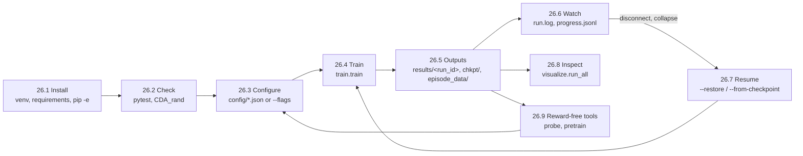

# 26. Runbook

The operator's page. Every command in the order you will need it, where each output lands, what
to watch while a run is going, and what to do when it goes wrong. Each command below was run on
the tree this document ships with; the output tree in §26.5 is copied from a real two-iteration
run, not typed from memory.

The detail behind each step lives elsewhere and is linked; this page is the path through it.

Related: [18](18_configuration.md) (every value and where it lives), [19](19_docker.md) (the GPU
image), [20](20_colab.md) (Colab), [11](11_logging_and_observability.md) (what a run records),
[10](10_testing.md) (the suite), [08](08_self_play_league.md) (the league).

---

## 26.0 The loop at a glance



---

## 26.1 Install

Python **3.12** only. `setup.py` says `>=3.12`; CI tests 3.12 and nothing else, and scipy's pin
has no 3.11 wheels ([10](10_testing.md) §7).

```bash
git clone https://github.com/ChuaCheowHuan/gym-continuousDoubleAuction.git
cd gym-continuousDoubleAuction
python3.12 -m venv .venv
source .venv/bin/activate
python -m pip install --upgrade pip setuptools wheel

# CPU box: take the CPU torch wheel first so the CUDA build is not pulled in
pip install torch==2.13.0 --extra-index-url https://download.pytorch.org/whl/cpu
pip install -r requirements.txt
pip install -e ".[dev]"
```

On a GPU box skip the CPU wheel line and let `requirements.txt` resolve torch, or use the Docker
image in [19](19_docker.md). On Colab follow [20](20_colab.md); the notebook bootstraps itself.

`pip install -e .` is required, not optional: the package registers the env with gymnasium on
import and reads its config tree relative to the repository root
([18](18_configuration.md) §1).

---

## 26.2 Check the install

Three checks, cheapest first. All three are what CI runs ([10](10_testing.md) §7).

```bash
# 1. the simulator and the training-side units: ~3 min, 1,049 tests (incl. pyflakes and Hypothesis)
python -m pytest gym_continuousDoubleAuction/test -q \
    --ignore=gym_continuousDoubleAuction/test/integration

# 2. a random-agent episode through the whole env, no learning: a few seconds
python -m gym_continuousDoubleAuction.CDA_rand --steps 200 --agents 4

# 3. RLlib wiring, real Algorithm builds, save/restore, evaluate: ~10-15 min, 156 tests
python -m pytest gym_continuousDoubleAuction/test/integration -q
```

Expected: `1023 passed`, a line reading `completed 200 steps with 4 random agents.`, and
`156 passed`. `pytest` is the only runner that works; `python test_x.py` defines classes and exits
([10](10_testing.md) §0).

To see the env work step by step, ask for the render, which writes at DEBUG:

```bash
python -m gym_continuousDoubleAuction.CDA_rand --steps 5 --agents 2 --render
```

---

## 26.3 Configure

Every value a run uses is in one of five JSON files under `config/`; no Python file holds a
default ([18](18_configuration.md)). For training the file is `config/train_config.json`, and
precedence is:

```
config/train_config.json  ->  --config <other.json>  ->  explicit flags
```

Edit the file for a change you want kept; pass a flag for a one-off. Flags are the field names
with dashes; `--help` lists them:

```bash
python -m gym_continuousDoubleAuction.train.train --help
```

Groups and what they own ([18](18_configuration.md) §1 and §5):

| Group | Owns | Examples |
|---|---|---|
| `environment` | the market and the reward | `num_agents`, `num_trained_agents`, `init_cash`, `max_step`, `tick_size`, the five reward coefficients |
| `rollouts`, `learner` | where sampling and learning run | `num_env_runners`, `sample_timeout_s`, `num_gpus_per_learner` |
| `ppo`, `optimizer` | the update | `lr`, `num_epochs`, `fcnet_hiddens`, `adam_betas` |
| `encoder` | which network encodes the observation | `encoder_type`, `encoder_specs`, `pretrained_encoder_path` |
| `continual_backprop` | selective reinitialisation, off by default | `cbp_enabled`, `cbp_metrics_only` |
| `league_self_play` | champion promotion and the episode record | `std_dev_multiplier`, `episode_data_dir`, `strict_nav_check` |
| `run` | iterations, checkpoints, logging, seed | `num_iters`, `chkpt_freq`, `log_base_dir`, `run_id`, `is_restore`, `seed` |

Two rules worth knowing before the first edit:

- **A missing key raises; an unknown key raises.** A typo in a JSON key is a hard error at
  startup, not a silently ignored value ([18](18_configuration.md) §1.1).
- **`loss_multiplier` must stay 1.0.** Any other value makes the game negative-sum and passing a
  dominant strategy ([15](15_findings_and_recommendations.md) S1-3).

For a machine-shaped choice (how many CPUs, whether there is a GPU, where the filesystem is) use
`config/runtime_profiles.json` via the notebook or `train.runtime`, not `train_config.json`
([18](18_configuration.md) §8).

---

## 26.4 Train

The default run is 16 iterations of 8 agents, 2 trainable, 4,096-step episodes, 4 episodes per
iteration, sampling in the driver process:

```bash
python -m gym_continuousDoubleAuction.train.train
```

A short run to see the machinery move, which is what §26.5's output tree comes from:

```bash
python -m gym_continuousDoubleAuction.train.train \
    --iters 2 --agents 4 --trained-agents 2 --max-step 64 \
    --chkpt-freq 1 --episode-sample-every 1 --seed 0 --run-id run_runbook
```

Every path a run writes is resolved against the **working directory** you launch from
(`log_base_dir` and `episode_data_dir` are relative in the shipped config), so launch from the
repository root or from one directory you keep for runs.

What the terminal shows, in order:

1. `run id: ... ` and `run log: ...` - the run directory and its log file.
2. `modules: [...] | trainable: [...] (encoder mlp) | frozen random baselines: [...]`.
3. Per episode, at INFO: a NAV verification table ending `Conserved (within 1e-06)`.
4. Per iteration: `iteration N league stats: mean=... std=... threshold=... best_trainable=...`
   then `iter N/M | env steps sampled: ... | module returns: {...} | vf_explained_var: ...`.
5. `checkpoint at iter N: .../chkpt/iter_0000N` on every `chkpt_freq`-th iteration and at the end.

To use more than one core, raise `num_env_runners` and read [09](09_distributed_training.md)
first, especially about `sample_timeout_s`: an iteration whose runners time out trains on
**nothing** and still checkpoints, and the log line for it says so
(`iter N trained on no samples`).

---

## 26.5 Where the outputs land

From the two-iteration command above, launched in an empty directory:

```
.
├── results/
│   ├── chkpt/                      shared across runs, NOT per run (see 26.7)
│   │   ├── iter_00001/             an RLlib checkpoint + league_state.json
│   │   └── iter_00002/
│   └── run_runbook/                one directory per run_id
│       ├── progress.jsonl          one JSON object per iteration, the full result dict
│       └── run.log                 this package's log, rotating, 10 MB x 5
└── episode_data/
    └── run_runbook/
        └── episodes.<pid>.<seq>.parquet   one row per (episode, step, agent)
```

| Output | What it is | Bounded by |
|---|---|---|
| `results/<run_id>/progress.jsonl` | Every iteration's result dict: `env_runners.*`, `learners.<module>.*`, `league.*`, timers | one line per iteration |
| `results/<run_id>/run.log` | The narrative: NAV tables, league statistics, warnings, the ERROR before a strict stop. With `num_env_runners > 0` each runner writes its own `run.<pid>.log` beside it | `file_max_bytes` x `file_backup_count` |
| `results/chkpt/iter_<n>/` | Full `Algorithm` save plus `league_state.json`, the champion bookkeeping | `chkpt_keep` newest kept, by mtime |
| `episode_data/<run_id>/*.parquet` | The per-step record of every info field for one episode in `episode_sample_every` | `episode_max_bytes` per writer |

Set `--no-episode-data` to switch the record off entirely; it is ~34 MB per 4,096-step episode at
8 agents ([11](11_logging_and_observability.md) §1.6, [21](21_logging_review.md) §2.2).

---

## 26.6 What to watch while it runs

The three failure modes a returns curve cannot show, and the number that shows each
([11](11_logging_and_observability.md) §1.2 and §1.7, [15](15_findings_and_recommendations.md)):

| Watch | Where | Healthy | Unhealthy means |
|---|---|---|---|
| `vf_explained_var` per trainable module | the `iter N/M` log line; `learners.<module>.vf_explained_var` in `progress.jsonl` | rises from noise toward positive values over the first iterations | stuck near 0 for the whole run: the critic is not learning (S1-1's symptom) |
| `pass_action_fraction` | `env_runners.pass_action_fraction` | well below 1.0 and not trending to it | trending to 1.0: the league has collapsed to doing nothing, and promotion will still fire (S1-3) |
| `order_rejection_fraction` | `env_runners.order_rejection_fraction` | small | high: agents quote past their cash every step and see nothing for it |
| `obs_clip_fraction` | `env_runners.obs_clip_fraction` | exactly 0.0 | anything else: the market has escaped a bound in `observation_bounds` and the policy is being shown a clipped value ([05](05_observation_space.md) §1.2); widen the bound, or accept the clip knowingly |
| `nav_conservation_error` | `env_runners.nav_conservation_error`; `Conserved` lines in `run.log` | exactly 0.0 | anything else stops the run under `strict_nav_check`; the ledger is corrupt |
| `league.promoted`, `league.idle_modules` | `progress.jsonl` `league` block | promotions every few iterations; idle 0 | idle > 0 for many iterations: an opponent is never drawn ([08](08_self_play_league.md) §7) |
| `iter N trained on no samples` | `run.log` WARNING | absent | present: raise `sample_timeout_s` or shrink the batch ([09](09_distributed_training.md)) |

`progress.jsonl` is plain JSON lines; the quickest reader is a one-liner:

```bash
python - <<'PY'
import json
for line in open("results/run_runbook/progress.jsonl"):
    r = json.loads(line); er = r["env_runners"]
    print(r["training_iteration"], er.get("module_episode_returns_mean"),
          "pass", round(er.get("pass_action_fraction", float("nan")), 3),
          "league", r.get("league", {}).get("size"))
PY
```

---

## 26.7 Resume a run

Checkpoints are under `results/chkpt/`, **shared across runs on purpose**: a restore after a
disconnect has to find the newest save whoever wrote it ([08](08_self_play_league.md) §8). Two
consequences:

- A fresh run into a directory that already holds checkpoints logs a WARNING naming them. Until
  it passes their iteration numbers, a `--restore` would pick the stale one. Move them, or use a
  new `--log-base-dir`.
- `num_iters` is a **target**, not an amount: resuming a 16-iteration run at 9 does 7 more. Pass
  `--iters-is-delta` to run `num_iters` more from the restore point.

```bash
# newest readable checkpoint under results/chkpt, same run directory as before
python -m gym_continuousDoubleAuction.train.train --restore --run-id run_runbook

# a specific save, e.g. to roll back past a league that collapsed
python -m gym_continuousDoubleAuction.train.train \
    --from-checkpoint results/chkpt/iter_00001 --run-id run_runbook --iters 4
```

A restore rebuilds the algorithm from the checkpoint's own config and **ignores** most of
`train_config.json`. The run says which values it ignored, and refuses outright when the change
would not fit the weights (`num_agents`, `n_hist`, the encoder) or would silently not apply
(`cbp_enabled`, `adam_betas`). Read the message; it names the key. Comparing architectures or
switching continual backprop on means a fresh run in a new `log_base_dir`
([18](18_configuration.md) §5.3, [25](25_continual_backprop.md) §4).

---

## 26.8 Inspect a finished run

Every chart in `visualize/` from one command. It reads the newest run under `episode_data/` and
`results/` relative to the working directory, and writes PNGs to `./visualize/chart/`:

```bash
python -m gym_continuousDoubleAuction.visualize.run_all
python -m gym_continuousDoubleAuction.visualize.run_all --run-dir episode_data/run_runbook \
    --training-run-dir results/run_runbook --agent-id agent_1
```

Produces `orderbook`, `nav`, `nav_drawdown`, `cumulative_rewards`, `reward_decomposition`,
`execution_quality`, `modules` and `training` visualisations. The `modules` chart assumes the
trainable/baseline split from `train_config.json`; pass `--trained-agents` if the run used
another.

The Parquet record itself is one `pandas.read_parquet` away, with one row per
(episode, step, agent) and every `info` field as a column ([11](11_logging_and_observability.md)
§1.1 and §1.7, [21](21_logging_review.md)).

---

## 26.9 Reward-free tools: probe and pretrain

Both exist because the reward could not settle an encoder comparison
([23](23_probe_harness.md), [24](24_pretraining.md)). Both take a corpus from random-agent
rollouts by default, or from a run's episode record with `--parquet`, which is the better corpus
once a run exists.

```bash
# score untrained encoders on microstructure targets; a report, no training
python -m gym_continuousDoubleAuction.train.probe --encoders mlp transformer \
    --parquet episode_data/run_runbook

# score a checkpoint's module alongside them
python -m gym_continuousDoubleAuction.train.probe \
    --checkpoint results/chkpt/iter_00002 --module-id policy_0

# pretrain a JEPA encoder on observations alone, then point a run at it
python -m gym_continuousDoubleAuction.train.pretrain --out pretrained/jepa --steps 300
# ... set encoder_type "jepa" and pretrained_encoder_path "pretrained/jepa" in train_config.json
python -m gym_continuousDoubleAuction.train.probe --pretrained pretrained/jepa \
    --pretrained-encoder jepa
```

For pretraining watch `latent_std`, not the loss: a collapsed encoder has a perfect loss
([24](24_pretraining.md) §5). The CLI exits non-zero when it detects one.

**Comparing encoders** is one command, the protocol of [18](18_configuration.md) §5.5: every
(encoder, seed) is a separate run with the seed pinned, the final checkpoint is probed against one
shared corpus, and the table reports means ± standard deviations across seeds:

```bash
# the real thing: three seeds, default iteration count, every encoder you name
python -m gym_continuousDoubleAuction.train.compare --encoders mlp transformer lstm \
    --seeds 0 1 2 --out compare_out

# a smoke test of the path, seconds not hours
python -m gym_continuousDoubleAuction.train.compare --encoders mlp transformer --seeds 0 1 \
    --iters 1 --agents 4 --trained-agents 2 --max-step 64 --episodes-per-iter 2 \
    --probe-episodes 1 --probe-steps 128 --horizons 1 5 --out compare_smoke
```

Output: `compare_out/compare_results.json` (every per-run number) and
`compare_out/compare_table.md`. The `separated on` column names metrics where one encoder's mean
sits clear of every other's by more than both standard deviations, and only with three or more
seeds a side; below that the footer says the table is a smoke test, and it is right.

### 26.9.1 Use a trained checkpoint

Roll episodes with a checkpoint's policies and no learning ([15](15_findings_and_recommendations.md)
S4-12). The checkpoint's own mapping function assigns modules to agents, so the random baselines
and any champions play their parts; the trainable modules act through the same inference path
the env runner uses.

```bash
python -m gym_continuousDoubleAuction.train.evaluate --checkpoint results/chkpt/iter_00016 \
    --episodes 4 --seed 0 --out eval.json
python -m gym_continuousDoubleAuction.train.evaluate --checkpoint results/chkpt/iter_00016 \
    --episodes 4 --seed 0 --deterministic --max-step 512
```

The log gets a table per module: return, NAV change, trades, and the pass, rejected and unmatched
fractions, as means over the agent-episodes that module played. `--seed` pins episode seeds
(episode i uses seed + i), so two checkpoints evaluated with the same seed face the same price
anchors and opponent draws and the difference is the policies. A checkpoint from another
observation or action layout is refused by name.

---

## 26.10 Troubleshooting

| Symptom | Cause | Do |
|---|---|---|
| `pip install -r requirements.txt` fails on scipy | Python is not 3.12 | build the venv with `python3.12` |
| `FileNotFoundError: Could not locate the config/ directory` | package imported from a copy without the config tree | `pip install -e .` from the checkout, or set `CDA_CONFIG_DIR` to a `config/` directory |
| `KeyError: train_config.json: ... has no key` | a key was removed or misspelled in a config file | restore it; every field must be present ([18](18_configuration.md) §1.1) |
| `ValueError: ... unknown config keys` | a key in `--config` or a profile names no `TrainConfig` field | fix the spelling; see `--help` for names |
| `iter N trained on no samples` | remote runners did not deliver the batch in `sample_timeout_s` | raise `--sample-timeout`, or lower `--max-step` / `num_episodes_per_iter` ([09](09_distributed_training.md) §5, [18](18_configuration.md) §5.1) |
| `Cannot restore: the configuration changes the shape of the problem` | a structural key differs from the checkpoint | revert the key, or start fresh in a new `--log-base-dir` |
| `Cannot restore: these keys are read when the Learner class is chosen` | `cbp_*` or `adam_*` changed alongside `--restore` | same: fresh run |
| `NavConservationError` stops the run | the ledger created or destroyed cash | a bug, not a tuning problem: keep the run directory and the episode Parquet, open an issue with `run.log`'s `NAV conservation VIOLATED` block |
| `checkpoint is already at iteration N, at or past the target` | `num_iters` is a target and the restore is past it | raise `--iters` or pass `--iters-is-delta` |
| `already holds N checkpoint(s) from an earlier run` | fresh run into a used `results/chkpt` | harmless now; dangerous with a later `--restore`. Move them or change `--log-base-dir` |
| `champion_1` never appears, `league.promoted` stays 0 | `std_dev_multiplier` threshold never cleared, or an idle opponent | read `league stats` lines; [08](08_self_play_league.md) §10 |
| every `module_episode_returns_mean` is `-0.0` / tiny | rewards are fractions of starting NAV, so 1e-3 is a real move | expected; compare modules to each other, not to 1 |
| `--render` prints nothing | render writes at DEBUG | `CDA_rand --render` raises the level itself; elsewhere set `cda_log_level` `DEBUG` |
| `python test_x.py` does nothing | the suite is pytest-native | `python -m pytest path/to/test_x.py` |

---

## 26.11 Before you push

What CI runs, so run it first ([10](10_testing.md) §7):

```bash
python -m pytest gym_continuousDoubleAuction/test -q --ignore=gym_continuousDoubleAuction/test/integration
python gym_continuousDoubleAuction/CDA_rand.py
python -m pytest gym_continuousDoubleAuction/test/integration -q
```

Lint is part of the first line: `test_lint.py` runs pyflakes over the package and fails on any
message, so a stray import fails the same step a broken test would. To see the messages directly,
`python -m pyflakes gym_continuousDoubleAuction` (pyflakes is in the `dev` extra). The
Hypothesis-driven `test_orderbook_properties.py` is also in that step; if it fails, the shrunk
failing example it prints is the bug report.

The `packaging` CI job additionally builds the wheel and imports it from a directory with no
checkout; reproduce it with `python -m build --wheel` and a clean venv if you touched `setup.py`,
`MANIFEST.in` or the config tree.

A change to behaviour is recorded in three places by convention: the finding or its status in
[15](15_findings_and_recommendations.md), the measurement in [16](16_verification_log.md), and
the narrative in [17](17_changelog.md). A change to the test inventory updates
[10](10_testing.md) and the totals quoted in [01](01_overview.md), [02](02_architecture.md)
and [14](14_perspective_ai_engineer.md).

Note for anyone automating pushes: the push credential used by the hosted review sessions has no
`workflow` scope, so a change to `.github/workflows/` from one of those is rejected on push
([17](17_changelog.md) §37); make workflow edits from a local checkout.
