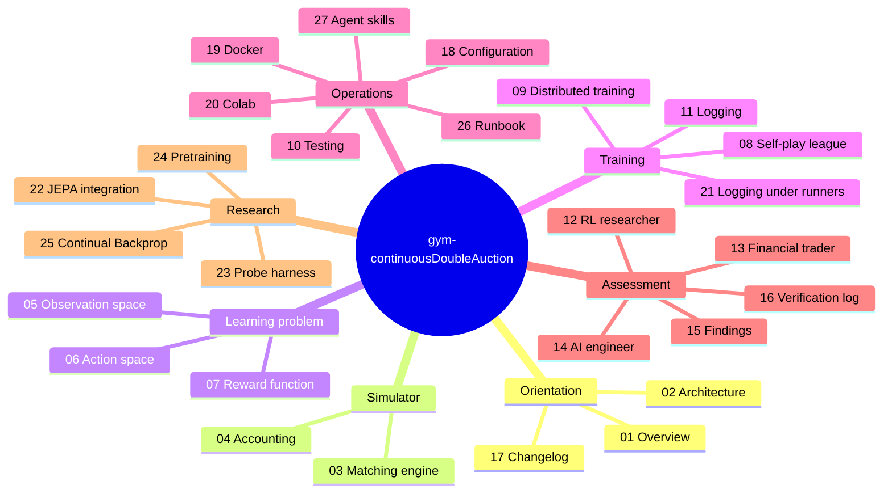

# Documentation

The index of everything in this folder: what each document answers, and the order to read them in
for a given goal. The project itself is introduced in the top-level [README](../README.md); what it
is, in depth, starts at [01_overview.md](01_overview.md).

## Documentation map

### Start here

| # | Document | What it answers |
|---|---|---|
| 1 | [01_overview.md](01_overview.md) | What this project is, the market it models, the research question, what an episode looks like |
| 26 | [26_runbook.md](26_runbook.md) | Install, check, train, resume, inspect, probe and pretrain, step by step, with what to watch and a troubleshooting table |
| 2 | [02_architecture.md](02_architecture.md) | The system at a glance, layer map, package tree, the mixin/MRO chain, the step lifecycle, config keys, data flow, tech stack |

### Core mechanisms (reference)

| # | Document | What it answers |
|---|---|---|
| 3 | [03_matching_engine.md](03_matching_engine.md) | Book data structures, limit/market processing, modify-order semantics and the six accounting scenarios, invariants |
| 4 | [04_accounting.md](04_accounting.md) | Cash escrow, order approval, position transitions including atomic flips, mark-to-market, NAV conservation |
| 5 | [05_observation_space.md](05_observation_space.md) | The 48-float grid snapshot (and the 66-float level view): the fixed tick-offset grid shared with the action, `√(V/limit_max_size)` sizing, the six market scalars, temporal stacking, the raw/normalized split, measured bounds and feature scales |
| 6 | [06_action_space.md](06_action_space.md) | The `Dict` action space, ghost-level price anchoring, the two degenerate size dimensions, the legacy `Tuple` design it replaced |
| 7 | [07_reward_function.md](07_reward_function.md) | The six-term formula (five shaping terms, and a sixth shipped at zero for dead order-management actions), its account plumbing, the measured decomposition, a coefficient tuning guide |

### Training

| # | Document | What it answers |
|---|---|---|
| 8 | [08_self_play_league.md](08_self_play_league.md) | League play: champion snapshotting and its four load-bearing ordering constraints, weighted matchmaking, configuration, monitoring, troubleshooting |
| 9 | [09_distributed_training.md](09_distributed_training.md) | `num_env_runners` and `num_learners`: what each distributes, worked examples, and three now-fixed bugs that existed only at non-default values |
| 10 | [10_testing.md](10_testing.md) | Every test file, what each case pins down, CI, and the gaps |
| 11 | [11_logging_and_observability.md](11_logging_and_observability.md) | What training records, where it goes, and the gap between what is computed and what is surfaced |
| 21 | [21_logging_review.md](21_logging_review.md) | The same audit re-run with `num_env_runners > 0`: what breaks when the hooks stop running on the driver |

### Analysis

| # | Document | Audience |
|---|---|---|
| 12 | [12_perspective_rl_researcher.md](12_perspective_rl_researcher.md) | Algorithm, reward design, exploration, sample efficiency, training stability |
| 13 | [13_perspective_financial_trader.md](13_perspective_financial_trader.md) | Microstructure realism, risk, execution, P&L, desk metrics |
| 14 | [14_perspective_ai_engineer.md](14_perspective_ai_engineer.md) | Code quality, packaging, scalability, observability, production readiness |
| 15 | [15_findings_and_recommendations.md](15_findings_and_recommendations.md) | Where the project stands, then consolidated, severity-ranked findings with fixes and a suggested sequence |
| 16 | [16_verification_log.md](16_verification_log.md) | Every executed probe and its raw output |
| 17 | [17_changelog.md](17_changelog.md) | What changed since `original_v1` (2020) and why |
| 22 | [22_jepa_integration.md](22_jepa_integration.md) | What JEPA is, why this observation suits it and this reward does not, and four ways it could be used |
| 23 | [23_probe_harness.md](23_probe_harness.md) | Scoring an encoder on microstructure targets without the reward: how to run it, how to read it, why the probe is linear |
| 24 | [24_pretraining.md](24_pretraining.md) | Training a JEPA encoder on observations alone before any PPO run, the fingerprint that guards its weights, and why to watch `latent_std` rather than the loss |
| 25 | [25_continual_backprop.md](25_continual_backprop.md) | What Continual Backprop is, why league self-play is the non-stationary regime it targets, why it belongs on the Learner rather than the encoder registry, and why the papers' hyperparameters cannot be copied at this repo's update cadence |
| 27 | [27_agent_skills.md](27_agent_skills.md) | Which agent skills this repository would pay for, from the work that was done by hand in the review passes: what each does, its evidence, the scripts it needs, the mistakes it must not repeat, and the order to build them in |

### Configuration and deployment

| # | Document | What it answers |
|---|---|---|
| 26 | [26_runbook.md](26_runbook.md) | The operator's page: every command in order, which command answers which goal, where each output lands, what to watch during a run, and what to do when it goes wrong |
| 18 | [18_configuration.md](18_configuration.md) | The five `config/` files and what each owns, the loader's rules, precedence between file and flags, the runtime profiles that pick a hardware set, how to add a knob |
| 19 | [19_docker.md](19_docker.md) | The GPU training image: build and run, what each flag is for, GPU prerequisites, where artefacts land in an ephemeral container, troubleshooting |
| 20 | [20_colab.md](20_colab.md) | Running the notebook on a free Colab VM: setup, the forced restart, what the free tier gives you, where output goes, resuming after a disconnect |

### Version 1

| Document | What it is |
|---|---|
| [README_v1.md](README_v1.md) | The original 2020 README of the `original_v1` branch, kept as it was |

---

## Reading paths

**New to the codebase**
[01](01_overview.md) → [02](02_architecture.md) → [03](03_matching_engine.md) →
[04](04_accounting.md) → [05](05_observation_space.md) → [06](06_action_space.md)

**Deciding whether to build on this**
[01](01_overview.md) → [15](15_findings_and_recommendations.md) → [16](16_verification_log.md)

**Planning changes to the RL layer**
[15](15_findings_and_recommendations.md) (severity order) → [12](12_perspective_rl_researcher.md) →
[05](05_observation_space.md) → [07](07_reward_function.md)

**Weighing a representation-learning change (JEPA)**
[22](22_jepa_integration.md) → [05](05_observation_space.md) →
[18](18_configuration.md) §5.4–5.5 → [12](12_perspective_rl_researcher.md) §4, §7

**Comparing encoders**
[23](23_probe_harness.md) (a metric that does not go through the reward) →
[18](18_configuration.md) §5.5 (seeds, separate runs, parameter counts)

**Pretraining an encoder before training a policy**
[22](22_jepa_integration.md) §4.2 (the objective) → [24](24_pretraining.md) (running it) →
[23](23_probe_harness.md) (measuring what it taught)

**Weighing a plasticity change for long runs (Continual Backprop)**
[25](25_continual_backprop.md) → [18](18_configuration.md) §5.6 (the two config groups, and
the cadence caveat that decides whether a result means anything) →
[11](11_logging_and_observability.md) (the three correlates) →
[23](23_probe_harness.md) (the reward-free metric it must be scored on) →
[15](15_findings_and_recommendations.md) (S1-1, S1-3, which gate the returns comparison)

**Setting up training**
[26](26_runbook.md) (the commands, in order) → [18](18_configuration.md) (where every value lives) → [08](08_self_play_league.md) →
[09](09_distributed_training.md) (if raising `num_env_runners` or `num_learners` above their
`0` defaults) → [11](11_logging_and_observability.md)

**Running it on Colab**
[20](20_colab.md) → [18](18_configuration.md) §8 (the `gpu` / `cpu` parameter sets
`CDA_train.ipynb` selects between)

**Running it on a local GPU box**
[19](19_docker.md) (the training image) → [18](18_configuration.md) §8 →
[09](09_distributed_training.md) §5

**Modifying the engine or accounts**
[03](03_matching_engine.md) §4 (invariants) → [04](04_accounting.md) → [10](10_testing.md) §1–2

**Trading / microstructure review**
[13](13_perspective_financial_trader.md) → [03](03_matching_engine.md) → [04](04_accounting.md)
